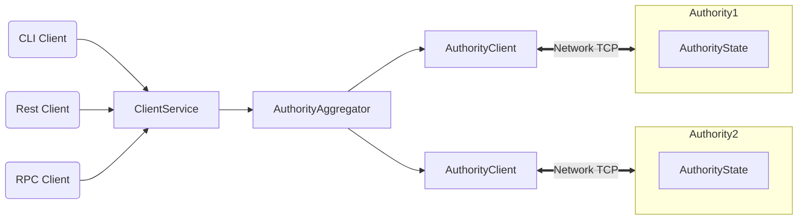

# Benchmarking Optimized Parallel Execution

This branch is based on the parallel executor of the
[distributed-execution branch](https://github.com/TonyZhangND/sui/commit/68d056f3403062da2c24eb2e3144dbc12cf0cc05).
It also includes several optimizations removing significant bottlenecks. This
allows this implementation to reach peak performance of around 200k tps for
simple SUI transfers on a MacBook Pro and peaks at 10k-20k tps for other types
of transactions.

## Snapshotting

A simple snapshot and restore mechanism is implemented. By passing the flag
`--snapshot-epoch <EPOCH>` to the executor it will dump SW/EW state at the epoch
boundary after the given epoch. This creates three files: `objects.dat`,
`epoch.dat`, and `sw_recovery.dat`. If these files exist upon startup SW/EW will
both restore from the snapshotted state.

_Note: Execution does not stop at the snapshotted epoch, it continues up to the
snapshot provided by the `--execute` flag._

_Note: The snapshot flag is currently mandatory. Snapshotting can thus only be
disabled by setting the snapshot epoch to a high value that is never reached._

## Benchmarking Artificial Workloads

See [benchmarking](./benchmarking/README.md) for more information on how the
generation and benchmarking of artificial workloads works.

## Comparing Tx Queueing Mechanisms

See [queues_test](./queues_test/README.md) for a micro-benchmark comparing
different methods of internally implementing the transaction queues.

## Parallelizability Study of Sui Mainnet Workload

See [sui_parallelizability](./sui_parallelizability/README.md) for a small tool
for analyzing the transaction workload on Sui mainnet with regards to
parallelizability.

_Below you can find the original README of the repo._

---

# Welcome to Sui

Sui is a next-generation smart contract platform with high throughput, low
latency, and an asset-oriented programming model powered by the
[Move programming language](https://github.com/MystenLabs/awesome-move).

## Sui Highlights

Sui offers the following benefits and capabilities:

- Unmatched scalability, instant settlement
- A safe smart contract language accessible to mainstream developers
- Ability to define rich and composable on-chain assets
- Better user experience for web3 apps

Sui is the only blockchain today that can scale with the growth of web3 while
achieving industry-leading performance, cost, programmability, and usability. As
Sui approaches Mainnet launch, it will demonstrate capacity beyond the
transaction processing capabilities of established systems – traditional and
blockchain alike. Sui is the first internet-scale programmable blockchain
platform, a foundational layer for web3.

## Sui Architecture

## Sui Overview

Sui is a smart contract platform maintained by a permissionless set of
authorities that play a role similar to validators or miners in other blockchain
systems.

Sui offers scalability and unprecedented low-latency for common use cases. Sui
makes the vast majority of transactions processable in parallel, which makes
better use of processing resources, and offers the option to increase throughput
with more resources. Sui forgoes consensus to instead use simpler and
lower-latency primitives for common use cases, such as payment transactions and
asset transfers. This is unprecedented in the blockchain world and enables a
number of new latency-sensitive distributed applications, ranging from gaming to
retail payment at physical points of sale.

Sui is written in [Rust](https://www.rust-lang.org) and supports smart contracts
written in the
[Move programming language](https://github.com/move-language/move) to define
assets that may have an owner. Move programs define operations on these assets
including custom rules for their creation, the transfer of these assets to new
owners, and operations that mutate assets.

Sui has a native token called SUI, with a fixed supply. The SUI token is used to
pay for gas, and is also used as
[delegated stake on authorities](https://learn.bybit.com/blockchain/delegated-proof-of-stake-dpos/)
within an epoch. The voting power of authorities within this epoch is a function
of this delegated stake. Authorities are periodically reconfigured according to
the stake delegated to them. In any epoch, the set of authorities is
[Byzantine fault tolerant](https://pmg.csail.mit.edu/papers/osdi99.pdf). At the
end of the epoch, fees collected through all transactions processed are
distributed to authorities according to their contribution to the operation of
the system. Authorities can in turn share some of the fees as rewards to users
that delegated stakes to them.

Sui is backed by a number of state-of-the-art
[peer-reviewed works](https://github.com/MystenLabs/sui/blob/main/doc/src/contribute/research-papers.md)
and years of open source development.

## More About Sui

Use the following links to learn more about Sui and the Sui ecosystem:

- Learn more about working with Sui in the
  [Sui Documentation](doc/src/learn/index.md).
- Join the Sui community on [Sui Discord](https://discord.gg/sui).
- Find out more about the Sui ecosystem on the
  [Sui Resources](https://sui.io/resources/) page.
- Review information about Sui governance,
  [decentralization](https://suifoundation.org/decentralization), and
  [Developer Grants Program](https://suifoundation.org/#grants) on the
  [Sui Foundation](https://suifoundation.org/) site.
