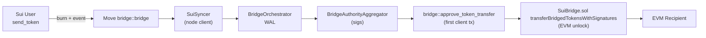
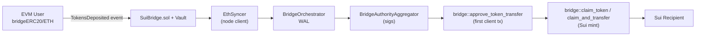
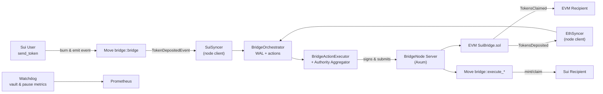

# Sui Native Bridge Primer for Agents

This document is a fast-start artifact for any agent (human or AI) that needs to reason about the Sui Native Bridge. It maps the three primary code surfaces—the Ethereum smart contracts, the Sui Move package, and the Rust bridge node—so you can quickly answer “where does this live?” and “who is responsible for what?” before making changes or asking follow-up questions.

## Purpose & Scope

- Clarify the ownership boundaries between the EVM contracts, the Move bridge module, and the Rust bridge node.
- Highlight the critical data flows for Sui→EVM and EVM→Sui transfers, plus emergency/governance operations.
- Provide verification checklists so future agents can prove they understand the system before making edits.

## Component Map (TL;DR)

| Component             | Path                                                                                          | Primary Role                                                                                                                                                                                | Key Dependencies                                                                                                              |
| --------------------- | --------------------------------------------------------------------------------------------- | ------------------------------------------------------------------------------------------------------------------------------------------------------------------------------------------- | ----------------------------------------------------------------------------------------------------------------------------- |
| EVM `SuiBridge`       | `bridge/evm/contracts/SuiBridge.sol`                                                          | Custody vault orchestrator on Ethereum: collects deposits, enforces limits, releases assets after committee-signed messages.                                                                | `CommitteeUpgradeable`, `IBridgeVault`, `IBridgeLimiter`, `IBridgeConfig`, OpenZeppelin upgradeable stack.                    |
| Move `bridge::bridge` | `crates/sui-framework/packages/bridge/sources/bridge.move`                                    | On-chain Sui contract that mints/burns bridged assets, stores bridge messages, enforces limiter + committee approvals, handles governance ops.                                              | `bridge::committee`, `bridge::limiter`, `bridge::treasury`, `sui::event`, `sui_system::sui_system`.                           |
| Sui Bridge Node       | `crates/sui-bridge/src` (`main.rs`, `node.rs`, `server`, `client`, `orchestrator`, `syncers`) | Off-chain daemon that (a) exposes a signing server for bridge actions, (b) optionally runs a client/orchestrator that watches both chains, aggregates signatures, and submits transactions. | Axum server, Reqwest client, `BridgeAuthorityAggregator`, `EthSyncer`, `SuiSyncer`, `BridgeOrchestrator`, Prometheus metrics. |

## EVM Contract: `bridge/evm/contracts/SuiBridge.sol`

### State & Initialization

`SuiBridge` keeps track of processed transfer nonces, references to the vault and limiter contracts, and enforces a fixed Sui address length. Deployment follows the OpenZeppelin upgradeable pattern via `initialize`, which wires in the committee contract and pause controller:

```24:45:bridge/evm/contracts/SuiBridge.sol
mapping(uint64 nonce => bool isProcessed) public isTransferProcessed;
IBridgeVault public vault;
IBridgeLimiter public limiter;

uint8 constant SUI_ADDRESS_LENGTH = 32;

function initialize(address _committee, address _vault, address _limiter)
    external
    initializer
{
    __CommitteeUpgradeable_init(_committee);
    __Pausable_init();
    vault = IBridgeVault(_vault);
    limiter = IBridgeLimiter(_limiter);
}
```

### Claim Path (EVM unlocks)

`transferBridgedTokensWithSignatures` is invoked by the bridge node once it has gathered quorum signatures for a Sui→EVM transfer message. It verifies the message, ensures the nonce was not processed, decodes the payload, checks the target chain, converts Sui decimals into ERC20 decimals, pulls tokens from the vault, and marks the nonce consumed:

```55:103:bridge/evm/contracts/SuiBridge.sol
function transferBridgedTokensWithSignatures(
    bytes[] memory signatures,
    BridgeUtils.Message memory message
)
    external
    nonReentrant
    verifyMessageAndSignatures(message, signatures, BridgeUtils.TOKEN_TRANSFER)
    onlySupportedChain(message.chainID)
{
    require(!isTransferProcessed[message.nonce], "SuiBridge: Message already processed");
    IBridgeConfig config = committee.config();
    BridgeUtils.TokenTransferPayload memory tokenTransferPayload =
        BridgeUtils.decodeTokenTransferPayload(message.payload);
    require(
        tokenTransferPayload.targetChain == config.chainID(), "SuiBridge: Invalid target chain"
    );
    uint256 erc20AdjustedAmount = BridgeUtils.convertSuiToERC20Decimal(
        IERC20Metadata(config.tokenAddressOf(tokenTransferPayload.tokenID)).decimals(),
        config.tokenSuiDecimalOf(tokenTransferPayload.tokenID),
        tokenTransferPayload.amount
    );
    _transferTokensFromVault(
        message.chainID,
        tokenTransferPayload.tokenID,
        tokenTransferPayload.recipientAddress,
        erc20AdjustedAmount
    );
    isTransferProcessed[message.nonce] = true;
    emit TokensClaimed(/* ... */);
}
```

### Deposit Path (EVM locks)

Users call `bridgeERC20` or `bridgeETH` to lock assets into the vault. The contract checks the destination route, token support, allowance, and recipient length. It measures the vault delta, converts ERC20 decimals back into Sui decimals, and emits `TokensDeposited` with the current nonce before incrementing it:

```135:189:bridge/evm/contracts/SuiBridge.sol
function bridgeERC20(
    uint8 tokenID,
    uint256 amount,
    bytes memory recipientAddress,
    uint8 destinationChainID
) external whenNotPaused nonReentrant onlySupportedChain(destinationChainID) {
    require(recipientAddress.length == SUI_ADDRESS_LENGTH, "SuiBridge: Invalid recipient address length");
    IBridgeConfig config = committee.config();
    require(config.isTokenSupported(tokenID), "SuiBridge: Unsupported token");
    address tokenAddress = config.tokenAddressOf(tokenID);
    require(
        IERC20(tokenAddress).allowance(msg.sender, address(this)) >= amount,
        "SuiBridge: Insufficient allowance"
    );
    uint256 oldBalance = IERC20(tokenAddress).balanceOf(address(vault));
    SafeERC20.safeTransferFrom(IERC20(tokenAddress), msg.sender, address(vault), amount);
    uint256 newBalance = IERC20(tokenAddress).balanceOf(address(vault));
    uint256 amountTransfered = newBalance - oldBalance;
    uint64 suiAdjustedAmount = BridgeUtils.convertERC20ToSuiDecimal(
        IERC20Metadata(tokenAddress).decimals(),
        config.tokenSuiDecimalOf(tokenID),
        amountTransfered
    );
    emit TokensDeposited(/* ... */);
    nonces[BridgeUtils.TOKEN_TRANSFER]++;
}
```

### Vault Escrow & Limiter Hooks

Once a message is verified, `_transferTokensFromVault` calls either `vault.transferETH` or `vault.transferERC20` and immediately records the bridged amount with the limiter to enforce 24h caps:

```244:265:bridge/evm/contracts/SuiBridge.sol
function _transferTokensFromVault(
    uint8 sendingChainID,
    uint8 tokenID,
    address recipientAddress,
    uint256 amount
) private whenNotPaused limitNotExceeded(sendingChainID, tokenID, amount) {
    address tokenAddress = committee.config().tokenAddressOf(tokenID);
    require(tokenAddress != address(0), "SuiBridge: Unsupported token");
    if (tokenID == BridgeUtils.ETH) {
        vault.transferETH(payable(recipientAddress), amount);
    } else {
        vault.transferERC20(tokenAddress, recipientAddress, amount);
    }
    limiter.recordBridgeTransfers(sendingChainID, tokenID, amount);
}
```

### Emergency & Pause Handling

Committee-signed emergency operations call `_pause`/`_unpause` through `executeEmergencyOpWithSignatures`, ensuring no duplicate freezes:

```105:125:bridge/evm/contracts/SuiBridge.sol
function executeEmergencyOpWithSignatures(
    bytes[] memory signatures,
    BridgeUtils.Message memory message
)
    external
    nonReentrant
    verifyMessageAndSignatures(message, signatures, BridgeUtils.EMERGENCY_OP)
{
    bool isFreezing = BridgeUtils.decodeEmergencyOpPayload(message.payload);
    if (isFreezing) _pause();
    else _unpause();
    emit EmergencyOperation(message.nonce, isFreezing);
}
```

### Key Takeaways for Agents

- Always consider both the `committee.config()` view (what chain/token IDs are valid) and the `limiter` state when touching EVM logic.
- Decimal conversions happen _twice_ (ERC20→Sui during deposit, Sui→ERC20 during withdrawal); mismatched decimals lead to silent value drift.
- Every transfer nonce is unique per message type; replays revert thanks to `isTransferProcessed`.
- All external methods are `nonReentrant` and gated by `whenNotPaused` or `onlySupportedChain`, so any new entrypoint should follow the same pattern.

### Supporting EVM Contracts & Libraries

#### BridgeCommittee (`BridgeCommittee.sol`)

- Holds the active validator set, their stake weights, HTTP endpoints, and blocklist flags. The contract is upgradeable so that committee membership can evolve without redeploying the entire bridge.
- `verifySignatures` recovers each signer with `ECDSA.tryRecover`, de-duplicates them via a bitmap, drops blocklisted signers, and sums their stake; transfers need ≥3,334 voting power, whereas governance ops require ≥5,001. The stake thresholds mirror `BridgeUtils.requiredStake`:

```70:126:bridge/evm/contracts/BridgeCommittee.sol
function verifySignatures(bytes[] memory signatures, BridgeUtils.Message memory message)
    external
    view
{
    uint32 requiredStake = BridgeUtils.requiredStake(message);
    uint16 approvalStake;
    uint256 bitmap;
    for (uint16 i; i < signatures.length; i++) {
        (bytes32 r, bytes32 s, uint8 v) = splitSignature(signatures[i]);
        (address signer,,) = ECDSA.tryRecover(BridgeUtils.computeHash(message), v, r, s);
        require(!blocklist[signer], "BridgeCommittee: Signer is blocklisted");
        require(committeeStake[signer] > 0, "BridgeCommittee: Signer has no stake");
        uint8 index = committeeIndex[signer];
        uint256 mask = 1 << index;
        require(bitmap & mask == 0, "BridgeCommittee: Duplicate signature provided");
        bitmap |= mask;
        approvalStake += committeeStake[signer];
    }
    require(approvalStake >= requiredStake, "BridgeCommittee: Insufficient stake amount");
}
```

- `updateBlocklistWithSignatures` consumes a `BridgeUtils.BLOCKLIST` message and flips `blocklist[address]` so that compromised validators stop contributing voting power immediately.

#### BridgeConfig (`BridgeConfig.sol`)

- Registry for supported tokens (`tokenAddressOf`, `tokenSuiDecimalOf`, `tokenPriceOf`) and supported chain IDs. The contract also stores per-token USD prices (8 decimal precision) and can add new ERC20s via committee-signed `ADD_EVM_TOKENS` messages.
- `updateTokenPriceWithSignatures` and `addTokensWithSignatures` mirror the governance actions emitted on Sui; both routes end with dedicated events so the off-chain client can pick them up.
- When adding a token, `_addToken` cross-checks ERC20 decimals against the provided Sui decimals to prevent overflows during conversion.

#### BridgeLimiter (`BridgeLimiter.sol`)

- Tracks a rolling 24 h window per `(sendingChain -> receivingChain)` route by quantizing transfers into hour buckets keyed by `chainID << 32 | hourTimestamp`.
- `recordBridgeTransfers` is `onlyOwner` (the SuiBridge proxy) and converts each transfer into USD using `BridgeConfig.tokenPriceOf`. If the USD total for the past 24 hours would exceed `chainLimits[chainID]`, it reverts with `"BridgeLimiter: amount exceeds rolling window limit"`.
- Governance can adjust USD limits via `updateLimitWithSignatures`, which decodes `BridgeUtils.UPDATE_BRIDGE_LIMIT` payloads and emits `LimitUpdated`.

#### BridgeVault (`BridgeVault.sol`)

- Minimal custody contract that actually holds ERC20 balances and WETH. Ownership is transferred to the bridge proxy so only `_transferTokensFromVault` can call `transferERC20` or `transferETH`.
- ETH deposits are immediately wrapped into WETH inside the `receive()` hook, so unwrapping happens explicitly inside `transferETH` before sending funds to the recipient to avoid stuck ETH.

#### Utility Libraries

- `BridgeUtils.sol` defines the canonical message format, payload encoders/decoders, stake thresholds, and decimal conversion helpers used by every contract. Any message-type addition must be reflected here as well as in the Move `bridge::message` module.
- `CommitteeUpgradeable.sol`—abstracts shared committee wiring for upgradeable contracts, exposing modifiers like `verifyMessageAndSignatures`, `onlySupportedChain`, and the `committee` handle itself.
- `MessageVerifier.sol` (not shown above) bundles keccak prefixing and required stake logic so that contracts such as `BridgeLimiter` or `BridgeConfig` can trust messages without duplicating recovery logic.

## Move Package: `crates/sui-framework/packages/bridge/sources/bridge.move`

### Core Storage & Events

`BridgeInner` contains the bridge version, chain ID, committee, treasury, limiter, per-message-type sequence numbers, and a linked table of token transfer records. Deposits emit `TokenDepositedEvent` so watchers can pick up outbound transfers:

```46:87:crates/sui-framework/packages/bridge/sources/bridge.move
public struct Bridge has key {
    id: UID,
    inner: Versioned,
}

public struct BridgeInner has store {
    bridge_version: u64,
    message_version: u8,
    chain_id: u8,
    sequence_nums: VecMap<u8, u64>,
    committee: BridgeCommittee,
    treasury: BridgeTreasury,
    token_transfer_records: LinkedTable<BridgeMessageKey, BridgeRecord>,
    limiter: TransferLimiter,
    paused: bool,
}

public struct TokenDepositedEvent has copy, drop {
    seq_num: u64,
    source_chain: u8,
    sender_address: vector<u8>,
    target_chain: u8,
    target_address: vector<u8>,
    token_type: u8,
    amount: u64,
}
```

### Outbound Flow (`send_token`)

When a Sui user bridges out, the module ensures the bridge is not paused, validates the route and EVM address length, increments the per-message-type sequence number, builds a `BridgeMessage`, burns the coins in the treasury, stores the record, and emits an event:

```218:333:crates/sui-framework/packages/bridge/sources/bridge.move
public fun send_token<T>(
    bridge: &mut Bridge,
    target_chain: u8,
    target_address: vector<u8>,
    token: Coin<T>,
    ctx: &mut TxContext,
) {
    let inner = load_inner_mut(bridge);
    assert!(!inner.paused, EBridgeUnavailable);
    assert!(chain_ids::is_valid_route(inner.chain_id, target_chain), EInvalidBridgeRoute);
    assert!(target_address.length() == EVM_ADDRESS_LENGTH, EInvalidEvmAddress);

    let bridge_seq_num = inner.get_current_seq_num_and_increment(message_types::token());
    let token_id = inner.treasury.token_id<T>();
    let token_amount = token.balance().value();
    assert!(token_amount > 0, ETokenValueIsZero);
    let message = message::create_token_bridge_message(/* ... */);
    inner.treasury.burn(token);
    inner.token_transfer_records.push_back(message.key(), BridgeRecord { message, verified_signatures: option::none(), claimed: false });
    event::emit(TokenDepositedEvent { /* ... */ });
}
```

### Approval Path (`approve_token_transfer`)

Bridge authorities submit committee-signed `BridgeMessage`s. The Move module verifies signatures, ensures message type/version/chain constraints, and either attaches verified signatures to an existing record (Sui-originated) or inserts a new record (foreign-originated). Duplicate approvals short-circuit with events:

```338:395:crates/sui-framework/packages/bridge/sources/bridge.move
public fun approve_token_transfer(
    bridge: &mut Bridge,
    message: BridgeMessage,
    signatures: vector<vector<u8>>,
) {
    let inner = load_inner_mut(bridge);
    assert!(!inner.paused, EBridgeUnavailable);
    inner.committee.verify_signatures(message, signatures);
    assert!(message.message_type() == message_types::token(), EMustBeTokenMessage);
    assert!(message.message_version() == MESSAGE_VERSION, EUnexpectedMessageVersion);
    let token_payload = message.extract_token_bridge_payload();
    let target_chain = token_payload.token_target_chain();
    assert!(
        message.source_chain() == inner.chain_id || target_chain == inner.chain_id,
        EUnexpectedChainID,
    );
    let message_key = message.key();
    if (message.source_chain() == inner.chain_id) {
        let record = &mut inner.token_transfer_records[message_key];
        assert!(record.message == message, EMalformedMessageError);
        assert!(!record.claimed, EInvariantSuiInitializedTokenTransferShouldNotBeClaimed);
        if (record.verified_signatures.is_some()) {
            event::emit(TokenTransferAlreadyApproved { message_key });
            return
        };
        record.verified_signatures = option::some(signatures)
    } else {
        if (inner.token_transfer_records.contains(message_key)) {
            event::emit(TokenTransferAlreadyApproved { message_key });
            return
        };
        inner.token_transfer_records.push_back(message_key, BridgeRecord {
            message,
            verified_signatures: option::some(signatures),
            claimed: false,
        });
    };
    event::emit(TokenTransferApproved { message_key });
}
```

### Claim Path & Limiter Interaction

`claim_token_internal` backs both `claim_token` (recipient-only) and `claim_and_transfer_token` (anyone). It enforces pause state, ensures the `BridgeRecord` exists with verified signatures, derives the Sui owner address, validates the `(source_chain → target_chain)` route and token type, checks the limiter via `limiter.check_and_record_sending_transfer`, mints the coin from the treasury, flips `record.claimed = true`, and emits `TokenTransferClaimed`. Limiter failures emit `TokenTransferLimitExceed` without aborting so relayers can retry when the 24 h window resets.

### Governance / System Messages

`execute_system_message` is the entrypoint the bridge node uses for emergency pauses, committee blocklists, limiter updates, asset price updates, and adding new tokens. It enforces sequence numbers per message type and requires signatures from the committee:

```436:473:crates/sui-framework/packages/bridge/sources/bridge.move
public fun execute_system_message(
    bridge: &mut Bridge,
    message: BridgeMessage,
    signatures: vector<vector<u8>>,
) {
    let message_type = message.message_type();
    assert!(message.message_version() == MESSAGE_VERSION, EUnexpectedMessageVersion);
    let inner = load_inner_mut(bridge);
    assert!(message.source_chain() == inner.chain_id, EUnexpectedChainID);
    let expected_seq_num = inner.get_current_seq_num_and_increment(message_type);
    assert!(message.seq_num() == expected_seq_num, EUnexpectedSeqNum);
    inner.committee.verify_signatures(message, signatures);
    if (message_type == message_types::emergency_op()) { /* ... */ }
    else if (message_type == message_types::committee_blocklist()) { /* ... */ }
    else if (message_type == message_types::update_bridge_limit()) { /* ... */ }
    else if (message_type == message_types::update_asset_price()) { /* ... */ }
    else if (message_type == message_types::add_tokens_on_sui()) { /* ... */ }
    else {
        abort EUnexpectedMessageType
    };
}
```

### Agent Notes

- `sequence_nums` are per message type, not per chain; resetting them incorrectly bricks governance.
- Helper functions (`get_token_transfer_action_status`, `get_parsed_token_transfer_message`, etc.) are safe read-only utilities for dev-inspect tooling—use them when building diagnostics.

### Module Inventory & Responsibilities

#### `bridge::committee`

- Stores the bridge committee members, their voting power snapshot, URLs, and blocklist state. Registration is limited to validators (sender must appear in `SuiSystemState.active_validator_addresses`), and the final committee is instantiated via `try_create_next_committee` during end-of-epoch.
- `verify_signatures` recreates the same prefix-hash scheme as the EVM contracts (`"SUI_BRIDGE_MESSAGE"` prefix + BCS payload) and enforces that the accumulated voting power across non-blocklisted members meets `BridgeMessage.required_voting_power()`:

```89:120:crates/sui-framework/packages/bridge/sources/committee.move
public fun verify_signatures(
    self: &BridgeCommittee,
    message: BridgeMessage,
    signatures: vector<vector<u8>>,
) {
    let required_voting_power = message.required_voting_power();
    let mut threshold = 0;
    while (i < signature_counts) {
        let pubkey = ecdsa_k1::secp256k1_ecrecover(&signatures[i], &message_bytes, 0);
        assert!(!seen_pub_key.contains(&pubkey), EDuplicatedSignature);
        assert!(self.members.contains(&pubkey), EInvalidSignature);
        let member = &self.members[&pubkey];
        if (!member.blocklisted) {
            threshold = threshold + member.voting_power;
        };
        seen_pub_key.insert(pubkey);
        i = i + 1;
    };
    assert!(threshold >= required_voting_power, ESignatureBelowThreshold);
}
```

- `execute_blocklist` takes EVM `Blocklist` payloads, matches ETH addresses back to stored pubkeys via `bridge::crypto::ecdsa_pub_key_to_eth_address`, and flips the on-chain blocklist flag so Move-side flows mirror EVM slashing decisions.

#### `bridge::limiter`

- Implements the same rolling 24h USD window as the EVM `BridgeLimiter`, but keyed by a `BridgeRoute` (source, destination). `check_and_record_sending_transfer` converts balances into notional USD via the treasury’s per-token `notional_value`, then enforces the route’s `transfer_limits`.
- Limits are seeded via `initial_transfer_limits()` (5 M USD for mainnet, effectively unbounded on testnets) and can be bumped with `execute_update_bridge_limit` once a committee-signed system message arrives.
- `TransferRecord` keeps circular hour buckets (`hour_head`, `hour_tail`, `per_hour_amounts`) so pruning old hours avoids unbounded growth.

#### `bridge::treasury`

- Custodies TreasuryCaps for every supported bridged asset, handles mint/burn on claims/deposits, and stores per-token metadata (id, decimal_multiplier, notional USD price, native flag).
- `register_foreign_token` accepts a `TreasuryCap<T>` and `UpgradeCap`, ensures the cap has zero supply, drops the metadata into a “waiting room,” and emits `TokenRegistrationEvent`. Only after governance approves the token via `AddTokenOnSui` does `add_new_token` move it into `supported_tokens`, freeze the UpgradeCap, and emit `NewTokenEvent`.
- `update_asset_notional_price` (called from `execute_update_asset_price`) rewrites the notional USD value used by the limiter and emits `UpdateTokenPriceEvent`.

#### `bridge::message` & `bridge::message_types`

- Define every wire-format payload (token transfer, emergency ops, blocklist, limiter updates, price updates, token additions) plus helper structs like `BridgeMessageKey`. The module is the Move analogue of `BridgeUtils`.
- `create_token_bridge_message` encodes sender bytes, target chain/address, token type, and amount into a canonical BCS layout that both Sui and Ethereum verify.
- `message_types.move` centralizes the byte IDs for each action (token, emergency op, committee blocklist, limiter update, asset price, add tokens). Any new message must be added both here and in `BridgeUtils`.

#### `bridge::chain_ids`

- Encodes all supported `(source_chain, destination_chain)` combinations and route validation helpers used across modules. `chain_ids::is_valid_route` is the guard inside `send_token`, and `chain_ids::get_route` is how the limiter looks up per-route transfer limits.
- The constants also determine which combos automatically receive “MAX” limits (dev/test nets) vs. enforced ones (mainnet to mainnet).

#### `bridge::crypto`

- Utility module containing ECDSA recovery helpers, Ethereum address derivation (`ecdsa_pub_key_to_eth_address`), and signature utilities shared by `bridge::committee` and other modules.
- Ensures Move-side signature checks stay byte-compatible with Solidity recoveries, which is critical for cross-chain replay protection.

## Sui Bridge Node (`crates/sui-bridge`)

### Runtime Entry & Process Topology

`main.rs` simply parses CLI args and calls `run_bridge_node`. The heavy lifting happens in `node.rs`: load metrics, validate config, fetch chain identifiers, materialize committee state, optionally start client components, and always run the Axum server plus watchdog tasks:

```53:150:crates/sui-bridge/src/node.rs
pub async fn run_bridge_node(
    config: BridgeNodeConfig,
    metadata: BridgeNodePublicMetadata,
    prometheus_registry: prometheus::Registry,
) -> anyhow::Result<JoinHandle<()>> {
    init_all_struct_tags();
    let metrics = Arc::new(BridgeMetrics::new(&prometheus_registry));
    let watchdog_config = config.watchdog_config.clone();
    let (server_config, client_config) = config.validate(metrics.clone()).await?;
    let sui_chain_identifier = server_config.sui_client.get_chain_identifier().await?;
    let eth_chain_identifier = server_config.eth_client.get_chain_id().await?;
    prometheus_registry.register(mysten_metrics::bridge_uptime_metric(/* ... */))?;
    let committee = Arc::new(server_config.sui_client.get_bridge_committee().await?);
    let mut handles = vec![];
    let eth_provider = server_config.eth_client.provider();
    let eth_bridge_proxy_address = server_config.eth_bridge_proxy_address;
    let sui_client = server_config.sui_client.clone();
    handles.push(spawn_logged_monitored_task!(start_watchdog(/* ... */)));
    let sui_system = server_config.sui_client.jsonrpc_client().governance_api().get_latest_sui_system_state().await?;
    if let Some(client_config) = client_config {
        let committee_keys_to_names = Arc::new(get_validator_names_by_pub_keys(&committee, &sui_system).await);
        let client_components = start_client_components(/* ... */).await?;
        handles.extend(client_components);
    }
    let committee_name_mapping = get_committee_voting_power_by_name(&committee, &sui_system).await;
    // expose Axum server
    let socket_address = SocketAddr::new(IpAddr::V4(Ipv4Addr::new(0, 0, 0, 0)), server_config.server_listen_port);
    Ok(run_server(&socket_address, BridgeRequestHandler::new(/* ... */), metrics, Arc::new(metadata)))
}
```

### Server Surface (Signing API)

`server::run_server` mounts an Axum router that serves health/ping, exposes the metrics public key, and provides GET endpoints for each bridge action (Tx signing, governance, emergency, token additions, etc.). Each handler validates inputs, builds a `BridgeAction`, and delegates to `BridgeRequestHandler` implementations that talk to the local key:

```91:139:crates/sui-bridge/src/server/mod.rs
pub fn run_server(
    socket_address: &SocketAddr,
    handler: impl BridgeRequestHandlerTrait + Sync + Send + 'static,
    metrics: Arc<BridgeMetrics>,
    metadata: Arc<BridgeNodePublicMetadata>,
) -> tokio::task::JoinHandle<()> {
    let socket_address = *socket_address;
    tokio::spawn(async move {
        let listener = tokio::net::TcpListener::bind(socket_address).await.unwrap();
        axum::serve(
            listener,
            make_router(Arc::new(handler), metrics, metadata).into_make_service(),
        )
        .await
        .unwrap();
    })
}
```

### Client Pipeline (Optional but Powerful)

If `run_client` is true in the config, `start_client_components` spins up the full cross-chain pipeline: persistent storage (`BridgeOrchestratorTables`), `EthSyncer` + `SuiSyncer` watchers, `BridgeAuthorityAggregator` (fetches signatures from peer bridge nodes), `BridgeActionExecutor` (submits transactions to Sui/EVM), `BridgeMonitor`, and orchestrator channels. It also queries token metadata, checks the pause flag, and seeds watch cursors:

```258:360:crates/sui-bridge/src/node.rs
async fn start_client_components(
    client_config: BridgeClientConfig,
    committee: Arc<BridgeCommittee>,
    committee_keys_to_names: Arc<BTreeMap<BridgeAuthorityPublicKeyBytes, String>>,
    metrics: Arc<BridgeMetrics>,
) -> anyhow::Result<Vec<JoinHandle<()>>> {
    let store = BridgeOrchestratorTables::new(&client_config.db_path.join("client"));
    let sui_modules_to_watch = get_sui_modules_to_watch(/* ... */);
    let eth_contracts_to_watch = get_eth_contracts_to_watch(/* ... */);
    let sui_client = client_config.sui_client.clone();
    let mut all_handles = vec![];
    let (task_handles, eth_events_rx, _) =
        EthSyncer::new(client_config.eth_client.clone(), eth_contracts_to_watch)
            .run(metrics.clone())
            .await?;
    all_handles.extend(task_handles);
    let (task_handles, sui_events_rx) = SuiSyncer::new(client_config.sui_client, sui_modules_to_watch, metrics.clone())
        .run(Duration::from_secs(2))
        .await?;
    all_handles.extend(task_handles);
    let bridge_auth_agg = Arc::new(ArcSwap::from(Arc::new(BridgeAuthorityAggregator::new(
        committee,
        metrics.clone(),
        committee_keys_to_names,
    ))));
    let sui_token_type_tags = sui_client.get_token_id_map().await.unwrap();
    let is_bridge_paused = sui_client.is_bridge_paused().await.unwrap();
    let (bridge_pause_tx, bridge_pause_rx) = tokio::sync::watch::channel(is_bridge_paused);
    let (sui_monitor_tx, sui_monitor_rx) = mysten_metrics::metered_channel::channel(10000, /* ... */);
    let (eth_monitor_tx, eth_monitor_rx) = mysten_metrics::metered_channel::channel(10000, /* ... */);
    let sui_token_type_tags = Arc::new(ArcSwap::from(Arc::new(sui_token_type_tags)));
    let bridge_action_executor = BridgeActionExecutor::new(/* ... */).await;
    let monitor = BridgeMonitor::new(/* ... */);
    all_handles.push(spawn_logged_monitored_task!(monitor.run()));
    let orchestrator = BridgeOrchestrator::new(/* ... */);
    all_handles.extend(orchestrator.run(bridge_action_executor).await);
    Ok(all_handles)
}
```

### Orchestrator, Watchers, and WAL

`BridgeOrchestrator` pulls decoded events from both chains, persists them to the write-ahead log (WAL), updates cursors, dispatches actions to the executor, and feeds monitoring channels. Pending actions are re-submitted on startup so retries are idempotent:

```4:105:crates/sui-bridge/src/orchestrator.rs
//! `BridgeOrchestrator` monitors Sui & Ethereum events, updates WAL/cursors, hands actions to the executor.
pub struct BridgeOrchestrator<C> {
    _sui_client: Arc<SuiClient<C>>,
    sui_events_rx: mysten_metrics::metered_channel::Receiver<(Identifier, Vec<SuiEvent>)>,
    eth_events_rx: mysten_metrics::metered_channel::Receiver<(EthAddress, u64, Vec<EthLog>)>,
    store: Arc<BridgeOrchestratorTables>,
    sui_monitor_tx: mysten_metrics::metered_channel::Sender<SuiBridgeEvent>,
    eth_monitor_tx: mysten_metrics::metered_channel::Sender<EthBridgeEvent>,
    metrics: Arc<BridgeMetrics>,
}

impl<C> BridgeOrchestrator<C>
where
    C: SuiClientInner + 'static,
{
    pub fn new(/* ... */) -> Self { /* ... */ }

    pub async fn run(
        self,
        bridge_action_executor: impl BridgeActionExecutorTrait,
    ) -> Vec<JoinHandle<()>> {
        tracing::info!("Starting BridgeOrchestrator");
        let mut task_handles = vec![];
        let (handles, executor_sender) = bridge_action_executor.run();
        task_handles.extend(handles);
        task_handles.push(spawn_logged_monitored_task!(Self::run_sui_watcher(/* ... */)));
        // re-submit pending actions
        let actions = store_clone.get_all_pending_actions().into_values().collect::<Vec<_>>();
        for action in actions {
            submit_to_executor(&executor_sender, action).await?;
        }
        task_handles.push(spawn_logged_monitored_task!(Self::run_eth_watcher(/* ... */)));
        task_handles
    }
}
```

### Watchdog & Metrics

- `start_watchdog` (see `node.rs`) monitors Ethereum vault balances for WETH/USDT/WBTC/LBTC, ETH & Sui pause status, and optional total supply invariants, exporting Prometheus gauges.
- `metrics.rs` and `mysten_metrics::bridge_uptime_metric` standardize dashboards; if you add new long-running tasks, wrap them with `spawn_logged_monitored_task!`.

## End-to-End Flows

Bridge clients (the optional `run_client` portion of `sui-bridge`) always submit an **approval transaction** before any assets are released or minted. On both chains this approval is the `bridge::approve_token_transfer` Move call—which either attaches signatures to an existing Sui-originated record or inserts a new record for EVM-originated transfers. Only after this approval lands do claims/unlocks occur. Keep that invariant in mind when reasoning about replay protection or idempotency.

### Sui → Ethereum (Mint on Sui, Unlock on EVM)

1. User calls `bridge::send_token` to burn/lock the Sui asset and emit `TokenDepositedEvent` (`bridge.move` lines 218–333).
2. `SuiSyncer` (client-side) tails the `bridge`, `bridge_committee`, `bridge_treasury`, and `bridge_limiter` modules, forwarding every deposit event into the orchestrator channel.
3. `BridgeOrchestrator` converts the raw event into `BridgeAction::SuiToEthTokenTransfer` and persists it in the WAL to guarantee retries.
4. `BridgeAuthorityAggregator` gathers the validator signatures needed for quorum by calling each Axum `/sign/bridge_action/sui/eth/...` endpoint.
5. **Approval:** The bridge client sends `bridge::approve_token_transfer` on Sui. Because the message originated on Sui, this transaction simply attaches the aggregated signatures to the existing `BridgeRecord` (`bridge.move` lines 338–372). This is the first on-chain transaction the client executes in this direction.
6. After approval is on-chain, the executor calls `SuiBridge.transferBridgedTokensWithSignatures` on Ethereum, which verifies the same signatures, withdraws from the vault, and pays the EVM recipient (`SuiBridge.sol` lines 55–103).



### Ethereum → Sui (Lock on EVM, Mint on Sui)

1. User calls `SuiBridge.bridgeERC20`/`bridgeETH` to send funds into the EVM vault and emit `TokensDeposited` (`SuiBridge.sol` lines 135–235).
2. `EthSyncer` streams logs from the bridge proxy, committee, limiter, vault, and config contracts, handing batches to the orchestrator with block cursors.
3. `BridgeOrchestrator` maps logs into `BridgeAction::EthToSui*` records, writes them into the WAL, and forwards them to the executor.
4. `BridgeAuthorityAggregator` again fans out to Axum peers for signatures covering the decoded `BridgeMessage`.
5. **Approval:** The bridge client now calls `bridge::approve_token_transfer` on Sui. Because the message originated on Ethereum, this transaction inserts a brand-new `BridgeRecord` containing the message + signatures (`bridge.move` lines 374–395). This is the first client-submitted transaction in this direction and unlocks the subsequent claim path.
6. Recipients (or relayers via `claim_and_transfer_token`) call `bridge::claim_token`/`claim_and_transfer_token`, which runs limiter checks, mints from the treasury, and transfers the Sui coins to the target address (`bridge.move` lines 398–434 & 548–634).



### Governance / Emergency Controls

- Emergency pause/unpause: bridge node hits `/sign/emergency_button/...`, collects signatures, then calls `bridge::execute_system_message` (Move) or `SuiBridge.executeEmergencyOpWithSignatures` (EVM) to toggle `paused`.
- Limiter or asset price updates: similar flow via `/sign/update_limit/...` or `/sign/update_asset_price/...`, feeding into `bridge::execute_update_bridge_limit` or `bridge::execute_update_asset_price`.
- Adding tokens: `/sign/add_tokens_on_sui` or `/sign/add_tokens_on_evm` feeds into corresponding Move/EVM modules; keep token IDs, type names, and prices arrays length-matched (see Move code lines 676–693).



## Limiter Bypass V2 Update

Commits after `fe3abe3a8c (VM Limiter Bypass)` introduce a timestamp-aware "V2" bridge flow. The **purpose of the limiter is to give the system time to respond to bugs outside the VM layer**. Fresh transfers (< 48h old) are rate-limited to allow time for issue detection, while mature transfers (> 48h old) can bypass the limiter since any problems would have been identified by then.

**Key principle:** Fresh messages (< 48h) → APPLY limiter; Mature messages (> 48h) → BYPASS limiter.

### Move-Side Additions

- `TokenDepositedEventV2` and `send_token_v2` mirror the original deposit paths but append `timestamp_ms`, recording when the deposit occurred:

```67:86:crates/sui-framework/packages/bridge/sources/bridge.move
public struct TokenDepositedEventV2 has copy, drop {
    seq_num: u64,
    source_chain: u8,
    sender_address: vector<u8>,
    target_chain: u8,
    target_address: vector<u8>,
    token_type: u8,
    amount: u64,
    timestamp_ms: u64,
}
```

```275:333:crates/sui-framework/packages/bridge/sources/bridge.move
public fun send_token_v2<T>(/* ... */) {
    let message = message::create_token_bridge_message_v2(/* ... , clock.timestamp_ms() */);
    inner.treasury.burn(token);
    inner.token_transfer_records.push_back(message.key(), BridgeRecord { /* ... */ });
    event::emit(TokenDepositedEventV2 { /* ... , timestamp_ms: clock.timestamp_ms() */ });
}
```

- `TokenTransferPayloadV2` and `BridgeMessage::create_token_bridge_message_v2` carry the timestamp over the wire; `claim_token_internal` checks if 48h has passed and bypasses `limiter.check_and_record_sending_transfer` only for mature messages:

```548:582:crates/sui-framework/packages/bridge/sources/bridge.move
let mut bypass_limiter = false;
let mut token_payload;
if (record.message.message_version() == 2) {
    let token_payload_v2 = record.message.extract_token_bridge_payload_v2();
    let timestamp = token_payload_v2.timestamp_ms();
    // Bypass limiter only if >48h has passed (message is "mature")
    bypass_limiter = clock.timestamp_ms() > timestamp + 48 * 3600000;
    token_payload = token_payload_v2.to_token_payload_v1();
} else {
    token_payload = record.message.extract_token_bridge_payload();
};
```

### Ethereum-Side Additions

- `SuiBridgeV2.sol` duplicates the deposit/claim entry points with timestamp-aware variants. Deposits emit `TokensDepositedV2` (including `block.timestamp` in seconds), while withdrawals call `_transferTokensFromVault` guarded by `limitNotExceededV2`:

```solidity
// BridgeUtilsV2.sol - checks if message is mature (>48h old)
function isMatureMessage(uint256 messageTimestamp, uint256 currentTimestamp)
    internal pure returns (bool)
{
    return currentTimestamp > messageTimestamp + 48 * 3600;
}

// SuiBridgeV2.sol - limitNotExceededV2 modifier
if (!BridgeUtilsV2.isMatureMessage(timestampSeconds, block.timestamp)) {
    // Fresh message (< 48h): check and record in limiter
    require(!limiter.willAmountExceedLimit(...));
    limiter.recordBridgeTransfers(...);
}
// Mature message (> 48h): skip limiter entirely
```

- `bridgeERC20V2`/`bridgeETHV2` emit `TokensDepositedV2` with `block.timestamp` (seconds) so the receiving chain can determine message maturity.

### Timestamp Units

- **Sui/Move**: Uses milliseconds (`timestamp_ms`)
- **Ethereum**: Uses seconds (`timestampSeconds` in events, `block.timestamp`)
- **Payload**: Contains milliseconds; EVM divides by 1000 when comparing to `block.timestamp`
- **Rust bridge node**: Converts ETH seconds → Sui milliseconds (`* 1000`) when building Sui transactions

### Bridge Node Updates

- New bridge actions (`SuiToEthTokenTransferV2`, `EthToSuiTokenTransferV2`) propagate the timestamp through the orchestrator WAL, and the authority aggregator requests signatures against the V2 payload format (`BridgeUtilsV2`).
- Approval ordering is unchanged—`bridge::approve_token_transfer` is still the first client transaction—but the follow-up claim on whichever chain now uses the timestamp to decide whether to consult the limiter.
- Watchers must track both the legacy and V2 events. `get_sui_modules_to_watch` and `get_eth_contracts_to_watch` remain the same; the differentiator is the event decoding logic in `SuiBridgeEvent` / `EthBridgeEvent`.

### Operational Notes

- Rolling back to the baseline flow requires dropping the V2 message types from the WAL and sticking to the original endpoints. Keep this section handy if you need to compare behaviors across commits or audit limiter-bypass allowances.

## Verification Checklist for Future Agents

- **Explain the nonce story:** Can you point to `BridgeInner.sequence_nums` and `SuiBridge.nonces` and describe how they prevent replays across message types?
- **Describe limiter enforcement on both sides:** On EVM it’s `limitNotExceeded` + `limiter.recordBridgeTransfers` (`SuiBridge.sol` lines 244–265); on Sui it’s `limiter.check_and_record_sending_transfer` inside `claim_token_internal` (`bridge.move` lines 603–624). Make sure you can articulate when the 48h bypass kicks in.
- **Trace a governance action end-to-end:** Start from Axum `/sign/update_limit/...`, show how `BridgeRequestHandler` signs a `BridgeAction`, how the orchestrator/executor submits `execute_system_message`, and where the limiter route update lands (`bridge.move` lines 651–665).
- **Know where to adjust watchers:** `get_sui_modules_to_watch` & `get_eth_contracts_to_watch` in `node.rs` (lines 362–404) determine cursor overrides. If you change event structure, update these lists.
- **Be ready to run tests:** `forge test` in `bridge/evm`, `cargo test -p sui-bridge` for Rust, `sui move test` for the Move package. Long-running tasks need ≥10m timeouts per repo guidelines.

If you cannot confidently answer the bullets above, re-read the cited sections before modifying code.

## Quick Start Commands & Resources

- **EVM contracts:** `cd bridge/evm && forge soldeer update && forge build && forge test` (`bridge/evm/README.md` lines 14–38).
- **Bridge node:** `cargo run -p sui-bridge -- --config-path <path>`; ensure your config passes `BridgeNodeConfig::validate` (see `crates/sui-bridge/src/config.rs`).
- **Move package:** `sui move test --path crates/sui-framework/packages/bridge`.
- **Metrics:** Run `cargo run -p sui-bridge ...` and hit `http://<host>:<metrics_port>/metrics` or `/ping` to confirm the node advertises its version and metrics key.

## Running Rust Tests for sui-bridge

The `sui-bridge` crate has specific test configuration requirements that differ from typical Cargo test invocations.

### Feature Requirements

The crate uses optional dependencies gated behind the `test-utils` feature:

```toml
# From crates/sui-bridge/Cargo.toml
[features]
test-utils = ["hex-literal", "test-cluster"]
```

Without this feature, test compilation will fail with unresolved imports for `hex_literal` and `test_cluster`.

### Test Commands

**Quick check (no tests):**

```bash
cargo check -p sui-bridge
```

**Unit tests only (fast, no external dependencies):**

```bash
cargo nextest run -p sui-bridge --features test-utils --lib
```

**Full test suite including e2e tests:**

```bash
cargo nextest run -p sui-bridge --features test-utils
```

**Run specific e2e tests:**

```bash
cargo nextest run -p sui-bridge --features test-utils e2e_tests::basic
```

### E2E Test Considerations

E2E tests spin up local Sui clusters and anvil (Ethereum simulator). They require:

1. **Network access** – Tests download/verify genesis, connect to local anvil instances
2. **Longer timeouts** – E2E tests take 30–150+ seconds each; use `--test-threads 1` if you encounter resource contention
3. **anvil installed** – The Ethereum simulator must be available in PATH (install via `foundryup`)

If running in a sandboxed environment (e.g., Cursor), ensure network access is permitted or tests will abort with SIGABRT.

### Test Categories

| Category     | Command Filter                                   | Typical Duration | Notes                    |
| ------------ | ------------------------------------------------ | ---------------- | ------------------------ |
| Unit tests   | `--lib`                                          | < 1s each        | No external deps         |
| Integration  | `action_executor::`, `monitor::`, `sui_client::` | 1–10s each       | Uses mock clients        |
| E2E          | `e2e_tests::`                                    | 30–200s each     | Full cluster + anvil     |
| Node startup | `node::tests::`                                  | 60–100s each     | Validates config/startup |

### Common Issues

- **"unresolved import hex_literal"** – Add `--features test-utils`
- **SIGABRT on e2e tests** – Network access blocked; run outside sandbox
- **Tests hang** – anvil not installed or port conflicts; check `lsof -i :8545`

With this primer in hand, you—and future agents—should be able to navigate the Sui Native Bridge code paths, justify design decisions, and verify understanding before proposing changes.
