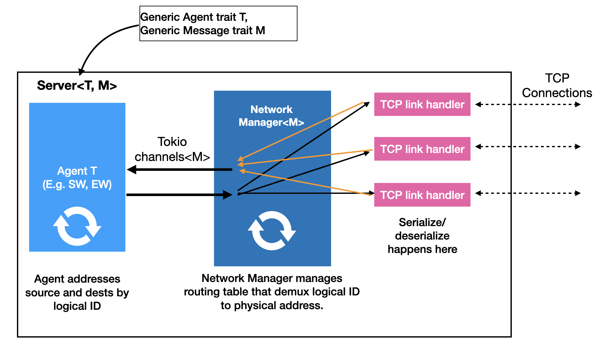

# Distributed Execution

## Running the code

```bash
cargo build --release --bin baseline_executor
time ./target/release/baseline_executor --config-path fullnode.yaml --download 500000 --execute 500000

cargo build --release --bin simple_channel_executor
time ./target/release/simple_channel_executor --config-path fullnode.yaml --download 500000 --execute 500000

cargo build --release --bin ping_service
time ./target/release/ping_service --my-id 1
```

Note that for for running ping_service, start a new terminal for each server. Then run

```bash
time ./target/release/ping_service --my-id <server-id>
```

to start each server, where `<server-id>` is the logical id from the json config file.

## Servers

### Agents

An agent is a self-contained program that receives and sends messages to other agents. Services are implemented by an agent or a group of agents. E.g. A full-node service may comprise of Sequencing and Execution Agents.

The type of agents currently implemented in this repository includes:

* Echo -- Prints every message it receives
* Ping -- Periodically sends a ping to a target

To implement a new type of agent, one writes a struct that implements the `Agent` trait.

### Configuration files

A configuration defines a global system configuration. It specifies the mapping of agents to servers, and the attributes of each agent.
Configuration files are written in the JSON language, where each agent is indexed by a unique global identifier.

Each JSON agent object has the following fields:

* kind -- A string describing the type of the agent, to be decoded by the driver program (see ping_service.rs for an example driver)
* ip and port -- The TCP listening address of the server.
* attr -- Attributes are arguments to the Agent program.

### Server design



A server has three main components:

1. the agent living on the server (running as a Tokio task),
2. a network manager that manages routing messages from the agent to the appropriate TCP link (running as a Tokio task), and
3. a set of TCP link handlers, each of which manages one of the bi-directional TCP channel with another server (each link handler runs as a Tokio task).

Communication between tasks are handled by Tokio channels, as shown in the schematic.
To create all-to-all TCP connections,  each server will upon startup attempt to connect to all servers with a smaller global identifier.
