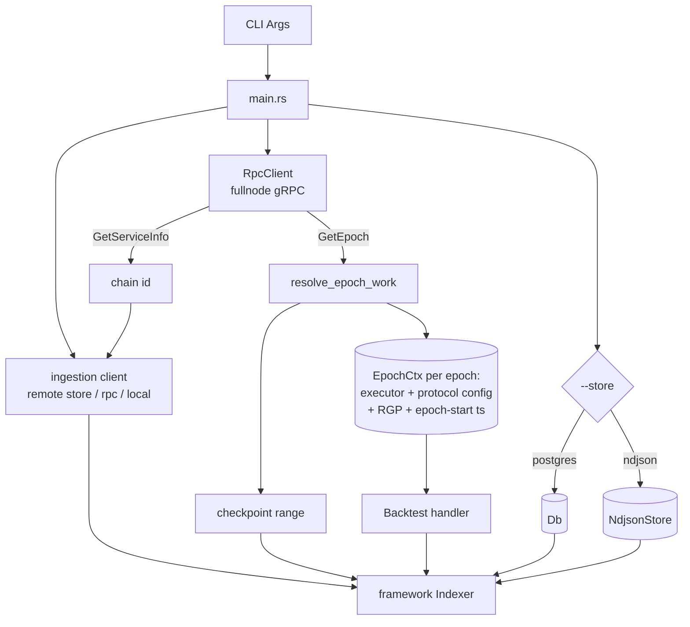
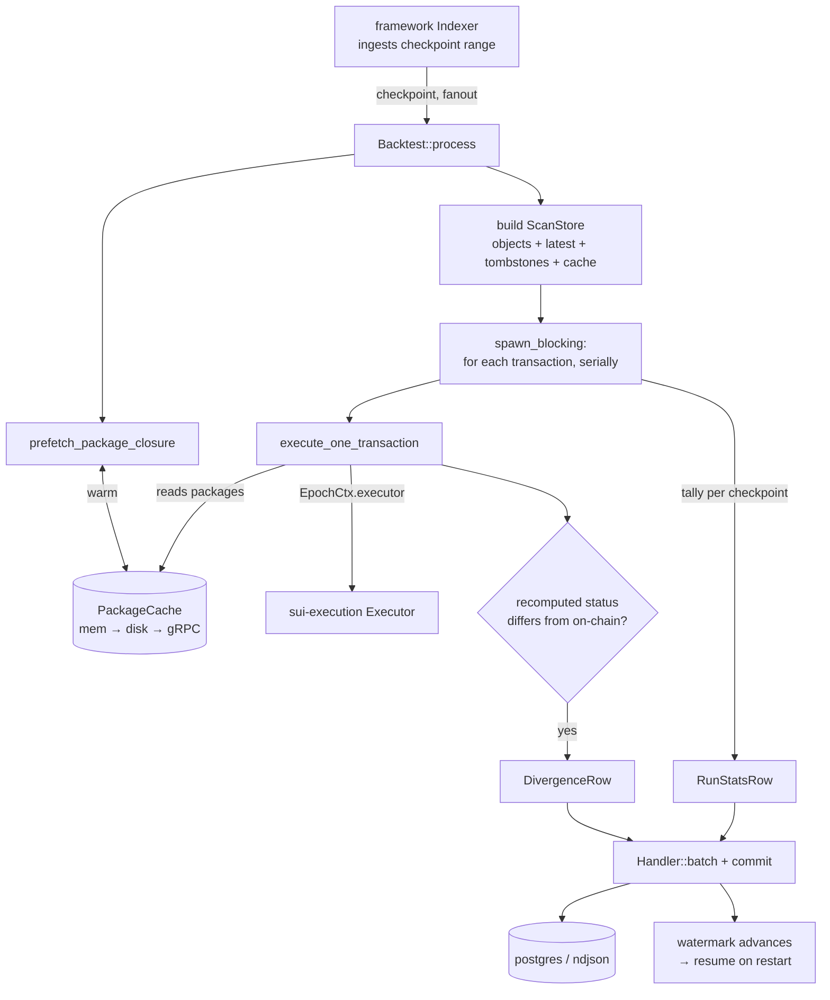

<!--
Copyright (c) Mysten Labs, Inc.
SPDX-License-Identifier: Apache-2.0
-->

# sui-execution-backtest

Backtests the execution layer against historical mainnet data: it re-executes past transactions
under the **current** execution rules and reports where the recomputed result diverges from what was
recorded on chain. Useful for measuring the behavioral impact of an execution/protocol change before
it ships (e.g. a VM, gas, or linkage change).

It runs as a [`sui-indexer-alt-framework`](../sui-indexer-alt-framework) concurrent pipeline:

1. Resolves each epoch's checkpoint range + protocol version + reference gas price from a fullnode
   (gRPC `GetEpoch`), building a version-correct executor per epoch.
2. Hands the resulting checkpoint range to the framework's `Indexer`, which ingests checkpoints with
   adaptive concurrency and runs the per-checkpoint processor with a configurable fanout.
3. For each checkpoint, prefetches the package closure its transactions could load (batched
   multi-gets; see [Packages](#how-execution-context-is-reconstructed)), then re-executes every
   programmable transaction whose on-chain status matches `--status` (default `all`) — serially, on
   a blocking worker — against reconstructed checkpoint state via the `sui-execution` Executor.
4. Records a **divergence** for any transaction whose recomputed success/failure status disagrees
   with its on-chain status, plus (unless `--no-stats`) a per-checkpoint `run_stats` row of
   denominators. The framework's watermark gives crash-resumption.

Divergence direction is recoverable from each record: a recomputed error (on-chain succeeded) has a
non-null `recomputed_error_kind`; a recomputed success (on-chain failed) has it null. `--status
success` is the strict baseline (a tx that succeeded on chain now erroring is a clear regression);
`all`/`failed` also replay failures, each row carrying its on-chain status so the differential can
be applied downstream.

## Run

The output sink is selected with `--store`:

- `--store ndjson --output <file>` — zero-setup, appends rows to a newline-delimited JSON file. No
  resumption across restarts. Good for quick local runs.
- `--store postgres --database-url <url>` — durable, queryable, and resumable (watermark-based).

```bash
# Zero-setup ndjson run.
cargo run --release -p sui-execution-backtest -- \
  --remote-store-url https://checkpoints.mainnet.sui.io \
  --fullnode-url https://mysten-rpc.mainnet.sui.io:443 \
  --start-epoch 1152 --end-epoch 1152 --status all \
  --execute-concurrency 24 \
  --cache ./.package-cache \
  --store ndjson --output ./divergences.ndjson

# Postgres run, with a run identifier (see --task below).
cargo run --release -p sui-execution-backtest -- \
  --remote-store-url https://checkpoints.mainnet.sui.io \
  --fullnode-url https://mysten-rpc.mainnet.sui.io:443 \
  --start-epoch 1152 --end-epoch 1152 --status all \
  --cache ./.package-cache \
  --store postgres --database-url postgres://localhost/backtest \
  --task my-linkage-change
```

- **Checkpoint source.** Prefer a remote object store — the fast archival path — with a
  `--fullnode-url` supplied separately for epoch + package resolution. The HTTP endpoint
  (`--remote-store-url https://checkpoints.<network>.sui.io`) is the zero-setup option but **only
  retains roughly the last 30 days**, so backtesting older epochs needs the GCS bucket directly via
  `--remote-store-gcs <bucket>` (see [accessing checkpoint
  data](https://docs.sui.io/guides/developer/advanced/custom-indexer#remote-reader)); running
  colocated with the bucket also avoids egress cost and latency. Alternatively a single
  `--rpc-api-url` fullnode can serve as both (slower; see the rate-limit caveat below).
- `--start-epoch` / `--end-epoch` select the inclusive epoch range.
- `--max-checkpoints-per-epoch N` caps each epoch at its first `N` checkpoints (for bounded
  samples). Omit it to backtest whole epochs — note a mainnet epoch is ~300–390k checkpoints.
- `--status {success,failed,all}` (default `all`) selects which on-chain statuses to re-execute.
- `--execute-concurrency N` is the **CPU** width: checkpoints processed (and re-executed)
  concurrently. Each checkpoint's transactions run serially on one blocking worker. Omit it for the
  framework's adaptive scaling (up to the number of CPUs). Throughput is fetch/memory-bound, not
  CPU-bound, so this rarely needs raising.
- `--cache` points at an on-disk package cache directory (speeds up re-scans).
- `--no-stats` suppresses the per-checkpoint `run_stats` rows (divergences are still recorded).

### `--task` and resumption

The postgres watermark lets an interrupted run resume from where it left off. But the watermark
assumes a checkpoint's output is a pure function of the checkpoint — and the whole point of the
backtest is that output also depends on the *execution rules under test*. So **`--task <run-id>`
namespaces both the output rows (the `task` column / primary key) and the watermark.** Bump it
whenever the rules under test change, otherwise a re-run would resume the previous run's watermark
and skip every already-processed checkpoint, silently producing an empty differential. Reusing a
task resumes — which is correct *only* if the rules are unchanged. (The ndjson sink keeps watermarks
in memory only, so it never resumes across restarts and is unaffected.)

**Omitting `--task` derives the id from the git revision the binary was built from** — the HEAD
commit, plus a hash of uncommitted changes when the working tree is dirty — so editing the execution
rules and rebuilding automatically yields a fresh namespace, while re-running unchanged code
resumes. Pass an explicit `--task` to override with a human-readable label.

## Output

Two row types, written to two postgres tables (or interleaved as ndjson lines):

- **`divergence`** — one row per divergent transaction: `task, epoch, checkpoint, tx_digest`, the
  on-chain outcome (`original_status`, `original_failure_kind`), the recomputed outcome
  (`recomputed_status`, `recomputed_error_kind`, `recomputed_error_detail`), and triage columns
  (`missing_modified`, `missing_loaded`, `missing_consensus`, `digest_mismatches`). The triage
  columns count how much of the transaction's read set our reconstructed store was missing or
  disagreed on — nonzero values point at a *reconstruction gap* rather than a genuine execution
  divergence. `recomputed_error_kind` is the bare error variant, so divergences can be grouped by
  kind (e.g. `… GROUP BY recomputed_error_kind`).
- **`run_stats`** — per-checkpoint denominators (`checked`, `executed`, `divergences`,
  `reconstruction_errors`, `coin_reservation_skipped`, `execute_skipped`, `gas_from_balance`,
  `cancellation_excluded`), so divergence rates are queryable and comparable across runs (`task`).

## How execution context is reconstructed

Per transaction the tool builds a read-only `BackingStore` from:

- **Objects**: the checkpoint's object set (input + output + unchanged-loaded-runtime objects).
  Shared objects are served at their per-transaction version (from the effects' input consensus
  objects), and dynamic-field child reads are tombstone-aware (within-checkpoint deletions are
  honored).
- **User packages**: a per-checkpoint **closure prefetch** warms a shared cache (in-memory, layered
  over the optional on-disk `--cache` dir) with every package the checkpoint's transactions could
  load. The roots are the MoveCall targets, type-argument packages, and object-type packages. For
  each fetched root we then add its **linkage table** (the upgraded storage ids of its transitive
  dependencies) and its **type-origin table** (the storage id of every package version that
  *introduced* one of its types) — the latter catches types added in a package upgrade, whose
  introducing version need never appear as a static reference yet is the id the executor loads.
  Reads during execution hit that cache; a rare miss falls through to a lazy single gRPC fetch (with
  retry/backoff) into the same cache — the correctness net for any runtime-only edge the static
  closure can't see. Over-fetching is harmless: the prefetch only decides what is warm. These
  packages are immutable, so fetching their latest version is faithful.
- **System (framework) packages** (`0x1`, `0x2`, `0x3`, `0xb`, `0xdee9`): these keep a stable id but
  are *upgraded* (new bytecode) across protocol versions, so the fullnode's latest version is wrong
  for a historical epoch. Instead they are loaded **version-correctly per epoch** from the on-disk
  [`sui-framework-snapshot`](../sui-framework-snapshot) at the epoch's protocol version (the snapshot
  is sparse, so the greatest snapshot ≤ the protocol version is used), and served directly by
  `ScanStore` — never fetched from the network. A protocol version newer than any bundled snapshot
  falls back to the newest available (update the snapshot crate if you need a newer framework).

Execution is **metered** with the transaction's own budget/price (gasless txns are metered at the
epoch RGP with the gasless compute cap, mirroring `sui-transaction-checks`).

Coin-reservation (address-balance) inputs — synthetic "fake coin" object refs that encode a
withdrawal in their digest — are rewritten back into `FundsWithdrawal` args by re-deriving the
balance type from the reservation id (no extra fetch). Reservations whose type can't be identified
are counted in `coin_reservation_skipped` and skipped.

## Caveats

- **Single-transaction replay can't model scheduling.** Transactions cancelled before execution by
  consensus-layer congestion / randomness control never ran on chain, so they "succeed" here. These
  are detected from the on-chain effects and counted under `cancellation_excluded` rather than
  reported as divergences.
- **Public-node rate limiting.** Package fetches go to the fullnode; `fullnode.mainnet.sui.io`
  returns HTTP 429 under concurrent load. The fetcher retries with backoff, but prefer
  `--remote-store-url` for checkpoints plus a dedicated/archival fullnode. Public nodes also prune
  old epochs — only recent epochs are available there.
- Only `ProgrammableTransaction`s are considered; system/consensus transactions are out of scope.

## Analysis

The backtest itself is change-agnostic — it just emits divergence (and stats) rows. Analysis
specific to a particular change lives outside this crate; the typed `recomputed_error_kind` and the
`run_stats` denominators are intended to make that analysis a matter of SQL.

## Architecture

The crate is a thin orchestration layer: the [`sui-indexer-alt-framework`](../sui-indexer-alt-framework)
pipeline drives ingestion, scheduling, batching, and watermarks; this crate supplies a checkpoint
*processor* that reconstructs state and re-executes with the [`sui-execution`](../../sui-execution)
Executor. Components, by module:

| Module | Responsibility |
|---|---|
| `main.rs` | CLI (`Args`), startup wiring, run-id derivation, sink selection; builds and runs the `Indexer`. |
| `grpc.rs` | `RpcClient` — thin fullnode gRPC client: epoch bounds (`GetEpoch`), chain id (`GetServiceInfo`), and package fetches (`GetObject` / `BatchGetObjects`) with retry + backoff. |
| `ingestion.rs` | Remote-store ingestion client with the chain id injected up front (`FixedChainId`), so it never derives it from a slow genesis fetch. |
| `context.rs` | `EpochCtx` (version-correct executor + protocol config + reference gas price + epoch-start timestamp + the epoch's framework packages from the snapshot) and `resolve_epoch_work`, which turns an epoch range into per-epoch contexts plus the overall checkpoint range. |
| `handler.rs` | `Backtest<S>` — the framework `Processor` + `Handler`. Per checkpoint: prefetch packages, reconstruct state, re-execute, emit rows; then batch and commit them through the `CommitRows` trait. |
| `store.rs` | `PackageCache` (shared, in-memory → on-disk → gRPC) with `prefetch_package_closure`, and `ScanStore` — the read-only `BackingStore` execution runs against (serves system packages from the epoch's framework, user packages from the cache). |
| `execute.rs` | `execute_one_transaction` — per-transaction gas planning, coin-reservation rewrite, metered execution, and divergence detection + triage. |
| `ndjson_store.rs` | `NdjsonStore` — the zero-setup `ConcurrentStore` sink (file output + in-memory watermarks). |
| `rows.rs` / `schema.rs` | Typed output rows (`DivergenceRow`, `RunStatsRow`) and their diesel/postgres schema. |

### Startup and wiring

Everything needed for replay is resolved up front, then handed to the framework's `Indexer`. The
chain id comes from `GetServiceInfo` (cheap) rather than fetching genesis, and the one ingestion
client serves both epoch resolution and the indexer.



### Per-checkpoint pipeline

The `Indexer` ingests the checkpoint range with adaptive concurrency and runs `Backtest::process`
per checkpoint (fanout = `--execute-concurrency`). Each checkpoint warms the shared package cache,
reconstructs a read-only store, and re-executes its transactions serially on a blocking worker;
the rows it emits are batched and committed, advancing the watermark for crash-resumption.



See [How execution context is reconstructed](#how-execution-context-is-reconstructed) for the store
and package-closure details.
