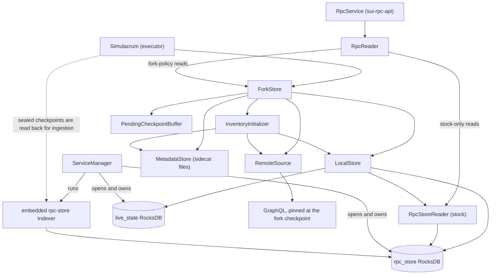
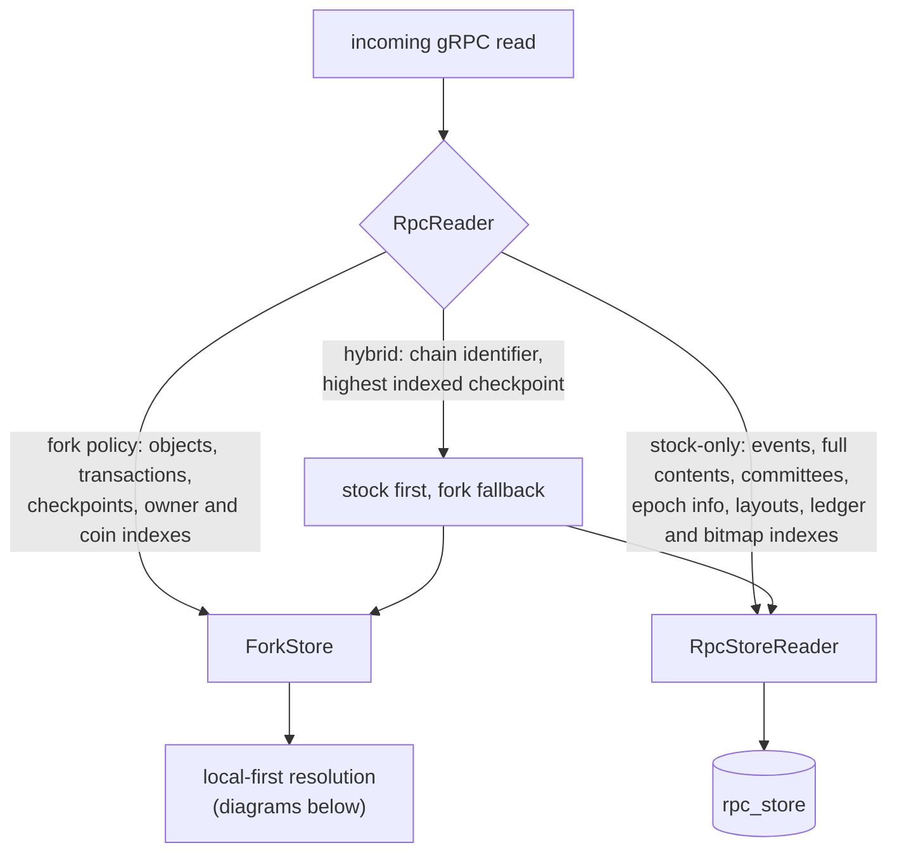
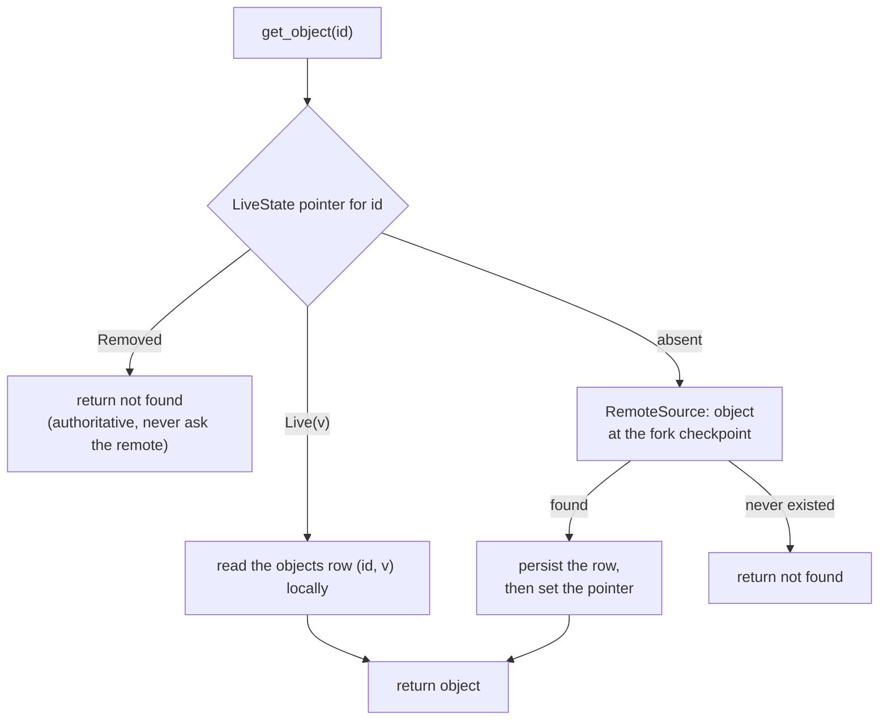
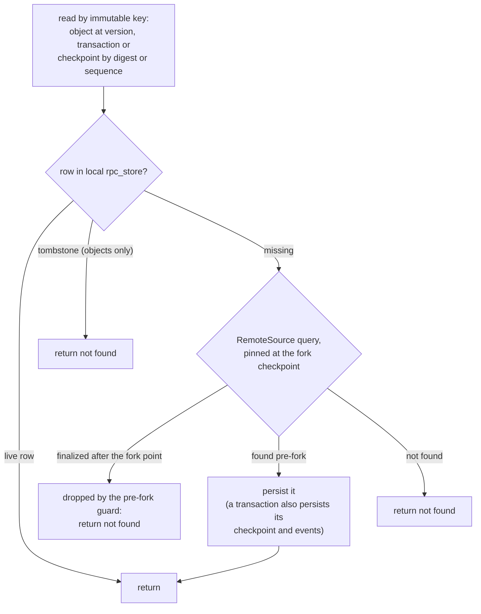
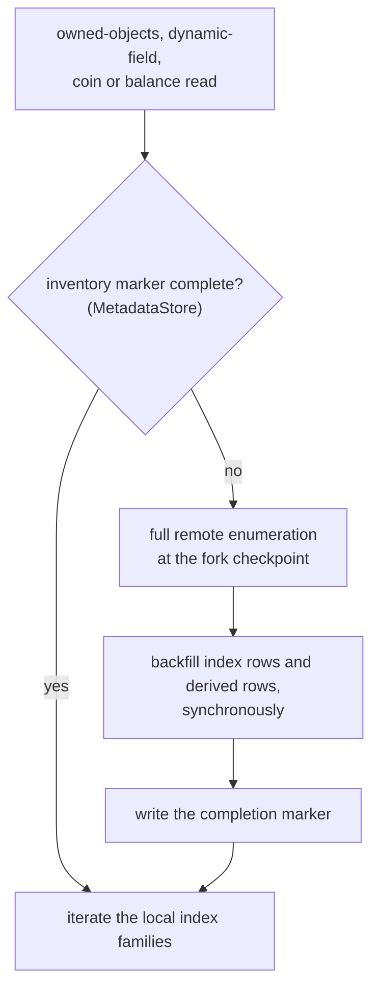
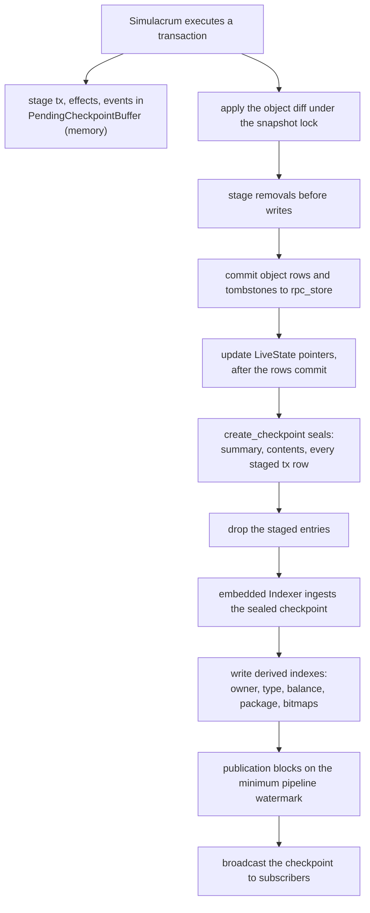

<!--
Copyright (c) Mysten Labs, Inc.
SPDX-License-Identifier: Apache-2.0
-->

# `sui-fork` storage: read and write flow diagrams

Companion to [storage.md](storage.md), which argues the design; this file draws it. Every
read diagram below is a variation on one rule: answer locally when local knowledge is
authoritative, fork to the remote chain — GraphQL pinned at the fork checkpoint — when it
is not, and persist what came back so the same question is never asked twice. Writes never
fork: local execution is the only writer of post-fork state, and remote data enters the
store only as the persisted result of a read.

## Who holds whom

`ServiceManager` opens and owns the durable pieces; `ForkStore` orchestrates policy over
them; `RpcReader` and Simulacrum are the two consumers standing in front of it.

## Reads

### RPC routing

`RpcReader` is a thin router: everything the fork has policy for goes to `ForkStore`
(which is itself local-first), and only the surfaces the fork has no policy for touch the
stock reader directly.

### Latest-object reads: the three-way fork

A latest read cannot trust a reverse scan of the sparse `objects` family, so it consults
the `LiveState` pointer, whose three states map exactly onto the three outcomes. Note the
`Removed` arm: an authoritative tombstone must never be "resurrected" by a remote fetch.

### Immutably-keyed reads: exact versions, transactions, checkpoints

A row under an immutable key cannot go stale, so the local rpc-store row is served
directly; only a miss forks to the remote. The tombstone arm applies to object reads —
transactions and checkpoints have no removal states. `RemoteSource` guards the fallback:
a result finalized after the fork point must not leak into the diverged fork.

### Owner and index reads: lazy inventories

Owner-scoped reads cannot be answered by fetching single objects — completeness is the
point — so the first such read triggers a one-time full enumeration, recorded in a
completion marker so every later read is purely local.

## Writes

### Local execution, sealing, and indexing

Everything canonical is written synchronously — the executor needs read-your-writes and
the indexer re-reads sealed rows — while everything derived is left to the embedded
indexer. Two orderings keep crashes fail-safe rather than fail-open: rows commit before
the `LiveState` pointer that makes them authoritative, and removals stage before writes
within one diff so a wrapped-then-recreated object lands live. A failed persist panics:
the `SimulatorStore` surface cannot return errors, and executing past one would diverge
memory from disk.

Pre-fork state is the one exception to "derived rows come from the indexer": seed saves,
inventory scans, and lazy materialization write their derived rows synchronously alongside
the objects they persist. That creates no second writer — those saves cover versions at or
before the fork checkpoint, a range the indexer, which starts one checkpoint after the
fork point, never touches.
