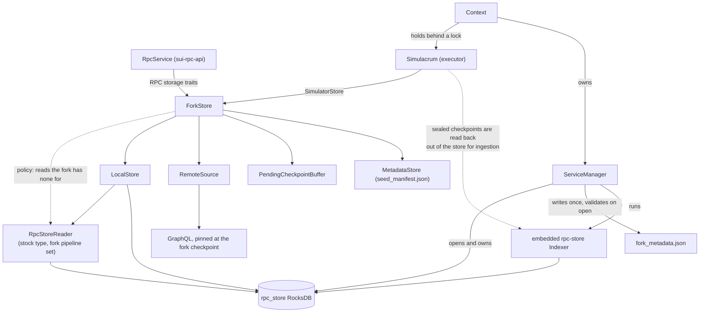
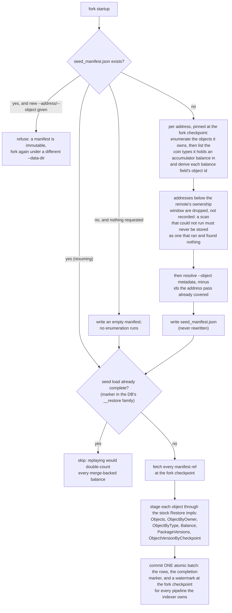
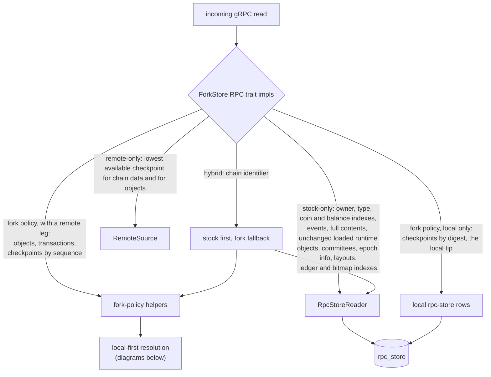
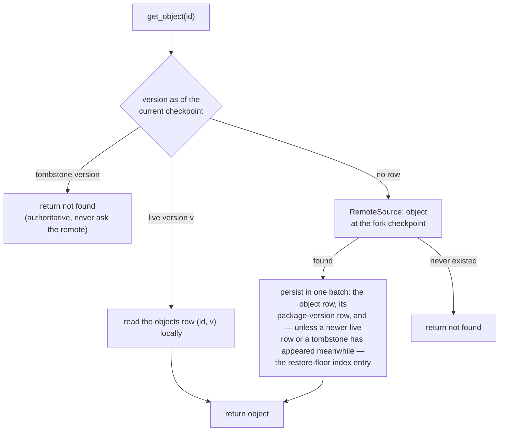
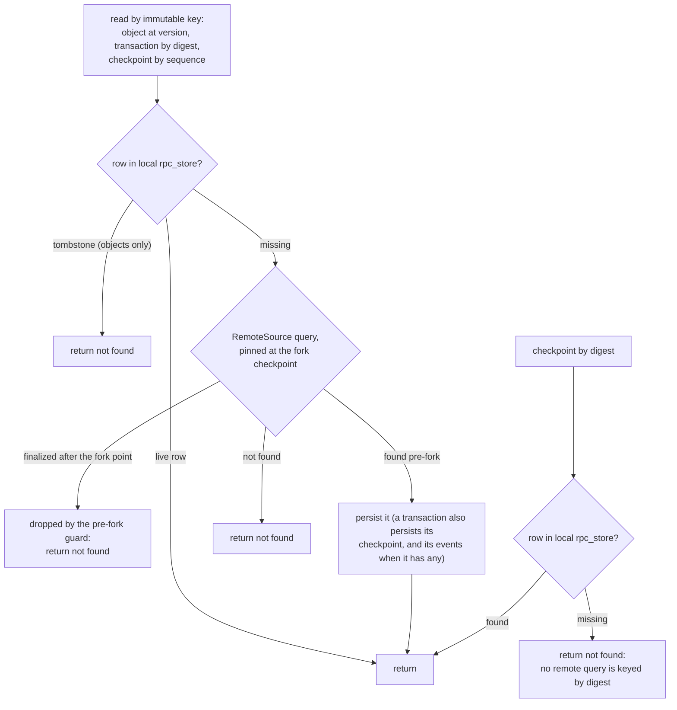
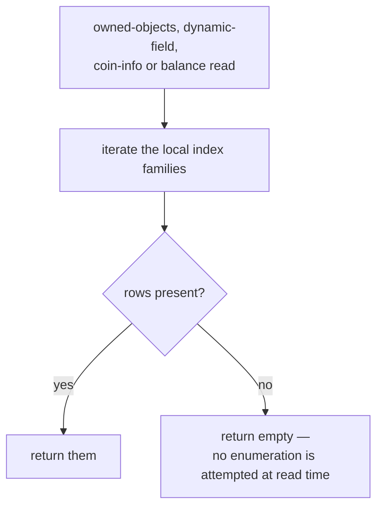
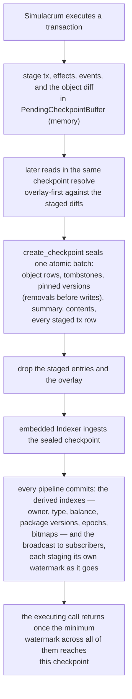

<!--
Copyright (c) Mysten Labs, Inc.
SPDX-License-Identifier: Apache-2.0
-->

# `sui-fork` workflows: seed, read, and write flows

Companion to [storage.md](storage.md), which argues the design; this file draws it.

Two rules cover almost everything below. A request that carries a **key** — an object id, a
version, a digest — is answered locally when local knowledge is authoritative and forked to
the remote chain (GraphQL pinned at the fork checkpoint) when it is not, persisting whatever
came back so the same question is never asked twice. A request that carries **no key** but
asks for a *set* is answered from what seeding established at fork creation, because the
enumeration behind it is only available for a window after the fork point and nothing
reconstructs it afterwards.

Writes never fork: local execution is the only writer of post-fork state, and remote data
enters the store only as the persisted result of a read or of the one-shot seed load.

## Who holds whom

`ServiceManager` opens and owns the durable pieces; `ForkStore` orchestrates policy over
them and is what both consumers stand on: it implements the RPC storage traits for
`RpcService` and `SimulatorStore` for Simulacrum. `Context` sits above both, holding the
executor behind a lock and the service manager that runs the indexer. It also owns the
publication lock, which is what keeps exactly one checkpoint in flight — an invariant the
read path leans on, since a live-state read bounds itself at "the checkpoint currently being
produced" and that phrase names one thing only while sealing is serialized.

The solid edges below are ownership. `ForkStore` does reach the stock reader, but through
`LocalStore`, which is where it is cached; that edge is dashed because it is policy rather
than possession. The reader is stock in type and not in configuration: `LocalStore` builds it
over the fork's own pipeline set rather than the default one, because a reader bounded by
pipelines nothing writes reports no indexed tip at all.

## Seeding

Seeding runs once, at fork creation, before anything executes. It splits into resolution and
loading because only the first half is time-critical: enumerating *which* objects an address
held is answerable only while the remote still retains ownership data for the fork
checkpoint, whereas fetching what each object *contains* is keyed by an exact
`(id, version)` and so stays answerable indefinitely.

An address's balance is not among the objects it owns — it lives in a dynamic field under
the accumulator root — so resolution derives those fields separately, per address, as part of
the same pass that enumerates what the address owns. Their ids follow from
`(address, coin type)`; the only thing that must come from the remote is which coin types to
derive for, since an address can hold a balance in a coin type it owns no `Coin<T>` of.

All three parts of that last step carry weight. Atomicity is what lets the load write blind —
no reconciliation against existing state, no retraction of stale rows — because it precedes
execution, so either the whole seed set is present or none of it is. The marker is what makes
it unrepeatable, and it lives in the database rather than beside it precisely so it commits
with the rows it describes; a JSON sidecar could not make that claim. The watermarks are what
make the rows legible: the rows say what the indexes hold, the watermarks say through which
checkpoint, and every reader asks the second question. A restore that writes rows without
watermarks reports no indexed tip at all, so the indexes read as empty however full they are.
The indexer resumes one checkpoint past the fork point, so the two meet without a gap.

## Reads

### RPC routing

`ForkStore`'s RPC trait impls are a thin router: reads the fork has policy for resolve
through its own local-first helpers, and everything else touches the stock reader directly.
The stock reader is the one cached inside `LocalStore` (`local_store().reader()`), so in the
*ownership* sense everything goes through `ForkStore`. The arrows show the *policy* sense
instead: whose logic answers the read.

The index reads sit on the stock side. They are answered from local rows alone, which hold
what seeding established plus whatever local execution has produced since.

Two arms are easy to miss. Not every fork-policy read has a remote leg: the digest-keyed
checkpoint reads have none because the GraphQL checkpoint query is keyed by sequence number,
so there is nothing to ask; and the tip reads have none by choice, because the local executor
is the source of truth for "latest" in a forked network. In the other direction, two reads
never touch local state at all — the availability bounds are facts about the *live*
network, so they are answered by asking it, on every call.

### Latest-object reads: the three-way fork

A latest read cannot trust a reverse scan of the sparse `objects` family, so it floor-scans
`object_version_by_checkpoint` instead, bounded at the checkpoint the fork is currently
producing. Its three outcomes map exactly onto the three the fork needs. Note the tombstone
arm: an authoritative removal must never be "resurrected" by a remote fetch.

Only the last of those three writes is conditional, and the condition is load-bearing rather
than defensive: nothing holds a lock across the miss and the write, so an execution can land
in between. If one did, the fetched object is still worth keeping as history — it is what the
live network held at the fork point, which stays true — but it must not claim currency.

### Immutably-keyed reads: exact versions, transactions, checkpoints

A row under an immutable key cannot go stale, so the local rpc-store row is served
directly; only a miss forks to the remote. The tombstone arm applies to object reads —
transactions and checkpoints have no removal states. `RemoteSource` guards the fallback:
a result finalized after the fork point must not leak into the diverged fork.

Checkpoints keyed by digest are the exception, and it is one of availability rather than of
policy: the remote's checkpoint query takes a sequence number, so a digest miss has nowhere
to go.

### Index reads are seed-bounded

Owner-, type- and balance-scoped reads cannot be answered by fetching single objects —
completeness is the point — and the enumeration that would establish completeness belongs to
fork creation. So these reads never reach the remote: they iterate local rows and return what
is there.

The failure mode is worth stating plainly: an empty answer is indistinguishable from a
complete one that found nothing, so a client cannot tell "this address owns nothing" from
"this fork was never told about this address."

`get_coin_info` is the sharpest case, and its gap is narrower than the read being useless. It
resolves a coin type by prefix-scanning `object_by_type` for that type's `CoinMetadata`,
`TreasuryCap` and `RegulatedCoinMetadata` wrappers, and that index has two writers here: the
seed load and the indexer. So a coin type published *inside* the fork resolves normally, and a
pre-fork `TreasuryCap` resolves whenever the address holding it was seeded, since it is an
ordinary address-owned object. What cannot resolve is pre-fork `CoinMetadata` and
`RegulatedCoinMetadata`: both are frozen, seed resolution admits only address-owned objects,
and nothing fetches them at read time. See storage.md § "Known gaps".

## Writes

Everything canonical commits at the seal, in one batch — object rows, tombstones,
checkpoint-pinned versions, summary, contents, and every transaction's data, effects, and
events — while everything derived is left to the embedded indexer. Until the seal, an
executed transaction's object diff lives only in `PendingCheckpointBuffer`, which doubles
as a read overlay: the executor gets read-your-writes for the next transaction's inputs
from the staged diffs, consulted before the rpc-store on every current, exact-version, and
bounded object read. Removals still stage before writes within one diff: both target the
same checkpoint-pinned key, so the later put is what decides whether a
wrapped-then-recreated object lands live. Terminal deletes are held out of that rule
deliberately — an object created and deleted by the same result stages no checkpoint-pinned
put at all, so it survives as history without ever having been current. The overlay mirrors
exactly these rules, because it must answer what the rows will say once committed. A failed
stage or seal panics: the `SimulatorStore` surface cannot return errors, and executing past
one would diverge memory from disk.

Two things the seal step flattens. `create_checkpoint` is not purely a sealing operation:
under accumulators it first executes the settlement transactions and the barrier transaction,
each of which re-enters staging and adds its own object diff, so the top of this flow runs
again before the summary is built. And the batch is genuinely one batch: a crash anywhere
before its commit leaves no trace of the checkpoint. The pending buffer is memory-only, so
the staged work vanishes with the process and a restart resumes from the previous tip —
never on top of objects whose checkpoint does not exist.

Publication is not a step after indexing but a pipeline within it. The broadcast to
subscribers is registered as an indexer pipeline like any other, and it stages its watermark
in the same store transaction that performs the send, so by the time the minimum watermark
reaches a checkpoint that checkpoint has already gone out. What the minimum gates is the
executing call's *return*: an execution does not answer its caller until every derived index
reflecting it is durable, so a read issued after the response cannot observe a transaction
whose derived state is still missing.

Pre-fork state is the one exception to "derived rows come from the indexer", because the
indexer starts one checkpoint after the fork point and never sees the state the fork
inherited. The seed load therefore writes the whole derived surface itself, routed through the
indexer's own `Restore` impls rather than a parallel set of writes maintained here. Lazy
object materialization writes far less: the object row, its package-version row, and the
checkpoint-pinned entry, and nothing else. It populates no owner, type or balance index, which
is exactly why the index reads above are bounded by the *seed* rather than by what has been
materialized — an object the fork fetched on demand is readable by id and invisible to every
scan.

Neither is a second writer, though for two different reasons. The checkpoint-pinned entries
land at or before the fork checkpoint, a range the indexer never touches. The package-version
rows are not range-separated at all — they are keyed `(original id, version)` and written as
plain puts, so a pre-fork version and a post-fork publish simply occupy different keys. The
pipeline where the range genuinely matters is `balance`, which accumulates through a merge
operator: there an overlap would double rather than be idempotent, which is why the seed load
must run exactly once.

Nothing has to maintain the seeded index rows afterwards. When a seeded object moves, the
checkpoint that moved it is a local checkpoint, and the indexer reads each such checkpoint as
a diff: inputs retract at the prior key, outputs write at the posterior one.
