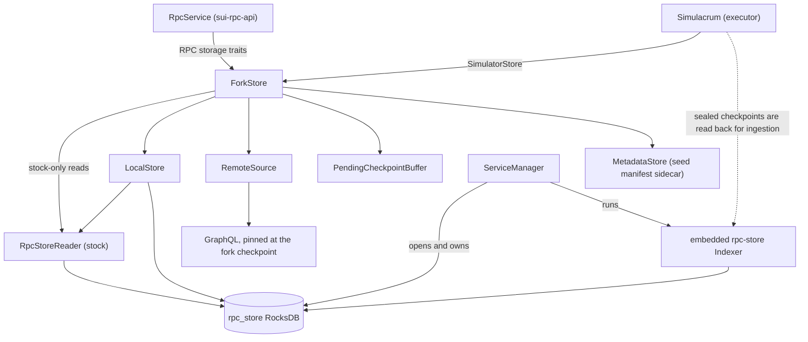
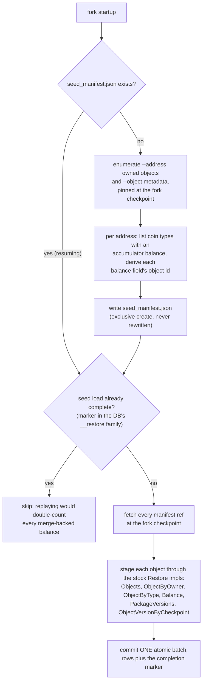
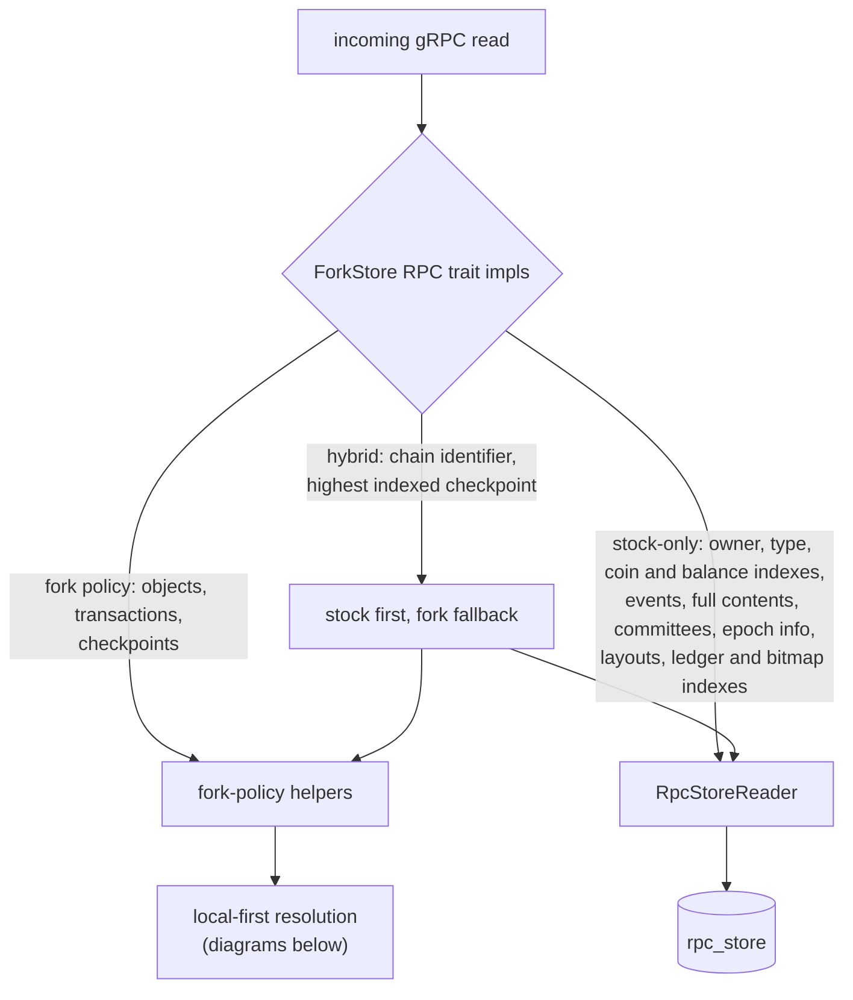
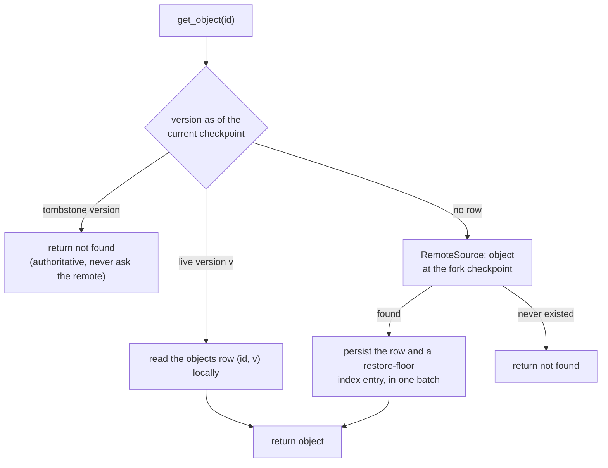
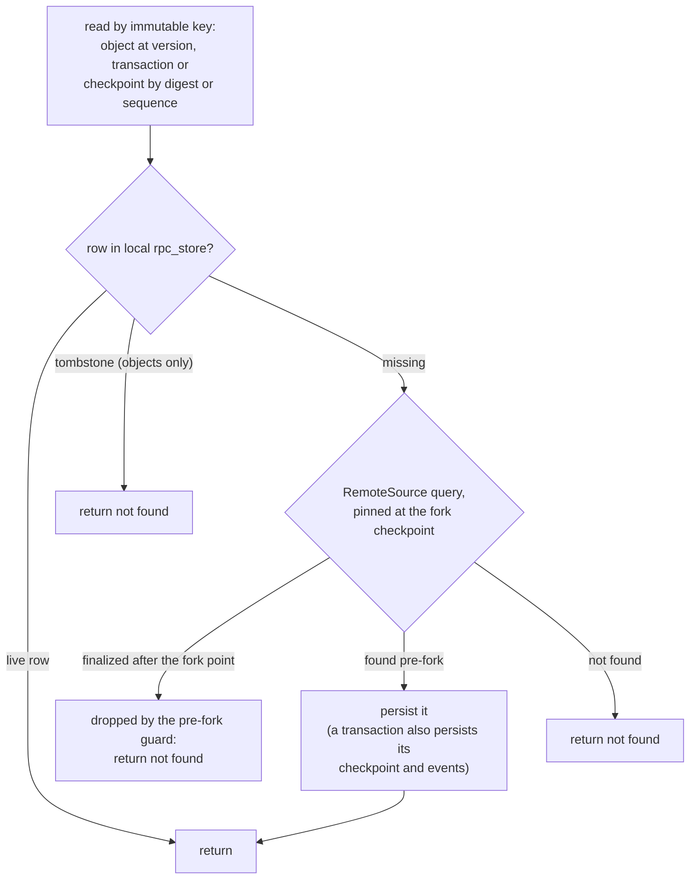
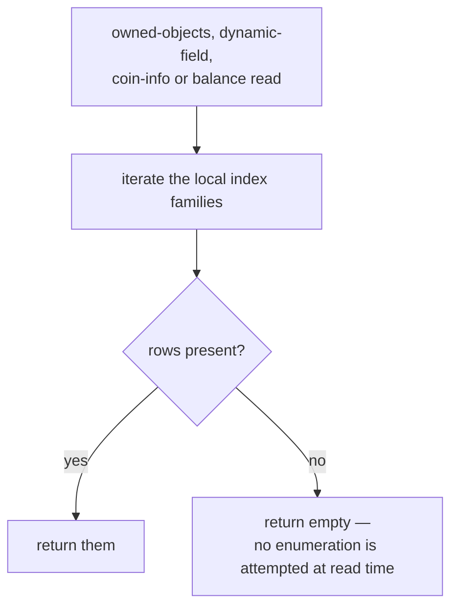
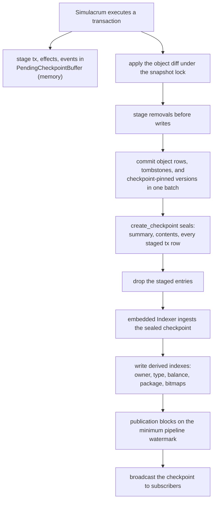

<!--
Copyright (c) Mysten Labs, Inc.
SPDX-License-Identifier: Apache-2.0
-->

# `sui-fork` workflows: seed, read, and write flows

Companion to [storage.md](storage.md), which argues the design; this file draws it.

Two rules cover almost everything below. A request that carries a **key** — an object id, a
version, a digest — is answered locally when local knowledge is authoritative and forked to
the remote chain (GraphQL pinned at the fork checkpoint) when it is not, persisting whatever
came back so the same question is never asked twice. A request that carries **no key** but
asks for a *set* is answered from what seeding established at fork creation, because the
enumeration behind it is only available for a window after the fork point and nothing
reconstructs it afterwards.

Writes never fork: local execution is the only writer of post-fork state, and remote data
enters the store only as the persisted result of a read or of the one-shot seed load.

## Who holds whom

`ServiceManager` opens and owns the durable pieces; `ForkStore` orchestrates policy over
them and is what both consumers stand on: it implements the RPC storage traits for
`RpcService` and `SimulatorStore` for Simulacrum.

## Seeding

Seeding runs once, at fork creation, before anything executes. It splits into resolution and
loading because only the first half is time-critical: enumerating *which* objects an address
held is answerable only while the remote still retains ownership data for the fork
checkpoint, whereas fetching what each object *contains* is keyed by an exact
`(id, version)` and so stays answerable indefinitely.

An address's balance is not among the objects it owns — it lives in a dynamic field under
the accumulator root — so resolution derives those fields separately. Their ids follow from
`(address, coin type)`; the only thing that must come from the remote is which coin types to
derive for, since an address can hold a balance in a coin type it owns no `Coin<T>` of.

Both halves of that last step carry weight. Atomicity is what lets the load write blind — no
reconciliation against existing state, no retraction of stale rows — because it precedes
execution, so either the whole seed set is present or none of it is. The marker is what makes
it unrepeatable, and it lives in the database rather than beside it precisely so it commits
with the rows it describes; a JSON sidecar could not make that claim.

## Reads

### RPC routing

`ForkStore`'s RPC trait impls are a thin router: reads the fork has policy for resolve
through its own local-first helpers, and everything else touches the stock reader directly.
The stock reader is the one cached inside `LocalStore` (`local_store().reader()`), so in the
*ownership* sense everything goes through `ForkStore`. The arrows show the *policy* sense
instead: whose logic answers the read.

The index reads sit on the stock side. They are answered from local rows alone, which hold
what seeding established plus whatever local execution has produced since.

### Latest-object reads: the three-way fork

A latest read cannot trust a reverse scan of the sparse `objects` family, so it floor-scans
`object_version_by_checkpoint` instead, bounded at the checkpoint the fork is currently
producing. Its three outcomes map exactly onto the three the fork needs. Note the tombstone
arm: an authoritative removal must never be "resurrected" by a remote fetch.

### Immutably-keyed reads: exact versions, transactions, checkpoints

A row under an immutable key cannot go stale, so the local rpc-store row is served
directly; only a miss forks to the remote. The tombstone arm applies to object reads —
transactions and checkpoints have no removal states. `RemoteSource` guards the fallback:
a result finalized after the fork point must not leak into the diverged fork.

### Index reads are seed-bounded

Owner-, type- and balance-scoped reads cannot be answered by fetching single objects —
completeness is the point — and the enumeration that would establish completeness belongs to
fork creation. So these reads never reach the remote: they iterate local rows and return what
is there.

The failure mode is worth stating plainly: an empty answer is indistinguishable from a
complete one that found nothing, so a client cannot tell "this address owns nothing" from
"this fork was never told about this address." `get_coin_info` currently always takes the
empty branch; see storage.md § "Known gaps".

## Writes

### Local execution, sealing, and indexing

Everything canonical is written synchronously — the executor needs read-your-writes and
the indexer re-reads sealed rows — while everything derived is left to the embedded
indexer. An object row and the index entry making it current commit in one batch, so
neither can outlive the other. Removals still stage before writes within one diff: both
target the same checkpoint-pinned key, so the later put is what decides whether a
wrapped-then-recreated object lands live. A failed persist panics: the `SimulatorStore`
surface cannot return errors, and executing past one would diverge memory from disk.

Pre-fork state is the one exception to "derived rows come from the indexer": the seed load
and lazy object materialization write their rows themselves, because the indexer starts one
checkpoint after the fork point and never sees the state the fork inherited. That creates no
second writer — those writes cover versions at or before the fork checkpoint, a range the
indexer never touches — and the seed load routes through the indexer's own `Restore` impls
rather than a parallel set of writes maintained here.

Nothing has to maintain the seeded index rows afterwards. When a seeded object moves, the
checkpoint that moved it is a local checkpoint, and the indexer reads each such checkpoint as
a diff: inputs retract at the prior key, outputs write at the posterior one.
