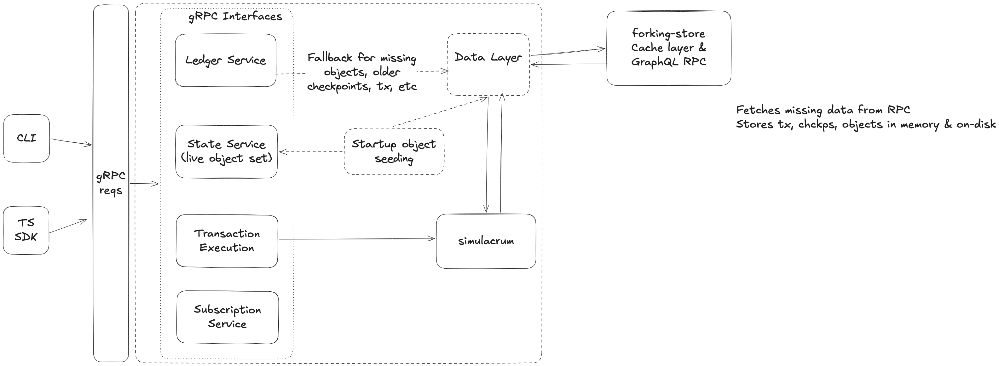

# Forking Tool Design, Implementation, & PR execution - POC

`sui-forking` allows developers to start a local network in lock-step mode and execute transactions against some initial state derived from the live Sui network. This enables you to:

- Depend on existing on-chain packages and data
- Test contracts that interact with real deployed packages
- Develop locally while maintaining consistency with production state
- Run integration tests against forked network state and using packages deployed on the real live network

Important to note: the forking tool spins up a network that is not generating checkpoints automatically. The network requires manual intervention

# Design

### **High level diagram**



### gRPC Interfaces

Interacting with the forking tool is similar to interacting with a real network, and it’s made possible through gRPC. There are four main interfaces that the gRPC layer needs to implement:

**Ledger Service**
- this provides APIs for requesting & providing basic data (objects, epoch, checkpoint, transaction, etc)
- provides a service info API that is used for fetching chain id, timestamp, epoch, highest available checkpoint, version.

**State Service** 
- this provides APIs for requesting and providing data related to balances, owned objects, dynamic fields, or coin information. In the context of the forking tool, this is used as a way to access live object data through the owned objects API. 

**Transaction Execution Service**
- this provides two APIs for executing and simulation transactions

**Subscription Service**

When using the Sui CLI to interact with the forked network, the CLI requires to have a checkpoint subscription to retrieve the effects once the transaction’s effects were committed in a checkpoint. This interface has just one API, `subscribe_checkpoints`.

### Execution Engine

Under the hood, the tool uses `simulacrum` to manage the state of the network and execute transactions. In a nutshell, simulacrum has an API for creating & handling checkpoints, objects, transactions, transaction events, executing transactions, etc.

When a transaction execution request comes in from gRPC, it will be routed by the gRPC API and passed to the `simulacrum`. Before executing the transaction, there are a few more steps needed to successfully execute the transaction:
- fetch any missing input objects (this delegates fetching data to the data-layer)
- sign the transaction with a dummy private key (allows for impersonating senders)
- execute the transaction and get back the effects
- create a checkpoint
- notifies subscription service subscribers (needed for Sui CLI integration)
- return the execution results (effects and error)

### **Data Layer**

In the initial POC, the tool will have a store that persists data on disk, and resolves various queries through a GraphQL client as the backing source for historical data (checkpoints, epochs, objects, transactions).

** Checkpoints | Epochs | Transactions **

Expected read flow:
- a checkpoint|epoch|tx is identified by its sequence number|number|digest
- on read, check on disk first
- on miss, fetch from backing source by querying for that data at the forked checkpoint
- return `None` if not found (GraphQL will return null if there's no data at that checkpoint)

When a checkpoint | epoch | transaction is created, it is persisted to disk. For checkpoints, a latest metadata is also updated to keep track of the latest checkpoint available on disk.
When a transaction is executed, its data and effects are persisted to disk. Each transaction also triggers a checkpoint creation, which is also persisted to disk.

** Objects **

Expected object read flow:
- an object is identified by its ID and version (or other query, e.g., latest version, version at checkpoint, etc)
- on read, check on disk first
- on miss, fetch from backing source by ID and version/query
- if the object is found but is later than the fork checkpoint, fetch & cache the latest object at the forked checkpoint and return `None`.
- return `None` if not found (GraphQL will return null if there's no data at that checkpoint)

When an object is updated (e.g., by executing a transaction that changes the object), the new version of the object is persisted to disk and the metadata around latest version is updated.

** Data Persistence **

As data is persisted to disk, the user needs to provide a directory where the network state should be stored. Upon restarting the tool, if the directory exists and contains valid data, the tool can reuse the existing data and continue from there. This allows the user to maintain the state of the forked network across restarts.

### **Startup object seeding**

At startup, the user has the choice to seed addresses or objects, to make the forked network “aware” of them.

`--address` adds an address for seeding (works in the consistent range), loads that address's objects and adds them to the seed.
`--object` add the object by ID directly to the seed.


Note that seeding can also be done from a file:

```json
{
    "network": "testnet",
    "checkpoint": 12345678,
    "addresses": [
        "0x1234567890abcdef1234567890abcdef12345678",
        "0xabcdef1234567890abcdef1234567890abcdef12"
    ],
    "objects": [
        "0xabcdef1234567890abcdef1234567890abcdef12"
    ]
}
```

If the user provides both `--address` and `--object`, the tool will combine the objects resolved from both sources and use that as the initial seed for the forked network.
The initial seed will be dumped to a file `generated_{network}_{checkpoint}.json` for future reference. This file can be used to restart the same forked network with the same seed, which is useful for debugging or CI purposes.

```json
{
    "network": "testnet",
    "checkpoint": 12345678,
    "objects": [
        "0xabcdef1234567890abcdef1234567890abcdef12"
    ]
}
```

The `network` identifier is defined as `mainnet`, `testnet`, or a custom one `custom-CHAIN_ID_DIGEST` for ephemeral networks.

### Starting a Local Forked Network

Start a local forked network at the latest checkpoint:

```bash
sui-forking start --network testnet
```

This command:

- Starts a local “*forked*” network on port 9000 (default) - this is used to interact with the forked network, e.g., through the Sui CLI or programmatically through gRPC clients. This will also expose a gRPC API for manually controlling the network (clock, checkpoints, epoch).
- Starts the RPC server on port 9000 (default) - this is the gRPC endpoint you can connect the Sui client to interact with the network.
- Allows you to execute transactions against this local state and fetches objects on-demand from the real network

The command accepts a checkpoint to fork from. This must not larger than the latest known checkpoint the RPC is aware of. It will error if the user requests a checkpoint that is not available.

- `--checkpoint <number>`: The checkpoint to fork from
- `--network <network>`: Network to fork from: `mainnet (default)`, `testnet`, `devnet`, or a custom one (`-network <CUSTOM-GRAPHQL-ENDPOINT>` ). The latter is useful for “forking” from a custom local network  / private network. It requires to have a GraphQL service running and a fullnode as well.
- `--data-dir <path>`: The directory to persist the network state (checkpoints, epochs, transactions, objects, etc). This allows the user to maintain the state of the forked network across restarts.

**The startup flow**
- Initialize store layer (forking-data-store)
- Fetch the latest checkpoint (or the checkpoint specified by the user)
- Accept incoming gRPC requests (data fetching, transaction execution, forked network control).

### POC CLI

The forking tool provides a CLI to interact with the forking-server for various actions. In addition to the `sui-forking start` command explained previously, there are a few other commands available:

**Advance Checkpoint**

```bash
sui-forking advance-checkpoint
```

Advances the checkpoint of the local network by 1.

**Advance Clock**

```bash
sui-forking advance-clock [--milliseconds <ms>]
```

Advances the clock of the local network by 1 millisecond, or by the specified amount of milliseconds if the `--milliseconds` flag is provided.

**Check Status**

```bash
sui-forking status
```

Shows the current checkpoint, epoch, and timestamp.

## Outside of scope for POC
- advance-epoch support
- faucet support
- minting any coin type
- GraphQL RPC support

