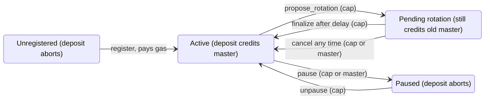

# Forwarding Address Registry: ownership, rotation, brakes

Status: proposal for the Move team, 2026-09-30, updated 2026-10-02 with the address format and
ID allocation now implemented in #27990 (step 1 below). #27989 is merged.

## Where we are

#27989 makes the registry an implicitly read system object, i.e. consensus pins its version per
transaction and the native reads it at that version. #27990 adds the Move side:
`balance::send_funds` resolves a forwarding address through the registry, credits the master,
emits `ForwardingDeposit<T>`, and aborts if the id is not registered. The registry assigns master
IDs and hands the registrant a `MasterCap`, so there is no id to front-run.

Address layout (`crates/sui-types/src/forwarding_address.rs`, all integers little-endian):

```
[u32 master_id][0xfa x 10][u8 variant][17 payload bytes]
 0..4           4..14      14          15..32
```

- The master id, magic and variant positions are fixed; the variant alone decides what the payload
  bytes mean. Variant 0 gives them no on-chain meaning: the native never reads them, so there is no
  canonical encoding to enforce, and the only thing an invoice tag has to be is distinct.
- Absent magic means an ordinary address. Present magic with a variant above
  `forwarding_address_max_variant` in protocol config (0 in version 139) aborts the deposit (code 2),
  so nobody can fund an address whose meaning a later variant would define differently; it is never
  treated as an ordinary recipient, and the gas-coin `send_funds` guard in the interpreter rejects
  anything with the magic for the same reason.
- The deposit event is `ForwardingDeposit<T> { forwarding_address, master, amount }`. The address
  is the lossless record of the variant and payload; `sui-types` publishes the layout and the typed
  registry schema (`MasterRecordKey`), so indexers slice bytes instead of depending on a parsed
  field whose meaning variant 0 does not define.
- Trade-off against the earlier `[u64 id][0xfd x 8][u128 tag]`: an ordinary address collides with
  the magic with probability 2^-80 instead of 2^-64, and grinding a key for some forwarding-shaped
  address costs 2^80 instead of 2^64, but grinding one for a specific master's id costs 2^112
  instead of 2^128 because the id shrank. Both are far out of reach; the id space is 2^32 masters.
- IDs: the registry keeps a `u64` counter in a dynamic field (starting at 1) and maps it through
  lowbias32, a permutation of `u32` (xor-shifts and odd multiplications), so counters never collide,
  id 0 is reserved (its only preimage is counter 0, never allocated), and allocation aborts with
  `EMasterIdsExhausted` after the last `u32` instead of wrapping. IDs look mixed but are not secret:
  the counter is public and the mix is invertible, which is fine because nothing depends on an id
  being unguessable.

What is still missing:

- The mapping is write-once, so there is no rotation and no revoke. If the master key leaks, every
  already published address keeps paying the attacker.
- No way to stop the bleed. Nothing pauses an id, and turning the feature flag off makes the pattern
  an ordinary address again, which strands funds instead of aborting.

## Proposed design

I think the fix is for the registry to assign the id and hand back a capability (done), keep
enough state on the record to survive a compromise, and add a protocol level brake. We don't need
mining or a fee token for this.

```move
module sui::forwarding_address;

// Layout is frozen on this object (it exists on every chain since 132); the counter lives in a
// dynamic field keyed by `MasterIdCounter {}`.
public struct ForwardingAddressRegistry has key { id: UID }

// Held cold. Needed to rotate; either the cap or the current master can pause/cancel.
public struct MasterCap has key, store { id: UID, master_id: u32 }

// Dynamic field on the registry: master_id -> MasterRecord. Its layout is frozen once published:
// framework upgrades reject struct layout changes even when no record exists.
public struct MasterRecord has store { master: address }

// Lifecycle state lives in separate registry dynamic fields keyed by master id, added when needed.
public struct PausedKey has copy, drop, store { master_id: u32 }    // -> bool
public struct PendingKey has copy, drop, store { master_id: u32 }   // -> Pending { new_master: address, effective_epoch: u64 }

// id = lowbias32(counter); charged via a native with its own cost param
public fun register(registry: &mut ForwardingAddressRegistry, ctx: &mut TxContext): MasterCap;

public fun pause(registry: &mut ForwardingAddressRegistry, cap: &MasterCap);
public fun pause_by_master(registry: &mut ForwardingAddressRegistry, master_id: u64, ctx: &TxContext);
public fun unpause(registry: &mut ForwardingAddressRegistry, cap: &MasterCap);

public fun propose_rotation(registry: &mut ForwardingAddressRegistry, cap: &MasterCap, new_master: address, ctx: &TxContext);
public fun cancel_rotation(registry: &mut ForwardingAddressRegistry, cap: &MasterCap);
public fun cancel_rotation_by_master(registry: &mut ForwardingAddressRegistry, master_id: u64, ctx: &TxContext);
public fun finalize_rotation(registry: &mut ForwardingAddressRegistry, cap: &MasterCap, ctx: &TxContext);

// Native. Reads the master record and the paused field, ignores pending. Aborts when paused,
// unregistered, or of an unsupported variant.
native fun resolve_impl(recipient: address): (address, bool);
```

Why each piece:

- Assigned ids kill front-running outright, since there is nothing to race for. Mixing the counter
  only makes ids non-enumerable; sequential would be just as safe. Deriving from the master address
  is worse because it ties the id to the exact key we want to be able to replace.
- Registration cost goes through gas: `register` calls a native with a large base cost in protocol
  config. Validators get paid the normal way, so no treasury or distribution question. The dynamic
  field storage fee applies on top and never gets rebated in practice, since records are never
  deleted.
- Rotation is two-step with a delay (one epoch to start, a registry constant so we can tune it
  without a protocol bump). A thief needs both the cap and the master key to redirect funds, and
  holding either one is enough to cancel or pause. Pause is immediate; deposits abort while paused.
- `propose_rotation` rejects a `new_master` that carries the forwarding magic. Resolution is one
  step and never resolves the master again, so a forwarding-shaped master would strand every
  deposit. `register` can't hit this: the master is the sender, and a key-derived address matching
  the 10-byte magic takes about 2^80 attempts.
- Brake: a second flag `freeze_forwarding_addresses`. When set, the native aborts for any pattern
  address. One epoch latency (protocol bump), which I think is acceptable for a brake; anything
  faster needs governance we don't have. Flag-off keeps meaning "pattern is an ordinary address"
  only for versions that never enabled the feature.
- Out of scope for now: object transfers to a pattern address still land there (separate decision),
  unregistered ids keep aborting.

## Record lifecycle



Protocol brake: with `freeze_forwarding_addresses` set, every deposit to a pattern address aborts,
whatever state the record is in.

A deposit only credits while the record is Active or Pending. Redirecting funds takes the cap plus
the delay; pausing or cancelling takes either the cap or the current master key, so a thief needs
both keys to win, and the owner needs one to stop them.

## Indexing

Most users are a payment app or exchange that hands out one forwarding address per customer or
invoice and needs to know who paid, and a master that needs to see and manage its own record.
Deposits are already covered by the event; the record lifecycle is not, so the PRs below add events
for it.

| Who asks | Question | Source of truth | Have it? |
| --- | --- | --- | --- |
| Payment app | Which deposits landed for master M, and from which forwarding address / payload? | `ForwardingDeposit<T> { forwarding_address, master, amount }` event; payload = bytes 15..32 of the address | Yes (#27990) |
| Payment app | Given a payload, did invoice X get paid, how much, in which tx? | Same event, indexed by `(master, payload)` | Yes, needs an index |
| Wallet / sender | Is this forwarding address registered, and to whom, right now? | Registry dynamic field `master_id -> MasterRecord` (`MasterRecordKey` in `sui-types` derives the field id and decodes it) | Yes, plain object read; GraphQL `dynamicField` works today |
| Master | My record: master, paused, pending rotation, and its history | `MasterRecord`, `PausedKey` and `PendingKey` fields plus lifecycle events | Object yes; `MasterRegistered` yes, the rest no |
| Master | Where is my `MasterCap`? | Owned object of type `MasterCap` | Yes, standard object index |
| Anyone | Balances | Master's address balance; a forwarding address always stays at 0 | Yes, existing balance indexing |

Events to add so an indexer never has to diff objects (`MasterRegistered { master_id, master, cap_id }`
already exists): `RotationProposed { master_id, new_master, effective_epoch }`, `RotationFinalized { master_id, master }`,
`RotationCancelled { master_id }`, `Paused { master_id }`, `Unpaused { master_id }`.

Implementation is one sui-indexer-alt pipeline over these events writing two tables,
`forwarding_deposits(master, forwarding_address, payload, amount, coin_type, tx_digest, checkpoint)`
and `forwarding_masters(master_id, master, paused, pending_master, effective_epoch, cap_id)`, plus
GraphQL fields `forwardingMaster(masterId)` and
`forwardingDeposits(master | forwardingAddress | payload, cursor)`. The registry read itself shows up in
effects as a read only consensus object, so replay and RPC already return it; nothing new needed
there.

## Incremental plan

Land #27990 as the base mechanism, then one small PR per step. Each is Move plus a few native lines,
none touch consensus or the core changes again. Every step adds dynamic fields next to the record
instead of changing `MasterRecord`: framework upgrades check struct layouts in bytecode, so an empty
registry does not make a layout change safe on a chain that already published the struct.

1. `MasterCap` + assigned ids + the versioned address format. Done in #27990: `register` returns
   the cap, the record is `MasterRecord { master }`, ids come from the mixed counter, the payload is
   opaque, and the native gates the variant through `forwarding_address_max_variant`.
2. Pause + two-step rotation. `PausedKey` and `PendingKey` fields, the entry functions above, native
   checks `PausedKey`. Lifecycle events land here.
3. Registration fee. Done in #27990: `register` calls `charge_registration_fee`, a native charging
   `forwarding_address_register_cost_base` (900K gas units in 139, so a registration lands in the
   1M-unit computation bucket).
4. Brake flag. `freeze_forwarding_addresses`, native aborts on any pattern address when set.
5. Indexer pipeline + GraphQL fields (can run in parallel with 2 to 4 once the events exist).
6. Later: object transfers to pattern addresses, testnet enablement.

## Open questions

- Rotation delay: one epoch, or longer? And should `finalize_rotation` need the cap only, or cap + a
  tx from the new master (proves the new key works before we cut over)?
- Should the current master be able to pause and cancel without the cap (as proposed), or is
  cap-only simpler to reason about?
- Registration price: 1M gas units (about 1 SUI at a 1,000 MIST gas price) is the starting
  point. We want it to hurt for spam but not for a legit business.
- Brake semantics: abort every deposit to a pattern address, or only resolution (i.e. strand)? I
  think abort.
- Is 2^32 master ids enough for good, or do we want a 6-byte id (2^48, and 2^128 targeted
  grinding again) at the cost of a custom 48-bit mixer?
- Do we want `MasterRecord` and the events readable from other Move packages (a
  `master_of(registry, id)` view), or is off-chain lookup enough for now?
