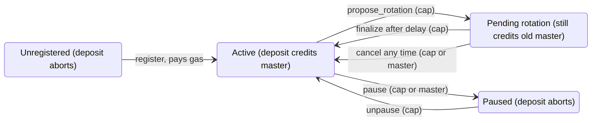

# Forwarding Address Registry: ownership, rotation, brakes

Status: proposal for the Move team, 2026-09-30. Applies on top of #27989 (merged) and #27990.

## Where we are

The prototype works end to end on devnet, but the registry has no ownership model, so it is not
safe to leave on for long. #27989 makes the registry an implicitly read system object, i.e.
consensus pins its version per transaction and the native reads it at that version. #27990 adds
the Move side: `balance::send_funds` resolves a forwarding address
`[u64 master_id][0xfd x 8][u128 tag]` through the registry, credits the master, emits
`ForwardingDeposit<T>`, and aborts if the id is not registered.

Today `register(registry, master_id, ctx)` just does `dynamic_field::add(master_id, ctx.sender())`.
That gives us three problems:

- Anyone can claim any id, so a master that publishes addresses before its registration lands (or
  gets front-run) loses all future deposits to that id, permanently.
- The mapping is write-once, so there is no rotation and no revoke. If the master key leaks, every
  already published address keeps paying the attacker.
- No way to stop the bleed. Nothing pauses an id, and turning the feature flag off makes the pattern
  an ordinary address again, which strands funds instead of aborting.

## Proposed design

I think the fix is for the registry to assign the id and hand back a capability, keep enough state
on the record to survive a compromise, and add a protocol level brake. We don't need mining or a fee
token for this.

```move
module sui::forwarding_address;

public struct ForwardingAddressRegistry has key { id: UID, next: u64 }

// Held cold. Needed to rotate; either the cap or the current master can pause/cancel.
public struct MasterCap has key, store { id: UID, master_id: u64 }

// Dynamic field on the registry: master_id -> MasterRecord
public struct MasterRecord has store {
    master: address,
    pending: Option<Pending>,   // Pending { new_master: address, effective_epoch: u64 }
    paused: bool,
}

// id = hash(next) truncated to u64, loop on collision; charged via a native with its own cost param
public fun register(registry: &mut ForwardingAddressRegistry, ctx: &mut TxContext): MasterCap;

public fun pause(registry: &mut ForwardingAddressRegistry, cap: &MasterCap);
public fun pause_by_master(registry: &mut ForwardingAddressRegistry, master_id: u64, ctx: &TxContext);
public fun unpause(registry: &mut ForwardingAddressRegistry, cap: &MasterCap);

public fun propose_rotation(registry: &mut ForwardingAddressRegistry, cap: &MasterCap, new_master: address, ctx: &TxContext);
public fun cancel_rotation(registry: &mut ForwardingAddressRegistry, cap: &MasterCap);
public fun cancel_rotation_by_master(registry: &mut ForwardingAddressRegistry, master_id: u64, ctx: &TxContext);
public fun finalize_rotation(registry: &mut ForwardingAddressRegistry, cap: &MasterCap, ctx: &TxContext);

// Native. Reads `master` and `paused`, ignores `pending`. Aborts when paused or unregistered.
native fun resolve_impl(recipient: address): (address, u128, bool);
```

Why each piece:

- Assigned ids kill front-running outright, since there is nothing to race for. Hashing the counter
  only makes ids non-enumerable; sequential would be just as safe. Deriving from the master address
  is worse because it ties the id to the exact key we want to be able to replace.
- Registration cost goes through gas: `register` calls a native with a large base cost in protocol
  config. Validators get paid the normal way, so no treasury or distribution question. The dynamic
  field storage fee applies on top and never gets rebated in practice, since records are never
  deleted.
- Rotation is two-step with a delay (one epoch to start, a registry constant so we can tune it
  without a protocol bump). A thief needs both the cap and the master key to redirect funds, and
  holding either one is enough to cancel or pause. Pause is immediate; deposits abort while paused.
- Brake: a second flag `freeze_forwarding_addresses`. When set, the native aborts for any pattern
  address. One epoch latency (protocol bump), which I think is acceptable for a brake; anything
  faster needs governance we don't have. Flag-off keeps meaning "pattern is an ordinary address"
  only for versions that never enabled the feature.
- Out of scope for now: object transfers to a pattern address still land there (separate decision),
  unregistered ids keep aborting.

## Record lifecycle



Protocol brake: with `freeze_forwarding_addresses` set, every deposit to a pattern address aborts,
whatever state the record is in.

A deposit only credits while the record is Active or Pending. Redirecting funds takes the cap plus
the delay; pausing or cancelling takes either the cap or the current master key, so a thief needs
both keys to win, and the owner needs one to stop them.

## Indexing

Most users are a payment app or exchange that hands out one forwarding address per customer or
invoice and needs to know who paid, and a master that needs to see and manage its own record.
Deposits are already covered by the event; the record lifecycle is not, so the PRs below add events
for it.

| Who asks | Question | Source of truth | Have it? |
| --- | --- | --- | --- |
| Payment app | Which deposits landed for master M, and from which forwarding address / tag? | `ForwardingDeposit<T> { forwarding_address, master, amount, tag }` event | Yes (#27990) |
| Payment app | Given a tag, did invoice X get paid, how much, in which tx? | Same event, indexed by `(master, tag)` | Yes, needs an index |
| Wallet / sender | Is this forwarding address registered, and to whom, right now? | Registry dynamic field `master_id -> MasterRecord` (derive the field id from the registry and the u64 key) | Yes, plain object read; GraphQL `dynamicField` works today |
| Master | My record: master, paused, pending rotation, and its history | `MasterRecord` object plus lifecycle events | Object yes; events no |
| Master | Where is my `MasterCap`? | Owned object of type `MasterCap` | Yes, standard object index |
| Anyone | Balances | Master's address balance; a forwarding address always stays at 0 | Yes, existing balance indexing |

Events to add so an indexer never has to diff objects: `MasterRegistered { master_id, master, cap_id }`,
`RotationProposed { master_id, new_master, effective_epoch }`, `RotationFinalized { master_id, master }`,
`RotationCancelled { master_id }`, `Paused { master_id }`, `Unpaused { master_id }`.

Implementation is one sui-indexer-alt pipeline over these events writing two tables,
`forwarding_deposits(master, forwarding_address, tag, amount, coin_type, tx_digest, checkpoint)` and
`forwarding_masters(master_id, master, paused, pending_master, effective_epoch, cap_id)`, plus
GraphQL fields `forwardingMaster(masterId)` and
`forwardingDeposits(master | forwardingAddress | tag, cursor)`. The registry read itself shows up in
effects as a read only consensus object, so replay and RPC already return it; nothing new needed
there.

## Incremental plan

Land #27990 as the base mechanism, then one small PR per step. Each is Move plus a few native lines,
none touch consensus or the core changes again. 139 is open and devnet only, and the registry is
empty everywhere except devnet (wiped weekly), so changing the record layout between steps costs
nothing.

1. `MasterCap` + assigned ids. `register` returns the cap, record becomes `MasterRecord { master }`,
   native reads `.master` through the struct layout instead of a field offset. This one removes
   front-running and is the smallest step, so it goes first.
2. Pause + two-step rotation. Record gains `pending` and `paused`, the entry functions above, native
   checks `paused`. Lifecycle events land here.
3. Registration fee. `register_impl` native with a cost param in 139.
4. Brake flag. `freeze_forwarding_addresses`, native aborts on any pattern address when set.
5. Indexer pipeline + GraphQL fields (can run in parallel with 2 to 4 once the events exist).
6. Later: object transfers to pattern addresses, testnet enablement.

## Open questions

- Rotation delay: one epoch, or longer? And should `finalize_rotation` need the cap only, or cap + a
  tx from the new master (proves the new key works before we cut over)?
- Should the current master be able to pause and cancel without the cap (as proposed), or is
  cap-only simpler to reason about?
- Registration price: what base cost feels right? We want it to hurt for spam but not for a legit
  business.
- Brake semantics: abort every deposit to a pattern address, or only resolution (i.e. strand)? I
  think abort.
- Is the u64 master_id + u128 tag split still the right layout once ids are assigned, or should the
  tag get more bits?
- Do we want `MasterRecord` and the events readable from other Move packages (a
  `master_of(registry, id)` view), or is off-chain lookup enough for now?
