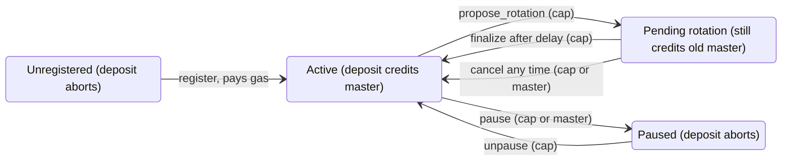

# Forwarding Addresses

Status: implemented on devnet at protocol version 139 (core in #27989, Move side in #28236). Not
enabled on testnet or mainnet. The sections "Path to production" and "Open questions" list what
still has to happen and what is still undecided.

## What a forwarding address is

A payment app, exchange or merchant wants to hand out a distinct deposit address per customer or
invoice, so it can tell who paid without asking the payer to attach a memo, but it does not want to
hold one key per address or sweep funds from thousands of addresses into one account.

A forwarding address is an address that carries no key. Its bytes encode a master id, a fixed
magic marker, a format variant and a payload chosen by the issuer, such as an invoice id. When
funds are deposited to it through address balances, the chain resolves it through the forwarding
address registry and credits the registered master address instead, emitting an event that records
which forwarding address the deposit came through. The forwarding address never holds anything; the
master receives everything, and the payload survives in the event for the app to match against its
own records.

Two consequences shape the design. Nobody can sign for a forwarding address, so anything that would
land there without resolution (an object transfer, an unregistered id) must fail rather than
strand funds. And the mapping from forwarding address to master is the only thing standing between
a payer and the right recipient, so who may change it, and how fast, matters.

## Address format

Defined in `crates/sui-types/src/forwarding_address.rs`; all integers little-endian.

```
[u48 master_id][0xfa x 9][u8 variant][16 payload bytes]
 0..6           6..15     15          16..32
```

- **Magic.** Nine `0xfa` bytes at offset 6. Any address with the magic at that offset is a
  forwarding address; any address without it is ordinary. There is no other signal. Together with
  the variant byte, which must be at or below the protocol maximum for a deposit to resolve, ten
  bytes have to line up for an address to be treated as a resolvable forwarding address.
- **Master id.** 48 bits, assigned by the registry at registration; see below. Id 0 is reserved
  and never allocated. Move and Rust carry it as a `u64`.
- **Variant.** Decides what the payload bytes mean. Variant 0 (the only one at 139) gives them no
  on-chain meaning: the resolver never reads them, so there is no canonical encoding to enforce,
  and an invoice tag only has to be distinct. A later variant can define structure, for example a
  typed tag or an on-chain lookup. `forwarding_address_max_variant` in protocol config (0 at 139)
  is the highest variant the resolver accepts; higher variants abort instead of being treated as
  ordinary recipients, so nobody can fund an address whose meaning a later version will define.
- **Payload.** 16 bytes whose meaning the variant defines. Under variant 0 the issuer chooses them
  freely, typically an invoice or customer id. Later variants can give them structure, for
  example a coin-type allow or deny list, a minimum amount or an expiry, which is why the payload
  keeps as many bytes as the layout allows.

How the chain treats a recipient address:

| Recipient                              | Balance deposit                                   | Object transfer |
| -------------------------------------- | ------------------------------------------------- | --------------- |
| No magic                               | Credited as today                                 | As today        |
| Magic, variant <= max, id registered   | Credited to the master, `ForwardingDeposit` event | Fails           |
| Magic, variant <= max, id unregistered | Aborts (code 1)                                   | Fails           |
| Magic, variant > max                   | Aborts (code 2)                                   | Fails           |

Probabilities, for a key-derived address (32 random bytes): it collides with the magic with
probability 2^-72, grinding a key whose address carries the magic costs about 2^72 hashes, and
grinding one for a specific master id costs 2^120. Owning a key for a forwarding address buys
nothing, since everything sent to it goes to the master, so these numbers matter only for
accidental collisions; with 2^32 addresses in existence the chance that any of them is affected is
about 2^-40.

## How it works today

### Registry and master ids

`ForwardingAddressRegistry` (`0xfa`) is a shared system object created by an end-of-epoch
transaction once `create_forwarding_address_registry` is on (devnet since 132). Its struct is
`{ id: UID }` and must stay that way: the object exists on chain, so its layout is frozen. All state
hangs off its `UID` as dynamic fields.

`register(registry, ctx) -> MasterCap` allocates a master id, stores `MasterRecord { master }`
with `master = ctx.sender()` as a dynamic field keyed by the `u64` id, emits
`MasterRegistered { master_id, master, cap_id }` and returns a `MasterCap` that names the id. Ids
come from a `u64` counter in a dynamic field (`MasterIdCounter {}`, starting at 1) mapped through
a permutation of the 48-bit space (the lowbias32 construction widened to 48 bits: xor-shifts by 24
and two odd multiplications mod 2^48): counters never collide, id 0 is reserved (its only preimage
is counter 0), and allocation aborts with `EMasterIdsExhausted` after the last 48-bit id instead of
wrapping. Ids look mixed but are not secret; the counter is public
and the mix is invertible, which is fine because nothing depends on an id being unguessable.
Assigned ids mean there is nothing to front-run.

`MasterRecord` is published with a single field and its layout is also frozen: framework upgrades
check struct layouts in bytecode, whether or not any record exists. Later state (paused, pending
rotation) goes into separate registry dynamic fields keyed by master id.

Registration charges a flat fee through a native, `forwarding_address_register_cost_base`, 1M gas
units at 139 (about 1 SUI at a 1,000 MIST gas price), on top of normal gas and the dynamic field
storage cost. Records are never deleted, so the storage fee is never rebated in practice. The fee
goes to validators as gas, so there is no treasury or distribution question.

### Resolution at the end of execution

Resolution is not Move code. `balance::send_funds` credits whatever address it is given; once Move
execution has finished and the written objects and funds credits are known, the adapter
(`execution/forwarding.rs`, called from `finish`) walks every funds credit and reroutes the ones
whose target carries the magic:

1. Charge `forwarding_address_resolve_cost_base` for the recipient. If its variant exceeds
   `forwarding_address_max_variant`, fail.
2. Charge `forwarding_address_resolve_lookup_cost_base`, then read the master record from the
   store through `ImplicitSystemObjectResolver::forwarding_master(master_id)`. No record: fail.
   A master that is itself a forwarding address: fail (chaining is the next step).
3. Rewrite the credit's target and accumulator object id to the master.

Then emit one `ForwardingDeposit<T> { forwarding_address, master, amount }` per forwarding address
and coin type on Move's behalf, with `amount` the sum of that address's credits in the
transaction, charged like `event::emit` and counted against `max_num_event_emit`. The event states
what the transaction paid to the address however many commands made up the payment, and splitting
a payment into many credits cannot exhaust the event limit.

`coin::send_funds(Gas, forwarding_address)` fails the transaction. The gas budget refund and the
gas charge location follow the gas coin's recipient and are set outside `reroute`, so resolving it
would need a second resolution path, and the master would net the coin's value plus the refunded
budget minus gas used, which is known only after gas is charged, so no `ForwardingDeposit` could
state what was paid and matching payments against invoices would have to account for gas. Payers
split the amount off the gas coin instead. After gas charging, a post-execution invariant check
asserts that no written object is owned by, and no accumulator write targets, a forwarding
address. Charging happens before each read, so an unregistered id pays for its lookup,
and every charge goes through the gas charger after Move execution, the same way the deny-list
check charges its reads.

The policy lives in one place (`sui_move_natives::forwarding_address::Resolver`) and the adapter
and `test_scenario` both call it; only gas, the shape of the written objects and the event type
differ between them. Doing this in the adapter rather than in Move is what lets the same pass later reroute objects
(`TransferObjects` never enters Move) and follow chains. It also means the failures are execution
errors, not Move aborts: today they surface as `FeatureNotYetSupported`, because dedicated
`ExecutionFailureStatus` variants are an on-wire change that the Rust SDK types must learn first
(see "Path to production").

The read goes to the backing store, bounded by the registry version consensus assigned to the
transaction, the same way object funds withdrawals read accumulator balances. The registry is an
implicitly read system object (#27989): the version manager assigns every transaction a registry
version, the read is recorded in effects as a read-only consensus object, and replay reproduces it.
A record written earlier in the same transaction is not visible, so registering and depositing to
the new id in one PTB fails and the registration rolls back with it. Move unit tests get the same
behaviour from `test_scenario`, which runs the same resolver over the scenario's writes and funds.

The event carries the whole forwarding address rather than a parsed payload, so it is a lossless
record of the variant and payload; indexers slice bytes instead of depending on a parse whose
meaning variant 0 does not define.

### Objects cannot be sent to a forwarding address

The same pass fails the transaction if any written object is owned by a forwarding address
(`AddressOwner` or `ConsensusAddressOwner`), whether it got there through `TransferObjects`,
`transfer::public_transfer` or a coin transfer. Nobody can sign for a forwarding address, so the
object would be stranded. Rerouting objects to the master is the next step and needs an event of
its own, since effects alone would lose the forwarding address. The check runs only once the
feature flag is on, so pre-139 behaviour is untouched.

### Protocol gating and rollout

| Setting                                           | Kind     | Value at 139 (devnet)        |
| ------------------------------------------------- | -------- | ---------------------------- |
| `create_forwarding_address_registry`              | flag     | on since 132 (devnet only)   |
| `enable_forwarding_addresses`                     | flag     | on (devnet only)             |
| `forwarding_address_max_variant`                  | u64      | 0                            |
| `forwarding_address_resolve_cost_base`            | gas      | 52                           |
| `forwarding_address_resolve_lookup_cost_base`     | gas      | 512 * `obj_access_cost_read_per_byte` |
| `forwarding_address_register_cost_base`           | gas      | 1,000,000,000 (1M gas units) |

While `enable_forwarding_addresses` is off: the adapter leaves every recipient unchanged, the
transfer check does not run, and transaction checks reject any transaction that takes the registry
as an input, so nobody can register early. Deposits to forwarding-shaped addresses are ordinary
deposits, which is also what every version before 139 must keep meaning on replay.

Once the flag is on, every transaction must have an assigned registry version; a missing
assignment is an execution invariant violation, never an abort. That holds as long as a chain
reaches a version that creates the registry before one that enables resolution, which is why the
two flags live in different versions and must ship in different releases. On devnet the registry
has existed since 132.

### Interaction with other features

- **Regulated coins.** Deny list v2 checks the addresses that receive a regulated `Balance<T>`
  after execution. Resolution happens before the credit, so the master is what gets checked:
  denying a master blocks deposits through all of its forwarding addresses, and denying a
  forwarding address does nothing. Global pause on a coin applies as usual.
- **Object funds.** A vault withdrawal deposited to a forwarding address resolves like any
  deposit; the accumulator root and the registry are both implicitly read in that transaction.
- **Simulation and dry run.** The registry shows up in effects as a read-only consensus object, so
  simulated deposits report it like executed ones.
- **Registry as an input.** `register` takes the registry mutably, which puts an ordinary user
  transaction into the system-object-writer execution pool. A deposit sequenced after such a
  transaction in the same commit waits for its registry version. Whether this is a contention
  problem in practice has not been measured.

## Interfaces

### Move: `sui::forwarding_address`

```move
public struct ForwardingAddressRegistry has key { id: UID }
public struct MasterCap has key, store { id: UID, master_id: u64 }
public struct MasterRecord has store { master: address }          // dynamic field, key u64
public struct MasterIdCounter has copy, drop, store {}             // dynamic field, value u64

public struct ForwardingDeposit<phantom T> has copy, drop { forwarding_address: address, master: address, amount: u64 }
public struct MasterRegistered has copy, drop { master_id: u64, master: address, cap_id: ID }

public fun register(registry: &mut ForwardingAddressRegistry, ctx: &mut TxContext): MasterCap;
public fun master_id(cap: &MasterCap): u64;
```

`ForwardingDeposit` is declared in Move so the type exists, but only the adapter emits it. The one
Move abort is `EMasterIdsExhausted` (3) from `register`. Resolution failures (unregistered id,
unsupported variant, a master that is a forwarding address, an object sent to a forwarding address)
are execution errors with no command index, reported as `FeatureNotYetSupported` for now.

### Rust: `sui_types::forwarding_address`

- `ForwardingAddress { master_id, variant, payload }` with `derive`, `derive_opaque`, `parse`
  (returns `None` for an ordinary address) and `has_magic`.
- Constants: `FORWARDING_ADDRESS_MAGIC`, `FORWARDING_ADDRESS_VARIANT_OPAQUE`,
  `FORWARDING_ADDRESS_PAYLOAD_LENGTH`, `FORWARDING_ADDRESS_RESERVED_MASTER_ID`.
- `MasterRecordKey(master_id).load(resolver, registry_version)` reads the record as of a registry
  version; `ForwardingDeposit` and `MasterRegistered` mirror the events for BCS decoding.
- The resolution itself is `sui_move_natives::forwarding_address::Resolver`, one implementation
  that both the adapter and `test_scenario` run over a transaction's written owners and funds
  credits. It reads masters through `ImplicitSystemObjectResolver::forwarding_master(master_id)`
  (`TemporaryStore` implements it against the assigned registry version, the `test_scenario` store
  from the registrations it has seen) and charges through a small `ForwardingGas` trait (the
  transaction's gas charger in the adapter, nothing in `test_scenario`). It hands back events as
  type tag plus BCS; the adapter wraps them as `Event`s, `test_scenario` deserializes them into Move
  values.
- Test support: the transactional test runner knows `0xfa` as a well-known object;
  `forwarding_address::create_for_testing` (sender `@0x0`) shares the registry at its system id in
  Move unit tests.

### What a client does

- Derive: `master_id` (from `MasterRegistered` or `MasterCap`), variant 0, a 16-byte payload.
- Before sending, check for the magic. An address with the magic can only receive address-balance
  deposits, and only if its id is registered; sending it an object fails the transaction.
- To find who a forwarding address pays: read the registry's dynamic field `master_id ->
  MasterRecord` (GraphQL `dynamicField` works today).
- To find what was paid: index `ForwardingDeposit<T>` by `(master, payload)`.

## Security properties

- **No front-running.** Ids are assigned, so there is no name to race for.
- **No stranding by format.** Unregistered ids and unsupported variants abort; objects and
  unresolved credits to a forwarding address fail the transaction. Turning the feature flag off
  would strand funds (the pattern becomes an ordinary address again), which is why a brake has to
  be a separate flag rather than disabling the feature.
- **Collisions and grinding** are covered under the address format; a forwarding address is
  worthless to control, so the only concern is accidental collision, at 2^-80 per address.
- **Spam.** Registration costs 1M gas units plus permanent storage, and the registry's id space is
  2^48.
- **Determinism and replay.** Resolution reads a consensus-assigned version through the standard
  implicit-read mechanism; gas is charged before the read, including for misses, and the events the
  adapter emits are charged and counted like Move events, so neither lookups nor events can be
  spammed for free.
- **What is not yet protected:** a leaked master key. The mapping is write-once today, so every
  published address keeps paying whoever holds the master key, and nothing can pause an id. That is
  the lifecycle work below.

## Lifecycle: rotation, pause, brake (planned)

The registry assigns the id and hands back a capability (done); the record needs enough state to
survive a compromise, and the protocol needs a brake.

```move
// Lifecycle state lives in separate registry dynamic fields keyed by master id.
public struct PausedKey has copy, drop, store { master_id: u64 }    // -> bool
public struct PendingKey has copy, drop, store { master_id: u64 }   // -> Pending { new_master: address, effective_epoch: u64 }

public fun pause(registry: &mut ForwardingAddressRegistry, cap: &MasterCap);
public fun pause_by_master(registry: &mut ForwardingAddressRegistry, master_id: u64, ctx: &TxContext);
public fun unpause(registry: &mut ForwardingAddressRegistry, cap: &MasterCap);

public fun propose_rotation(registry: &mut ForwardingAddressRegistry, cap: &MasterCap, new_master: address, ctx: &TxContext);
public fun cancel_rotation(registry: &mut ForwardingAddressRegistry, cap: &MasterCap);
public fun cancel_rotation_by_master(registry: &mut ForwardingAddressRegistry, master_id: u64, ctx: &TxContext);
public fun finalize_rotation(registry: &mut ForwardingAddressRegistry, cap: &MasterCap, ctx: &TxContext);

```

The adapter's resolver reads the master record and the paused field and ignores pending; a deposit
fails when the id is paused, unregistered, or of an unsupported variant.

- Rotation is two-step with a delay (one epoch to start, a registry constant so it can be tuned
  without a protocol bump). A thief needs both the cap and the master key to redirect funds, and
  holding either one is enough to cancel or pause. Pause is immediate; deposits abort while paused.
- `propose_rotation` must reject a `new_master` that carries the magic until chaining is decided,
  since a forwarding-shaped master would strand every deposit. `register` cannot hit this today:
  the master is the sender.
- Brake: a protocol flag `freeze_forwarding_addresses`. When set, resolution fails for every
  forwarding address, whatever state its record is in. One epoch of latency, which is acceptable
  for a brake; anything faster needs governance that does not exist. It has to be a separate flag
  because `enable_forwarding_addresses` off means "ordinary address", which must stay true for
  every version before 139 on replay.



A deposit only credits while the record is Active or Pending. Redirecting funds takes the cap plus
the delay; pausing or cancelling takes either the cap or the current master key, so a thief needs
both keys to win and the owner needs one to stop them.

## Indexing

Most users are a payment app or exchange that hands out one forwarding address per customer or
invoice and needs to know who paid, and a master that needs to see and manage its own record.
Deposits are covered by the event; the record lifecycle is not yet, so the lifecycle step adds
events for it.

| Who asks        | Question                                                                         | Source of truth                                                                                                            | Have it?                                                   |
| --------------- | -------------------------------------------------------------------------------- | -------------------------------------------------------------------------------------------------------------------------- | ---------------------------------------------------------- |
| Payment app     | Which deposits landed for master M, and from which forwarding address / payload? | `ForwardingDeposit<T> { forwarding_address, master, amount }` event; payload = bytes 16..32 of the address                 | Yes (#28236)                                               |
| Payment app     | Given a payload, did invoice X get paid, how much, in which tx?                  | Same event, indexed by `(master, payload)`                                                                                 | Yes, needs an index                                        |
| Wallet / sender | Is this forwarding address registered, and to whom, right now?                   | Registry dynamic field `master_id -> MasterRecord` (`MasterRecordKey::load` in `sui-types` reads it at a registry version) | Yes, plain object read; GraphQL `dynamicField` works today |
| Master          | My record: master, paused, pending rotation, and its history                     | `MasterRecord`, `PausedKey` and `PendingKey` fields plus lifecycle events                                                  | Object yes; `MasterRegistered` yes, the rest no            |
| Master          | Where is my `MasterCap`?                                                         | Owned object of type `MasterCap`                                                                                           | Yes, standard object index                                 |
| Anyone          | Balances                                                                         | Master's address balance; a forwarding address always stays at 0                                                           | Yes, existing balance indexing                             |

Events to add so an indexer never has to diff objects: `RotationProposed { master_id, new_master,
effective_epoch }`, `RotationFinalized { master_id, master }`, `RotationCancelled { master_id }`,
`Paused { master_id }`, `Unpaused { master_id }`.

Implementation is one sui-indexer-alt pipeline over these events writing two tables,
`forwarding_deposits(master, forwarding_address, payload, amount, coin_type, tx_digest, checkpoint)`
and `forwarding_masters(master_id, master, paused, pending_master, effective_epoch, cap_id)`, plus
GraphQL fields `forwardingMaster(masterId)` and
`forwardingDeposits(master | forwardingAddress | payload, cursor)`. The registry read itself shows
up in effects as a read-only consensus object, so replay and RPC already return it.

## Path to production

Each step is Move plus adapter code; none touch consensus or the core change again. Every
step adds dynamic fields next to the record instead of changing `MasterRecord`.

### Done (devnet, protocol version 139)

- Registry as an implicitly read system object, version-pinned per transaction (#27989).
- Resolution of funds credits in the adapter at the end of execution, with gas per lookup and
  adapter-emitted `ForwardingDeposit` events charged and counted like Move events (#28236).
- Address format with variant gating; opaque payload; assigned ids through a mixed counter;
  `MasterCap` (#28236).
- Registration fee through a native cost param (#28236).
- End-of-execution rejection of objects sent to forwarding addresses (#28236).
- Transactional, Move unit (`test_scenario`) and e2e coverage, including the staged upgrade and
  mixes with object funds withdrawals (#28236).

### Required before testnet

- Object rerouting and chaining, in the same end-of-execution pass: objects owned by a forwarding
  address go to the master with a `ForwardingTransfer { forwarding_address, master, object_id }`
  event (effects alone lose the forwarding address); a master that is itself a forwarding address
  resolves again, bounded by a protocol config `forwarding_address_max_hops`, with the lookup charged
  per hop and an event per hop.
- Dedicated `ExecutionFailureStatus` variants for unregistered id, unsupported variant, too many
  hops and object-to-forwarding-address, replacing `FeatureNotYetSupported`. On-wire change: the
  Rust SDK types (`sui-sdk-types`) and the gRPC proto must add the variants first, since this repo's
  conversions are exhaustive; produced only under the devnet guard until the SDKs ship.
- Pause and two-step rotation with lifecycle events (lifecycle section).
- Brake flag `freeze_forwarding_addresses`.
- Decide the open questions that change the format or the resolver: chaining, non-sender masters,
  object addresses as masters, magic length. These are cheap on devnet (wiped weekly) and expensive
  afterwards.
- Registry creation on testnet: `create_forwarding_address_registry` is devnet-only today. It must
  be enabled for testnet in a protocol version that ships at least one release before the version
  that enables resolution there.
- SDK support (TypeScript and Rust): derive and parse forwarding addresses, the magic check before
  sending, and decoding of the two events.
- Indexer pipeline and GraphQL fields from the indexing section, so apps can match payments without
  running their own event scan.
- Developer documentation: format, what can and cannot be sent to a forwarding address, the abort
  codes, and the deny list semantics (deny the master).

### Required before mainnet

- Testnet soak with real integrators, including at least one payment app using the event index.
- Security review of the adapter resolver, the registration native and the lifecycle functions.
- Registration fee tuned on testnet feedback.
- Measure registry write contention (the system-object-writer pool) under a registration flood.
- Same registry-creation ordering for mainnet: create in one release, enable in a later one.

## Open questions

- Rotation delay: one epoch, or longer? And should `finalize_rotation` need the cap only, or cap + a
  tx from the new master (proves the new key works before we cut over)?
- Should the current master be able to pause and cancel without the cap (as proposed), or is
  cap-only simpler to reason about?
- Registration price: 1M gas units (about 1 SUI at a 1,000 MIST gas price) is the starting
  point. We want it to hurt for spam but not for a legit business.
- Brake semantics: abort every deposit to a forwarding address, or only resolution (i.e. strand)? I
  think abort.
- Format: settled on a 48-bit id, a 9-byte magic and a 16-byte payload. The magic plus the
  variant byte give ten bytes that must line up for a resolvable address; collision margin is
  2^-72 per address. Revisit only before the format leaves devnet.
- Should `register` accept a master other than the sender (for example a custodian registering
  on behalf of a cold wallet)? Today the master is always `ctx.sender()`, which also rules out a
  forwarding-shaped master by construction.
- Chaining (a master that is itself a forwarding address) is planned, bounded by
  `forwarding_address_max_hops`. Still open: the bound (3 to 5), and whether to emit one event per
  hop, so intermediate masters see traffic, or one per credit with the first forwarding address,
  the final master and the hop count. Until it lands, resolution fails on such a master, and
  `propose_rotation` and any `register` that takes a master must reject the magic.
- Can an object address (a shared or owned object's ID) be a master, given nobody can sign for it
  and its balance is only reachable through object funds withdrawals?
- Do issuers of regulated coins need to deny a single forwarding address, or is denying the master
  (which blocks all of its forwarding addresses) enough?
- Do we want `MasterRecord` and the events readable from other Move packages (a
  `master_of(registry, id)` view), or is off-chain lookup enough for now?
