<!-- Copyright (c) Mysten Labs, Inc. -->
<!-- SPDX-License-Identifier: Apache-2.0 -->

# Subscription admission priority analysis

## Scope and current dataflow

The `sui-node` HTTP-server setup calls `SubscriptionService::build` and installs the returned `SubscriptionServiceHandle` in `RpcService`. The checkpoint executor (or the embedded RPC-store indexer wiring) holds the returned broadcast sender.

```mermaid
flowchart LR
    C[gRPC client] --> G[subscribe_checkpoints / subscribe_transactions / subscribe_events]
    G --> F[compile filter and validate read mask]
    F --> H[SubscriptionServiceHandle::register_subscription]
    H -->|SubscriptionRequest| A[bounded admission mpsc]
    A --> D[dispatcher SubscriptionService::start]

    E[checkpoint executor] -->|Arc<Checkpoint>| B[broadcast channel]
    B --> D
    D -->|Register, round robin| S1[shard mailbox 0]
    D -->|Register| SN[shard mailbox N-1]
    D -->|Checkpoint + shared extracted keys| S1
    D -->|Checkpoint + shared extracted keys| SN
    S1 --> M1[SubscriptionMatcher partition]
    SN --> MN[SubscriptionMatcher partition]
    M1 -->|SubscriptionUpdate| R1[per-subscriber mpsc]
    MN -->|SubscriptionUpdate| RN[per-subscriber mpsc]
    R1 --> G1[gRPC response stream]
    RN --> GN[gRPC response stream]
```

The three gRPC methods compile their optional DNF filter, call the common `register` helper, and await `SubscriptionServiceHandle::register_subscription`. A successful admission returns the receiving half of a per-subscriber channel. `None` becomes gRPC `Status::unavailable`; the in-tree bridge checkpoint subscriber retries every subscription-start error after five seconds, so `Unavailable` is already on a retry path. Once admitted, the gRPC async stream renders each `SubscriptionUpdate` into response frames until the sender is dropped.

The dispatcher owns two independent inbound lanes and one sender per shard:

| Lane | Type | Bound | Producer behavior | Consumer behavior |
| --- | --- | ---: | --- | --- |
| Checkpoints | `tokio::sync::broadcast` | `CHECKPOINT_MAILBOX_SIZE = 1024` | broadcast send is non-blocking; an overwritten receiver slot becomes `RecvError::Lagged` | dispatcher awaits `recv` |
| Admission | `tokio::sync::mpsc` | `MAILBOX_SIZE = 128` | currently `send().await`, so the channel is bounded but excess calls wait outside it rather than being rejected | dispatcher awaits `recv` |
| Each shard | `tokio::sync::mpsc<ShardMsg>` | `SHARD_MAILBOX_SIZE = 64` | dispatcher currently awaits every `Checkpoint`, `Register`, and `Clear` send | one spawned shard task drains FIFO |
| Each subscriber | `tokio::sync::mpsc<SubscriptionUpdate>` | `SUBSCRIPTION_CHANNEL_SIZE = 256` | matcher uses the bounded sender; a slow consumer is removed rather than allowed to grow without bound | gRPC response stream awaits `recv` |
| Admission reply | `tokio::sync::oneshot` | one value | dispatcher returns the per-subscriber receiver, or drops the reply sender on rejection | the gRPC handler awaits it |

The dispatcher loop is an unbiased `tokio::select!` with the checkpoint branch and admission branch. The checkpoint branch validates sequence order, optionally waits for the embedded index (10 ms polling, 10 second timeout), skips work when `counters.total == 0`, extracts checkpoint keys once for each filtered key space that has subscribers, and then awaits a FIFO `Checkpoint` send to every shard. The admission branch checks the global cap, sends the per-subscriber receiver to the caller, creates a lifecycle guard (incrementing counters), and awaits a round-robin `Register` send to one shard.

Each shard serially handles `Register`, `Checkpoint`, and `Clear`. Its `SubscriptionMatcher` owns that shard's subscriber senders and lifecycle guards, evaluates filters, delivers updates, and removes closed or slow consumers. FIFO shard messages define the registration boundary: a subscriber receives checkpoints after its `Register`, never checkpoints already ahead of it.

## The priority and starvation failure

The unbiased `select!` intentionally randomizes among ready branches. During a join surge the admission lane is continuously ready, so it competes equally with checkpoint receive even though admitting a new subscriber is less important than maintaining gap-free delivery to existing subscribers. More importantly, `handle_message` awaits a bounded shard send. If the chosen shard mailbox is full, the dispatcher can be parked inside admission handling and cannot poll the checkpoint broadcast receiver at all.

The public admission bound does not currently shed load. Once its 128 slots fill, every additional gRPC request waits in `mpsc::Sender::send`, moving the backlog into blocked request futures and connection/task state. This explains both symptoms: new callers can wait a long time for their first frame, while admissions consume dispatcher turns or block on shard capacity and increase checkpoint receive latency for all established subscribers.

Checkpoint fan-out is deliberately different. Awaiting each shard `Checkpoint` send propagates a slow shard back to the dispatcher. The checkpoint broadcast producer remains non-blocking; if this delay consumes 1024 broadcast slots, `recv` reports `Lagged`. Because a gap-free stream can no longer be guaranteed, `handle_lag` enqueues `Clear(SourceLag)` to every shard and resets the sequence metric. That fuse is correct, but the resulting all-subscriber reconnect wave is especially damaging if admission pressure caused the lag.

## Candidate designs

### 1. Biased checkpoint select only

Add `biased;` and keep the checkpoint branch first.

This is the smallest change and ensures a ready checkpoint wins at each select boundary. It does not solve the two blocking paths: callers still accumulate while awaiting a full admission channel, and one selected admission can still park the dispatcher on a full shard mailbox. It also permits admission starvation while the broadcast receiver stays continuously ready. This is insufficient by itself.

### 2. Bounded shedding at both admission boundaries plus biased selection

Use `try_send` in `register_subscription`, so a full 128-entry admission lane returns `None` immediately and the gRPC helper returns `Unavailable`. In the dispatcher, reserve a shard mailbox slot without waiting before completing the reply handshake; if the selected shard is full, probe the remaining shards in round-robin order, and shed the request if all shard mailboxes are full. Add `biased;` with checkpoints first.

This keeps admission O(number of shards), non-blocking, and bounded in both queued requests and downstream registrations. Probing other shards provides useful spillover while retaining round-robin placement from the next successful shard. The tradeoff is that overload becomes explicit retry traffic and subscriber distribution can temporarily skew toward shards with capacity. Strict biased selection can also indefinitely defer the admission lane under a permanently ready checkpoint backlog.

### 3. Design 2 plus a bounded admission turn between checkpoint fan-outs

After successfully handling one checkpoint, non-blockingly take at most one queued admission request before returning to the biased select. Do not drain an unbounded or large registration batch. This guarantees admission progress under a continuously ready but still serviceable checkpoint stream, while every contested select boundary still chooses checkpoint delivery first and admission work cannot await shard capacity.

The extra admission turn slightly delays reception of the next checkpoint. Its work is tightly bounded: one cap check, at most one mailbox-capacity probe per shard, one channel allocation only after capacity is found, and one non-awaiting enqueue. A batch larger than one would improve join throughput during a checkpoint backlog but would directly recreate a configurable checkpoint-delay window. When checkpoints are not backed up, the normal select loop admits requests at full speed, so a larger batch has little value.

An admission rate limiter was also considered. It would cap join work but adds timing state and tuning while rejecting or delaying benign bursts even when the dispatcher is idle. The bounded lane, non-blocking shard reservation, and one-turn fairness rule constrain the overload case without a new time-based policy.

## Counters and registration boundary

`SubscriberCounts::total` must continue to mean live plus fully admitted/in-flight-to-shard subscribers. It must not count requests merely waiting in the admission lane: those callers do not own a receiver yet and their stream has not begun.

The chosen implementation reserves a shard mailbox slot first, then sends the per-subscriber receiver through the oneshot, constructs the lifecycle guard, and consumes the reserved slot with `Register`, all without an await point. If the reply receiver has gone away, no guard is created and the reservation is released. If no shard slot is available, the oneshot sender is dropped and the caller receives `None`/`Unavailable`. Once the reply succeeds, guard creation increments `total` before the reserved `Register` is synchronously placed in the shard FIFO; the dispatcher cannot observe an intermediate state.

Therefore the checkpoint fast path remains valid with a more precise statement: `total == 0` proves there is no live subscriber and no admitted registration pending in a shard. It does not prove the admission request lane is empty, nor does it need to. Queued requests have not established a stream boundary and may legitimately begin after that checkpoint.

Filtered counters follow the same guard lifetime. Failed ingress, cap, and shard-capacity admissions create no guard. A successfully enqueued registration increments `total` and the appropriate filtered counter; dropping an unprocessed `Register`, clearing a shard, removing a client, or shutting down drops the guard and reverses the accounting exactly once.

## Lag fuse interaction

Checkpoint fan-out remains an awaited send to every shard, preserving FIFO backpressure and the existing lag signal. `RecvError::Lagged` still calls `handle_lag`; `Clear(SourceLag)` remains ordered behind pre-gap messages and ahead of later checkpoint messages on each shard. Admission never waits on a shard mailbox, making admission pressure much less likely to prevent the dispatcher from observing the lag error.

The bounded post-checkpoint admission turn is performed only after an actual checkpoint, not after a lag error. A lag indication therefore proceeds directly to teardown. A registration accepted immediately before the dispatcher observes a later lag is covered by the same shard FIFO `Clear` and closes like every other in-progress subscription.

## Chosen design

Choose candidate 3: checkpoint-first biased selection, immediate ingress shedding, non-blocking round-robin spillover across shard mailboxes, and at most one queued admission after each successfully handled checkpoint. It is surgical: it changes only admission scheduling and capacity handling inside the existing dispatcher/shard architecture, needs no dependency, and preserves checkpoint and shard FIFO semantics.

This design protects established streams at every contested select boundary and removes admission awaits from the dispatcher, while the one-request fairness turn prevents permanent admission starvation. Overload is surfaced promptly as retryable `Unavailable` instead of minutes of hidden waiting; once checkpoint pressure subsides, admission returns to normal select-loop throughput.

Required focused tests are:

1. a full public admission lane returns `None` without waiting (and the existing gRPC mapping remains `Unavailable`);
2. a prequeued checkpoint wins over a prequeued admission, so the new subscriber begins at the following checkpoint;
3. under a finite/continuous checkpoint backlog, the one-request fairness turn admits a queued request, while a ready checkpoint cannot be starved by queued admissions;
4. full shard mailboxes spill registration to another shard, and all-full shard mailboxes shed without incrementing `total`;
5. the run-loop lag path still clears subscribers and resets the checkpoint tracker, in addition to the existing direct `handle_lag` coverage.
