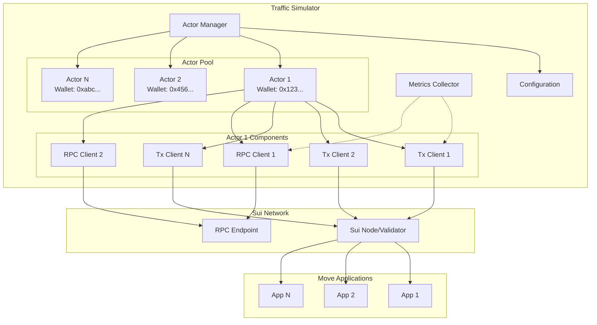
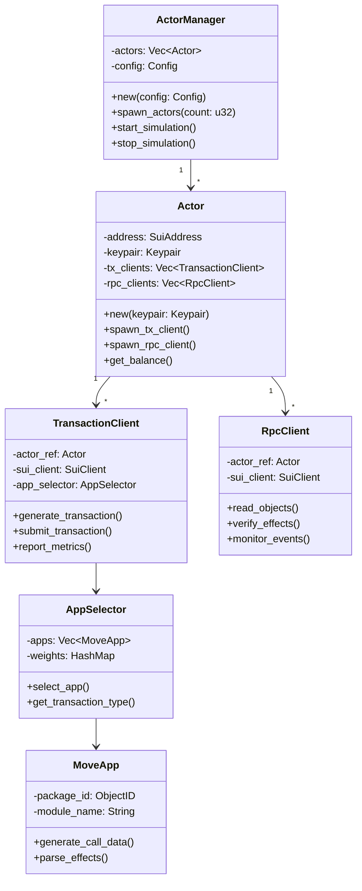
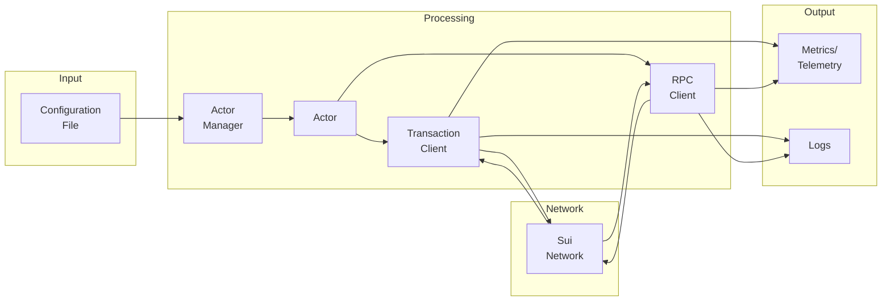

# Sui Traffic Simulator - Architecture Diagrams

## System Architecture

```mermaid
graph TB
    subgraph "Traffic Simulator"
        AM[Actor Manager]
        CONFIG[Configuration]
        METRICS[Metrics Collector]
        
        AM --> CONFIG
        
        subgraph "Actor Pool"
            A1[Actor 1<br/>Wallet: 0x123...]
            A2[Actor 2<br/>Wallet: 0x456...]
            AN[Actor N<br/>Wallet: 0xabc...]
        end
        
        AM --> A1
        AM --> A2
        AM --> AN
        
        subgraph "Actor 1 Components"
            TC1[Tx Client 1]
            TC2[Tx Client 2]
            TCN[Tx Client N]
            RC1[RPC Client 1]
            RC2[RPC Client 2]
        end
        
        A1 --> TC1
        A1 --> TC2
        A1 --> TCN
        A1 --> RC1
        A1 --> RC2
    end
    
    subgraph "Sui Network"
        NODE[Sui Node/Validator]
        RPC[RPC Endpoint]
    end
    
    subgraph "Move Applications"
        APP1[App 1]
        APP2[App 2]
        APPN[App N]
    end
    
    TC1 --> NODE
    TC2 --> NODE
    TCN --> NODE
    RC1 --> RPC
    RC2 --> RPC
    
    NODE --> APP1
    NODE --> APP2
    NODE --> APPN
    
    METRICS -.-> TC1
    METRICS -.-> RC1
```

## Component Interactions

```mermaid
classDiagram
    class ActorManager {
        -actors: Vec~Actor~
        -config: Config
        +new(config: Config)
        +spawn_actors(count: u32)
        +start_simulation()
        +stop_simulation()
    }
    
    class Actor {
        -address: SuiAddress
        -keypair: Keypair
        -tx_clients: Vec~TransactionClient~
        -rpc_clients: Vec~RpcClient~
        +new(keypair: Keypair)
        +spawn_tx_client()
        +spawn_rpc_client()
        +get_balance()
    }
    
    class TransactionClient {
        -actor_ref: Actor
        -sui_client: SuiClient
        -app_selector: AppSelector
        +generate_transaction()
        +submit_transaction()
        +report_metrics()
    }
    
    class RpcClient {
        -actor_ref: Actor
        -sui_client: SuiClient
        +read_objects()
        +verify_effects()
        +monitor_events()
    }
    
    class AppSelector {
        -apps: Vec~MoveApp~
        -weights: HashMap
        +select_app()
        +get_transaction_type()
    }
    
    class MoveApp {
        -package_id: ObjectID
        -module_name: String
        +generate_call_data()
        +parse_effects()
    }
    
    ActorManager "1" --> "*" Actor
    Actor "1" --> "*" TransactionClient
    Actor "1" --> "*" RpcClient
    TransactionClient --> AppSelector
    AppSelector --> MoveApp
```

## Data Flow

```mermaid
flowchart LR
    subgraph "Input"
        CONF[Configuration<br/>File]
    end
    
    subgraph "Processing"
        AM[Actor<br/>Manager]
        ACTOR[Actor]
        TX[Transaction<br/>Client]
        RPC[RPC<br/>Client]
    end
    
    subgraph "Network"
        SUI[Sui<br/>Network]
    end
    
    subgraph "Output"
        METRICS[Metrics/<br/>Telemetry]
        LOGS[Logs]
    end
    
    CONF --> AM
    AM --> ACTOR
    ACTOR --> TX
    ACTOR --> RPC
    TX --> SUI
    RPC --> SUI
    SUI --> TX
    SUI --> RPC
    TX --> METRICS
    RPC --> METRICS
    TX --> LOGS
    RPC --> LOGS
```