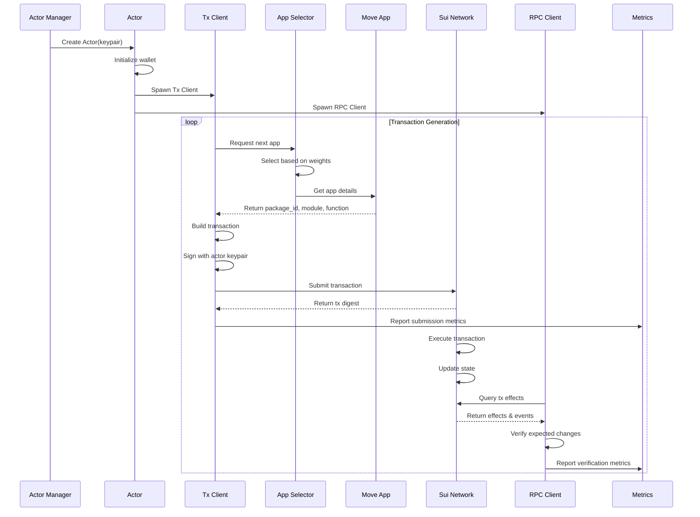
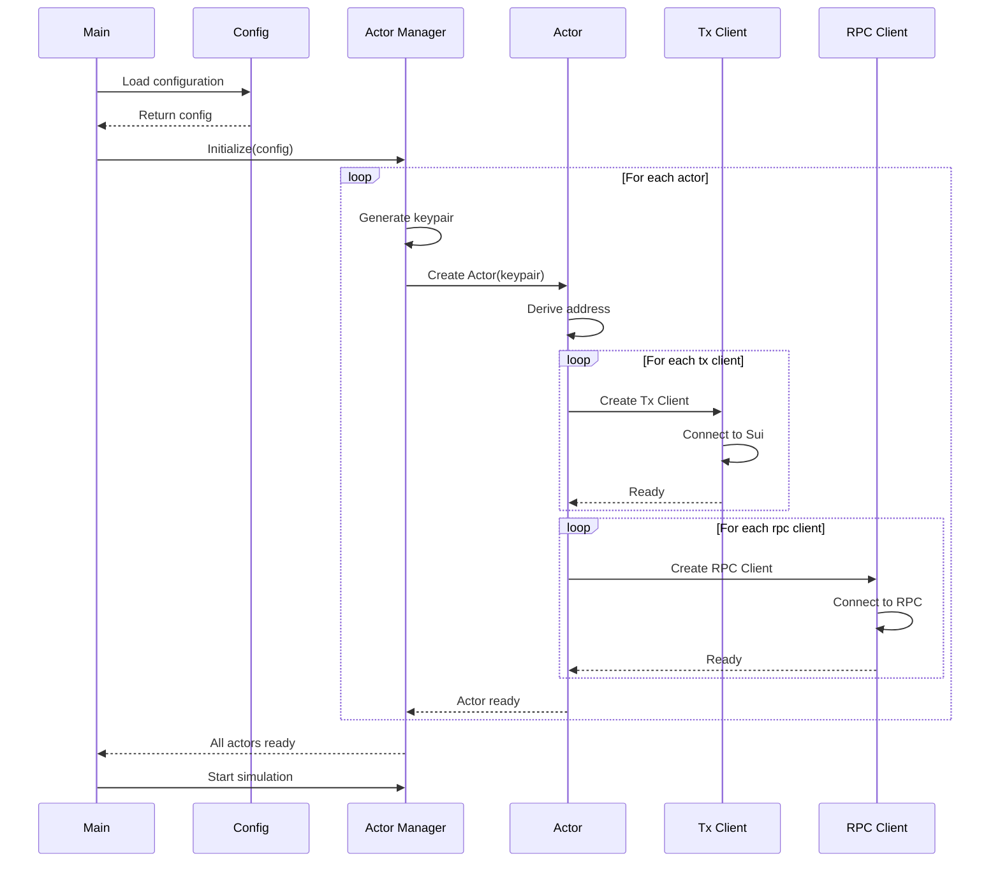
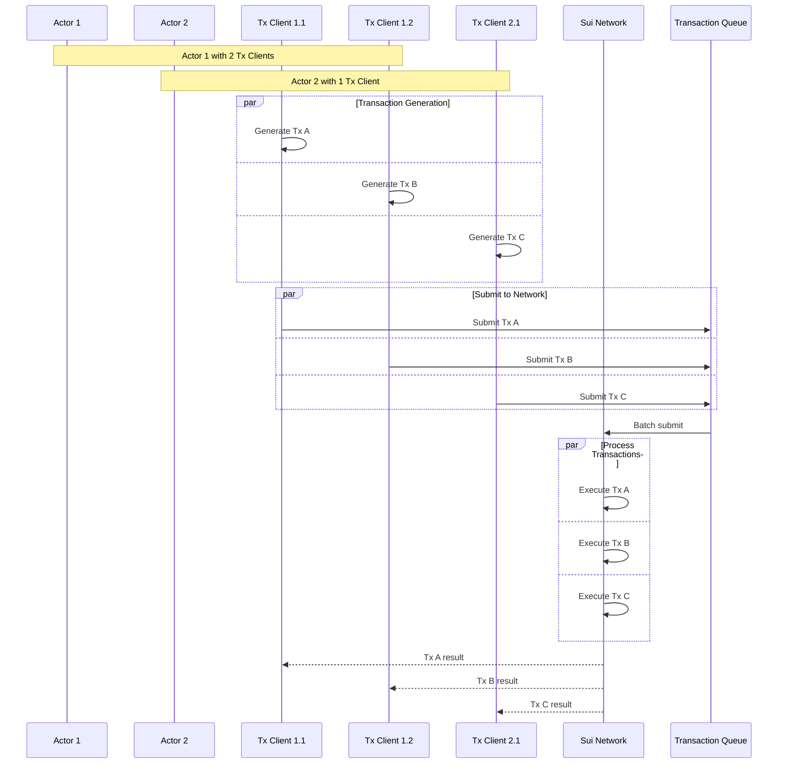
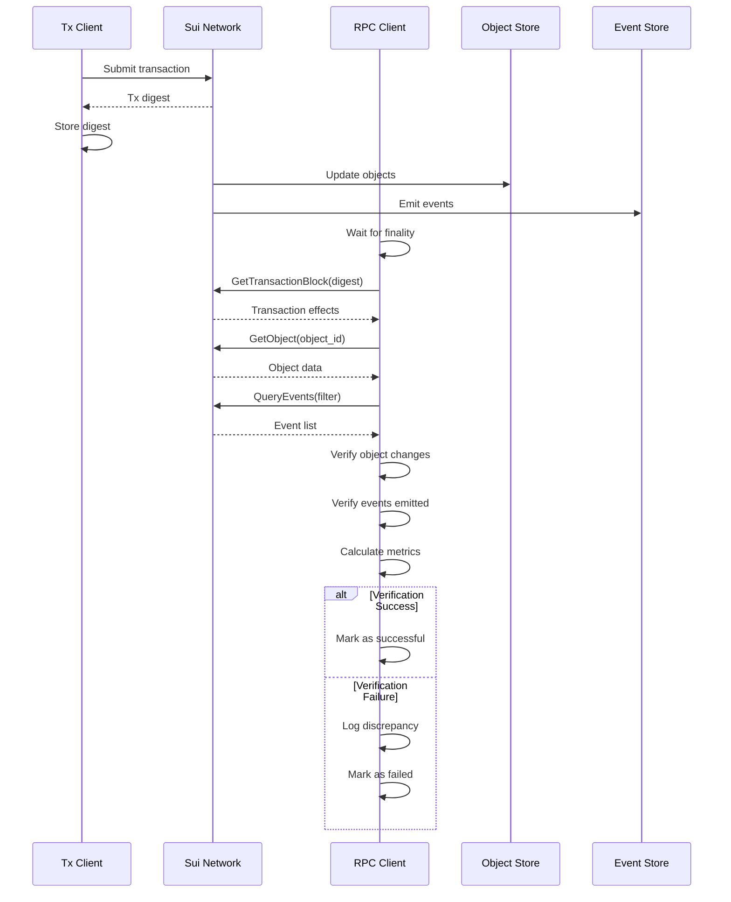
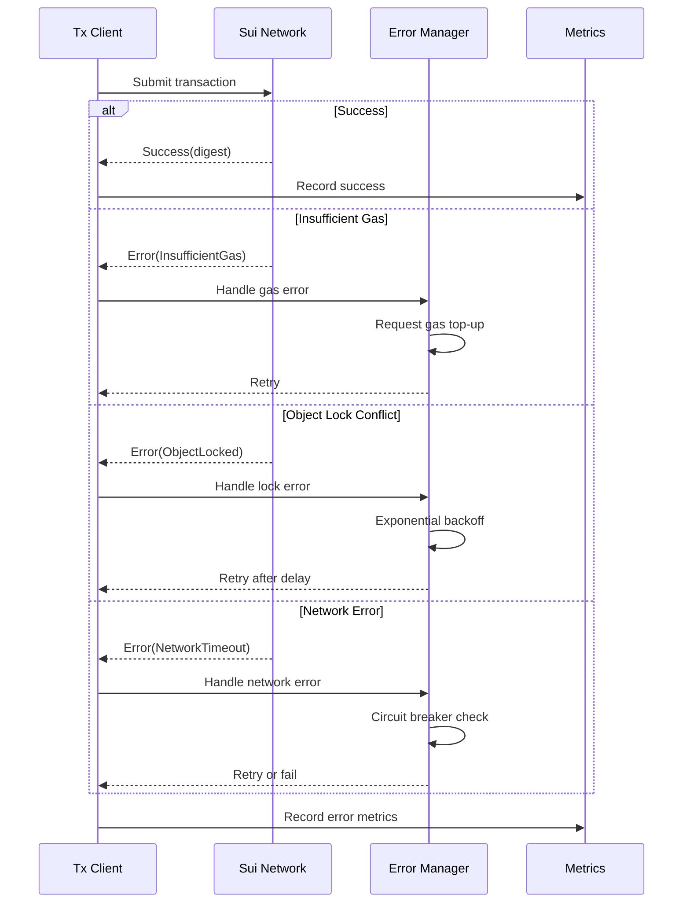

# Sui Traffic Simulator - Sequence Diagrams

## Transaction Lifecycle

```mermaid
sequenceDiagram
    participant AM as Actor Manager
    participant A as Actor
    participant TC as Tx Client
    participant AS as App Selector
    participant APP as Move App
    participant SUI as Sui Network
    participant RC as RPC Client
    participant M as Metrics
    
    AM->>A: Create Actor(keypair)
    A->>A: Initialize wallet
    A->>TC: Spawn Tx Client
    A->>RC: Spawn RPC Client
    
    loop Transaction Generation
        TC->>AS: Request next app
        AS->>AS: Select based on weights
        AS->>APP: Get app details
        APP-->>TC: Return package_id, module, function
        
        TC->>TC: Build transaction
        TC->>TC: Sign with actor keypair
        TC->>SUI: Submit transaction
        SUI-->>TC: Return tx digest
        
        TC->>M: Report submission metrics
        
        SUI->>SUI: Execute transaction
        SUI->>SUI: Update state
        
        RC->>SUI: Query tx effects
        SUI-->>RC: Return effects & events
        RC->>RC: Verify expected changes
        RC->>M: Report verification metrics
    end
```

## Actor Initialization Flow

```mermaid
sequenceDiagram
    participant Main
    participant Config
    participant AM as Actor Manager
    participant A as Actor
    participant TC as Tx Client
    participant RC as RPC Client
    
    Main->>Config: Load configuration
    Config-->>Main: Return config
    Main->>AM: Initialize(config)
    
    loop For each actor
        AM->>AM: Generate keypair
        AM->>A: Create Actor(keypair)
        A->>A: Derive address
        
        loop For each tx client
            A->>TC: Create Tx Client
            TC->>TC: Connect to Sui
            TC-->>A: Ready
        end
        
        loop For each rpc client
            A->>RC: Create RPC Client
            RC->>RC: Connect to RPC
            RC-->>A: Ready
        end
        
        A-->>AM: Actor ready
    end
    
    AM-->>Main: All actors ready
    Main->>AM: Start simulation
```

## Concurrent Transaction Processing

```mermaid
sequenceDiagram
    participant A1 as Actor 1
    participant A2 as Actor 2
    participant TC1 as Tx Client 1.1
    participant TC2 as Tx Client 1.2
    participant TC3 as Tx Client 2.1
    participant SUI as Sui Network
    participant Q as Transaction Queue
    
    Note over A1,TC2: Actor 1 with 2 Tx Clients
    Note over A2,TC3: Actor 2 with 1 Tx Client
    
    par Transaction Generation
        TC1->>TC1: Generate Tx A
        and
        TC2->>TC2: Generate Tx B
        and
        TC3->>TC3: Generate Tx C
    end
    
    par Submit to Network
        TC1->>Q: Submit Tx A
        and
        TC2->>Q: Submit Tx B
        and
        TC3->>Q: Submit Tx C
    end
    
    Q->>SUI: Batch submit
    
    par Process Transactions
        SUI->>SUI: Execute Tx A
        and
        SUI->>SUI: Execute Tx B
        and
        SUI->>SUI: Execute Tx C
    end
    
    SUI-->>TC1: Tx A result
    SUI-->>TC2: Tx B result
    SUI-->>TC3: Tx C result
```

## RPC Verification Flow

```mermaid
sequenceDiagram
    participant TC as Tx Client
    participant SUI as Sui Network
    participant RC as RPC Client
    participant OBJ as Object Store
    participant EVT as Event Store
    
    TC->>SUI: Submit transaction
    SUI-->>TC: Tx digest
    TC->>TC: Store digest
    
    SUI->>OBJ: Update objects
    SUI->>EVT: Emit events
    
    RC->>RC: Wait for finality
    
    RC->>SUI: GetTransactionBlock(digest)
    SUI-->>RC: Transaction effects
    
    RC->>SUI: GetObject(object_id)
    SUI-->>RC: Object data
    
    RC->>SUI: QueryEvents(filter)
    SUI-->>RC: Event list
    
    RC->>RC: Verify object changes
    RC->>RC: Verify events emitted
    RC->>RC: Calculate metrics
    
    alt Verification Success
        RC->>RC: Mark as successful
    else Verification Failure
        RC->>RC: Log discrepancy
        RC->>RC: Mark as failed
    end
```

## Error Handling Flow

```mermaid
sequenceDiagram
    participant TC as Tx Client
    participant SUI as Sui Network
    participant EM as Error Manager
    participant M as Metrics
    
    TC->>SUI: Submit transaction
    
    alt Success
        SUI-->>TC: Success(digest)
        TC->>M: Record success
    else Insufficient Gas
        SUI-->>TC: Error(InsufficientGas)
        TC->>EM: Handle gas error
        EM->>EM: Request gas top-up
        EM-->>TC: Retry
    else Object Lock Conflict
        SUI-->>TC: Error(ObjectLocked)
        TC->>EM: Handle lock error
        EM->>EM: Exponential backoff
        EM-->>TC: Retry after delay
    else Network Error
        SUI-->>TC: Error(NetworkTimeout)
        TC->>EM: Handle network error
        EM->>EM: Circuit breaker check
        EM-->>TC: Retry or fail
    end
    
    TC->>M: Record error metrics
```