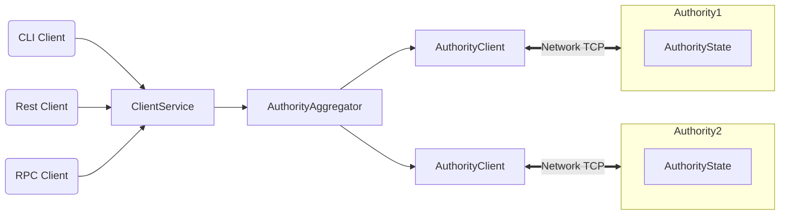

# Sui Developer Portal

Welcome to Sui, a next generation smart contract platform with high throughput, low latency, and an asset-oriented programming model powered by Move! Here are some suggested starting points:

* To jump right into building smart contract applications on top of Sui, go to [Dev Quick Start](move.md)
* To experiment with a toy Sui wallet, check out [Wallet Quick Start](TODO)
* To understand what's possible by browsing examples of full-fledged applications and games built on top of Sui, have a look at [Demos](TODO)
* To go deep on how Sui works, start at [Key Concepts](TODO)
* To learn what distinguishes Sui from other blockchain systems, see [What Makes Sui Different?](TODO)
* To experience Sui's speed and scalability for yourself, try [Benchmarking](TODO)
* To see the current status of the Sui software/network and preview what's coming next, read through [Roadmap](TODO)

## Architectural Overview

## Dev Quick Start
TODO: installation, defining custom objects, object operations (create/destroy/update/transfer/freeze), publishing, invoking your published code. Then deeper: Sui standard library, design patterns, examples.

## Wallet Quick Start
TODO: installation, querying the chain, client setup, getting test coins, sending transfer transactions, viewing the effects in a block explorer. Then deeper: wallet CLI vs client service vs forwarder architecture, how to integrate your code (wallet, indexer, ...) with the client service or forwarder components.

## Demos

## Key Concepts
- [Overview](overview.md)
- [Authorities](authorities.md)
- [Objects](objects.md)
- [Programmability](programmability.md)
- [Transactions](transactions.md)
- TODO: clients
- TODO: state sync
- TODO: reconfiguration
- TODO governance, incentives, and rewards

## What Makes Sui Different?

Sui allows a set of distributed authorities, some of which are Byzantine, to maintain a high-integrity and availability settlement system for pre-funded payments. It can be used to settle payments in a native unit of value (crypto-currency), or as a financial side-infrastructure to support retail payments in fiat currencies. Sui is based on Byzantine Consistent Broadcast as its core primitive, foregoing the expenses of full atomic commit channels (consensus). The resulting system has low-latency for both confirmation and payment finality. Remarkably, each authority can be sharded across many machines to allow unbounded horizontal scalability. Our experiments demonstrate intra-continental confirmation latency of less than 100ms, making Sui applicable to point of sale payments. In laboratory environments, we achieve over 80,000 transactions per second with 20 authorities---surpassing the requirements of current retail card payment networks, while significantly increasing their robustness.

- High throughput and low latency (enables low cost w/ fixed hardware)
- Causal order vs total order (enables massively parallel execution)
- Move and object-centric data model (enables composable objects/NFT's)
TODO: more

EDITORIAL COMMENT: feel free to take a hatchet to what follows

### Authorities vs Validators/Miners
An authority plays a role similar to "validators" or "miners" in other blockchain systems. The key distinction between these roles (and the reason we insist on using a separate term) is that validators/miners are *active*, whereas authorities are *passive*. Broadly speaking:
* Miners/validators continuously participate in a global consensus protocol that requires multiple rounds of all-to-all communication between the participants. The goal is typically to agree on a *totally ordered* block of transactions and the result of their execution.
* Authorities do nothing until they receive a transaction or certificate from a user. Upon receiving a transaction or certificate, an authority need not communicate with other authorities in order to take action and advance its internal state machine. It may wish to communicate with other authorities to share certificates, but need not do so.

## Causal Order vs Total Order
Unlike most existing blockchain systems (and as the reader may have guessed from the description of write requests above), Sui does not impose a total order on the transactions submitted by clients. Instead, transactions are *causally* ordered--if a transaction `T1` produces output objects `O1` that are used as input objects in a transaction `T2`, an authority must execute `T1` before it executes `T2`. Note that `T2` need not use these objects directly for a causal relationship to exist--e.g., `T1` might produce output objects which are then used by `T3`, and `T2` might use `T3`'s output objects. However, transactions with no causal relationship can be processed by Sui authorities in any order.

EDITORIAL NOTE: Feels like this last bit could/should be part of a different

## Benchmarking
TODO: installation, running throughput and latency benchmarks, demonstrating that throughput goes up when you add more cores, adding more authorities leads to linear-ish decrease of latency/throughput.

## Roadmap

TODO
