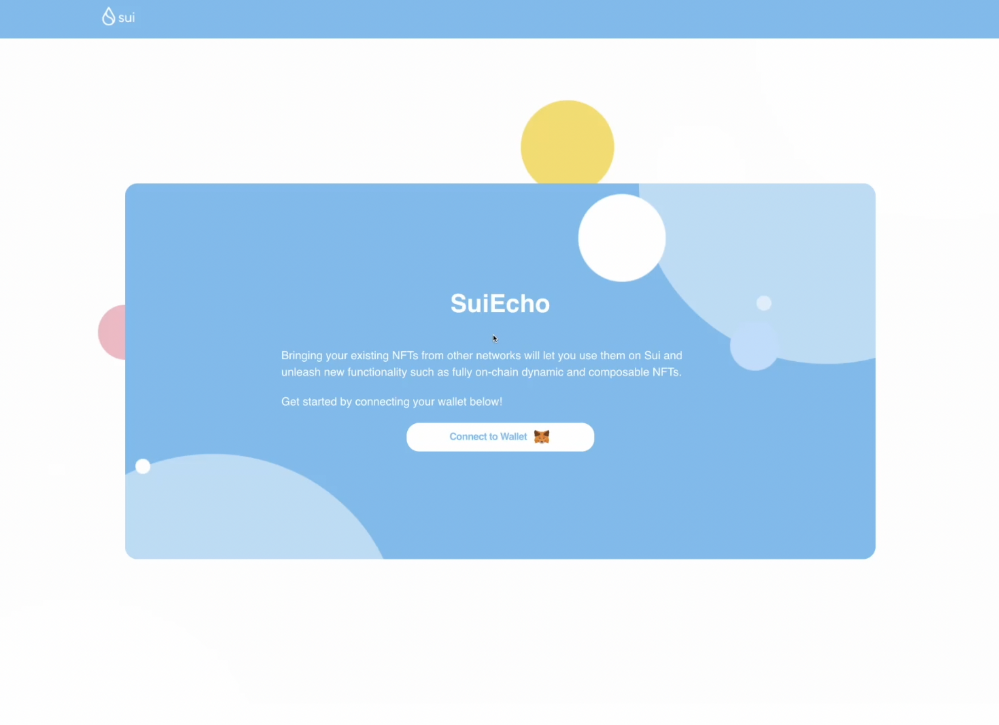

# Panzerdogs x Sui

Lucky Kat, Sui'nin performansının oyun ve blok zinciri teknolojileri arasındaki sinerjiye nasıl öncülük edeceğini gösteren bir demo oluşturmak için Mysten Labs ile birlikte çalıştı. Özellikle amacımız, Sui'nin zincir üzerindeki varlık sahipliği ile oyun arasında sıkı bir geri bildirim döngüsü oluşturmak için nasıl kullanılabileceğini vurgulamaktır.

Lucky Kat Studios tarafından geliştirilen Panzerdogs, kullanıcıların oyun içi varlıklarına sahip olabileceği ve bunları tanklarda birbirlerine karşı savaşmak için kullanabileceği bir NFT oyun projesidir. Brawl Stars x Tanks x Play-To-Earn (Kazanmak için oyna).

### Lucky Cat Stüdyoları hakkında 

Lucky Kat Studios, Hollanda'nın Lahey kentinde bulunan bağımsız bir oyun stüdyosudur. Stüdyonun misyonu, her yaştan kullanıcı için kolayca erişilebilen eğlenceli ve zorlu mobil oyunlar yaratmaktır. Genç ve azimli bir sanatçı ekibinden oluşan Lucky Kat, retro'yu günümüzün geleceği haline getirmeyi amaçlayan piksel sanatı oyunları yaratma konusunda uzmanlaşmıştır.

2015 baharında Lucky Kat Stüdyoları kuruldu. Kurucuları piksel sanatı görsellerini görmek kadar heyecanlandıran ve onları çocukluk anılarına geri götüren başka bir şey yoktur. Piksel sanatı oyunlarına olan tutkularından yola çıkarak, piksel başına pikseli eğlenceli ve zorlu mobil oyunlara dönüştürme felsefesine sahip bir oyun şirketi kurmak istediler. Piksel sanatı düşük çözünürlüklü olduğundan, kurucular detaylara önem veren sanatçılarla çalışmanın çok önemli olduğuna inanıyorlardı. Lucky Kat Stüdyoları, mevcut yetenekli ekibiyle her yaştan kullanıcı için yüksek kaliteli premium mobil oyunlar sunmayı vaat ediyor.

> "Sui, Panzerdogs ve genel olarak blok zinciri oyunları için heyecan verici yeni seçenekler sunuyor. Sui'deki gelişim hızlı ve yerinde. Sahiplik programlama modeli merkezi olmayan oyunlar için çok uygundur ve güvenlik sunarken Proof-of-Work gibi darboğazlara ihtiyaç duyulmasını da önler. İşlem hızı etkileyici olmakla kalmıyor, aynı zamanda NFT'leri yankılama yeteneği ve zincir üzerindeki varlıkların dinamik olarak ele alınması, kullanıcılara ve sahip oldukları varlıklara yeni bir değer katabilir. Tüm NFT'lerinizi bir oyuna aktardığınızı, onları yeni, kullanılabilir varlıklara yükselttiğinizi ve oyun deneyimini ve oyun içi ekonomiyi geliştirdiğinizi hayal edin. NFT'ler yalnızca oyun deneyiminin bir parçası olmakla kalmıyor, aynı zamanda oyun da NFT'nin bir parçası haline geliyor. Sui'nin web3 oyunlarını nasıl etkileyeceğini görmek için sabırsızlanıyoruz!"

### SuiEcho 

SuiEcho, Sui ekosistemini büyütmek için oluşturduğumuz ilk açık kaynak araçlarından biridir. Özellikle SuiEcho, mevcut NFT sahiplerinin bunları Sui'ye taşımasına ve yeni işlevleri keşfetmek için kullanmasına olanak tanır (SuiEcho hakkında daha fazla bilgiyi [buradan ](https://medium.com/@media-mysten/d3a59606dfcb)okuyabilirsiniz).

Panzerdogs oynanışının heyecan verici bir özelliği de kullanıcıların NFT'lerini oyunlarında avatar olarak kullanabilmelerine olanak sağlamasıdır. Sui, yüksek verim, düşük gecikme süresi ve düşük maliyet sunacak şekilde optimize edilmiştir; bu da sık sık, ucuz ve kolay bir şekilde hareket etmesi gereken oyun içi varlıkları çalıştırmak için ideal bir ağ oluşturur. Daha da önemlisi, Sui'nin tasarımı tamamen zincir üzerinde veri depolamaya olanak tanıyarak oyun içi özelleştirmelerin ve yükseltmelerin anında Sui'ye yansıtılabileceği anlamına gelir. Bu özellikler, Sui'yi Panzerdogs gibi kullanıcının NFT'lerinin ve oyunun derinden iç içe geçtiği bir oyunu çalıştırmak için ideal bir platform haline getirmektedir.

.png>)

&#x20;_Panzerdogs, kullanıcıların mevcut NFT'lerini SuiEcho etmelerini sağlıyor_

### SuiEcho nasıl çalışır? 

Sui'nin performansını optimize etmenin ötesinde, hedeflerimizden biri Sui'yi erişilebilir ve kullanımı kolay hale getiren araçlar oluşturmaktır (Sui Geliştirici Kitimiz hakkında daha fazla bilgiyi [buradan ](https://medium.com/@media-mysten/488ec3f3f1d2)okuyabilirsiniz). Bu doğrultuda, kullanıcıların Sui tabanlı NFT'ler oluşturmasına yardımcı olmak için basit bir SuiEcho beyaz etiket çözümü oluşturma sürecindeyiz.

SuiEcho beyaz etiketi, kullanıcılardan mevcut adreslerini diğer ağlardan bağlamalarını isteyerek başlar. Bu, zincirler arası kullanıcı arayüzünü kullanıcının bakış açısından mümkün olduğunca kolay hale getirir.

&#x20;_SuiEcho beyaz etiketli kullanıcı arayüzü mevcut cüzdanlara bağlanır_

Kullanıcı daha sonra genel NFT portföyünü görselleştirebilir ve Sui'ye hangilerini ekleyeceğini seçebilir.

.png>)

&#x20;_Ve adresin NFT portföyünü sergiler_

Son olarak, kullanıcılar Sui ağına, ilişkili adresin özel anahtarlarına sahip olduklarını doğrulayan bir imza sağlayarak ve Sui tabanlı NFT'nin basılacağı Sui adresini ekleyerek sahipliklerini kanıtlarlar.

&#x20;_Kullanıcının bir NFT seçmesi, sahipliğini kanıtlaması ve SuiEcho etmesi_

Ve işte bu kadar! Bu adımları izledikten sonra, kullanıcı artık SuiEcho beyaz etiket çözümü aracılığıyla Sui'ye getirilen Sui tabanlı yeni bir NFT'ye sahiptir. Sahipliği onaylamak için kullanıcı [Sui Gezginini](https://explorer.sui.io/) kontrol edebilir ve her bir NFT ile ilgili ek bilgileri okuyabilir.

.png>)

&#x20;_Sui NFT'leri Sui Gezgininde görüntülenebilir._

SuiEcho ile kullanıcılar NFT'lerini Sui'ye kolayca getirebilir ve yeni işlevlerin kilidini açabilir. Artık kullanıcılar NFT'lerini Panzerdogs'ta avatar olarak kullanmaya ve zincir içi sahiplik ile oyun arasındaki birçok zengin sinerjiyi keşfetmeye hazır.

&#x20;_Kullanıcılar artık yeni Sui tabanlı NFT'lerini Panzerdogs'ta avatar olarak kullanmakta özgür!_

### Sırada ne var? 

Bu sadece bir başlangıç. Sui, NFT'leri faydalı bir şekilde sunmak için tasarlandı ve değerlerinin yalnızca kıtlık nedeniyle değil, aynı zamanda kullanıcıların onlarla harika yeni deneyimler ve işlevselliklerin kilidini açabilecekleri için artmasını sağlıyor. Örneğin, gelecekte Panzerdogs NFT'lerinin oyunda olanlara bağlı olarak geliştiğini göreceğiz. Sui platformu, mutasyonları zincir üzerinde kaydederek ve oyun, NFT sahipliği ve oyun ekonomisi arasında sıkı bir çark sağlayarak bu özelliklerden tam olarak yararlanabilecektir.

.png>)
