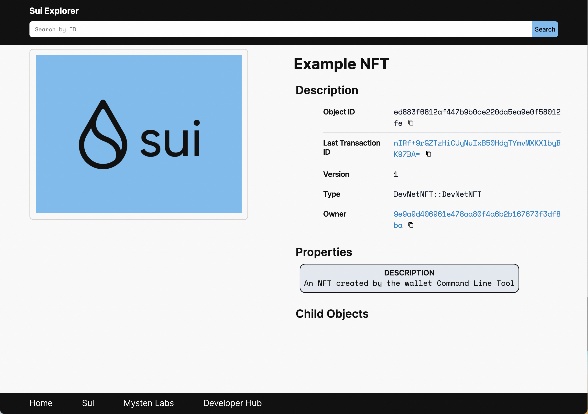
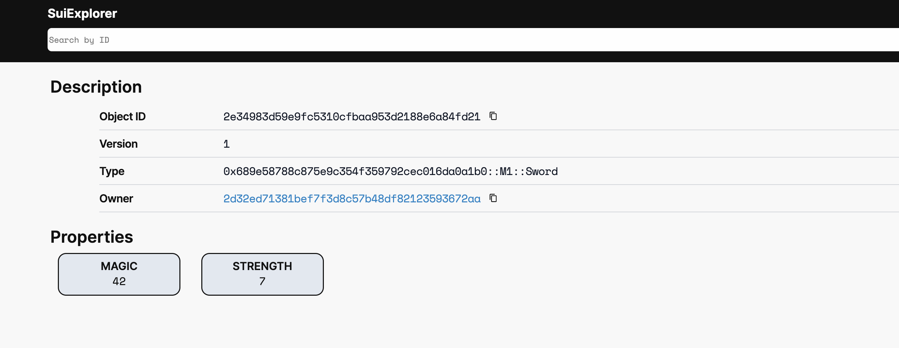

Welcome to the Sui Devnet. We are hosting a public Devnet for the community to experiment with our tech and help to shape the future of the Sui network. It exists to gain operational experience with the Sui software in a public setting prior to our Mainnet launch.

The Sui Devnet currently consists of:

* A four-validator network with all nodes operated by Mysten Labs. Clients send transactions and read requests via this endpoint: gateway.devnet.sui.io:443 using [JSON-RPC](../build/json-rpc.md)
* A public network [Sui Explorer](https://explorer.devnet.sui.io) for browsing transaction history.
* A [Discord channel](https://discordapp.com/channels/916379725201563759/971488439931392130) for requesting test coins that can be used to pay for gas on the test network. These coins have no financial value and will disappear each time we reset the network.

Many improvements to the Sui Devnet are underway, such as the ability to run full nodes and use a browser-based wallet. See the [Sui Devnet blog post](https://medium.com/mysten-labs/sui-devnet-public-release-a2be304ff36b) announcement for full details on upcoming features. All Devnet usage is subject to our [terms of service](https://sui.io/terms/).

## Tools

We provide the following tools for users to interact with the Sui Devnet:

* The [Sui command line interface (CLI)](../build/cli-client.md)
    * create and manage your private keys
    * submit transactions for creating example NFTs
    * call and publish Move modules
* [Sui Explorer](https://github.com/MystenLabs/sui/blob/main/apps/explorer/README.md) - view transactions and objects


## Environment set up

You can [install Sui](../build/install.md) and then request test tokens as described in the install docs. To use the Sui Devnet, you need:

1. Sui [test coins (tokens)](#request-gas-tokens) requested through [Discord](https://discordapp.com/channels/916379725201563759/971488439931392130).
1. the [`git` command line interface](https://git-scm.com/download/).
1. [Sui binaries](../build/install.md#binaries) in your PATH environment variable, particularly `sui`.

Remember, you can confirm the existence of a command in your PATH by running `which` followed by the command, for example:

```shell
$ which sui
```
You should see the path to the command. Otherwise, reinstall.

> **Tip:** To reliably test Devnet with the latest Sui binaries, re-install them at least weekly.

In addition, to conduct advanced work such as publishing a Move module or making a Move call, also obtain the [Sui source code](../build/install.md#source-code); for simplicity, we recommend installing in `~/sui` or using an environment variable.

## Configure the Sui client

Now set up your Sui CLI client and connect to Devnet. Note you can manually change the Gateway URL if you have already configured a Sui CLI client.

 To connect the Sui client to the Devnet, run the following command:
```shell
$ sui client
```
The Sui CLI will print the following line if the client is starting up for the first time:
```shell
Config file ["/Users/dir/.sui/sui_config/client.yaml"] doesn't exist, do you want to connect to a Sui RPC server [y/n]?
```
Type `y` and then press `Enter`. You should see the following output:
```shell
Sui RPC server Url (Default to Sui Devnet if not specified) :
```
The Sui client will prompt for the RPC server URL; press 'Enter' and it will default to Devnet.
Or enter a custom URL to connect to a server hosted elsewhere.

If you have used the Sui client before with a local network, you will have an existing `client.yaml` configuration
file needing update. Change the configured RPC server URL to Devnet by using:
```shell
$ sui client switch --rpc https://gateway.devnet.sui.io:443
```

> **Tip:** If you run into issues, reset the Sui configuration by removing its directory, by default located at `~/.sui/sui_config`. Then reinstall [Sui binaries](../build/install.md#binaries).

## Validating

Note that in the following sections, the object ID's, addresses, and authority signatures used are example values only. Sui generates unique values for each of these, so you see different values when you run the commands.

## Request gas tokens

1. Join [Discord](https://discord.gg/sui) If you haven’t already.
1. Find your address by running:
   ```shell
   $ sui client active-address
   ```
1. Request tokens in the [#devnet-faucet](https://discord.com/channels/916379725201563759/971488439931392130)
   channel per the [SUI tokens](../build/install.md#sui-tokens) install documentation.

## Mint an example NFT

To create a Non-Fungible Token (NFT), run:
```shell
$ sui client create-example-nft
```

You will see output resembling:
```shell
Successfully created an ExampleNFT:

ID: ED883F6812AF447B9B0CE220DA5EA9E0F58012FE
Version: 1
Owner: Account Address ( 9E9A9D406961E478AA80F4A6B2B167673F3DF8BA )
Type: 0x2::devnet_nft::DevNetNFT
```

The preceding command created an object with ID `ED883F6812AF447B9B0CE220DA5EA9E0F58012FE`. Use the `Sui CLI client` to [view objects owned by the address](../build/cli-client.md#view-objects-owned-by-the-address).

Now you can view the created object in the [Sui Explorer](https://explorer.devnet.sui.io) by appending the object ID to:
https://explorer.devnet.sui.io/objects/



The following example command demonstrates how to customize the name, description, or image of the NFT:
```shell
$ sui client create-example-nft --url=https://user-images.githubusercontent.com/76067158/166136286-c60fe70e-b982-4813-932a-0414d0f55cfb.png --description="The greatest chef in the world" --name="Greatest Chef"
```

The command returns a new object ID:
```shell
Successfully created an ExampleNFT:

ID: EC97467A40A1305FFDEF7019C3045FBC7AA31E29
Version: 1
Owner: Account Address ( 9E9A9D406961E478AA80F4A6B2B167673F3DF8BA )
Type: 0x2::devnet_nft::DevNetNFT
```

You can view details about the object in Sui Explorer:
https://explorer.devnet.sui.io/objects/EC97467A40A1305FFDEF7019C3045FBC7AA31E29

## Publish a Move module

Publish a sample Move package containing code developed in the [Sui Move tutorial](../build/move/write-package.md) as follows (assuming you installed the source code in `~sui` as advised in set up):
```shell
$ sui client publish --path <your-sui-repo>/sui_programmability/examples/move_tutorial --gas-budget 30000
```

The response resembles the following:
```shell
----- Certificate ----
Signed Authorities : [k#2266186afd9da10a43dd3ed73d1039c6793d2d8514db6a2407fcf835132e863b, k#1d47ad34e2bc5589882c500345c953b5837e30d6649d315c61690ba7a1e28d23, k#e9599283c0da1ac2eedeb89a56fc49cd8f3c0d8d4ddba9b0a0a5054fe7df3ffd]
Transaction Kind : Publish

----- Publish Results ----
The newly published package object ID: 0689E58788C875E9C354F359792CEC016DA0A1B0
List of objects created by running module initializers:

ID: 898922A9CABE93C6C38C55BBE047BFB0A8C864BF
Version: 1
Owner: Account Address ( F16A5AEDCDF9F2A9C2BD0F077279EC3D5FF0DFEE )
Type: 0x689e58788c875e9c354f359792cec016da0a1b0::my_module::Forge

Updated Gas : Coin { id: 58C4DAA98694266F4DF47BA436CD99659B6A5342, value: 49552 }
```

Two important things happened as a result of publishing this package:

* a package object (with ID `0689E58788C875E9C354F359792CEC016DA0A1B0`)  has been created
* a `Forge` object (with ID `898922A9CABE93C6C38C55BBE047BFB0A8C864BF`) has been created as a result of running a [module initializer](../build/move/debug-publish.md#module-initializers) for one (and the only one) module of this package

Specific object IDs displayed above may differ from one Sui installation to the other, so we will use the following placeholders for them (respectively): <PACKAGE_ID> and <FORGE_ID>. Whenever you see these used in the command line, for example when calling Move functions in the next section, *replace them with actual object IDs*.

## Make a Move call

In the previous section, we learned how to publish a Move package; and in this section, we will learn how to call into functions defined in this package. As a result of publishing a package, we obtained the new package object ID (<PACKAGE_ID>) and ID of the `Forge` object (<FORGE_ID>) that can be used to create swords and transfer them to other players.

Let’s assume that the placeholder for the address of the player to receive a sword is <PLAYER_ADDRESS>. If you don’t know any address other than your own, you can create one using the following `client` command and use it whenever you see the <PLAYER_ADDRESS> placeholder:
```shell
$ sui client new-address ed25519
```
New address creation requires key scheme flag `{ed25519 | secp256k1}`.

Which yields output resembling:
```shell
Created new keypair for address with flag 0: [0x19de019c19fc800a6aeba4eb4133f6db91ca7c2c]
```

In order to create a sword and transfer it to another player, we use the following command to call the `sword_create` [function](https://github.com/MystenLabs/sui/blob/main/sui_programmability/examples/move_tutorial/sources/my_module.move#L47) in the `my_module` [module](https://github.com/MystenLabs/sui/blob/main/sui_programmability/examples/move_tutorial/sources/my_module.move#L4) of the package we previously published.

> **Important:** Note placeholders on the command line and formatting of function parameters as it is important to follow the same pattern.

Now run:
```shell
$ sui client call --function sword_create --module my_module --package 0x<PACKAGE_ID> --args \"0x<FORGE_ID>\" 42 7 \"0x<PLAYER_ADDRESS>\" --gas-budget 30000
```

And receive output like:
```shell
----- Certificate ----
Signed Authorities : [k#2266186afd9da10a43dd3ed73d1039c6793d2d8514db6a2407fcf835132e863b, k#1d47ad34e2bc5589882c500345c953b5837e30d6649d315c61690ba7a1e28d23, k#e9599283c0da1ac2eedeb89a56fc49cd8f3c0d8d4ddba9b0a0a5054fe7df3ffd]
Transaction Kind : Call
Package ID : 0x689e58788c875e9c354f359792cec016da0a1b0
Module : my_module
Function : sword_create
Arguments : [ImmOrOwnedObject((898922A9CABE93C6C38C55BBE047BFB0A8C864BF, SequenceNumber(1), o#9f12d4390e4fc8de3834c4960c6f265a78eca7c2b916ac1be66c1f00e1b47c68)), Pure([42, 0, 0, 0, 0, 0, 0, 0]), Pure([7, 0, 0, 0, 0, 0, 0, 0]), Pure([45, 50, 237, 113, 56, 27, 239, 127, 61, 140, 87, 180, 141, 248, 33, 35, 89, 54, 114, 170])]
Type Arguments : []

----- Transaction Effects ----
Status : Success { gas_cost: GasCostSummary { computation_cost: 69, storage_cost: 40, storage_rebate: 27 } }
Created Objects:
  - ID: 2E34983D59E9FC5310CFBAA953D2188E6A84FD21 , Owner: Account Address ( 2D32ED71381BEF7F3D8C57B48DF82123593672AA )
Mutated Objects:
  - ID: 58C4DAA98694266F4DF47BA436CD99659B6A5342 , Owner: Account Address ( ADE6EAD34629411F730416D6AD48F6B382BBC6FD )
  - ID: 898922A9CABE93C6C38C55BBE047BFB0A8C864BF , Owner: Account Address ( ADE6EAD34629411F730416D6AD48F6B382BBC6FD )
```

Go to the Sui Explorer to observe a newly created object (ID `2E34983D59E9FC5310CFBAA953D2188E6A84FD21`, in this example). You should see a sword object created with `Magic` property of `42` and `Strength` property of `7` and transferred to the new owner.

As above, replace the object ID in the Explorer link with the object ID of the created object you observed in your own command output, appended to:
https://explorer.devnet.sui.io/objects/



This concludes the Sui Devnet setup and testing instructions. Revisit this page and re-install the binaries regularly to witness and help Sui grow!
