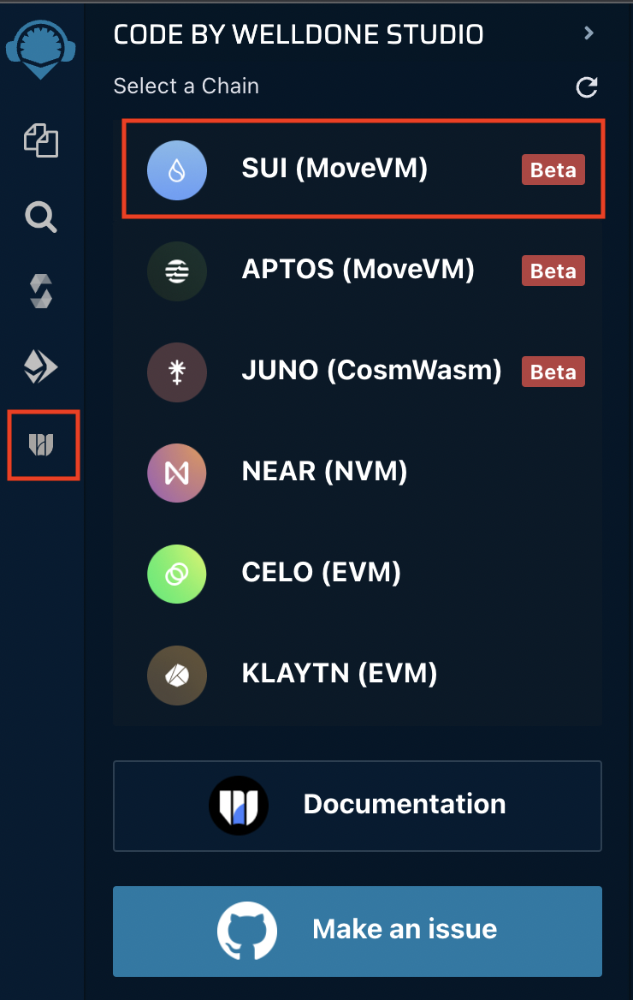
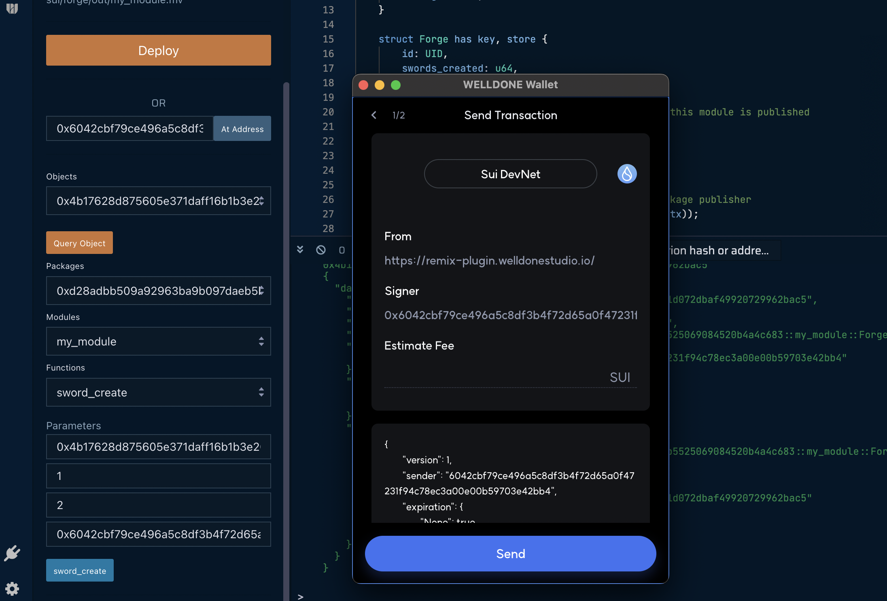
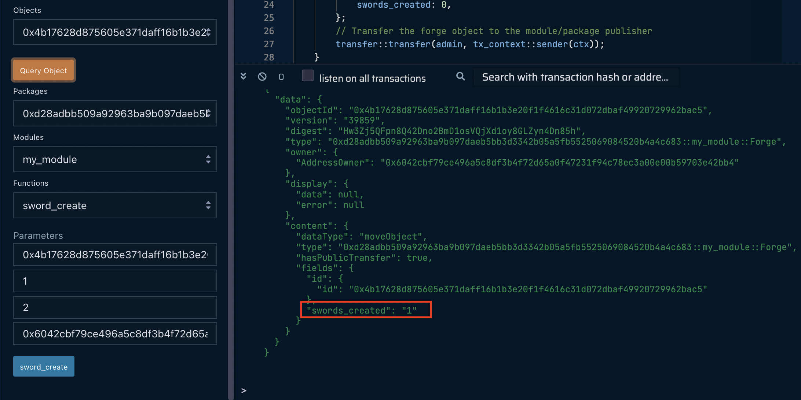

This tutorial explains how to deploy and run Move modules with the [WELLDONE Code Remix IDE](https://docs.welldonestudio.io/code) plugin. This tool offers a graphical interface for developing Move modules.

## Connect to Remix IDE

1. Load the [Remix IDE](https://remix.ethereum.org/).

2. Click the **Plugin Manager** button near the bottom left, search for *CODE BY WELLDONE STUDIO*, and click **Activate**.


## Select a Chain

Click the newly created icon at the bottom of the left menu. Then, select **Sui (MoveVM)** from the chain list.



## Install a wallet

This steps assumes you are using the [WELLDONE Wallet](https://docs.welldonestudio.io/wallet/manual/). following that manual to install and create a wallet and then create an account for the selected chain.

[Sui Wallet](https://chrome.google.com/webstore/detail/sui-wallet/opcgpfmipidbgpenhmajoajpbobppdil) will be supported soon, and WELLDONE Wallet can be used with the Remix IDE plugin now. 

After choosing a chain, click the `Connect to WELLDONE` button to connect to the **WELLDONE Wallet.** 

Now go into the *Settings* tab of your wallet and activate **Developer Mode**.

Click the **Refresh** button in the upper right corner of the plug-in to apply changes to your wallet.

## Create the Project

In Sui, you can write smart contracts with the Move programming language. **WELLDONE Code** provides two features to help developers new to Sui and Move.

### Select a template

Create simple example contract code written in Move. You can create a sample contract by selecting the *template* option and clicking the **Create** button.

### Create a new project

Automatically generate the Move module structure. Write a name for the project, and click the **Create** button to create a Move module structure.

You can create your own Move projects without using the features above. However, for the Remix IDE plugin to build and deploy the Move module, it must be built within the directory `sui/`. If you start a new project, the structure should resemble:


  ```
  sui
  └── <YOUR_PROJECT_NAME>
      ├── Move.toml
      ├── Move.lock
      └── sources
          └── YOUR_CONTRACT_FILE.move
  ```

## Compile and publish a Move module to the Sui blockchain

1. Select the project you want to compile in the **TARGET PROJECT** section.

2. Click the `Compile` button. 

3. When the compilation is complete, a compiled binary file is returned in the `sui/<YOUR_PROJECT_NAME>/out` directory.

4. Once you have compiled contract code, the `Deploy` button will be activated.

## Interact with a Move module.

There are two ways to import contracts.
* Automatically import contracts deployed through the above process.
* Import existing deployed contracts through the **At Address** button.

1. Check the objects and modules owned by the current account and read the resources through the **Query Object** button.
2. You can select a function, enter parameters as needed, and click a button to run the function. For an entry function, a signature from the WELLDONE Wallet is required because the transaction signature and request are required.





## Get support

Click the **Documentation** button to seek help with this Remix IDE plugin. To file requests, click the **Make an issue** button to go to the [welldonestudio](https://github.com/welldonestudio/welldonestudio.github.io) GitHub Repository and [file an issue](https://github.com/welldonestudio/welldonestudio.github.io/issues/new/choose).