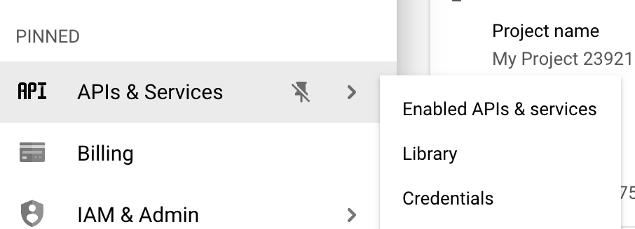
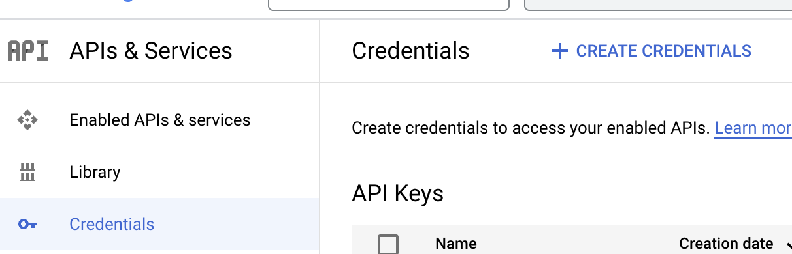
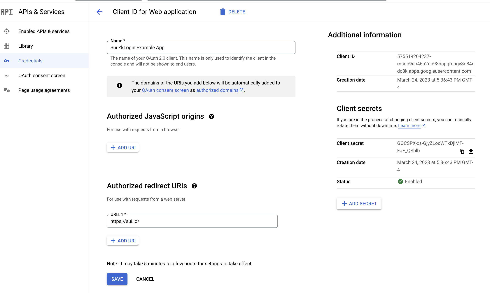
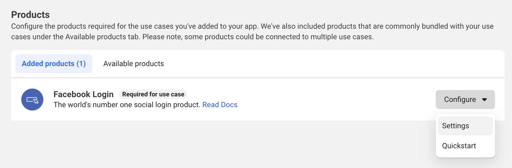
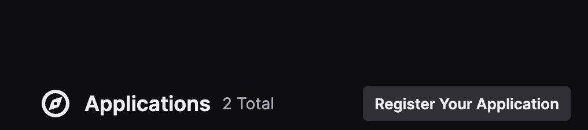
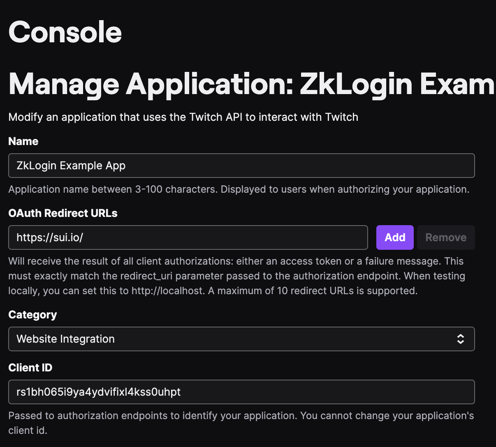

zkLogin is a Sui primitive that lets users send transactions from a Sui address using an OAuth credential, without publicly linking the two.

zkLogin is designed with the following goals in mind:

1. **Simple Onboarding**: zkLogin allows users to transact on Sui using the familiar OAuth login flow, eliminating the friction of handling cryptographic keys or remembering mnemonics.

1. **Self-Custody**: A zkLogin transaction requires user approval via the standard OAuth login process--the OAuth provider cannot transact on the user's behalf.

1. **Secure**: zkLogin is a two-factor authentication scheme: sending a transaction requires both a credential from a recent OAuth login and a salt not managed by the OAuth provider. An attacker who compromises an OAuth account cannot transact from the user's corresponding Sui address unless they separately compromise the salt.

1. **Private**: Zero knowledge proofs prevent third parties from linking a Sui address with its corresponding OAuth identifier.

1. **Optional Verified Identity**: However, a user can *opt in* to verify the OAuth identifier that was used to derive a particular Sui address. This serves as the foundation for a verifiable on-chain identity layer.

1. **Accessible**: zkLogin is one of several native Sui signature schemes thanks to Sui's [crypto agility](https://docs.sui.io/devnet/learn/cryptography/sui-signatures). It smoothly integrates with other powerful Sui primitives like sponsored transactions and multisig.

1. **Built with Rigor**. The [code](https://github.com/sui-foundation/zklogin-circuit) for zkLogin is open source and has been independently [audited](https://github.com/sui-foundation/zk-ceremony-client) by two firms specializing in zero knowledge. The public zkLogin ceremony for creating the common reference string attracted contributions from more than 100 participants.

Are you a builder who wants to integrate zkLogin into your application or wallet? Dive into our [Integration guide](#integration-guide).

If you want to understand how zkLogin works, including how the zero-knowledge proof is generated, and how Sui verifies a zkLogin transaction, see [this section](#how-zklogin-works).

If you are curious about the security model and the privacy considerations of zkLogin, visit this [page](#security-and-privacy).

More questions? See [this page](#faq).

## OpenID providers

The following table lists the OpenID providers that can support zkLogin or are currently being reviewed to determine whether they can support zkLogin.

| Provider     | Can support? | Comments |
| ------------ | ----------   | -------- |
| Facebook     | Yes          |	         |
| Google       | Yes          |          |
| Twitch       | Yes          |          |
| Slack        | Yes          |          |
| Apple        | Yes          |          |
| RedBull      | Under review |          |
| Microsoft    | Under review |          |
| AWS (Tenant) | Under review |          |
| Amazon       | Under review |          |
| WeChat       | Under review |          |
| Auth0        | Under review |          |
| Okta         | Under review |          |

## Integration guide

Here is the high-level flow the wallet or frontend application must implement to support zkLogin-enabled transactions:

1. The wallet creates an ephemeral KeyPair.
1. The wallet prompts the user to complete an OAuth login flow with the nonce corresponding to the ephemeral public key.
1. After receiving the JWT token, the wallet obtains a zero-knowledge proof.
1. The wallet obtains a unique user salt based on a JWT token. The OAuth subject identifier  and salt can be used to compute the zkLogin Sui address.
1. The wallet signs transactions with the ephemeral private key.
1. The wallet submits the transaction with the ephemeral signature and the zero-knowledge proof.

Let's dive into the specific implementation details.

## Install the zkLogin TypeScript SDK

To use the zkLogin TypeScript SDK in your project, run the following command in your project root:

```typescript
npm install @mysten/zklogin

# If you want to use the latest experimental version:
        npm install @mysten/zklogin@experimental
```

## Configure a developer account with OpenID provider

Sui currently supports Google, Facebook, and Twitch. More OpenID-compatible providers will be enabled in the future.

In Devnet and Testnet, a dev-use only client ID is provided below. These URLs can be used with the `redirect_uri` set to `https://zklogin-dev-redirect.vercel.app/api/auth`, which will use the `state` parameter to issue a redirect to your application.

| Provider | Dev-Use Only Client ID |
| ----------- | ----------- |
| Google | 25769832374-famecqrhe2gkebt5fvqms2263046lj96.apps.googleusercontent.com |
| Facebook | 233307156352917 |
| Twitch | rs1bh065i9ya4ydvifixl4kss0uhpt |


For example, the following TypeScript code can be used in Devnet and Testnet to construct a login URL for testing.

```typescript
const REDIRECT_URI = '<YOUR_SITE_URL>';

const params = new URLSearchParams({
   // When using the provided test client ID + redirect site, the redirect_uri needs to be provided in the state.
   state: new URLSearchParams({
      redirect_uri: REDIRECT_URI
   }).toString(),
   // Test Client ID for devnet / testnet:
   client_id: '25769832374-famecqrhe2gkebt5fvqms2263046lj96.apps.googleusercontent.com',
   redirect_uri: 'https://zklogin-dev-redirect.vercel.app/api/auth',
   response_type: 'id_token',
   scope: 'openid',
   // See below for details about generation of the nonce
   nonce: nonce,
});

const loginURL = `https://accounts.google.com/o/oauth2/v2/auth?${params}`;
```

In Mainnet, you must configure the client ID (`$CLIENT_ID`) and redirect URL (`$REDIRECT_URL`) with each provider as follows:

### Google

1. Register for a Google Cloud account and access the [dashboard](https://console.cloud.google.com/home/dashboard).
1. Select "APIs & Services" then "Credentials", where you can find the client ID. Set the redirect URL. This should be the wallet or application front end.


*Sign up for Google developer account*
<p>&nbsp;</p>


*Go to Credentials*
<p>&nbsp;</p>


*Configure a Redirect URL*

### Facebook

1. Register for a Facebook developer account and access the [dashboard](https://developers.facebook.com/apps/).

1. Select "Build your app" then "Products" then "Facebook Login" where you can find the client ID. Set the redirect URL. This should be the wallet or application frontend.


*Sign up for Facebook developer account*
<p>&nbsp;</p>


*Go to Settings*

### Twitch

1. Register for a Twitch developer account. Access the [dashboard](https://dev.twitch.tv/console).

1. Go to "Register Your Application" then "Application" where you can find the client ID. Set the redirect URL. This should be the wallet or application frontend.


*Sign up for Twitch developer account*
<p>&nbsp;</p>


*Go to Console*

## Set Up OAuth Flow

1. Generate an ephemeral KeyPair. Follow the same process as you would generating a KeyPair in a traditional wallet. See [Sui SDK](https://sui-typescript-docs.vercel.app/typescript/cryptography/keypairs) for details.

1. Set the expiration time for the ephemeral KeyPair. The wallet decides whether the maximum epoch is the current epoch or later. The wallet also determines whether this is adjustable by the user.

1. Assemble the OAuth URL with configured client ID, redirect URL, ephemeral public key and nonce: This is what the application sends the user to complete the login flow with a computed [nonce](#notations).

```typescript
import { generateNonce, generateRandomness } from '@mysten/zklogin';

const FULLNODE_URL = 'https://fullnode.devnet.sui.io'; // replace with the RPC URL you want to use
const suiClient = new SuiClient({ url: FULLNODE_URL });
const { epoch, epochDurationMs, epochStartTimestampMs } = await suiClient.getLatestSuiSystemState();

const maxEpoch = Number(epoch) + 2; // this means the ephemeral key will be active for 2 epochs from now.
const ephemeralKeyPair = new Ed25519Keypair();
const randomness = generateRandomness();
const nonce = generateNonce(ephemeralKeyPair.getPublicKey(), maxEpoch, randomness);
```

The OAuth URL can be constructed with `$CLIENT_ID`, `$REDIRECT_URL` and `$Nonce` as follows:

| Provider | URL |
| ----------- | ----------- |
| Google | `https://accounts.google.com/o/oauth2/v2/auth?client_id=$CLIENT_ID&response_type=id_token&redirect_uri=$REDIRECT_URL&scope=openid&nonce=$NONCE` |
| Facebook | `https://www.facebook.com/v17.0/dialog/oauth?client_id=$CLIENT_ID&redirect_uri=$REDIRECT_URL&scope=openid&nonce=$NONCE&response_type=id_token` |
| Twitch | `https://id.twitch.tv/oauth2/authorize?client_id=$CLIENT_ID&force_verify=true&lang=en&login_type=login&redirect_uri=$REDIRECT_URL&response_type=id_token&scope=openid&nonce=$NONCE` |

## User Salt Management

User salt is used when computing the zkLogin Sui address (see [definition](#address-definition)). There are several options for the application to maintain the user salt:
1. Client Side:
   - Request user input for the salt during wallet access, transferring the responsibility to the user, who must then remember it.
   - Browser or Mobile Storage: Ensure proper workflows to prevent users from losing wallet access during device or browser changes. One approach is to email the salt during new wallet setup.
2. Backend service that exposes an endpoint that returns a unique salt for each user consistently.
   - Store a mapping from user identifier (e.g. `sub`) to user salt in a conventional database (e.g. `user` or `password` table). The salt is unique per user.
   - Implement a service that keeps a master seed value, and derive a user salt with key derivation by validating and parsing the JWT token. For example, use `HKDF(ikm = seed, salt = iss || aud, info = sub)` defined [here](https://github.com/MystenLabs/fastcrypto/blob/e6161f9279510e89bd9e9089a09edc018b30fbfe/fastcrypto/src/hmac.rs#L121). Note that this option does not allow any rotation on master seed or change in client ID (i.e. aud), otherwise a different user address will be derived and will result in loss of funds.

Here is an example of a backend service request and response. Note that only valid tokens with the dev-only client IDs can be used.

```bash
curl -X POST http://salt.api-devnet.mystenlabs.com/get_salt -H 'Content-Type: application/json' -d '{"token": "$JWT_TOKEN"}'

Response: {"salt":"129390038577185583942388216820280642146"}
```

User salt is used to disconnect the OAuth identifier (sub) from the on-chain Sui address to avoid linking Web2 credentials with Web3 credentials. While losing or misusing the salt could enable this link, it wouldn't compromise fund control or zkLogin asset authority. See more discussion [here](#security-and-privacy).

## Get the User's Sui Address

Once the OAuth flow completes, the JWT token can be found in the redirect URL. Along with the user salt, the zkLogin address can be derived as follows:

```typescript
import { jwtToAddress } from '@mysten/zklogin';

const address = jwtToAddress(jwt, userSalt)
```

## Get the Zero-Knowledge Proof

A ZK proof is required for each ephemeral KeyPair refresh upon expiry. Otherwise, it can be cached in the wallet's local storage.

Because generating a ZK proof can be resource-intensive and potentially slow on the client side, it's advised that wallets utilize a backend service endpoint dedicated to ZK proof generation.

Here's an example request and response for the Mysten Labs-maintained proving service (the endpoint is currently experimental and only available in devnet).

Note that only valid JWT token authenticated with dev-only client ID is supported. If you wish to use the above endpoint for the ZK Proving Service, please contact us for whitelisting your registered client ID.

```bash
curl -X POST https://prover.mystenlabs.com/v1 -H 'Content-Type: application/json' -d '{"jwt":"$JWT_TOKEN","extendedEphemeralPublicKey":"84029355920633174015103288781128426107680789454168570548782290541079926444544","maxEpoch":"10","jwtRandomness":"100681567828351849884072155819400689117","salt":"248191903847969014646285995941615069143","keyClaimName":"sub"}'

Response:

`{"proofPoints":{"a":["17267520948013237176538401967633949796808964318007586959472021003187557716854","14650660244262428784196747165683760208919070184766586754097510948934669736103","1"],"b":[["21139310988334827550539224708307701217878230950292201561482099688321320348443","10547097602625638823059992458926868829066244356588080322181801706465994418281"],["12744153306027049365027606189549081708414309055722206371798414155740784907883","17883388059920040098415197241200663975335711492591606641576557652282627716838"],["1","0"]],"c":["14769767061575837119226231519343805418804298487906870764117230269550212315249","19108054814174425469923382354535700312637807408963428646825944966509611405530","1"]},"issBase64Details":{"value":"wiaXNzIjoiaHR0cHM6Ly9pZC50d2l0Y2gudHYvb2F1dGgyIiw","indexMod4":2},"headerBase64":"eyJhbGciOiJSUzI1NiIsInR5cCI6IkpXVCIsImtpZCI6IjEifQ"}`
```

## Assemble the zkLogin signature and submit the transaction

First, sign the transaction bytes with the ephemeral private key. This is the same as [traditional KeyPair signing](https://sui-typescript-docs.vercel.app/typescript/cryptography/keypairs).
  ```typescript
  const ephemeralKeyPair = new Ed25519Keypair();

const client = new SuiClient({ url: "<YOUR_RPC_URL>" });

const txb = new TransactionBlock();

const { bytes, signature: userSignature } = await txb.sign({
   client,
   signer: ephemeralKeyPair,
});
  ```

Next, serialize the zkLogin signature by combining the ZK proof and the ephemeral signature.
  ```typescript
  import { getZkSignature } from "@mysten/zklogin";

const zkSignature = getZkSignature({
   inputs,
   maxEpoch,
   userSignature,
});
  ```

Finally, execute the transaction.
  ```typescript
  client.executeTransactionBlock({
   transactionBlock: bytes,
   signature: zkSignature,
});
  ```

## Add sponsored transaction support

This is optional, but it enhances user experience by allowing zkLogin address holders to skip acquiring SUI prior to transaction initiation.

Coming Soon

## Example integration

Coming Soon

# How zkLogin Works

In rough sketches, the zkLogin protocol relies on the following:

1. A JWT token is a signed payload from OAuth providers, including a user-defined field named nonce. zkLogin leverages [the OpenID Connect OAuth flow](https://openid.net/developers/how-connect-works/) by defining the nonce as a public key and an expiry epoch.
1. The wallet stores an ephemeral KeyPair, where the ephemeral public key is defined in the nonce. The ephemeral private key signs transactions for a brief session, eliminating the need for user memorization.
The Groth16 zero-knowledge proof is generated based on the JWT token, concealing privacy-sensitive fields.
1. A transaction is submitted on-chain with the ephemeral signature and the ZK proof. Sui authorities execute the transaction after verifying the ephemeral signature and the proof.
1. Instead of deriving the Sui address based on a public key, the zkLogin address is derived from `sub` (that uniquely identifies the user per provider), `iss` (identifies the provider), `aud` (identifies the application) and `user_salt` (a value that unlinks the OAuth identifier with the on-chain address).

## The complete zkLogin flow


(Step 0) We use Groth16 for our protocol's zkSNARK instantiation, requiring a singular generation of a structured common reference string (CRS) linked to the circuit. A ceremony is conducted to generate the CRS, which is used to produce the proving key in the ZK Proving Service, the verifying key in Sui Authority. See [the Ceremony section](#ceremony) for more details.

(Step 1-3) The user begins by logging into an OpenID Provider (OP) to obtain a JWT token containing a defined nonce. In particular, the user generates an *ephemeral* KeyPair `(eph_sk, eph_pk)` and embed `eph_pk`, along with expiry times (`max_epoch`) and randomness (`jwt_randomness`), into the nonce (see [definition](#notations)). After the user completes the OAuth login flow, an JWT token can be found in the redirect URL in the application.

(Step 4-5) The application frontend then sends the JWT token to a salt service. The salt service returns the unique `user_salt` based on `iss, aud, sub` upon validation of the JWT token.

(Step 6-7) The user sends the ZK proving service the JWT token, user salt, ephemeral public key, jwt randomness, key claim name (i.e. `sub`). The proving service generates a Zero-Knowledge Proof that takes these as private inputs and does the following: (a) Checks the nonce is derived correctly [as defined](#notations) (b) Checks that key claim value matches the corresponding field in the JWT, (c) Verifies the RSA signature from OP on the JWT, and (d) the address is consistent with the key claim value and user salt.

(Step 8): The application computes the user address based on iss, aud, sub, aud. This step can be done independently as long as the application has a valid JWT token.

(Step 9-10) A transaction is signed using the ephemeral private key to generate an ephemeral signature. Finally, the user submits the transaction along with the ephemeral signature, ZK proof and other inputs to Sui.

(After Step 10) After submitted on chain, Sui Authorities verify the ZK proof against the provider JWKs from storage (agreed upon in consensus) and also the ephemeral signature.

## Entities

1. Application frontend: This describes the wallet or frontend application that supports zkLogin. This frontend is responsible for storing the ephemeral private key, directing users to complete the OAuth login flow, creating and signing a zkLogin transaction.

2. Salt Backup Service: This is a backend service responsible for returning a salt per unique user. See [integration guide](#integration-guide) for other strategies to maintain salt.

3. ZK Proving Service: This is a backend service responsible for generating ZK proofs based on JWT token, JWT randomness, user salt and max epoch. This proof is submitted on-chain along with the ephemeral signature for a zkLogin transaction.

## Address definition

The address is computed on the following inputs:

1. The address flag: `zk_login_flag = 0x05` for zkLogin address. This serves as a domain separator as a signature scheme defined in [crypto agility](https://docs.sui.io/learn/cryptography/sui-signatures).

1. `kc_name_F = hashBytesToField(kc_name, maxKCNameLen)`: Name of the key claim, e.g., `sub`. The sequence of bytes is mapped to a field element in BN254 using `hashBytesToField` (defined below).

1. `kc_value_F = hashBytesToField(kc_value, maxKCValueLen)`: The value of the key claim mapped using `hashBytesToField`.

1. `aud_F = hashBytesToField(aud, maxAudValueLen)`: The Relying Party (RP) identifier. See [definition](#terminology-and-notations).

1. `iss`: The OpenID Provider (OP) identifier. See [definition](#terminology-and-notations).

1. `user_salt`: A value introduced to unlink the OAuth identifier with the on-chain address.

Finally, we derive `zk_login_address = Blake2b_256(zk_login_flag, iss_L, iss, addr_seed)` where `addr_seed = Poseidon_BN254(kc_name_F, kc_value_F, aud_F, Poseidon_BN254(user_salt)`.

## Terminology and notations

See below for all relevant OpenID terminology defined in [spec](https://openid.net/specs/openid-connect-core-1_0.html#Terminology) and how they are used in zkLogin, along with definitions for protocol details.

### OpenID provider (OP)

OAuth 2.0 Authorization Server that is capable of Authenticating the End-User and providing Claims to a Relying Party about the Authentication event and the End-User. This is identified in the `iss` field in JWT token payload. Currently zkLogin supported OPs include Google, Facebook and Twitch, and more compatible providers will be enabled in the future.

### Relying party (RP) or client

OAuth 2.0 Client application requiring End-User Authentication and Claims from an OpenID Provider. This is assigned by OP when the developer creates the application. This is identified in the `aud` field in JWT token payload. This refers to any zkLogin enabled wallet or application.

### Subject identifier (sub)

Locally unique and never reassigned identifier within the Issuer for the End-User, which is intended to be consumed by the RP. We use this as the key claim to derive user address.

### JWK (JSON Web Key)

A JSON data structure that represents a set of public keys for an OP. A public endpoint (e.g. https://www.googleapis.com/oauth2/v3/certs) can be queried to retrieve the valid public keys corresponding to `kid` for the provider. Upon matching with the `kid` in the header of a JWT token, the JWT token can be verified against the payload and its corresponding JWK. In Sui, all authorities call the JWK endpoints independently, and update the latest view of JWKs for all supported providers during protocol upgrades. The correctness of JWKs is guaranteed by the quorum (2f+1) of validator stake.

### JWT Token (JSON Web Token)

JWT token can be found in the redirect URL to RP after the user completes the OAuth login flow (i.e. `https://redirect.com?id_token=$JWT_TOKEN`). The JWT token contains a `header`, `payload` and a `signature`. The signature is an RSA signature that can be verified against `jwt_message = header + . + payload` and its JWK identified by `kid`. The `payload` contains a JSON of many claims that is a name, value pair. See below for the specific claims that are relevant to the zkLogin protocol.

**Header**

| Name | Example Value | Usage |
| ----------- | ----------- | ----------- |
| alg | RS256 | zkLogin only supports `RS256` (RSA + SHA-256). |
| kid | c3afe7a9bda46bae6ef97e46c95cda48912e5979 | Identifies the JWK that should be used to verify the JWT. |
| typ | JWT | zkLogin only supports `JWT`. |

**Payload**

| Name | Example Value | Usage |
| ----------- | ----------- | ----------- |
| iss | https://accounts.google.com | A unique identifier assigned to the OAuth provider. |
| aud | 575519200000-msop9ep45u2uo98hapqmngv8d8000000.apps.googleusercontent.com | A unique identifier assigned to the relying party by the OAuth provider. |
| nonce | hTPpgF7XAKbW37rEUS6pEVZqmoI | A value set by the relying party. The zkLogin enabled wallet is required to set this to the hash of ephemeral public key, an expiry time and a randomness. |
| sub | 110463452167303000000 | A unique identifier assigned to the user. |

For a zkLogin transaction, we do not use the `iat` and `exp` claims (i.e., timestamp). This is because we provide a different way for users to specify expiry times, namely via `nonce`.

### Key Claim

We call the claim used to derive a users' address as the "key claim" e.g., sub or email. Naturally, we only want to use claims that are fixed once and never changed again. For zkLogin, we currently support sub as the key claim because OpenID spec mandates that providers do not change this identifier. In the future, this can be extended to use email, username, etc.

### Notations

1. `(eph_sk, eph_pk)`: Ephemeral KeyPair refers to the private and public key pair used to produce ephemeral signatures. The signing mechanism is the same as traditional transaction signing, but it is ephemeral because it is only stored for a short session and can be refreshed upon new OAuth sessions. The ephemeral public key is used to compute nonce.
2. `nonce`: An application-defined field embedded in the JWT token payload, computed as the hash of the ephemeral public key, JWT randomness, and the maximum epoch (Sui's defined expiry epoch). Specifically, a zkLogin compatible nonce is required to passed in as `nonce = ToBase64URL(Poseidon_BN254([ext_eph_pk_bigint / 2^128, ext_eph_pk_bigint % 2^128, max_epoch, jwt_randomness]).to_bytes()[len - 20..])` where `ext_eph_pk_bigint` is the BigInt representation of `ext_eph_pk`.
3. `ext_eph_pk`: The byte representation of an ephemeral public key (`flag || eph_pk`). Size varies depending on the choice of the signature scheme (denoted by the flag, defined [here](https://docs.sui.io/learn/cryptography/sui-signatures)).
4. `user_salt`: A value introduced to unlink the OAuth identifier with the on-chain address.
5. `max_epoch`: The epoch at which the JWT token expires. This is u64 used in Sui.
6. `kc_name`: The key claim name, e.g. `sub`.
7. `kc_value`: The key claim value, e.g. `110463452167303000000`.
8. `hashBytesToField(str, maxLen)`: Hashes the ASCII string to a field element using the Poseidon hash.

## Ceremony

Through zero-knowledge proof, we hide sensitive credentials during proof generation while verifying user information on the blockchain. This involves treating the JWT as a private witness within a circuit that internally validates both the OAuth provider's RSA signature in the JWT token and the expected user information.

The non-interactive ZK proofs (NIZK) share a public, universal common reference string (CRS) for all users. Traditional NIZK applications require a trusted setup, involving trusted parties, distributed ceremonies, or inefficient transparent methods. Leveraging the Groth16 zkSNARK system, we benefit from compact proofs and efficient verifiers, with a one-time setup cost. Therefore, we establish a common CRS through a one-time ceremony accessible to everyone.

### What is The Ceremony?

The ceremony's objective is to compute a public common reference string (CRS). Achieving this involves using the circuit description and confidentially-generated random numbers for sampling. Although these random numbers are not needed in the subsequent protocols, if they are leaked, the security of the protocols will be compromised. Therefore, we need to trust the setup process in two crucial ways: (1) ensuring a faithful sampling process, and (2) securely discarding the confidential random numbers.

We adopt a distributed setup process  instead of relying on a single central party to adhere to the requirements. Through a distributed protocol involving numerous parties, we ensure the setup affords the intended security and privacy assurances. Even if only one party follows the protocol honestly, the final setup remains reliable. Refer to [this page](https://sui.io/zklogin) for more details.

### Who is participating?

The following groups are invited to participate:

1. Experts: People who work in Web3, cryptography, and distributed systems, and who have possibly participated in similar ceremonies.
2. Validators: Entities that have already participated in securing the Sui Network.

The ceremony's security guarantees that among the participants, at least one adheres to the protocol and handles entropy safely. With several participants, the likelihood of this outcome is elevated.

### What exactly happens during the contribution?

Contributions to the ceremony are made one-by-one in sequence, with participants forming a queue. A participant joins the queue upon entering the invitation code in their browser. The coordinator server then assigns each participant a position according to their queue entry.

When a participant is at the head of the queue, they have an option to choose to contribute within the browser or with Docker. Opting for the browser is the simplest method as all processes run in the background; the Docker choice demands command line execution with dependencies.

Throughout the contribution process, whether through browser interaction or running the Docker command, a series of events take place:

1. The latest contribution file is fetched from the coordinator server.

1. The file's integrity is verified within the browser.

1. An entropy is input.

1. The previous contribution is downloaded and the contribution code is executed.

1. The contribution hash is signed.

1. The contribution is uploaded to the coordinator server.

Once the coordinator server confirms the accurately computed uploaded contribution and verifies the signed hash, it stores the latest contribution on-disk. Then, it advances to the next participant in the queue, who repeats the same steps. This cycle continues until the queue is empty.

If for any reason, the participant at the head of the queue did not finish uploading the verified contribution in time, the coordinator discards the participant and moves on to the next one in the queue. Note that throughout the time, the coordinator does not have access to any private information about the contribution.

We encourage the participant to use an entropy that is easy to discard, like using the mouse-moving option that contains high entropy. As long as one participant safely disposes of their entropy, we consider the resulting CRS is trustworthy.

## Finalization

Once all contributions are concluded, the ultimate CRS and a verification script will be made available for public examination. The Sui Foundation will run the verification to ensure the integrity of the ceremony and we also invite anyone to verify the same.

Eventually, the final CRS will be used to generate the proving key and verifying key. The proving key will be used to generate zero knowledge proof for ZkLogin, stored with the ZK proving service. The verifying key will be deployed as part of the validator software that is used to verify the zkLogin transaction on Sui.

## Security and Privacy

We'll walk through all zkLogin artifacts, their security assumptions, and the consequences of loss or exposure.

## JWT Token

The JWT token's validity is scoped on the client ID (i.e. aud) to prevent phishing attacks. The same origin policy for the proof prevents the JWT token obtained for a malicious application from being used for zkLogin. The JWT token for the client ID is sent directly to the application frontend through the redirect URL. A leaked JWT token for the specific client ID can compromise user privacy, as these tokens frequently hold sensitive information like usernames and emails. Furthermore, if a backend salt server is responsible for user salt management, the JWT token could potentially be exploited to retrieve the user's salt, which introduces additional risks.

However, a JWT leak does not mean loss of funds as long as the corresponding ephemeral private key is safe.

## User Salt

The user salt is required to get access to the zkLogin wallet. This value is essential for both ZK proof generation and zkLogin address derivation.

The leak of user salt does not mean loss of funds, but it enables the attacker to associate the user's subject identifier (i.e. `sub`) with the Sui address. This can be problematic depending on whether pairwise or public subject identifiers are in use. In particular, there is no problem if pairwise IDs are used (e.g., Facebook) as the subject identifier is unique per RP. However, with public reusable IDs (e.g., Google and Twitch), the globally unique sub value can be used to identify users.

## Ephemeral Private Key

The ephemeral private key's lifespan is tied to the maximum epoch specified in nonce for creating a valid ZK proof. Should it be misplaced, a new ephemeral private key can be generated for transaction signing, accompanied by a freshly generated ZK proof using a new nonce. However, if the ephemeral private key is compromised, acquiring the user salt and the valid ZK proof would be necessary to move funds.

## Proof

Obtaining the proof itself cannot create a valid zkLogin transaction because an ephemeral signature over the transaction is also needed.

## Privacy

By default, there is no linking between the OAuth subject identifier (i.e. `sub`) and a Sui address. This is the purpose of the user salt.
The JWT token is not published on-chain by default. The revealed values include `iss`, `aud` and `kid` so that the public input hash can be computed, any sensitive fields such as `sub` are used as private inputs when generating the proof.

The ZK proving service and the salt service (if maintained) can link the user identity since the user salt and JWT token are known, but the two services are stateless by design.

In the future, the user can opt in to verify their OAuth identity associated with an Sui address on-chain.

## FAQ

## What providers is zkLogin compatible with?

zkLogin can support providers that work with OpenID Connect built on top of the OAuth 2.0 framework. This is a subset of OAuth 2.0 compatible providers. Sui currently supports Google, Facebook and Twitch. Other compatible providers will be enabled via protocol upgrades in the future.

## How is a zkLogin Wallet different from a traditional private key wallet?

Traditional private key wallets demand users to consistently recall mnemonics and passphrases, necessitating secure storage to prevent fund loss from private key compromise.

On the other hand, a zkLogin wallet only requires an ephemeral private key storage with session expiry and the OAuth login flow with expiry. Forgetting an ephemeral key does not result in loss of funds, because a user can always sign in again to generate a new ephemeral key and a new ZK proof.

## How is zkLogin different from MPC or Multisig wallets?

Multi-Party Computation (MPC) and Multisig wallets rely on multiple keys or distributing multiple key shares and then defining a threshold value for accepting a signature.

zkLogin does not split any individual private keys, but ephemeral private keys are registered using a fresh nonce when the user authenticates with the OAuth provider. The primary advantage of zkLogin is that the user does not need to manage any persistent private key anywhere, not even with any private keys management techniques like MPC or Multisig.

You can think of zkLogin as a 2FA scheme for an address, where the first part is user's OAuth account and the second is the user's salt.

Furthermore, because Sui native supports Multisig wallets, one can always include one or more zkLogin signers inside a Multisig wallet for additional security, such as using the zkLogin part as 2FA in k-of-N settings.

## If my OAuth account is compromised, what happens to my zkLogin address?

Because zkLogin is a 2FA system, an attacker that has compromised your OAuth account cannot access your zkLogin address unless they have separately compromised your salt.

## If I lose access to my OAuth account, do I lose access to my zkLogin address?

Yes. You must be able to log into your OAuth account and produce a current JWT in order to use zkLogin.

## Does losing my OAuth credential mean the loss of funds in the zkLogin wallet?

A forgotten OAuth credential can typically be recovered by resetting the password in that provider.
In the unfortunate event where user's OAuth credentials get compromised, an adversary will still require to obtain `user_salt`, but also learn which wallet is used in order to take over that account. Note that modern `user_salt` providers may have additional 2FA security measures in place to prevent provision of user's salt even to entities that present a valid, non-expired JWT.

It's also important to highlight that due to the fact that zkLogin addresses do not expose any information about the user's identity or wallet used, targeted attacks by just monitoring the blockchain are more difficult.
Finally, on the unfortunate event where one loses access to their OAuth account permanently, access to that wallet is lost. But if recovery from a lost OAuth account is desired, a good suggestion for wallet providers is to support the native Sui Multisig functionality and add a backup method. Note that it's even possible to have a Multisig wallet that all signers are using zkLogin, i.e. an 1-of-2 Multisig zkLogin wallet where the first part is Google and the second Facebook OAuth, respectively.

## Can I convert or merge a traditional private key wallet into a zkLogin one, or vice versa?

No. The zkLogin wallet address is derived differently compared to a private key address.

## Will my zkLogin address ever change?

zkLogin address is derived from `sub`, `iss`, `aud` and `user_salt`.

The address will not change if the user logs in to the same wallet with the same OAuth provider, since `sub`, `iss`, `aud` and `user_salt` (see definitions) will remain unchanged in the JWT token, even though the JWT token itself may look different every time the user logs in.

However, if the user logs in with different OAuth providers, your address will change because the `iss` and `aud` are defined distinctly per provider.

In addition, each wallet or application maintains its own `user_salt`, so logging with the same provider for different wallets may also result in different addresses.

See more on address [definition](#address-definition).

## Can I have multiple addresses with the same OAuth provider?

Yes, this is possible by using a different wallet provider or different `user_salt` for each account. This is useful for separating funds between different accounts.

## Is a zkLogin Wallet custodial?

A zkLogin wallet is a non-custodial or unhosted wallet.

A custodial or hosted wallet is where a third party (the custodian) controls the private keys on behalf of a wallet user. No such third-party exists for zkLogin wallets.

Instead, a zkLogin wallet can be viewed as a 2-out-of-2 Multisig where the two credentials are the user's OAuth credentials (maintained by the user) and the salt. In other words, neither the OAuth provider, the wallet vendor, the ZK proving service or the salt service provider is a custodian.

## Generating a ZK proof is expensive, is a new proof required to be generated for every transaction?

No. Proof generation is only required when ephemeral KeyPair expires. Since the nonce is defined by the ephemeral public key (`eph_pk`) and expiry (`max_epoch`), the ZK proof is valid until what the expiry is committed to nonce in the JWT token. The ZK proof can be cached and the same ephemeral key can be used to sign transactions till it expires.

## Does zkLogin work on mobile?

zkLogin is a Sui native primitive and not a feature of a particular application or wallet. It can be used by any Sui developer, including on mobile.

## Can I run my own ZK Proving Service?

Yes, you can choose to run the server binary on premise and generate ZK proofs yourself instead of calling a provider. Please contact us for more instructions.

## What RPC providers support the ZK Proving Service?

The application can currently call the Mysten Labs-maintained ZK Proving Service. Please reach out to whitelist the application's registered client ID to use the service.

## Is account recovery possible if the user loses the OAuth credentials?

Yes, the user can follow the OAuth providers' recovery flow. The ephemeral private key can be refreshed and after completing a new OAuth login flow, the user can obtain new ZK proof and sign transactions with the refreshed key.

## What are some assumptions for the zkLogin circuit?

Due to the way Groth16 works, we impose length restrictions on several fields in the JWT. Some of the fields that are length-restricted include aud, iss, the JWT's header and payload. For example, zkLogin can currently only work with aud values of up to length 120 (this value is not yet final). In general, we tried to make sure that the restrictions are as generous as possible. We have decided on these values after looking at as many JWTs that we could get our hands on.

## How is zkLogin different from other solutions that support social login?

While providing social login with Web2 credentials for Web3 wallet is not a new concept, the existing solutions have one or more of the trust assumptions:

1. Trust a different network or parties to verify Web2 credentials other than the Blockchain itself, usually involving a JWK oracle posted on-chain by a trusted party.

2. Trust some parties to manage a persistent private key, whether it uses MPC, threshold cryptography or secure enclaves.

3. Relying on smart contracts (account abstraction) to verify the JWT token on-chain with revealing privacy fields, or to verify ZK proofs on-chain which can be expensive.

Some of the existing deployed solutions rely on some of these assumptions. Web3Auth and DAuth social login requires deployment of custom OAuth verifiers to Web3auth Auth Network nodes to verify the JWT token. Magic Wallet and Privy also require custom OAuth identity issuer and verifiers to adopt the DID standard. All of the solutions still require persistent private keys management, either with trusted parties like AWS via delegation, Shamir Secret Sharing or MPC.

The key differentiators that zkLogin brings to Sui are:

1. Native Support in Sui: Unlike other solutions that are blockchain agnostic, zkLogin is deployed just for Sui. This means a zkLogin transaction can be combined with Multisig and sponsored transactions seamlessly.

2. Self-Custodial without additional trust: We leverage the nonce field in JWT token to commit to ephemeral public key, so no persistent private key management is required with any trusted parties. In addition, the JWK itself is an oracle agreed upon by the quorum of stakes by the validators with trusting any source of authority.

3. Full privacy: Nothing is required to submit on-chain except the ZK proof and the ephemeral signature.

4. Compatible with Existing Identity Providers: zkLogin is compatible with providers that adopt OpenID Connect. No need to trust any intermediate identity issuers or verifiers other than the OAuth providers themselves.
