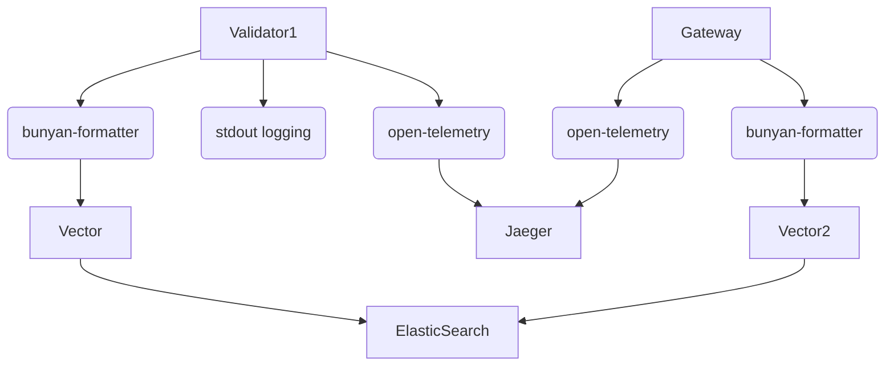

Good observability facilities are key to the development and growth of Sui. This is made
more challenging by the distributed and asynchronous nature of Sui, with multiple client and validator
processes distributed over a potentially global network.

The observability stack in Sui is based on the [Tokio tracing](https://tokio.rs/blog/2019-08-tracing) library.
The rest of this document highlights specific aspects of achieving good observability through structured logging
and metrics in Sui.

NOTE: The output here is largely for the consumption of Sui operators, administrators, and developers. The
content of logs and traces do not represent the authoritative, certified output of validators and are subject
to potentially byzantine behavior.

## Contexts, scopes, and tracing transaction flow

In a distributed and asynchronous system like Sui, one cannot rely on looking at individual logs over time in a single thread.
To solve this problem, we use the approach of structured logging. Structured logging offers a way to tie together
logs, events, and blocks of functionality across threads and process boundaries.

### Spans and events

In the [Tokio tracing](https://tokio.rs/blog/2019-08-tracing) library, structured logging is implemented using [spans and events](https://docs.rs/tracing/0.1.31/tracing/index.html#core-concepts).
Spans cover a whole block of functionality - like one function call, a future or asynchronous task, etc. They can be
nested, and key-value pairs in spans give context to events or logs inside the function.

* spans and their key-value pairs add essential context to enclosed logs, such as a transaction ID.
* spans also track time spent in different sections of code, enabling distributed tracing functionality.
* individual logs can also add key-value pairs to aid in parsing, filtering and aggregation.

Here is a table/summary of context information that we will want:

- TX Digest
- Object reference/ID, when applicable
- Address/account
- Certificate digest, if applicable
- For Client HTTP endpoint: route, method, status
- Epoch
- Host information, for both clients and validators

Example output which shows both context (tx digests) and key-value pairs enhancing observability/filtering,
and tracing a transaction across the gateway (`authority_aggregator`) as well as the validator:

```
7ab7774d1f7bd40848}: sui_core::authority_aggregator: Broadcasting transaction request to authorities quorum_threshold=3 validity_threshold=2 timeout_after_quorum=60s
2022-03-05T01:35:03.383791Z TRACE test_move_call_args_linter_command:process_tx{tx_digest=t#7e5f08ab09ec80e3372c101c5858c96965a25326c21af27ab7774d1f7bd40848}: sui_core::authority_aggregator: Transaction data: TransactionData { kind: Call(MoveCall { package: (0000000000000000000000000000000000000002, SequenceNumber(1), o#3104eb8786a94f58d88564c38e22f13d79e3868c5cf81c9c9228fe91465eccad), module: Identifier("object_basics"), function: Identifier("transfer"), type_arguments: [], object_arguments: [(DA40C299F382CBC3C1EBEEA97351F5F185BAD359, SequenceNumber(1), o#d299113b3b52fd1b9dc01e3ba9cf70345faed592af04a56e287057f166ed2783)], shared_object_arguments: [], pure_arguments: [[145, 123, 205, 38, 175, 158, 193, 63, 122, 56, 238, 127, 139, 117, 186, 164, 89, 46, 222, 252]], gas_budget: 1000 }), sender: k#37ebb9c16574a57bcc7b52a6312a35991748be55, gas_payment: (3EE0283D2D12D5C49D0E4E2F509D07227A64ADF2, SequenceNumber(1), o#3ad1a71ee65e8e6675e6a0fb1e893e48c1820b274d3055d75f4abb850c9663e5) }
2022-03-05T01:35:03.385294Z DEBUG test_move_call_args_linter_command:process_tx{tx_digest=t#7e5f08ab09ec80e3372c101c5858c96965a25326c21af27ab7774d1f7bd40848}: sui_core::authority: Checked locks and found mutable objects num_mutable_objects=2
2022-03-05T01:35:03.386500Z DEBUG test_move_call_args_linter_command:process_tx{tx_digest=t#7e5f08ab09ec80e3372c101c5858c96965a25326c21af27ab7774d1f7bd40848}: sui_core::authority: Checked locks and found mutable objects num_mutable_objects=2
2022-03-05T01:35:03.387681Z DEBUG test_move_call_args_linter_command:process_tx{tx_digest=t#7e5f08ab09ec80e3372c101c5858c96965a25326c21af27ab7774d1f7bd40848}: sui_core::authority_aggregator: Received signatures response from authorities for transaction req broadcast num_errors=0 good_stake=3 bad_stake=0 num_signatures=3 has_certificate=true
2022-03-05T01:35:03.391891Z DEBUG test_move_call_args_linter_command:process_cert{tx_digest=t#7e5f08ab09ec80e3372c101c5858c96965a25326c21af27ab7774d1f7bd40848}: sui_core::authority_aggregator: Broadcasting certificate to authorities quorum_threshold=3 validity_threshold=2 timeout_after_quorum=60s
2022-03-05T01:35:03.394529Z DEBUG test_move_call_args_linter_command:process_cert{tx_digest=t#7e5f08ab09ec80e3372c101c5858c96965a25326c21af27ab7774d1f7bd40848}: sui_core::authority: Read inputs for transaction from DB num_inputs=3
2022-03-05T01:35:03.395917Z DEBUG test_move_call_args_linter_command:process_cert{tx_digest=t#7e5f08ab09ec80e3372c101c5858c96965a25326c21af27ab7774d1f7bd40848}: sui_core::authority: Finished execution of transaction with status Success { gas_used: 7 } gas_used=7
```

From the example above, we can see that `process_tx` is a span that covers handling the initial transaction request, and "Checked locks" is a single log message within the transaction handling method in the validator.
Every log message that occurs within the span inherits the key-value properties defined in the span, including the tx_digest and any other fields that are added.
Log messages can set their own keys and values.
The fact that logs inherit the span properties allows us to trace, for example, the flow of a transaction across thread and process boundaries.

## Key-value pairs schema

### Span names

Spans capture not a single event but an entire block of time; so start, end, duration, etc. can be captured
and analyzed for tracing, performance analysis, etc.

|           Name          |       Place        |                                    Meaning                                     |
| ----------------------- | ------------------ | ------------------------------------------------------------------------------ |
| process_tx              | Gateway, Validator | Send transaction request, get back 2f+1 signatures and make certificate        |
| process_cert            | Gateway, Validator | Send certificate to validators to execute transaction                         |
| cert_check_signature    | Validator          | Check certificate signatures                                                   |
| process_cert_inner      | Validator          | Inner function to process certificates in validator                            |
| fetch_objects           | Validator          | Read objects from database                                                     |
| tx_execute_to_effects   | Validator          | Execute Move call and create effects                                           |
| tx_execute              | Validator          | Actual execution of transfer/Move call etc.                                    |
| handle_cert             | Gateway            | Send to one validator for certificate processing                               |
| quorum_map_auth         | Gateway            | Handle one network component with one validator                                |
| sync_cert               | Gateway, Validator | Gateway-initiated sync of data to validator                                    |
| db_set_transaction_lock | Validator          | Database set transaction locks on new transaction                              |
| db_update_state         | Validator          | Update the database with certificate, effects after transaction Move execution |
|                         |                    |                                                                                |

### Tags - keys

The idea is that every event and span would get tagged with key-value pairs. Events that log within any context or nested contexts would also inherit the context-level tags.
These tags represent *fields* that can be analyzed and filtered by. For example, one could filter out broadcasts and see the errors for all instances where the bad stake exceeded a certain amount, but not enough for an error.

|         Key         |      Place(s)      |                                  Meaning                                   |
| ------------------- | ------------------ | -------------------------------------------------------------------------- |
| tx_digest           | Gateway, Validator | Hex digest of transaction                                                  |
| tx_kind             | Gateway, Validator | Kind of transaction: Transfer/Publish/Call                                 |
| quorum_threshold    | Gateway            | Numeric threshold of quorum stake needed for a transaction                 |
| validity_threshold  | Gateway            | Numeric threshold of maximum "bad stake" from errors that can be tolerated |
| num_errors          | Gateway            | Number of errors from validators broadcast                                |
| good_stake          | Gateway            | Total amount of good stake from validators who answered a broadcast       |
| bad_stake           | Gateway            | Total amount of bad stake from validators, including errors               |
| num_signatures      | Gateway            | Number of signatures received from validators broadcast                   |
| num_unique_effects  | Gateway            | Number of unique effects responses from validators                        |
| num_inputs          | Validator          | Number of inputs for transaction processing                                |
| num_mutable_objects | Validator          | Number of mutable objects for transaction processing                       |
| gas_used            | Validator          | Amount of gas used by the transaction                                      |
|                     |                    |                                                                            |

## Logging levels

This is always tricky, to balance the right amount of verbosity especially by default -- while keeping in mind this is a high performance system.

| Level |                                              Type of Messages                                              |
| ----- | ---------------------------------------------------------------------------------------------------------- |
| Error | Process-level faults (not transaction-level errors, there could be a ton of those)                         |
| Warn  | Unusual or byzantine activity                                                                              |
| Info  | High level aggregate stats, major events related to data sync, epoch changes.                              |
| Debug | High level tracing for individual transactions, eg Gateway/client side -> validator -> Move execution etc. |
| Trace | Extremely detailed tracing for individual transactions                                                     |
|       |                                                                                                            |

Going from info to debug results in a much larger spew of messages.

The `RUST_LOG` environment variable can be used to set both the overall logging level as well as the level for
individual components, and even filtering down to specific spans or tags within spans are possible too.
For more details, please see the [EnvFilter](https://docs.rs/tracing-subscriber/latest/tracing_subscriber/filter/struct.EnvFilter.html) docs.

## Metrics

Sui includes Prometheus-based metrics:
* `rpc_requests_by_route` and related for RPC Server API metrics and latencies (see `rpc-server.rs`)
* Gateway transaction metrics (see `GatewayMetrics` struct in `gateway-state.rs`)
* Validator transaction metrics (see `AuthorityMetrics` in `authority.rs`)

## Viewing logs, traces, metrics

The tracing architecture is based on the idea of [subscribers](https://github.com/tokio-rs/tracing#project-layout) which
can be plugged into the tracing library to process and forward output to different sinks for viewing. Multiple
subscribers can be active at the same time.



In the graph above, there are multiple subscribers, JSON logs can be for example fed via a local sidecar log forwarder such as
[Vector](https://vector.dev), and then onwards to destinations such as ElasticSearch.

The use of a log and metrics aggregator such as Vector allows for easy reconfiguration without interrupting the validator server,
as well as offloading observability traffic.

Metrics: served with a Prometheus scrape endpoint, by default at `<host>:9184/metrics`.

### Stdout (default)

By default, logs (but not spans) are formatted for human readability and output to stdout, with key-value tags at the end of every line.
`RUST_LOG` can be configured for custom logging output, including filtering - see the logging levels section above.

### Tracing and span output

Detailed span start and end logs can be generated by defining the `SUI_JSON_SPAN_LOGS` environment variable. Note that this causes all output to be in JSON format, which is not as human-readable, so it is not enabled by default.
This output can easily be fed to backends such as ElasticSearch for indexing, alerts, aggregation, and analysis.

The example output below shows certificate processing in the authority with span logging. Note the START and END annotations,
and notice how DB_UPDATE_STATE which is nested is embedded within PROCESS_CERT.
Also notice `elapsed_milliseconds` which logs the duration of each span.

```
{"v":0,"name":"sui","msg":"[PROCESS_CERT - START]","level":20,"hostname":"Evan-MLbook.lan","pid":51425,"time":"2022-03-08T22:48:11.241421Z","target":"sui_core::authority_server","line":67,"file":"sui_core/src/authority_server.rs","tx_digest":"t#d1385064287c2ad67e4019dd118d487a39ca91a40e0fd8e678dbc32e112a1493"}
{"v":0,"name":"sui","msg":"[PROCESS_CERT - EVENT] Read inputs for transaction from DB","level":20,"hostname":"Evan-MLbook.lan","pid":51425,"time":"2022-03-08T22:48:11.246688Z","target":"sui_core::authority","line":393,"file":"sui_core/src/authority.rs","num_inputs":2,"tx_digest":"t#d1385064287c2ad67e4019dd118d487a39ca91a40e0fd8e678dbc32e112a1493"}
{"v":0,"name":"sui","msg":"[PROCESS_CERT - EVENT] Finished execution of transaction with status Success { gas_used: 18 }","level":20,"hostname":"Evan-MLbook.lan","pid":51425,"time":"2022-03-08T22:48:11.246759Z","target":"sui_core::authority","line":409,"file":"sui_core/src/authority.rs","gas_used":18,"tx_digest":"t#d1385064287c2ad67e4019dd118d487a39ca91a40e0fd8e678dbc32e112a1493"}
{"v":0,"name":"sui","msg":"[DB_UPDATE_STATE - START]","level":20,"hostname":"Evan-MLbook.lan","pid":51425,"time":"2022-03-08T22:48:11.247888Z","target":"sui_core::authority","line":430,"file":"sui_core/src/authority.rs","tx_digest":"t#d1385064287c2ad67e4019dd118d487a39ca91a40e0fd8e678dbc32e112a1493"}
{"v":0,"name":"sui","msg":"[DB_UPDATE_STATE - END]","level":20,"hostname":"Evan-MLbook.lan","pid":51425,"time":"2022-03-08T22:48:11.248114Z","target":"sui_core::authority","line":430,"file":"sui_core/src/authority.rs","tx_digest":"t#d1385064287c2ad67e4019dd118d487a39ca91a40e0fd8e678dbc32e112a1493","elapsed_milliseconds":0}
{"v":0,"name":"sui","msg":"[PROCESS_CERT - END]","level":20,"hostname":"Evan-MLbook.lan","pid":51425,"time":"2022-03-08T22:48:11.248688Z","target":"sui_core::authority_server","line":67,"file":"sui_core/src/authority_server.rs","tx_digest":"t#d1385064287c2ad67e4019dd118d487a39ca91a40e0fd8e678dbc32e112a1493","elapsed_milliseconds":2}
```

### Jaeger (seeing distributed traces)

To see nested spans visualized with [Jaeger](https://www.jaegertracing.io), do the following:

1. Run this to get a local Jaeger container:
   ```shell
   $ docker run -d -p6831:6831/udp -p6832:6832/udp -p16686:16686 jaegertracing/all-in-one:latest
   ```
1. Run Sui like this (trace enables the most detailed spans):
   ```shell
   $ SUI_TRACING_ENABLE=1 RUST_LOG="info,sui_core=trace" ./sui start
   ```
1. Run some transfers with Sui CLI client, or run the benchmarking tool.
4. Browse to `http://localhost:16686/` and select Sui as the service.

> **Note:** Separate spans (which are not nested) are not connected as a single trace for now.

### Live async inspection / Tokio Console

[Tokio-console](https://github.com/tokio-rs/console) is an awesome CLI tool designed to analyze and help debug Rust apps using Tokio, in real time! It relies on a special subscriber.

1. Build Sui using a special flag: `RUSTFLAGS="--cfg tokio_unstable" cargo build`.
2. Start Sui with `SUI_TOKIO_CONSOLE` set to 1.
3. Clone the console repo and `cargo run` to launch the console.

> **Note:** Adding Tokio-console support may significantly slow down Sui validators/gateways.
