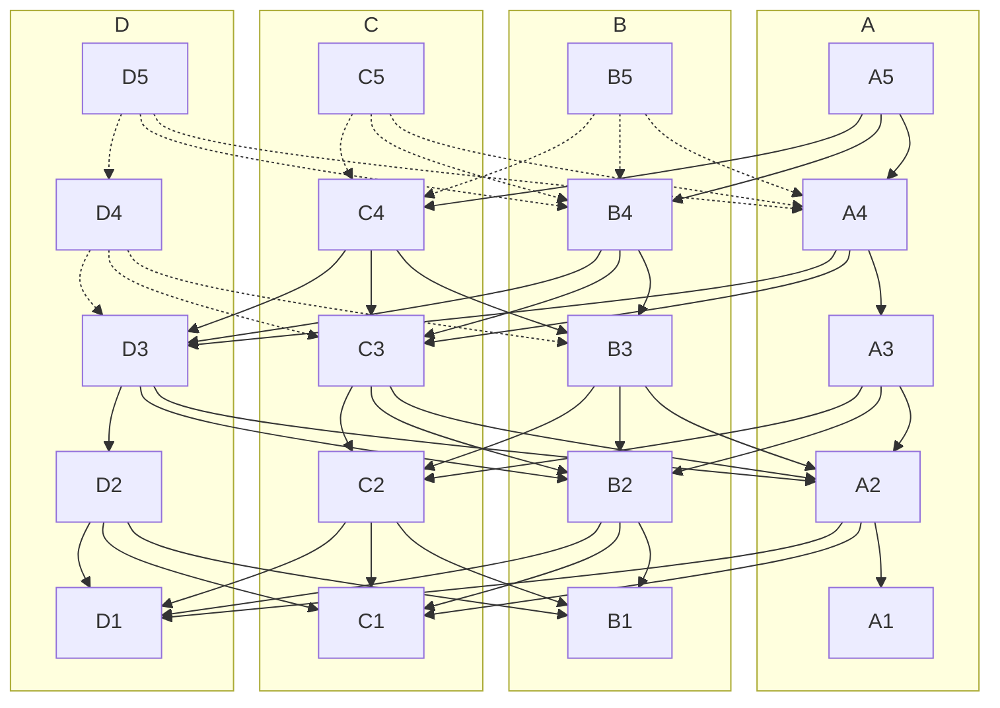

This is a brief introduction to [Narwhal](https://github.com/MystenLabs/narwhal), and [Bullshark](https://arxiv.org/abs/2209.05633), the high-throughput mempool and consensus engines offered by Mysten Labs. Sui uses Narwhal as the mempool and Bullshark as the consensus engine by default, to sequence transactions that require a total ordering, synchronize transactions between validators and periodically checkpoint the network's state.

The names highlight that the components split the responsibilities of:
 * ensuring the availability of data submitted to consensus = [Narwhal](https://arxiv.org/abs/2105.11827)
 * agreeing on a specific ordering of this data = [Bullshark](https://arxiv.org/abs/2209.05633)

The Sui Consensus Engine represents the latest variant of decades of work on multi-proposer, high-throughput consensus algorithms that reach throughputs of more than 125,000 transactions per second with a two-second latency for a deployment of 50 parties, with production cryptography, permanent storage, and a scaled-out primary-worker architecture.

The Sui Consensus Engine approach can offer dramatic scalability benefits in the following cases:
 * a blockchain that has experimented with larger and larger blocks and has measured runaway latencies before the execution phase
 * a blockchain with fast execution (e.g., focused on transactions or with an UTXO data model), but which mempool and consensus do not keep up

## Features

The Narwhal mempool offers:
 * a high-throughput data availability engine, with cryptographic proofs of data availability at a [primary node](https://github.com/MystenLabs/sui/blob/main/narwhal/primary)
 * a structured graph data structure for traversing this information
 * a scaled architecture, splitting the disk I/O and networking requirements across several [workers](https://github.com/MystenLabs/sui/blob/main/narwhal/worker)

The [consensus](https://github.com/MystenLabs/sui/blob/main/narwhal/consensus) component offers a zero-message overhead consensus algorithm, leveraging graph traversals.

## Architecture

A Narwhal instance sets up a message-passing system comprised of a set of $3f+1$ units of stake divided amongst a set of nodes, and assumes a computationally bounded adversary that controls the network and can corrupt parties holding up to f units of stake. The validators collaborate in forming a leaderless graph of batches of transactions - which the literature (in the context of DAG-based consensus) designates as _blocks_ and that Sui labels _collections_ - to emphasize that this happens in a context where the mempool data is used by an unspecified consensus algorithm.

The graph's *vertices* consist of certified collections. Each valid collection signed by its validator-author must contain a round number and must itself be signed by a quorum (2f+1) of validator stake. These 2f+1 signatures are called a _certificate of availability_. Furthermore, that collection must contain hash pointers to a quorum of valid certificates (that is, certificates from validators with 2f + 1 units of stake) from the previous round (see Danezis & al. Fig 2), which constitute the *edges* of the graph.

Each collection is formed in the following way: each validator _reliably broadcasts_ a collection for each round. Subject to specified validity conditions, if validators with 2f + 1 stake receive a collection, they acknowledge it with a signature each. Signatures from 2f + 1 validators by stake form a certificate of availability that is then shared and potentially included in collections at round r + 1.

The following figure represents five rounds of construction of such a DAG (1 to 5), with authorities A, B, C and D participating. For simplicity, each validator holds 1 unit of stake. The collections transitively acknowledged by A's latest round in A5 are represented in full lines in the graph.

## How it works

 * The graph construction allows inserting more transactions in the system at each authority and at each round.
 * The certificates prove the data availability of each collection, or block, at each round.
 * Their contents constitute a DAG that can be traversed identically at each honest node.

## Dependencies

Narwhal is implemented using [Tokio](https://github.com/tokio-rs/tokio), [RocksDB](https://github.com/facebook/rocksdb/) and generic cryptography implemented in [fastcrypto](https://github.com/MystenLabs/fastcrypto).

## Configuration

To conduct a fresh deployment of Sui Consensus Engine, follow the instructions at [Running Benchmarks](https://github.com/MystenLabs/sui/blob/main/narwhal/benchmark).

## Further reading

Narwhal and Tusk (Danezis et al. 2021) is a consensus system leveraging directed acyclic graphs (DAG). DAG-based consensus has been developed over the last 30 years, and some of the history is summarized in (Wang & al. 2020). The closest theoretical ancestor of Narwhal & Tusk is DAG-Rider (Keidar & al. 2021).

Narwhal & Tusk are developed in the [asynchronous model](https://decentralizedthoughts.github.io/2019-06-01-2019-5-31-models/). A partially synchronous variant of Narwhal and Tusk, called Bullshark, is presented in (Giridharan 2022).

Narwhal and Tusk started [as a research prototype](https://github.com/facebookresearch/narwhal) at Facebook Novi.

[Bullshark: DAG BFT Protocols Made Practical](https://arxiv.org/pdf/2201.05677.pdf) - 
Bullshark replaces Tusk for even greater performance.

[Bullshark: The Partially Synchronous Version](https://arxiv.org/pdf/2209.05633.pdf) - 
A simplified version of Bullshark that is used in Sui today.

[DAG Meets BFT - The Next Generation of BFT Consensus](https://decentralizedthoughts.github.io/2022-06-28-DAG-meets-BFT/) - Explains the evolution of the consensus protocol used by Sui.

### Bibliography

 * Danezis, G., Kogias, E. K., Sonnino, A., & Spiegelman, A. (2021). Narwhal and Tusk: A DAG-based Mempool and Efficient BFT Consensus. ArXiv:2105.11827 [Cs]. http://arxiv.org/abs/2105.11827
 * Giridharan, N., Kokoris-Kogias, L., Sonnino, A., & Spiegelman, A. (2022). Bullshark: DAG BFT Protocols Made Practical. ArXiv:2201.05677 [Cs]. http://arxiv.org/abs/2201.05677
 * Spiegelman, A., Giridharan, N., Sonnino, A., & Kokoris-Kogias, L. (2022). Bullshark: The Partially Synchronous Version. ArXiv:2209.05633 [Cs]. https://arxiv.org/abs/2209.05633
 * Keidar, I., Kokoris-Kogias, E., Naor, O., & Spiegelman, A. (2021). All You Need is DAG. ArXiv:2102.08325 [Cs]. http://arxiv.org/abs/2102.08325
 * Wang, Q., Yu, J., Chen, S., & Xiang, Y. (2020). SoK: Diving into DAG-based Blockchain Systems. ArXiv:2012.06128 [Cs]. http://arxiv.org/abs/2012.06128
