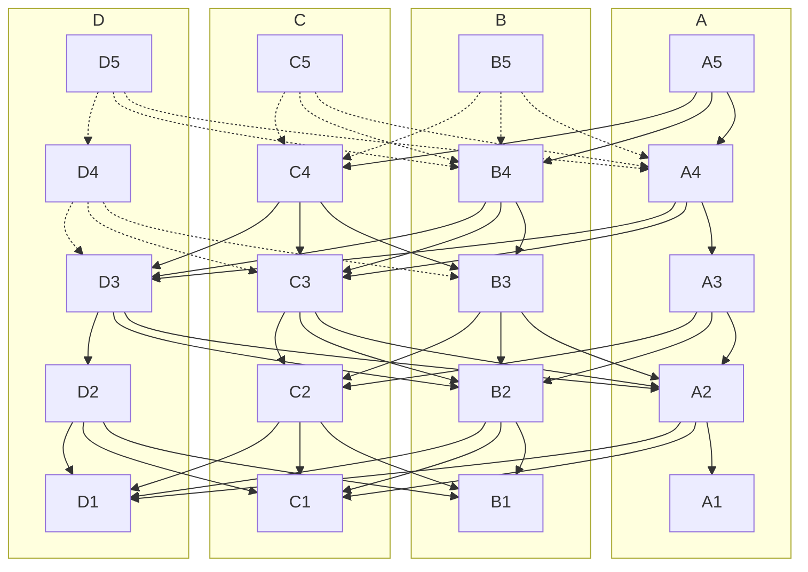

 ---
title: Learn about Narwhal and Tusk, Sui's consensus engine.
---

This is a brief introduction to Narwhal and Tusk, the high-throughput mempool and consensus offered by Mysten Labs. Sui runs consensus as needed to periodically checkpoint its state. And for those transactions that require a total ordering, Narwhal/Tusk is the consensus engine of Sui.

The dual name highlights that the systems split the responsibilities of:
- ensuring the availability of data submitted to consensus (Narwhal)
- agreeing on a specific ordering of this data (Tusk)

This is done in two layered modules, so Narwhal can also be used coupled with an external consensus algorithm, such as HotStuff, Istanbul BFT, or Tendermint. Narwhal is undergoing integration in the [Celo](https://www.youtube.com/watch?v=Lwheo3jhAZM) and [Sommelier](https://www.prnewswire.com/news-releases/sommelier-partners-with-mysten-labs-to-make-the-cosmos-blockchain-the-fastest-on-the-planet-301381122.html) blockchain.

Narwhal and Tusk represent the latest variant of decades of work on multi-proposer, high-throughput consensus algorithms that reaches throughputs more than 130,000 transactions per second on a WAN, with production cryptography, permanent storage, and a scaled-out primary-worker architecture.

The Narwhal/Tusk approach can offer dramatic scalability benefits in the following cases:
- a blockchain that has experimented with larger and larger blocks and has measured runaway latencies before the execution phase,
- a blockchain with fast execution (e.g. focused on transactions, or with an UTXO data model), but which mempool and consensus do not keep up,

## Features

The Narwhal mempool offers:
* a high-throughput data availability engine, with cryptographic proofs of data availability at [a primary node](https://github.com/MystenLabs/narwhal/tree/main/primary)
* a structured graph data structure for traversing this information
* a scaled architecture, splitting the disk I/O and networking requirements across several [workers](https://github.com/MystenLabs/narwhal/tree/main/worker)

The [Tusk consensus](https://github.com/MystenLabs/narwhal/tree/main/consensus) offers a zero-message overhead consensus algorithm, leveraging graph traversals.

## Architecture

A Narwhal instance sets up a message-passing system comprised of a set of $3f+1$ units of stake divided amongst a set of nodes, and assumes a computationally bounded adversary that controls the network and can corrupt parties holding up to f units of stake. The validators collaborate in forming a leaderless graph of batches of transactions - which the literature (in the context of DAG-based consensus) designates as _blocks_ and that we label as _collections_ - to emphasize we're in a context where the mempool data is used by an unspecified consensus algorithm.

The graph's *vertices* consist of certified collections. Each valid collection signed by its validator-author must contain a round number and must itself be signed by a quorum ($2f+1$) of validator stake. We call those $2f+1$ signatures a _certificate of availability_. Furthermore, that collection must contain hash pointers to a quorum of valid certificates (that is, certificates from validators with $2f+1$ units of stake) from the previous round (see Danezis & al. Fig 2), which constitute the *edges* of the graph.

Each collection is formed in the following way: each validator _reliably broadcasts_ a collection for each round. Subject to specified validity conditions, if validators with $2f+ 1$ stake receive a collection, they acknowledge it with a signature each. Signatures from $2f + 1$ validators by stake form a certificate of availability that is then shared and potentially included in collections at round $r + 1$.

The following figure represents five rounds of construction of such a DAG (1 to 5), with authorities A, B, C and D participating. For simplicity, each validator holds 1 unit of stake. The collections transitively acknowledged by A's latest round in A5 are represented in full lines in the graph.

## How it works

* The graph construction allows inserting more transactions in the system at each authority and at each round.
* The certificates prove the data availability of each collection, or block, at each round.
* Their contents constitute a DAG that can be traversed identically at each honest node.

While the Tusk consensus selects a specific DAG traversal among several a posteriori, both Tusk and external consensus algorithms can add more sophistication to their selection of blocks / collections to reflect priority concerns.

## Dependencies

Narwhal is implemented using [Tokio](https://github.com/tokio-rs/tokio), [RocksDB](https://github.com/facebook/rocksdb/) and generic cryptography. The cryptography contains implementations of node signing using BLS12-377, BLS12-381, and Ed25519.

## Configuration

To conduct a fresh deployment of Narwhal and Tusk, follow the instructions at [Running Benchmarks](https://github.com/mystenlabs/narwhal/tree/main/benchmark).

## Further reading

Narwhal and Tusk (Danezis et al. 2021) is a consensus system leveraging directed acyclic graphs (DAG). DAG-based consensus has been developed over the last 30 years, and some of the history is summarized in (Wang & al. 2020). The closest theoretical ancestor of Narwhal & Tusk is (Keidar & al. 2021).

Narwhal & Tusk are developed in the [asynchronous model](https://decentralizedthoughts.github.io/2019-06-01-2019-5-31-models/). A partially synchronous variant of Narwhal and Tusk, called Bullshark, is presented in (Giridharan 2022).

Narwhal and Tusk started [as a research prototype](https://github.com/facebookresearch/narwhal) at Facebook Novi.

### Bibliography

- Danezis, G., Kogias, E. K., Sonnino, A., & Spiegelman, A. (2021). Narwhal and Tusk: A DAG-based Mempool and Efficient BFT Consensus. ArXiv:2105.11827 [Cs]. http://arxiv.org/abs/2105.11827
- Giridharan, N., Kokoris-Kogias, L., Sonnino, A., & Spiegelman, A. (2022). Bullshark: DAG BFT Protocols Made Practical. ArXiv:2201.05677 [Cs]. http://arxiv.org/abs/2201.05677
- Keidar, I., Kokoris-Kogias, E., Naor, O., & Spiegelman, A. (2021). All You Need is DAG. ArXiv:2102.08325 [Cs]. http://arxiv.org/abs/2102.08325
- Wang, Q., Yu, J., Chen, S., & Xiang, Y. (2020). SoK: Diving into DAG-based Blockchain Systems. ArXiv:2012.06128 [Cs]. http://arxiv.org/abs/2012.06128
