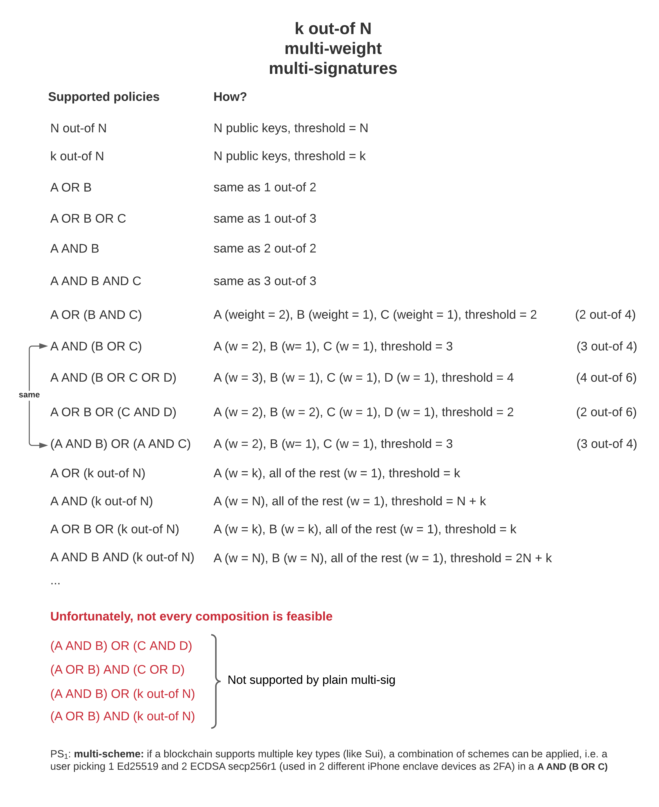

Sui supports `k` out of `n` Multi-Signature (MultiSig) transactions where `k` is the threshold and `n` is the total weights of all participating parties. The maximum number of parties is required to be `<= 10`. 

Pure Ed25519, ECDSA Secp256k1 and ECDSA Secp256r1 are supported as valid participating keys for MultiSig. A ([u8](https://doc.rust-lang.org/std/primitive.u8.html)) weight is set for each participating keys and the threshold can be set as [u16](https://doc.rust-lang.org/std/primitive.u16.html). If the serialized MultiSig contains enough valid signatures of which the sum of weights passes the threshold, the MultiSig is considered valid and the transaction can be executed. 

This topic covers:
 1. The applications of Multi-Signature;
 1. The workflow to create a Multi-Signature transaction in Sui.

# Applications of Multi-Signature

Interestingly, cryptographic agility allows users to mix and match key schemes in a single multisig account. For 
example, one can pick a single Ed25519 mnemonic-based key and two ECDSA secp256r1 key to create a multisig account that 
always requires the Ed25519 key, but also one of the ECDSA secp256r1 keys to sign. A potential application of the above
structure is using mobile secure enclave stored keys as 2FA; note that currently iPhone and high-end Android devices 
support ECDSA secp256r1 enclave-stored keys only.

Interestingly, cryptographic agility allows users to mix and match key schemes in a single MultiSig account. For example, one can pick a single Ed25519 mnemonic-based key and two ECDSA secp256r1 key to create a MultiSig account that always requires the Ed25519 key, but also one of the ECDSA secp256r1 keys to sign. A potential application of the above structure is using mobile secure enclave stored keys as 2FA; note that currently iPhone and high-end Android devices support ECDSA secp256r1 enclave-stored keys only.



# Example Workflow

Here we demonstrate the steps to create a MultiSig transaction in Sui using CLI and then submit it using the Sui CLI against a local network. A transaction can be a transfer of an object, publish or upgrade a package, pay Sui, etc. To learn how to set up a local network, see [Sui Local Network](../build/sui-local-network.md)
 
## Step 1: Add keys to Sui keystore

Use the following command to generate a Sui address and key for each supported key scheme and add it to the `sui.keystore`, then list the keys.

```shell
$SUI_BINARY client new-address ed25519
$SUI_BINARY client new-address secp256k1
$SUI_BINARY client new-address secp256r1

$SUI_BINARY keytool list
```

The response resembles the following, but displays actual addresses and keys:

```
Sui Address | Public Key (Base64) | Scheme
--------------------------------------------------------------------------
$ADDR_1     | $PK_1               | secp256r1
$ADDR_2     | $PK_2               | secp256k1
$ADDR_3     | $PK_3               | ed25519
```

## Step 2: Create a MultiSig address

To create a MultiSig address, input a list of public keys to use for the MultiSig address and list their corresponding weights.

```shell
$SUI_BINARY keytool multi-sig-address --pks $PK_1 $PK_2 $PK_3 --weights 1 2 3 --threshold 3
MultiSig address: $MULTISIG_ADDR
```

The response resembles the following:

```
Participating parties:
Sui Address | Public Key (Base64)| Weight
------------------------------------------
$ADDR_1    | $PK_1              |   1
$ADDR_2    | $PK_2              |   2
$ADDR_3    | $PK_3              |   3
```

## Step 3: Send objects to a MultiSig address

This example requests gas from a local network using the default URL following the guidance in [Sui Local Network](../build/sui-local-network.md).


```shell
curl --location --request POST 'http://127.0.0.1:9123/gas' --header 'Content-Type: application/json' --data-raw "{ \"FixedAmountRequest\": { \"recipient\": \"$MULTISIG_ADDR\" } }"
```

The response resembles the following:
```
{"transferred_gas_objects":[{"amount":200000,"id":"$OBJECT_ID", ...}]}
```

## Step 3: Serialize ANY transaction

This section demonstrates how to use an object that belongs to a MultiSig address and serialize a transfer to be signed. Note that the tx_bytes can be *ANY* serialized transaction data where the sender is the MultiSig address, simply use the `--serialize-output` flag for supported commands in `sui client -h` (e.g. `publish`, `upgrade`, `call`, `transfer`, `transfer-sui`, `pay`, `pay-all-sui`, `pay-sui`, `split`, `merge-coin`) to output the Base64 encoded transaction bytes. 

```shell
$SUI_BINARY client transfer --to $MULTISIG_ADDR --object-id $OBJECT_ID --gas-budget 1000 --serialize-output

Raw tx_bytes to execute: $TX_BYTES
```

## Step 4: Sign the transaction with two keys

Use the following code sample to sign the transaction with two keys in `sui.keystore`. You can do this with other tools as long as you serialize it to `flag || sig || pk`.

```shell
$SUI_BINARY keytool sign --address $ADDR_1 --data $TX_BYTES

Raw tx_bytes to execute: $TX_BYTES
Serialized signature (`flag || sig || pk` in Base64): $SIG_1

$SUI_BINARY keytool sign --address $ADDR_2 --data $TX_BYTES

Raw tx_bytes to execute: $TX_BYTES
Serialized signature (`flag || sig || pk` in Base64): $SIG_2
```

## Step 5: Combine individual signatures into a MultiSig

This sample demonstrates how to combine the two signatures:
```shell
$SUI_BINARY keytool multi-sig-combine-partial-sig --pks $PK_1 $PK_2 $PK_3 --weights 1 2 3 --threshold 3 --sigs $SIG_1 $SIG_2

MultiSig address: $MULTISIG_ADDRESS # Informational
MultiSig parsed: $HUMAN_READABLE_STRUCT # Informational
MultiSig serialized: $SERIALIZED_MULTISIG
```

## Step 6: Execute a transaction with MultiSig

This sample demonstrates how to execute a transaction using MultiSig:
```shell
$SUI_BINARY client execute-signed-tx --tx-bytes $TX_BYTES --signature $SERIALIZED_MULTISIG
```