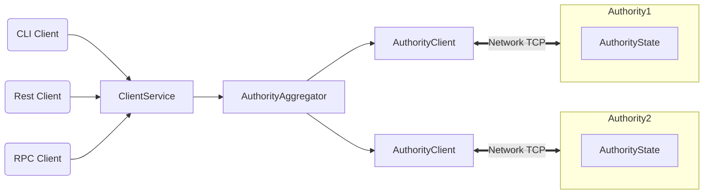

This document has two main goals: It first provides a high-level overview of Sui, presenting its main functionalities and design choices. It then compares Sui with existing blockchains allowing potential adopters to decide whether Sui fits their use cases.

This document is written for engineers, developers, and technical readers knowledgeable about the crypto space. It does not assume deep programming language or distributed systems expertise. See the [Sui white paper](https://github.com/MystenLabs/sui/blob/main/doc/paper/sui.pdf) for a much deeper explanation of how Sui works. See [How Sui Differs from Other Blockchains](sui-compared.md) for a high-level overview of the differences in approach between Sui and other blockchain systems.

## tl;dr

The Sui blockchain operates at a speed and scale previously thought unimaginable. Sui assumes the typical blockchain transaction is a simple transfer and optimizes for that use. Sui does this by making each request idempotent, holding network connections open longer, and ensuring transactions complete immediately. Sui optimizes for single-writer objects, allowing a design that forgoes consensus for simple/common transactions.

Instead of the traditional blockchain’s fire-and-forget broadcast, Sui ensures a two-way handshake between the requestor and approving authorities, with simple transactions having near instant finality. With this low latency, transactions can easily be incorporated into games and other settings that need completion in real time. Furthermore, Sui supports smart contracts written in Move, a language designed for blockchains with strong inherent security and a more understandable programming model.

In a world where the cost of bandwidth is diminishing steadily, we are creating an ecosystem of services that will find it easy, fun, and perhaps profitable to ensure transaction voting on behalf of users.

## Architecture
Sui is a distributed ledger that stores a collection of programmable *[objects](../build/objects.md)*, each with a globally unique ID. Every object is owned by a single *address*, and each address can own an arbitrary number of objects.

The ledger is updated via a *[transaction](../build/transactions.md)* sent by a particular address. A transaction can create, destroy, and write objects, as well as transfer them to other addresses.

Structurally, a transaction contains a set of input object references and a pointer to a Move code object that already exists in the ledger. Executing a transaction produces updates to the input objects and (if applicable) a set of freshly created objects along with their owners. A transaction whose sender is address *A* can accept objects owned by *A*, shared objects, and objects owned by other objects in the first two groups as input.

Sui authorities agree on and execute transactions in parallel with high throughput using [Byzantine Consistent Broadcast](https://en.wikipedia.org/wiki/Byzantine_fault).

## System overview

This section is written for a technical audience wishing to gain more insight about how Sui achieves its main performance and security objectives.

Sui assumes the typical blockchain transaction is a user-to-user transfer or asset manipulation and optimizes for that scenario. As a result, Sui distinguishes between two types of assets (i) owned objects that can only be modified by its specific owner, and (ii) shared objects that have no specific owners and can be modified by more than one user. This distinction allows a design that forgoes consensus for common transactions involving only owned objects to achieve very low latency.

Sui mitigates a major hindrance to blockchain growth: [head-of-line blocking](https://en.wikipedia.org/wiki/Head-of-line_blocking). Blockchain nodes maintain an accumulator that represents the state of the entire blockchain, such as the latest certified transactions. Nodes participate in a consensus protocol to add an update to that state reflecting the transaction’s modification to blocks (add, remove, mutate). That consensus protocol leads to an agreement on the state of the blockchain before the increment, the validity and suitability of the state update itself, and the state of the blockchain after the increment. On a periodic basis, these increments are collected in the accumulator.

In Sui, this consensus protocol is required only when the transaction involves shared objects. When shared objects are involved, the Sui authorities play the role of more active validators in other blockchains to totally order the transaction with respect to other transactions accessing shared objects.

Because Sui focuses on managing specific objects rather than a single aggregation of state, it also reports on them in a unique way: (i) every object in Sui has a unique version number, and (ii) every new version is created from a transaction that may involve several dependencies, themselves versioned objects.

As a consequence, a Sui authority – or any other entity with a copy of the state – can exhibit a causal history of an object, showing its history since genesis. Sui explicitly makes the bet that in most cases, the ordering of that causal history with the causal history of another object is irrelevant; and in the few cases where this information is relevant, Sui makes this relationship explicit in the data.

Sui guarantees transaction processing obeys *[eventual consistency](https://en.wikipedia.org/wiki/Eventual_consistency)* in the [classical sense](https://hal.inria.fr/inria-00609399/document). This breaks down in two parts:

* Eventual delivery - if one honest authority processes a transaction, all other honest authorities will eventually do the same.
* Convergence - two authorities that have seen the same set of transactions share the same view of the system (reach the same state).

But contrary to a blockchain, Sui does not stop the flow of transactions in order to witness the convergence.

## Common transactions

[Many transactions](https://eprint.iacr.org/2019/611.pdf) do not have complex interdependencies with other, arbitrary parts of the blockchain state. Often financial users just want to send an asset to a recipient, and the only data required to gauge whether this simple transaction is admissible is a fresh view of the sender's account. This observation allows Sui to forgo [consensus](https://pmg.csail.mit.edu/papers/osdi99.pdf) and instead use simpler algorithms based on [Byzantine Consistent Broadcast](https://link.springer.com/book/10.1007/978-3-642-15260-3). These protocols are based on the [FastPay](https://arxiv.org/abs/2003.11506) design that comes with peer-reviewed security guarantees. In a nutshell, Sui takes the approach of taking a lock (or "stopping the world") only for the relevant piece of data rather than the whole chain. In this case, the only information needed is the sender account, which can then send only one transaction at a time.

Sui further expands this approach to more involved transactions that may explicitly depend on multiple elements under their sender's control, using Move’s object model and leveraging Move's strong ownership model. By requiring that dependencies be explicit, Sui applies a _multi-lane_ approach to transaction validation, making sure those independent transaction flows can progress without impediment from the others.

Sui validates transactions individually, rather than batching them into traditional blocks. The key advantage of this approach is low latency; each successful transaction quickly obtains a certificate of finality that proves to anyone the transaction will be processed by the Sui network.

The process of submitting a Sui transaction is thus a bit more involved than in traditional blockchains. Whereas a usual blockchain can accept a bunch of transactions from the same author in a fire-and-forget mode, Sui transaction submission follows these steps:

1. The sender broadcasts a transaction to all Sui authorities.
2. Each Sui authority replies with an individual vote for this transaction. Each vote has a certain weight based on the stake owned by the authority.
3. The sender collects a Byzantine-resistant-majority of these votes into a _certificate_ and broadcasts that back to all Sui authorities. This settles the transaction, ensuring _finality_ that the transaction will not be dropped (revoked).
4. Optionally, the sender collects a certificate detailing the effects of the transaction.

While those steps demand more of the sender, performing them efficiently can still yield a cryptographic proof of finality with minimum latency. Aside from crafting the original transaction itself, the session management for a transaction does not require access to any private keys and can be delegated to a third party. Sui takes advantage of this observation to provide [Sui Gateway services](#sui-gateway-services).

## Support for complex contracts

Complex smart contracts may benefit from shared objects where more than one user can mutate those objects (following smart contract specific rules). In this case, Sui totally orders all transactions involving shared objects using a consensus protocol. Sui uses a novel peer-reviewed consensus protocol based on [Narwhal](https://arxiv.org/abs/2105.11827). This is state-of-the-art in terms of both performance and robustness.

Transactions involving shared objects also contain at least one owned object to pay for gas fees. It is thus essential to carefully compose the protocol dealing with owned objects with the protocol sequencing the transaction to guarantee Sui’s security properties. When shared objects are involved, transaction submission follows these steps:

1. The sender broadcasts a transaction to all Sui authorities.
2. Each Sui authority replies with an individual vote for this transaction. Each vote has a certain weight based on the stake owned by the authority.
3. The sender collects a Byzantine-resistant-majority of these votes into a certificate and broadcasts it back to all Sui authorities. _This time however, the certificate is sequenced through Byzantine Agreement._
4. Once the transaction has been successfully sequenced, the user broadcasts again the certificate to the authorities to settle the transaction.

## Scalability

As mentioned, Sui does not impose a total order on the transactions containing only owned objects. Instead, transactions are [causally ordered](sui-compared.md#causal-order-vs-total-order). If a transaction `T1` produces an output object `O1` used as input objects in a transaction `T2`, an authority must execute `T1` before it executes `T2`. Note that `T2` does not need to use these objects directly for a causal relationship to exist, e.g., `T1` might produce output objects which are then used by `T3`, and `T2` might use `T3`'s output objects. However, transactions with no causal relationship can be processed by Sui authorities in any order. This insight allows Sui to massively parallelize execution, and shard it across multiple machines.

Sui employs the [state-of-the-art Narwhal consensus protocol](https://arxiv.org/abs/2105.11827) to totally order transactions involving shared objects. The consensus sub-system also scales in the sense that it can sequence more transactions by adding more machines per authority.

## Sui Gateway services

The Sui model encourages third parties to assist with transaction submissions. For example, if an app developer (e.g., a game developer) has many users, they can manage votes aggregation and certificate submission on behalf of their users. The app developer may use their own servers (e.g., where they store the state of the game) to run a _Sui Gateway service_. We provide a reference implementation of such a service.

Instead of the app users attempting to send transactions to multiple authorities from their mobile device, which may degrade user experience, users may submit their transactions to the app, which forwards it to the Sui Gateway service run by the app developer. The Sui Gateway service conducts the entire transaction session and returns the results to the users. Security is assured since the app doesn’t need to know the users’ private keys; the app owner merely provides the bandwidth.

More specifically, this service plays the role of an accumulator and makes sure the transaction is received by a quorum of authorities, collects a quorum of votes, submits the certificate to the authorities, and replies to the client. The Sui Gateway is trusted for availability only and not safety.

In a world where the cost of bandwidth is diminishing steadily, Sui fosters an ecosystem of services that will find it easy, fun, and perhaps profitable to ensure transaction voting and certificates broadcast on behalf of end-users.

## Smart contract programming

Sui smart contracts are written in the [Move language](https://github.com/MystenLabs/awesome-move/blob/main/README.md). Move is safe and expressive, and its type system and data model naturally support the parallel agreement/execution strategies that make Sui scalable. Move is an open source programming language for building smart contracts originally developed at [Meta](http://meta.com) for the [Diem blockchain](https://www.diem.com). The language is platform-agnostic, and in addition to being adopted by Sui, it has been gaining popularity on other platforms (e.g., [0L](https://0l.network), [StarCoin](https://starcoin.org/en/)).

Find a more thorough explanation of Move’s features in:

* the [Move Programming Language book](https://github.com/diem/move/blob/main/language/documentation/book/src/introduction.md)
* Sui-specific [Move instructions](../build/move.md) and [differences](sui-move-diffs.md) on this site
* the [Sui whitepaper](https://github.com/MystenLabs/sui/blob/main/doc/paper/sui.pdf) and its formal description of Move in the context of Sui
