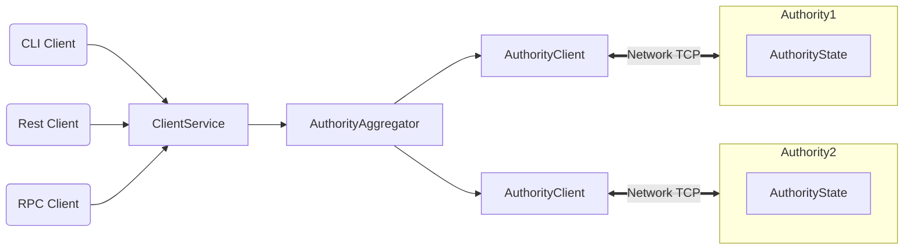

Sui is a distributed ledger that stores a collection of programmable *[objects](https://github.com/MystenLabs/sui/tree/main/doc/src/objects.md)*, each with a globally unique ID. Every object is owned by a single *address*, and each address can own an arbitrary number of objects.

The ledger is updated via a *[transaction](https://github.com/MystenLabs/sui/tree/main/doc/src/transactions.md)* sent by a particular address. A transaction can create, destroy, and write objects, as well as transfer them to other addresses.

Structurally, a transaction contains a set of input object references and a pointer to a Move code object that already exists in the ledger. Executing a transaction produces updates to the input objects and (if applicable) a set of freshly created objects along with their owners. A transaction whose sender is address *A* can accept objects owned by *A*, shared objects, and objects owned by other objects in the first two groups as input.

Sui authorities agree on and execute transactions in parallel with high throughput using [Byzantine Consistent Broadcast](https://en.wikipedia.org/wiki/Byzantine_fault).
