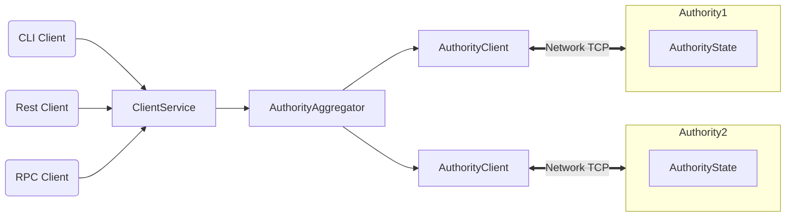

This document is written for engineers, developers, and technical readers knowledgeable about the blockchain. It does not assume deep programming language or distributed systems expertise. See the [Sui white paper](https://github.com/MystenLabs/sui/blob/main/doc/paper/sui.pdf) for a much deeper explanation of how Sui works. See [How Sui Differs from Other Blockchains](sui-compared.md) for a high-level overview of the differences between Sui and other blockchain systems.

## Overview

The Sui blockchain operates at a speed and scale previously thought unattainable. Sui assumes most blockchain transactions touch non-overlapping states, meaning that transactions can run in parallel. Sui optimizes for single-writer objects, allowing a design that forgoes consensus for simple transactions.

Instead of the traditional blockchain’s fire-and-forget broadcast, Sui's design enables a requestor or a proxy to proactively talk to validators to bring a transaction to finality. This results in near instant finality for simple transactions.

With this low latency, Sui makes it easy to incorporate transactions into games and other settings that need completion in real time. Sui also supports smart contracts written in Move, a language designed for blockchains with strong inherent security and a more understandable programming model.

In a world where the cost of bandwidth is diminishing steadily, we are creating an ecosystem of services that will find it easy, fun, and perhaps profitable to ensure transaction voting on behalf of users.

## Components

Become familiar with these key Sui concepts:

* [Objects](../learn/objects.md) - Sui has programmable objects created and managed by Move packages (a.k.a. smart contracts). Move packages themselves are also objects. Thus, Sui objects can be partitioned into two categories: mutable data values and immutable packages.
* [Transactions](../learn/transactions.md) - All updates to the Sui ledger happen via a transaction. This section describes the transaction types supported by Sui and explains how their execution changes the ledger.
* [Validators](../learn/architecture/validators.md) - The Sui network is operated by a set of independent validators, each running its own instance of the Sui software on a separate machine (or a sharded cluster of machines operated by the same entity).

## Architecture

Sui is a distributed ledger that stores a collection of programmable [objects](../learn/objects.md), each with a globally unique ID. Every object is owned by a single *address*, and each address can own an arbitrary number of objects.

The ledger is updated via a [transaction](../learn/transactions.md) sent by a particular address. A transaction can create, destroy, and write objects, as well as transfer them to other addresses.

Structurally, a transaction contains a set of input object references and a pointer to a Move code object that already exists in the ledger. Executing a transaction produces updates to the input objects and (if applicable) a set of freshly created objects along with their owners. A transaction whose sender is address *A* can accept objects owned by *A*, shared objects, and objects owned by other objects in the first two groups as input.

Sui validators agree on and execute transactions in parallel with high throughput using [Byzantine Consistent Broadcast](https://en.wikipedia.org/wiki/Byzantine_fault).

## System overview

This section is written for a technical audience wishing to gain more insight about how Sui achieves its main performance and security objectives.

Sui assumes the typical blockchain transaction is a user-to-user transfer or asset manipulation and optimizes for that scenario. As a result, Sui distinguishes between two types of assets (i) owned objects that can be modified only by their specific owner, and (ii) shared objects that have no specific owners and can be modified by more than one user. This distinction allows for a design that achieves very low latency by forgoing [consensus](architecture/consensus.md) for simple transactions involving only owned objects.

Sui mitigates a major hindrance to blockchain growth: [head-of-line blocking](https://en.wikipedia.org/wiki/Head-of-line_blocking). Blockchain nodes maintain an accumulator that represents the state of the entire blockchain, such as the latest certified transactions. Nodes participate in a consensus protocol to add an update to that state reflecting the transaction’s modification to blocks (add, remove, mutate). That consensus protocol leads to an agreement on the state of the blockchain before the increment, the validity and suitability of the state update itself, and the state of the blockchain after the increment. On a periodic basis, these increments are collected in the accumulator.

In Sui, this [consensus](architecture/consensus.md)  protocol is required only when the transaction involves shared objects. For this, Sui offers the Narwhal DAG-based mempool and efficient Byzantine Fault Tolerant (BFT) consensus via Bullshark. When shared objects are involved, the Sui validators play the role of more active validators in other blockchains to totally order the transaction with respect to other transactions accessing shared objects.

Because Sui focuses on managing specific objects rather than a single aggregation of state, it also reports on them in a unique way: (i) every object in Sui has a unique version number, and (ii) every new version is created from a transaction that may involve several dependencies, themselves versioned objects.

As a consequence, a Sui validator – or any other entity with a copy of the state – can exhibit a causal history of an object, showing its history since genesis. Sui explicitly makes the bet that in many cases, the ordering of that causal history with the causal history of another object is irrelevant; and in the few cases where this information is relevant, Sui makes this relationship explicit in the data.

Sui guarantees transaction processing obeys [eventual consistency](https://en.wikipedia.org/wiki/Eventual_consistency) in the [classical sense](https://hal.inria.fr/inria-00609399/document). This breaks down in two parts:

* Eventual delivery - if one honest validator processes a transaction, all other honest validators will eventually do the same.
* Convergence - two validators that have seen the same set of transactions share the same view of the system (reach the same state).

But contrary to a blockchain, Sui does not stop the flow of transactions in order to witness the convergence.

## Transactions on single-owner objects

[Many transactions](https://eprint.iacr.org/2019/611.pdf) such as coin or object transfers, NFT minting, and smart contract publishing can be expressed as operations on _single-owner_ objects that can be used in transactions by only one address at a time. Sui automatically recognizes such transactions and leverages this observation to forgo [consensus](https://pmg.csail.mit.edu/papers/osdi99.pdf). Instead, Sui uses simpler algorithms based on [Byzantine Consistent Broadcast](https://link.springer.com/book/10.1007/978-3-642-15260-3). See our list of potential [single-writer apps](single-writer-apps.md) for examples of real-world simple transactions.

These protocols are based on the [FastPay](https://arxiv.org/abs/2003.11506) design that comes with peer-reviewed security guarantees. In a nutshell, Sui takes the approach of taking a lock (or "stopping the world") only for the relevant piece of data rather than the whole chain, enabling massively parallel transaction submission and execution.

Sui further expands this approach to more involved transactions that may explicitly depend on multiple elements under their sender's control, using Move’s object model and leveraging Move's strong ownership model. By requiring that dependencies be explicit, Sui applies a _multi-lane_ approach to transaction validation, making sure those independent transaction flows can progress without interference or synchronization.

Sui validates transactions individually, rather than batching them into traditional blocks. The key advantage of this approach is low latency; each successful transaction quickly obtains a certificate of finality that proves to anyone the transaction will be processed by the Sui network.

Submitting a Sui transaction involves the following steps. These are transparent to the transaction sender, but it's worth understanding what is happening behind the scenes:

1. The user sends the transaction to a *quorum driver* (e.g., a full node) that broadcasts the transaction to a set of validators.
1. Each Sui validator performs validity checks and (if successful) a signature on the transaction. Each signature has a weight proportional to the amount staked with the validator. The combined weight of all validators is always 10,000, and thus the quorum threshold is always 6,667.
1. The quroum driver collects signatures with a combined weight greater than or equal to 6,667 into a _certificate_ and broadcasts it to all Sui validators.
1. Upon receiving a cerficate, the validator (afer checking its validity) executes the embedded transaction and returns signed _transaction effects_ to the quorum driver. A transaction is _final_ when a quorum of validators have received and executed its corresponding certificate.
1. Optionally, the quorum driver can collect an _effects certificate_ based on the previous step and return it to the sender.

While this may sound like a lot of steps, this process allows each validator to peform the operations above in parallel without coordination--observe that no step above requires validators to communicate with each other! This massively reduces latency compared to a conventional blockchain that requires O(n^2) communication among validators before finality can be achieved.

Finally, we note that the role of quorum driver does not require access to any private keys and can safely be delegated to a third party (e.g., a full node, an RPC provider, a custodial wallet).

## Transactions on shared objects

Many use-cases require *shared* objects that can be touched by two or more addresses at once--e.g., an auction with open bidding or a central limit order book accepting arbitrary trades. In such cases, Sui must sequence transactions touching the same shared object(s) using a [consensus](architecture/consensus.md) protocol. Sui uses [Narwhal](https://arxiv.org/abs/2105.11827) for high-throughput, horizontally scalable transaction dissemination and [Bullshark](https://arxiv.org/abs/2209.05633) for zero message overhead consensus.

For transactions involving one or more shared objects, the process is as described above up to step (4), where instead:
1. Upon receiving a cerficate, the validator (afer checking its validity) uses Narwhal to submit the certificate to Bullshark for sequencing.
1. Once the transaction has been sequenced, it is executed to produce effects using same flow as (5) above.

## Scalability

As mentioned, Sui does not impose a total order on the transactions containing only owned objects. Instead, transactions are [causally ordered](sui-compared.md#causal-order-vs-total-order). If a transaction `T1` produces an output object `O1` used as input objects in a transaction `T2`, a validator must execute `T1` before it executes `T2`. Note that `T2` does not need to use these objects directly for a causal relationship to exist, e.g., `T1` might produce output objects which are then used by `T3`, and `T2` might use `T3`'s output objects. However, transactions with no causal relationship can be processed by Sui validators in any order. This insight allows Sui to massively parallelize execution, and shard it across multiple machines.

Sui employs the [state-of-the-art Narwhal consensus protocol](https://arxiv.org/abs/2105.11827) to totally order transactions involving shared objects. The consensus sub-system also scales in the sense that it can sequence more transactions by adding more machines per validator.

## Smart contract programming

Sui smart contracts are written in the [Move language](https://github.com/MystenLabs/awesome-move/blob/main/README.md). Move is safe and expressive, and its type system and data model naturally support the parallel agreement/execution strategies that make Sui scalable. Move is an open source programming language for building smart contracts originally developed at [Meta](http://meta.com) for the [Diem blockchain](https://www.diem.com). The language is platform-agnostic, and in addition to being adopted by Sui, it has been gaining popularity on other platforms (e.g., [0L](https://0l.network), [StarCoin](https://starcoin.org/en/)).

Find a more thorough explanation of Move’s features in:

* the [Move Programming Language book](https://github.com/move-language/move/blob/main/language/documentation/book/src/introduction.md)
* Sui-specific [Move instructions](../build/move/index.md) and [differences](sui-move-diffs.md) on this site
* the [Sui whitepaper](https://github.com/MystenLabs/sui/blob/main/doc/paper/sui.pdf) and its formal description of Move in the context of Sui
