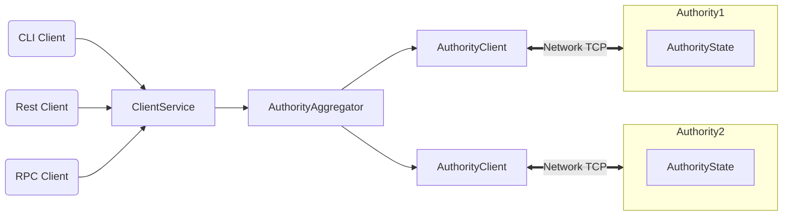

This page summarizes how Sui operates and is intended for potential adopters of Sui so they may decide whether it fits your use cases. See How Sui Differs for a high-level overview of the differences in approach between Sui and other blockchain systems.

## tl;dr

The Sui blockchain operates at a speed and scale previously thought unimaginable. Sui assumes the typical blockchain transaction is a simple transfer and optimizes for that use. Sui, which supports smart contracts written in Move, does this by making each request idempotent, holding network connections open longer, and ensuring transactions complete immediately.

Instead of the traditional blockchain’s fire-and-forget broadcast, Sui ensures a two-way handshake between the requestor and approving authorities, with simple transactions having near instant finality. With this speed, transactions can easily be incorporated into games and other settings that need completion in real time.

In a world where the cost of bandwidth is diminishing steadily, we are creating an ecosystem of services that will find it easy, fun, and perhaps profitable to ensure transaction voting on behalf of users. We provide a reference implementation of such a service, called the Sui Gateway service. This service makes sure the transaction is received by a quorum of authorities, collects a quorum of votes, submits the certificate to the authorities, and replies to the client.

## Architecture

Sui is a distributed ledger that stores a collection of programmable *[objects](../build/objects.md)*, each with a globally unique ID. Every object is owned by a single *address*, and each address can own an arbitrary number of objects.

The ledger is updated via a *[transaction](../build/transactions.md)* sent by a particular address. A transaction can create, destroy, and write objects, as well as transfer them to other addresses.

Structurally, a transaction contains a set of input object references and a pointer to a Move code object that already exists in the ledger. Executing a transaction produces updates to the input objects and (if applicable) a set of freshly created objects along with their owners. A transaction whose sender is address *A* can accept objects owned by *A*, shared objects, and objects owned by other objects in the first two groups as input.

Sui authorities agree on and execute transactions in parallel with high throughput using [Byzantine Consistent Broadcast](https://en.wikipedia.org/wiki/Byzantine_fault).

## Overview

Sui, which is written in Rust, supports smart contracts running on Sui written in Move .Sui addresses the primary hindrance to blockchain growth: [head-of-line blocking](https://en.wikipedia.org/wiki/Head-of-line_blocking). The blockchain world manages an *accumulator* that represents the state of the entire blockchain, such as validator votes on transactions. Validators participate in a consensus process to add an increment to that state reflecting the transaction’s modification to blocks (add, remove, mutate).

That consensus protocol leads to an agreement on the prior state of the blockchain before the increment, the validity and suitability of the increment itself, and the state of the blockchain after the increment. On a periodic basis, these increments are collected in the accumulator.

In Sui, this consensus process is required only when shared objects are involved. When transactions affect objects owned only by the sender, they proceed with validation of the sender’s account. This single-writer scenario is expected to be the most common transaction type. When shared objects are involved, Sui invokes *authorities* that play the role of more active validators in other blockchains to reach consensus.

Sui votes result in *[eventual consistency](https://en.wikipedia.org/wiki/Eventual_consistency)* in the classical sense. Eventual consistency is achieved when two authorities who have seen the exact same set of transactions reach the same state.

Eventual availability is achieved through eventual consistency. If one honest authority certifies the transaction, all of the other honest authorities will, as well. One of the components that is missing from eventual consistency is the witnessing of the convergence.

This means we do not insist by default on two authorities having the same state. This would be possible only by halting input transactions, which is infeasible. So transactions arrive in no particular order, and views into those transactions are limited. And authorities do not normally communicate in the world of causal order. As a result, getting a fresh view of the total world state is difficult in an efficient manner.

Sui’s high throughput and low latency is unrivaled. Other blockchains that operate from a [proof of work](https://en.wikipedia.org/wiki/Proof_of_work), for instance, may take an hour or more to reach consensus across the required six blocks due to a lack of deterministic finality and (strong) synchrony assumptions.

And the Sui model encourages third parties to assist with transaction submissions. For example, if you run an app (say, game) on the blockchain and have many users, you can manage transaction submission on behalf of those users. You as the app owner may use the servers where you store the state of the game to run the Sui Gateway service.

Instead of the app users attempting to send transactions to multiple authorities from their mobile device, which scales poorly, you may have the users submit the transaction to the app, which forwards it to the Sui Gateway service. The Sui Gateway service conducts the entire transaction session and returns the results to the users. Security is assured since the app doesn’t need to know the users’ private keys; the app owner merely provides the bandwidth. The gateway is trusted for availability only.

## Blockchains

Blockchains validators collectively build a shared accumulator: a representation of the state of the blockchain, a chain to which they add increments over time, called blocks. In blockchains that offer finality, every time validators want to make an incremental addition to the blockchain, i.e. a block proposal, they enter into a consensus protocol. This protocol lets them form an agreement over the current state of the chain, whether the proposed increment is suitable and valid, and what the state of the chain will be after the new addition. 

This method of maintaining common state over time has known practical success over the last 14 years or so, using a wealth of theory from the last 50 years of research in the field of Byzantine Fault Tolerant distributed systems. 

Yet it is inherently sequential: increments to the chain are added one at a time, like pearls on a string. In practice, this approach pauses the influx of transactions (often stored in a "mempool"), while the current block is under consideration.

## Sui's approach to validating new transactions

A lot of transactions do not have complex interdependencies with other, arbitrary parts of the state of the blockchain. Often financial users just want to send an asset to a recipient, and the only data required to gauge whether this simple transaction is admissible is a fresh view of the sender's account. Hence Sui takes the approach of only "stopping the world" for the relevant piece of data rather than the whole chain -- in this case, the account of the sender, which can only send one transaction at a time.

Sui further expands this approach to more involved transactions that may explicitly depend on multiple elements under their sender's control, using an object model and leveraging Move's strong ownership model. By requiring that dependencies be explicit, Sui applies a "multi-lane" approach to transaction validation, making sure those independent transaction flows can progress without impediment from the others.

This doesn't mean that Sui is a platform never orders transactions with respect to each other, or that it we allows owners to only affect their owned microcosm of objects. Sui will also process transactions that have an effect on some shared state, in a rigorous, consensus-ordered manner. They're just not the default use case.

## A collaborative approach to transaction submission

Sui validates transactions individually, rather than batching them in the traditional blocks. The advantage of this approach is that each successful transaction obtains a certificate of finality that proves to anyone that the transaction will be processed by the Sui network.

But the process of submitting a transaction is a bit more involved. That little more work occurs on the network. (With bandwidth getting cheaper, this is less of a concern.) Whereas a usual blockchain can accept a bunch of transactions from the same author in a fire-and-forget mode, Sui transaction submission follows these steps:

1. Sender broadcasts a transaction to all Sui authorities.
1. Sui authorities send individual votes on this transaction to the sender.
1. Each vote has a certain weight since each authority has weight based upon the rules of [Proof of Stake](https://en.wikipedia.org/wiki/Proof_of_work).
1. Sender collects a Byzantine-resistant-majority of these votes into a *certificate* and broadcasts it to all Sui authorities, thereby ensuring *finality*, or assurance the transaction will not be revoked.
1. Optionally, the sender collects a certificate detailing the effects of the transaction.

While those steps demand more of the sender, performing them efficiently can still yield a cryptographic proof of finality almost instantly. Aside from crafting the original transaction itself, the session management for a transaction does not require access to any private keys and can be delegated to a third party.

## A different approach to state

Because Sui focuses on managing specific objects rather than a single aggregate of state, it also reports on them in a unique way:

- Every object in Sui has a unique version.
- Every new version is created from a transaction that may involve several dependencies, themselves versioned objects. 

As a consequence, a Sui authority -- or any other authority with a copy of the state -- can exhibit a causal history of an object, showing its history since genesis. Sui explicitly makes the bet that in most cases, the ordering of that causal history with the causal history of another object is irrelevant; and in the few cases where this information is relevant, Sui makes this relationship explicit in the data. 
