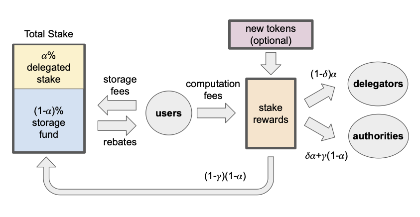

Sui’s tokenomics are designed at the frontier of economic blockchain research, aiming to deliver an economic ecosystem and financial plumbing at par with Sui’s leading engineering design.  For further details, refer to the Sui Tokenomics white paper: [The Sui Smart Contracts Platform: Economics and Incentives](https://github.com/MystenLabs/sui/blob/main/doc/paper/tokenomics.pdf).

This page includes a high-level overview of Sui’s economic model.

## The Sui economy

The Sui economy is characterized by three main sets of participants:

* **Users** submit transactions to the Sui platform in order to create, mutate, and transfer digital assets or interact with more sophisticated applications enabled by smart contracts, interoperability, and composability.
* **SUI token holders** have the option of staking their tokens to validators and participating in the proof-of-stake mechanism. SUI owners also hold the rights to participate in Sui’s governance.
* **Validators** manage transaction processing and execution on the Sui platform.

The Sui economy has five core components:

* The [SUI token](../tokenomics/sui-token.md) is the Sui platform’s native asset. 
* [Gas fees](../tokenomics/gas-pricing.md) are charged on all network operations and used to reward participants of the proof-of-stake mechanism and prevent spam and denial-of-service attacks.
* [Sui’s storage fund](../tokenomics/storage-fund.md) is used to shift stake rewards across time and compensate future validators for storage costs of previously stored on-chain data.
* The [proof-of-stake mechanism](../tokenomics/proof-of-stake.md) is used to select, incentivize, and reward honest behavior by Sui Validators and the SUI owners that stake with them.
* On-chain voting is used for governance and protocol upgrades.

Throughout, use the visual representation in the following figure to aid the discussion. 

*Visualize staking and tokenomics in Sui*
