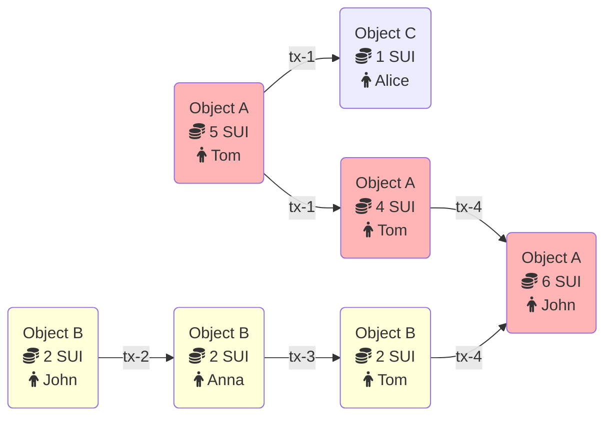

All updates to the Sui ledger happen via a transaction. This topic describes the transaction types supported by Sui and explains how their execution changes the ledger.

## Transaction metadata

All Sui transactions have the following common metadata:
 * Sender address: The address of the user sending this transaction.
 * Gas input: An object reference pointing to the object that will be used to pay for this transaction's execution and storage. This object must be owned by the user and must be of type `sui::coin::Coin<SUI>` (i.e., the Sui native currency).
 * Gas price: An unsigned integer specifying the number of native tokens per gas unit this transaction will pay. The gas price must always be nonzero.
 * Maximum gas budget: The maximum number of gas units that can be expended by executing this transaction. If this budget is exceeded, transaction execution will abort and have no effects other than debiting the gas input. The gas input object must have a value higher than the gas price multiplied by the max gas, and this product is the maximum amount that the gas input object will be debited for the transaction.
 * Epoch: The Sui epoch this transaction is intended for.
 * Type: A call, publish, or native transaction and its type-specific-data (see below).
 * Authenticator: A cryptographic signature on the [Binary Canonical Serialization (BCS)](https://docs.rs/bcs/latest/bcs/)-encoded bytes of the data above, and a public key that both verifies against the signature and is cryptographically committed to by the sender address.
 * Expiration: An epoch reference that sets a deadline after which validators will no longer consider the transaction valid. The optional expiration epoch reference enables users to define transactions that either execute and commit by a set time (current epoch less than or equal to expiration epoch), or never execute after the deadline passes. By default, there is no deadline for when a transaction must execute. 

## Move call transaction

This transaction type is a *smart contract call* that invokes a function in a published Move package with objects owned by the sender and pure values (e.g., integers) as inputs. Executing a function may read, write, mutate, and transfer these input objects, as well as other objects created during execution.

In addition to the common metadata above, a call transaction includes the following fields:
 * Package: An object reference pointing to a previously published Move package object.
 * Module: A UTF-8 string specifying the name of a Move module in the package.
 * Function: A UTF-8 string specifying the name of a function inside the module. The function must be a valid entry point.
 * Type Inputs: A list of Move types that will be bound to the type parameters of the function.
 * Object Inputs: A list of unique object references pointing to objects that will be passed to this function. Each object must either be owned by the sender, immutable or shared. *The gas input object from above cannot also appear as an object input.*
 * Pure Inputs: A list of BCS-encoded values that will be bound to the parameters of the function. Pure inputs must be primitive types (i.e. addresses, object IDs, strings, bytes, integers, or booleans)--they cannot be objects.

## Move publish transaction

This transaction type publishes a new Sui Move package as an immutable object. Once the package has been published, its public functions and types can be used by future packages, and its entry point functions can be called by future transactions.

In addition to the common metadata above, a publish transaction includes Package Bytes: A list of Sui Move bytecode modules topologically sorted by their dependency relationship (i.e., leaves in the dependency graph must appear earlier in the list). These modules will be deserialized, verified, and linked against their dependencies. In addition, each module's initializer function will be invoked in the order specified by the list.

## Native transaction

Native transactions are optimized versions of common Sui operations. Each native transaction is semantically equivalent to a specific Move call but has a lower gas cost.

### Transfer object

This transaction type transfers objects from the sender to the specified recipients.

In addition to the common metadata above, a transfer object transaction includes the following fields:
 * Input: An object reference pointing to a mutable object owned by the sender. The object must be of type that allows for public transfers--that is, any type with the `store` ability. The gas input object from above cannot also appear as the object input.
 * Recipient: The address that will receive the object from this transfer.

### Transfer SUI

This transaction type is similar to the Transfer Object transaction type, but the input object type must be a SUI coin--that is, an object of type `sui::coin::Coin<sui::sui::SUI>`. The benefit of this transaction type is that a separate coin object is not needed for gas. The gas payment is taken from the SUI coin being transferred.
Optionally, an amount can be specified for partial transfers.

In addition to the common metadata above, a transfer SUI transaction includes the following fields:
 * Input: An object reference pointing to a `sui::coin::Coin<sui::sui::SUI>` object owned by the sender.
 * (Optional) Amount: An unsigned integer encoding the amount that the recipient will receive. The amount will be debited from the input object, wrapped in a freshly created coin object, and sent to the corresponding recipient address. The value of the input object must be greater than or equal to the amount specified.
 * Recipient: The address that will receive the coin from this transfer.

### Join

This transaction type combines several coin objects into one. It includes the following field:

Inputs: A list of unique object references pointing to mutable objects owned by the sender. The objects must all have the same type: `sui::coin::Coin<T>` with arbitrary `T`--that is, any fungible token. The list must contain at least two objects. All objects except the first one will be destroyed, and the new value of the first object will be its old value plus the sum of the value of all destroyed objects. The gas input object from above cannot also appear as an object input.

## Transactions flow - example

Here's an example showing how objects and transactions are connected to each other in Sui.

In the following example there are two objects:
 * Object A with 5 SUI coins that belongs to Tom
 * Object B with 2 SUI coins that belongs to John

Tom decides to send 1 SUI coin to Alice. In this case, Object A is the input to this transaction and 1 SUI coin is debited from this object. The output of the transaction is two objects: 
 * Object A with 4 SUI coins that still belongs to Tom
 * new created Object C with 1 SUI coin that belongs now to Alice

At the same time, John decides to send 2 SUI coins to Anna. Because [the relationship between objects and transactions is written in a directed acyclic graph (DAG)](objects.md#the-transaction-object-dag-relating-objects-and-transactions), and both transactions interact with different objects, this transaction executes in parallel with the transaction that sends coins from Tom to Alice. This transaction changes only the owner of Object B from John to Anna.

After receiving 2 SUI coins, Anna sent them immediately to Tom. Now Tom has 6 SUI coins (4 from Object A and 2 from Object B).

Finally, Tom sends all of his SUI coins to John. For this transaction, the input is actually two objects (Object A and Object B). Object B is destroyed, and its value is added to Object A. As a result, the transaction's output is only Object A with a value of 6 SUI.

## Limits on transactions, objects, and data

Sui has some limits on transactions and data used in transactions, such as a maximum size and number of objects used. To view the full list of limits in source code, see [Transaction input limits](https://github.com/MystenLabs/sui/blob/main/crates/sui-protocol-config/src/lib.rs#L154).

## Further reading

 * See the [Move tutorial](move/index.md) to develop Sui smart contracts.
 * Transactions take objects as input and produce objects as output--learn about the [objects](objects.md), their structure and attributes.
 * Transactions are executed by Sui [validators](../learn/architecture/validators.md).
