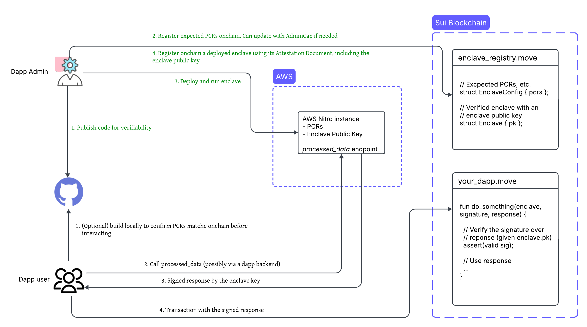

## dApp developer actions

1. Create a Nautilus off-chain server with a reproducible build using the [provided template](https://github.com/MystenLabs/nautilus).
1. Publish the server code to a public repository like GitHub to ensure transparency and verifiability.
1. Register the platform configuration registers (PCRs) of the instance. PCRs are measurements of the trusted computing base. Use a Sui smart contract to register them.
1. Deploy the server to an AWS Nitro Enclave.
1. Register the deployed enclave using a Sui smart contract and attestation document. Include the ephemeral public key of the enclave for signing responses.

To reduce the trusted computing base, route access to the enclave through backend services that handle load balancing, rate limiting, and other related aspects.

:::tip

Verify attestation documents on-chain only during enclave registration due to high gas costs. After registration, use the enclave key for more efficient message verification.

:::

## dApp user and client actions

1. (Optional) Verify the Nautilus off-chain server code by building it locally and confirming that the generated PCRs match the on-chain records.
1. Send a request to the deployed enclave and receive a signed response.
1. Submit the signed response on-chain for verification before executing the corresponding application logic.

## Trust model

The attestation document from an AWS Nitro Enclave includes a certificate chain that you can verify on-chain using AWS as the root certificate authority. This verification confirms the following:

- The enclave instance is running unmodified software, as validated by its PCR values.
- Users can independently verify that the computation of the instance aligns with the published source code, ensuring transparency and trust.

Reproducible builds allow builders and users to optionally verify that the binary running inside an enclave instance matches a specific version of the source code. This approach provides the following benefits:

- Anyone can build and compare the binary to confirm consistency with the published source code.
- Any changes to the software result in different PCR values, making unauthorized modifications detectable.
- Reproducible builds shift the trust from runtime to build time, strengthening the overall security posture of the dApp.

:::info

Reproducible builds might not apply to all use cases, such as when the source code is not public.

:::

### TEE security considerations

Nautilus uses cloud-based enclaves designed to protect against software-level attacks. The focus on cloud-hosted TEEs, like AWS Nitro Enclaves, is intentional for the following reasons:

- **Cloud providers respond quickly to vulnerabilities.** They receive early signals about security issues and can patch them efficiently.
- **They maintain strong physical security.** Access to cloud data centers is tightly controlled, reducing the risk of physical hardware attacks.
- **They operate under strict compliance standards.** Providers like AWS and GCP are regularly audited against frameworks like SOC 2, ISO 27001, CSA STAR, and others, ensuring operational integrity.

You are encouraged to evaluate whether this trust model aligns with the threat profile and security needs of your application.