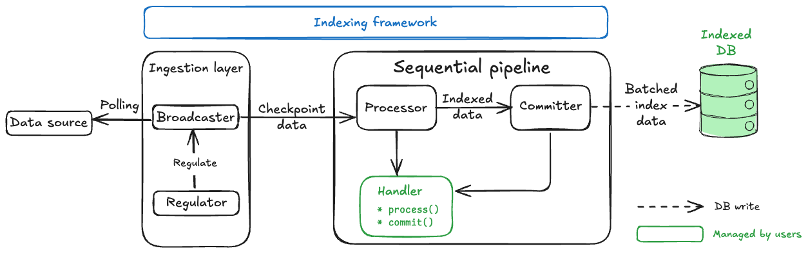
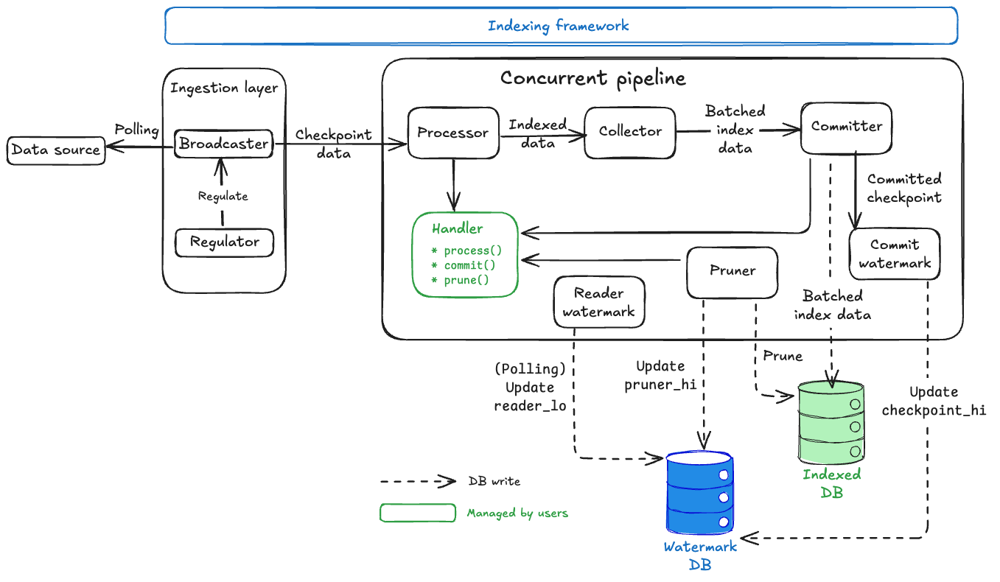
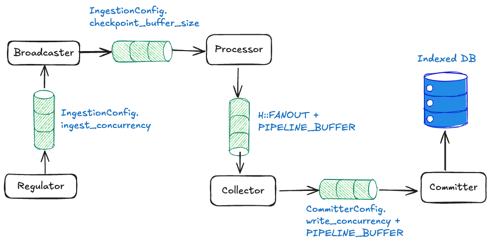

The `sui-indexer-alt-framework` provides two distinct pipeline architectures. Understanding their differences is crucial for choosing the right approach.

## Sequential versus concurrent pipelines

[Sequential pipelines](#sequential-pipeline-architecture) commit complete checkpoints in order. Each checkpoint is fully committed before the next one, ensuring simple, consistent reads.

[Concurrent pipelines](#concurrent-pipeline-architecture) commit out-of-order and can commit individual checkpoints partially. This allows you to process multiple checkpoints simultaneously for higher throughput, but requires reads to check which data is fully committed to ensure consistency.

## When to use each pipeline

Both pipeline types can handle updates in place, aggregations, and complex business logic. While sequential pipelines have throughput limitations compared to concurrent, the decision to use one over the other is primarily about engineering complexity rather than performance needs.

### Recommended: Sequential pipeline

Start here for most use cases. Provides more straightforward implementation and maintenance.

<ul className="list-none pl-2">
<li><span className="text-sui-success-dark">✓</span> You want straightforward implementation with direct commits and simple queries.</li>
<li><span className="text-sui-success-dark">✓</span> Team prefers predictable, easy-to-debug behavior.</li>
<li><span className="text-sui-success-dark">✓</span> Current performance meets your requirements.</li>
<li><span className="text-sui-success-dark">✓</span> Operational simplicity is valued.</li>
</ul>

### Concurrent pipeline

Consider implementing a concurrent pipeline when:

<ul className="list-none pl-2">
<li><span className="text-sui-success-dark">✓</span> Performance optimization is essential.</li>
<li><span className="text-sui-success-dark">✓</span> Sequential processing can't keep up with your data volume.</li>
<li><span className="text-sui-success-dark">✓</span> Your team is willing to handle the additional implementation complexity for the performance benefits.</li>
</ul>

Supporting out-of-order commits introduces a few additional complexities to your pipeline:

- Watermark-aware queries: All reads must check which data is fully committed. See [the watermark system](#watermark-system) section for details.
- Complex application logic: You must handle data commits in pieces rather than handling complete checkpoints.

## Decision framework

If you're unsure of which pipeline to choose for your project, start with a sequential pipeline as it's easier to implement and debug. Then, measure performance under a realistic load. If the sequential pipeline can't meet your project's requirements, then switch to a concurrent pipeline.

While not an exhaustive list, some specific scenarios where a sequential pipeline might not meet requirements include:

- Your pipeline produces data in each checkpoint that benefits from chunking and out-of-order commits. Individual checkpoints can produce lots of data or individual writes that might add latency.
- You're producing a lot of data that needs pruning. In this case, you must use a concurrent pipeline.

Beyond the decision of which pipeline to use, you also need to consider scaling. If you're indexing multiple kinds of data, then consider using multiple pipelines and watermarks.

{/*- If relational databases don't fit your use case, then consider [Bring Your Own Store (BYOS)](https://www.notion.so/Bring-Your-Own-Store-BYOS-2336d9dcb4e980db9a06c88248125910?pvs=21)*/}

## The watermark system {#watermark-system}

For each pipeline, the indexer minimally tracks the highest checkpoint where all data up to that point is committed. Tracking is done through the `checkpoint_hi_inclusive` committer watermark. Both concurrent and sequential pipelines rely on `checkpoint_hi_inclusive` to understand where to resume processing on restarts.

Optionally, the pipeline tracks `reader_lo` and `pruner_hi`, which define safe lower bounds for reading and pruning operations, if pruning is enabled. These watermarks are particularly crucial for concurrent pipelines to enable out-of-order processing while maintaining data integrity. 

### Safe pruning

The watermark system creates a robust data lifecycle management system:

1. **Guaranteed data availability:** Enforcing checkpoint data availability rules ensures readers perform safe queries.    
1. **Automatic cleanup process:** The pipeline frequently cleans unpruned checkpoints to ensure storage doesn't grow indefinitely while maintaining the retention guarantee. The pruning process runs with a safety delay to avoid race conditions.
1. **Balanced approach:** The system strikes a balance between safety and efficiency.
    - Storage efficiency: Old data gets automatically deleted.
    - Data availability: Always maintains retention amount of complete data.
    - Safety guarantees: Readers never encounter missing data gaps.
    - Performance: Out-of-order processing maximizes throughput.

This watermark system is what makes concurrent pipelines both high-performance and reliable, enabling massive throughput while maintaining strong data availability guarantees and automatic storage management.

### Scenario 1: Basic watermark (no pruning)

With pruning disabled, the indexer reports each pipeline's committer `checkpoint_hi_inclusive` only. Consider the following timeline, where a number of checkpoints are being processed and some are committed out of order.

```sh
Checkpoint Processing Timeline:

[1000] [1001] [1002] [1003] [1004] [1005]
  ✓      ✓      ✗      ✓      ✗      ✗
         ^
  checkpoint_hi_inclusive = 1001

✓ = Committed (all data written)
✗ = Not Committed (processing or failed)
```

In this scenario, the `checkpoint_hi_inclusive` is at 1001, even though checkpoint 1003 is committed, because there is still a gap at 1002. The indexer must report the high watermark at 1001 to satisfy the guarantee that all data from start to `checkpoint_hi_inclusive` is available.

After the checkpoint 1002 is committed, you can safely read data up to 1003.

```sh
[1000] [1001] [1002] [1003] [1004] [1005]
  ✓      ✓      ✓      ✓      ✗       ✗
[---- SAFE TO READ -------]
(start   →   checkpoint_hi_inclusive at 1003)
```

### Scenario 2: Pruning enabled

Pruning is enabled for pipelines configured with a retention policy. For example, if your table is growing too large and you want to keep only the last four checkpoints, then `retention = 4`. This means that the indexer periodically updates `reader_lo` as the difference between `checkpoint_hi_inclusive` and the configured retention. A separate pruning task is responsible for pruning data between `[pruner_hi, reader_lo]`.

```sh
[998] [999] [1000] [1001] [1002] [1003] [1004] [1005] [1006]
 🗑️    🗑️     ✓      ✓      ✓      ✓      ✗      ✗      ✗
              ^                    ^
       reader_lo = 1000       checkpoint_hi_inclusive = 1003

🗑️ = Pruned (deleted)
✓ = Committed  
✗ = Not Committed
```

Current watermarks:

- `checkpoint_hi_inclusive` = 1003:
       - All data from start to 1003 is complete (no gaps).
       - Cannot advance to 1005 because 1004 is not committed yet (gap).

- `reader_lo` = 1000:
       - Lowest checkpoint guaranteed to be available.
       - Calculated as: `reader_lo = checkpoint_hi_inclusive - retention + 1`.
       - `reader_lo` = 1003 - 4 + 1 = 1000.

- `pruner_hi` = 1000:
       - Highest exclusive checkpoint that has been deleted.
       - Checkpoints 998 and 999 were deleted to save space.

Clear safe zones:

```sh
[998] [999] [1000] [1001] [1002] [1003] [1004] [1005] [1006]
 🗑️    🗑️     ✓      ✓      ✓      ✓      ✗      ✗      ✓

[--PRUNED--][--- Safe Reading Zone ---] [--- Processing ---]             
```

### How watermarks progress over time

**Step 1:** Checkpoint 1004 completes.

```sh
[999] [1000] [1001] [1002] [1003] [1004] [1005] [1006] [1007]
 🗑️     ✓      ✓      ✓      ✓      ✓      ✗      ✓      ✗
        ^                           ^
 reader_lo = 1000           checkpoint_hi_inclusive = 1004 (advanced by 1)
 pruner_hi = 1000
```

With checkpoint 1004 now committed, `checkpoint_hi_inclusive` can advance from 1003 to 1004 because there are no gaps up to 1004. Note that `reader_lo` and `pruner_hi` haven't changed yet.

**Step 2:** Reader watermark updates periodically.

```sh
[999] [1000] [1001] [1002] [1003] [1004] [1005] [1006] [1007]
 🗑️     ✓      ✓      ✓      ✓      ✓      ✗      ✓      ✗
               ^                   ^
        reader_lo = 1001    checkpoint_hi_inclusive = 1004
        (1004 - 4 + 1 = 1001)

pruner_hi = 1000 (unchanged as pruner hasn't run yet)
```

A separate reader watermark update task (running periodically, configurable) advances `reader_lo` to 1001 (calculated as `1004 - 4 + 1 = 1001`) based on the retention policy. However, the pruner hasn't run yet, so `pruner_hi` remains at 1000.

**Step 3:** Pruner runs after safety delay.

```sh
[999] [1000] [1001] [1002] [1003] [1004] [1005] [1006] [1007]
 🗑️     🗑️     ✓      ✓      ✓      ✓      ✗      ✓      ✗
               ^                   ^
        reader_lo = 1001    checkpoint_hi_inclusive = 1004
        pruner_hi = 1001
```

Because `pruner_hi` (1000) < `reader_lo` (1001), the pruner detects that some checkpoints are outside of the retention window. It cleans up all elements up to `reader_lo` (deleting checkpoint 1000) and updates `pruner_hi` to `reader_lo` (1001).

:::info

Checkpoints older than `reader_lo` might still be temporarily available because of an intentional delay that protects in-flight queries from premature data removal or because the pruner has not finished working yet.

:::

## Sequential pipeline architecture

Sequential pipelines provide a more straightforward yet powerful architecture for indexing that prioritizes ordered processing. While they sacrifice some throughput compared to concurrent pipelines, they offer stronger guarantees and are often easier to reason about.

### Architecture overview

The sequential pipeline consists of only two main components, making it significantly simpler than the concurrent pipeline's six-component architecture.



The ingestion layer (`Regulator` + `Broadcaster`) and `Processor` components use the same backpressure mechanisms, same `FANOUT` parallel processing, and same `processor()` implementation as the concurrent pipeline.

The key difference is the dramatically simplified pipeline core with just a single `Committer` component that handles ordering, batching, and database commits. Concurrent pipelines, in contrast, have five separate components in addition to the `Processor`: `Collector`, `Committer`, `CommitterWatermark`, `ReaderWatermark`, and `Pruner`.

### Sequential pipeline components {#sequential-components}

There are two main components to sequential pipelines.

1. [Processor](#seq-processor)
1. [Committer](#seq-committer)

#### `Processor` {#seq-processor}

{@include: ../../snippets/indexer-pipeline-processor.mdx}

#### `Committer` {#seq-committer}

The sequential `Committer` is the main component of the pipeline and your main customization point. At a high level, the `Committer` performs the following actions:

1. **Receives** out-of-order processed data from the processor.
1. **Orders** the data by checkpoint sequence.
1. **Batches** multiple checkpoints together using your logic.
1. **Commits** the batch to the database atomically.
1. **Signals** progress back to the ingestion layer.

To customize, your code uses two key functions that the committer calls:

`batch()`: Data merging logic.

{@inject: crates/sui-indexer-alt-framework/src/pipeline/sequential/mod.rs#fun=batch}

`commit()`: Database write logic.

{@inject: crates/sui-indexer-alt-framework/src/pipeline/sequential/mod.rs#fun=commit}

### Sequential pipeline backpressure mechanisms

Sequential pipelines use two layers of backpressure to prevent memory overflow and ordering-related deadlocks:


#### Channel-based backpressure

Sequential pipelines use the same channel-based flow control as concurrent pipelines (see [concurrent pipeline backpressure](#concurrent-backpressure) for detailed mechanics), but with a simpler topology due to fewer components:

- **Broadcaster → Processor:** `checkpoint_buffer_size` slots.
- **Processor → Committer:** `FANOUT + PIPELINE_BUFFER` slots.

#### Watermark-based regulation (sequential-specific) {#sequential-watermark-regulation}

Sequential pipelines must process checkpoints in strict order (N, then N+1, then N+2...). If checkpoint N is missing, they cannot commit later checkpoints, even if available.

Without regulation, missing checkpoints can cause deadlocks in situations such as:

1. Pipeline waits for checkpoint 100.
1. Checkpoint 100 gets dropped or delayed.
1. Ingestion fills buffer with 101, 102, 103...
1. Buffer becomes full and cannot refetch checkpoint 100 when available.
1. Pipeline becomes permanently stuck.

To avoid this pitfall, you can use watermark progress reporting. After successful commits, instruct the pipelines to send `(pipeline_name, highest_committed_checkpoint)` to the regulator via the `ingest_hi_tx` channel.

{@inject: crates/sui-indexer-alt-framework/src/pipeline/sequential/committer.rs#send}
    
The `Regulator` receives updates by listening on `ingest_hi_rx`. It then calculates the ingestion boundary across all pipelines (`min_subscriber_watermark + buffer_size`).

{@inject: crates/sui-indexer-alt-framework/src/ingestion/regulator.rs#regulator}

This approach prevents deadlocks in the following ways:

- The `Regulator` only fetches checkpoints up to the calculated boundary.
- No pipeline falls too far behind the ingestion front.
- Guarantees buffer space remains available to retry missing checkpoints.

Only sequential pipelines need this type of regulation, as concurrent pipelines can process checkpoints out-of-order and any missing checkpoints only delay watermark updates rather than halt overall progress.

### Performance tuning

Sequential pipelines have a more basic configuration but do require critical tuning parameters:

```rust
let config = SequentialConfig {
    committer: CommitterConfig {
        // Not applicable to sequential pipelines
        write_concurrency: 1,
        
        // Batch collection frequency in ms (default: 500)
        collect_interval_ms: 1000,
    },
    
    // Checkpoints to lag behind live data (default: 0)
    checkpoint_lag: 100,
};
```

- `collect_interval_ms`: Higher values allow more checkpoints per batch, improving efficiency.
- `checkpoint_lag`: Essential for live indexing to avoid processing incomplete data.
- `write_concurrency`: Not applicable to sequential pipelines (always single-threaded writes).

## Concurrent pipeline architecture {#concurrent-pipeline-architecture}

Before diving into the concurrent pipeline architecture, make sure you understand the watermark system covered in the the [previous section](#watermark-system). The watermark concepts (`checkpoint_hi_inclusive`, `reader_lo`, `pruner_hi`, and `retention`) are fundamental to how every component in the concurrent pipeline operates and coordinates.

### Architecture overview

The concurrent pipeline transforms raw checkpoint data into indexed database records through a sophisticated multi-stage architecture designed for maximum throughput while maintaining data integrity:



Key design principles:

- **Watermark coordination:** Safe out-of-order processing with consistency guarantees.
- **Handler abstraction:** Where your business logic plugs into the framework.
- **Automatic storage management:** Framework handles watermark tracking and data cleanup within the `Watermark` database.

### Concurrent pipeline components {#concurrent-components}

There are six components to concurrent pipelines.

1. [Processor](#con-processor)
1. [Collector](#con-collector)
1. [Committer](#con-committer)
1. [CommitterWatermark](#con-commit-watermark)
1. [ReaderWatermark](#con-reader-watermark)
1. [Pruner](#con-pruner)

#### `Processor` {#con-processor}
    
{@include: ../../snippets/indexer-pipeline-processor.mdx}

#### `Collector` {#con-collector}

The primary responsibility of the `Collector` is to buffer processed data and create user-configurable batches for database writes.

The `Collector` receives out-of-order processed data from multiple `Processor` workers. It then buffers data until reaching optimal batch size (`MIN_EAGER_ROWS`) or until a timeout is met (to preserve forward progress for quiet pipelines).

{@inject: crates/sui-indexer-alt-framework/src/pipeline/concurrent/mod.rs#variable=MIN_EAGER_ROWS}
    
The `Collector` combines data from multiple checkpoints into single database write batches and applies backpressure when too much data is pending (`MAX_PENDING_ROWS`).

{@inject: crates/sui-indexer-alt-framework/src/pipeline/concurrent/mod.rs#variable=MAX_PENDING_ROWS}
    
Database writes are expensive; batching dramatically improves throughput by reducing the number of database round trips.

#### `Committer` {#con-committer}

The `Committer` primarily writes batched data to the database using parallel connections with retry logic. It does this by receiving optimized batches from `Collector`, then spawns up parallel database writers to `write_concurrency`.

{@inject: crates/sui-indexer-alt-framework/src/pipeline/mod.rs#struct=CommitterConfig}

- Each writer calls your `Handler::commit()` method with exponential backoff retry.
- Reports successful writes to the `CommitterWatermark` component.

:::important

The `Committer` tasks don't actually perform database operations. Rather, it calls your handler's `commit()` method. You must implement the actual database logic.

:::

#### `CommitterWatermark` {#con-commit-watermark}

The primary responsibility of the `CommitterWatermark` is to track which checkpoints are fully committed and update `checkpoint_hi_inclusive` in the `Watermark` table.

The `CommitterWatermark` receives `WatermarkParts` from successful `Committer` writes.

{@inject: crates/sui-indexer-alt-framework/src/pipeline/mod.rs#struct=WatermarkPart}
    
The `CommitterWatermark` maintains an in-memory map of checkpoint completion status, advancing `checkpoint_hi_inclusive` only when there are no gaps in the sequence. Periodically, it writes the new `checkpoint_hi_inclusive` to the `Watermark` database.

This component enforces the critical rule that `checkpoint_hi_inclusive` can advance only when all data up to that point is committed with no gaps. This component enforces that critical rule. See the [watermark system](#watermark-system) for details.

By using polling, updates happen on a configurable interval (`watermark_interval_ms`) rather than immediately, balancing consistency with performance.

{@inject: crates/sui-indexer-alt-framework/src/pipeline/mod.rs#struct=CommitterConfig highlight=watermark_interval_ms}

#### `ReaderWatermark` {#con-reader-watermark}

The primary responsibility of the `ReaderWatermark` is to calculate and update `reader_lo` to maintain the retention policy and provide safe pruning boundaries.

The `ReaderWatermark` polls the `Watermark` database periodically (`interval_ms`) to check current `checkpoint_hi_inclusive`. It then calculates the new `reader_lo = checkpoint_hi_inclusive - retention + 1` value and updates the `reader_lo` and `pruner_timestamp` in the `Watermark` database. This behavior provides the safety buffer that prevents premature pruning.

The `reader_lo` value represents the lowest checkpoint guaranteed to be available. This component ensures your retention policy is maintained. See the [watermark system](#watermark-system) section for details.

#### `Pruner` {#con-pruner}

The primary responsibility of the `Pruner` is to remove old data based on retention policies and to update `pruner_hi`.

The `Pruner` waits for the safety delay (`delay_ms`) after `reader_lo` updates.

{@inject: crates/sui-indexer-alt-framework/src/pipeline/concurrent/mod.rs#struct=PrunerConfig highlight=delay_ms}
    
The `Pruner` then calculates which checkpoints can be safely deleted and spawns up to `prune_concurrency` parallel cleanup tasks.

{@inject: crates/sui-indexer-alt-framework/src/pipeline/concurrent/mod.rs#struct=PrunerConfig highlight=prune_concurrency}
    
Each task calls your `Handler::prune()` method for specific checkpoint ranges and updates `pruner_hi` as cleanup completes.

:::important

The `Pruner` tasks don't actually delete data. Rather, they call your handler's `prune()` method. You must implement the actual cleanup logic.

:::

The `Pruner` operates in the range between the current `pruner_hi` and the safe boundary determined by `reader_lo`, ensuring readers are never affected. See the [watermark system](#watermark-system) for details.

### Handler abstraction

The `Handler` is where you implement your indexing business logic. The framework calls three key methods:

```rust
trait Processor {
    // Called by Processor workers
    fn process(&self, checkpoint: &CheckpointData) -> Vec<Self::Value>;
}

trait Handler { 
    // Called by Committer workers  
    async fn commit(&[Self::Value], &mut Connection) -> Result<usize>;
    
    // Called by Pruner workers
    async fn prune(&self, from: u64, to: u64, &mut Connection) -> Result<usize>;
}
```

:::important

The framework components (`Committer`, `Pruner`) are orchestrators that manage concurrency, retries, and watermark coordination. The actual database operations happen in your `Handler` methods.

:::

### Watermark table management

The `Watermark` table manages all watermark coordination. It is critical for recovery, as the framework reads this table to resume from the correct checkpoint.

The framework automatically creates and manages a `Watermark` table in your database when you first run your indexer. The table might have only one row per pipeline, allowing multiple indexers to share the same database.

`Watermark` schema:

{@inject: crates/sui-pg-db/src/schema.rs noComments}

###  Concurrent pipeline backpressure mechanisms {#concurrent-backpressure}

With the component architecture detailed, let's examine how the pipeline prevents memory overflow through cascading backpressure using inter-component channels.



#### Channel-level blocking with fixed sizes

Each channel has a fixed buffer size that automatically blocks when full:

**`Regulator` to `Broadcaster`**: `ingest_concurrency` slots → `Regulator` stops signaling new fetches.

{@inject: crates/sui-indexer-alt-framework/src/ingestion/mod.rs#struct=IngestionConfig highlight=ingest_concurrency}
    
**`Broadcaster` to `Processor`**: `checkpoint_buffer_size` slots → `Broadcaster` blocks, upstream pressure.

{@inject: crates/sui-indexer-alt-framework/src/ingestion/mod.rs#struct=IngestionConfig highlight=checkpoint_buffer_size}    
    
**`Processor` to `Collector`**: `FANOUT + PIPELINE_BUFFER` slots → All workers block on `send()`.

{@inject: crates/sui-indexer-alt-framework/src/pipeline/concurrent/mod.rs#variable=processor_tx}
    
**`Collector` to `Committer`**: `write_concurrency + PIPELINE_BUFFER` slots → `Collector` stops accepting.

{@inject: crates/sui-indexer-alt-framework/src/pipeline/concurrent/mod.rs#buff}

When any channel fills, pressure automatically propagates backward through the entire pipeline.

#### Component-level blocking

At the component level, the `Collector` respects memory limits and stops accepting when `pending_rows ≥ MAX_PENDING_ROWS`.

{@inject: crates/sui-indexer-alt-framework/src/pipeline/concurrent/collector.rs#collector}
    
Database connection limits are also in place. The `Committer` blocks when all connections are busy.

#### Application-level coordination

`Watermark` feedback provides application-level coordination by reporting progress to the `Regulator` through `Watermark` updates. Further coordination is provided via bounded ingestion, where the `Regulator` only signals fetches within a bounded range ahead of the current watermark.

{@inject: crates/sui-indexer-alt-framework/src/ingestion/regulator.rs#bound}
    
Finally, memory protection ensures the entire system operates within predictable memory bounds.

#### Backpressure in practice

Basic example: Slow database scenario

1. **Initial state**: Your indexer is processing 100 checkpoints per second.
1. **Bottleneck appears**: Database becomes slow (maybe high load, maintenance, or similar) and can now only handle 50 commits per second.
1. **Backpressure cascade**:
    - `Committer` channel fills up (can't commit fast enough).
    - `Collector` stops sending to `Committer` (channel full).
    - `Processor` workers stop sending to `Collector` (channel full).
    - `Broadcaster` stops sending to `Processors` (channel full).
    - `Regulator` stops requesting new checkpoints (channel full).
1. **End result**:
    - Indexer automatically slows to 50 checkpoints per second, matching database capacity.
    - Memory stays bounded, no runaway growth.
    - No data loss as everything just processes slower.
    - System is stable at the bottleneck's pace.
1. **Recovery**: When database speeds up, channels start draining and indexer automatically returns to full speed.

What happens:

- Slower checkpoint progress in logs and metrics.
- Stable memory usage (no growth).
- System remains responsive, just at reduced throughput.

### Performance tuning

The following sections detail the configuration settings you can implement for optimal performance.

#### Concurrent pipeline `Handler` constants

`Handler` constants are the most direct way to tune pipeline behavior. These are implemented as associated constants in your `Handler` trait implementation.

```rust
impl concurrent::Handler for MyHandler {
    type Store = Db;
    
    // Number of concurrent processor workers (default: 10)
    const FANOUT: usize = 20;
    
    // Minimum rows to trigger eager commit for committer (default: 50)
    const MIN_EAGER_ROWS: usize = 100;
    
    // Backpressure threshold on committer (default: 5000)
    const MAX_PENDING_ROWS: usize = 10000;
    
    // Maximum watermarks per batch (default: 10,000)
    const MAX_WATERMARK_UPDATES: usize = 5000;
}
```

Tuning guidelines: 

- **`FANOUT`:** Increase for CPU-intensive processing, decrease for memory-constrained environments.
- **`MIN_EAGER_ROWS`:** Lower values reduce data commit latency (individual data appears in database sooner), higher values improve overall throughput (more efficient larger batches).
- **`MAX_PENDING_ROWS`:** Controls how much data can accumulate when the committer falls behind. Higher values provide more buffer space but use more memory during bottlenecks.
- **`MAX_WATERMARK_UPDATES`:** Lower for sparse pipelines (rare events), keep default for dense pipelines.

#### `CommitterConfig` optimization

The `CommitterConfig` controls how data flows from collection to database commits:

```rust
let config = ConcurrentConfig {
    committer: CommitterConfig {
        // Number of parallel database writers (default: 5)
        write_concurrency: 10,
        
        // How often collector checks for batches in ms (default: 500)
        collect_interval_ms: 250,
        
        // How often watermarks are updated in ms (default: 500)
        watermark_interval_ms: 1000,
    },
    pruner: Some(pruner_config),
};
```

Tuning guidelines:

- **`write_concurrency`:** Higher values result in faster throughput but more database connections; `ensure total_pipelines × write_concurrency < db_connection_pool_size`.
- **`collect_interval_ms`:** Lower values reduce latency but increase CPU overhead.
- **`watermark_interval_ms`:** Controls how often watermarks are updated. Higher values reduce database contention from frequent watermark writes but make the indexer slower to respond to pipeline progress.

### `PrunerConfig` settings

Configure data retention and pruning performance:

```rust
let pruner_config = PrunerConfig {
    // Check interval for pruning opportunities in ms (default: 300,000 = 5 min)
    interval_ms: 600_000, // 10 minutes for less frequent checks
    
    // Safety delay after reader watermark update in ms (default: 120,000 = 2 min)  
    delay_ms: 300_000, // 5 minutes for conservative pruning
    
    // How many checkpoints to retain (default: 4,000,000)
    retention: 10_000_000, // Keep more data for analytics
    
    // Max checkpoints to prune per operation (default: 2,000)
    max_chunk_size: 5_000, // Larger chunks for faster pruning
    
    // Parallel pruning tasks (default: 1)
    prune_concurrency: 3, // More parallelism for faster pruning
};
```

Tuning guidelines:

- **`retention`:** Balance storage costs vs. data availability needs.
- **`max_chunk_size`:** Larger values faster pruning, but longer database transactions.
- **`prune_concurrency`:** Don't exceed database connection limits.
- **`delay_ms`:** Increase for safety, decrease for aggressive storage optimization.

## Related links

- [Custom Indexing Framework](../custom-indexing-framework.mdx): The `sui-indexer-alt-framework` is a powerful Rust framework for building high-performance, custom blockchain indexers on Sui, providing customizable, production-ready components for data ingestion, processing, and storage.
- [Life of a Transaction](../sui-architecture/transaction-lifecycle.mdx): The life of a transaction on the Sui network has some differences compared to those from other blockchains.
- [Build a Custom Indexer](../../guides/developer/advanced/custom-indexer.mdx): Establishing a custom indexer helps improve latency, allows pruning the data of your Sui Full node, and provides efficient assemblage of checkpoint data. This guide walks you through the process.
