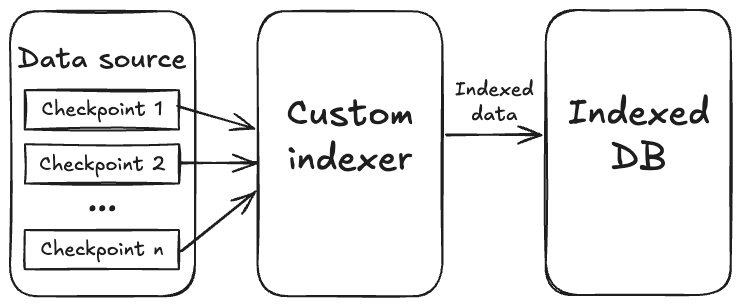

Sui generates rich, complex data, including transactions, events, object changes, and more. While Sui provides standard APIs to access this data, many applications need customized data processing for workflows such as tracking specific events, aggregating analytics, building dashboards, or creating specialized databases.

A custom indexer can be used to extract, transform, and store the specific blockchain data you need. Instead of querying Sui APIs repeatedly or building complex filtering logic, you process the raw blockchain data once and store it in your preferred format.

To create a custom indexer, the `sui-indexer-alt-framework` Rust framework can be used. It provides production-ready components for data ingestion, processing, and storage while giving you full control over your indexing logic.

Leveraging the custom indexing framework is necessary for projects and use cases such as:

- Tracking DEX trading volumes
- Monitoring NFT collection activity
- Building analytics dashboards
- Creating specialized search indexes
- Aggregating cross-chain bridge data

## Framework architecture

At a high level, the indexing framework is a streaming pipeline that continuously polls for the latest available checkpoints from a pre-defined data source and streams that checkpoint data to your pipeline's processing logic.

Checkpoints on Sui are batches of transactions that represent consistent blockchain state snapshots. Each checkpoint contains complete transaction details, events, object changes, and execution results with guaranteed ordering. See [Life of a Transaction](./sui-architecture/transaction-lifecycle.mdx#checkpoints) for more information on checkpoints.

## Detailed architecture

The following diagram details the custom indexer architecture.

### Data sources

Checkpoint data comes from various data sources, including:

- **Remote stores** connect to public checkpoint stores like [`https://checkpoints.mainnet.sui.io`](https://checkpoints.mainnet.sui.io/). This is the most straightforward way to get started without running your own infrastructure.
- **Local files** allow you to process checkpoint files dumped by a local Sui full node, providing the lowest latency, but should be used for testing only as these files are not automatically cleaned up.
- **RPC endpoints** enable direct connection to a Sui full node RPC endpoint, allowing you to use a trusted data source that you control or to connect to networks (like Devnet) that lack a remote store.
The indexing framework supports multiple data sources to maximize flexibility.

### Ingestion layer

The indexing framework manages the ingestion layer, which handles the complex task of reliably fetching and distributing checkpoint data. The `Broadcaster` receives checkpoints from data sources and efficiently distributes them to multiple processing pipelines running in parallel. This is essential for indexers that run multiple different data processing workflows simultaneously. 

The `Regulator` acts as a smart coordinator, controlling data flow rates by directing the `Broadcaster` on which checkpoints to fetch. It's backpressured by the high watermarks reported by subscribers, so that the `Broadcaster` doesn't fetch too many.

### Processing layer

Both the indexing framework and your code manage the processing layer, which is where your custom logic integrates with the framework. The pipeline framework components are the heart of the system, as they orchestrate checkpoint processing, manage concurrency to maximize throughput, maintain watermarks to track progress and ensure data consistency, and coordinate the entire data flow from ingestion to storage. The framework components adapt based on your chosen pipeline type: 

- **Sequential pipelines** use different components optimized for in-order processing with batching capabilities.
- **Concurrent pipelines** use components like `Collector`, `Committer`, and `Pruner` for high-throughput out-of-order processing.

The framework then exposes specific interfaces that you implement to define your data processing logic. Some common APIs include:

- `process()`: Transform raw checkpoint data (transactions, events, object changes) into your desired database rows. This is where you extract meaningful information, filter relevant data, and format it for storage.
- `commit()`: Store your processed data to the database with proper transaction handling. The framework calls this with batches of processed data for efficient bulk operations.
- `prune()`: Clean up old data based on your retention policies (optional). Useful for managing database size by removing outdated records while preserving recent data.

Sequential and concurrent pipeline types and their trade-offs are detailed in [Pipeline Architecture](./custom-indexer/pipeline-architecture.mdx).

`CheckpointData` struct

{@inject: ../../../crates/sui-types/src/full_checkpoint_content.rs#struct=CheckpointData}

### Storage layer

The indexing framework abstracts database operations through a flexible storage layer. PostgreSQL comes with built-in support using Diesel ORM, providing production-ready database operations, connection pooling, migrations, and watermark management out of the box. For custom database implementations, you can implement the framework's storage interfaces to use any database, for example, [MongoDB](https://www.mongodb.com/) for document storage or [ClickHouse](https://clickhouse.com/) for analytics.

## Single program, multiple threads

Your indexer runs as one executable program with multiple coordinated background tasks (threads). The ingestion layer polls for new checkpoints while your processing pipelines transform and store data - all within the same process.

## Related links

- [Pipeline Architecture](./custom-indexer/pipeline-architecture.mdx): The structure of the available indexer pipelines (sequential and concurrent) and the advantages of using one over the other.
- [Life of a Transaction](./sui-architecture/transaction-lifecycle.mdx): The life of a transaction on the Sui network has some differences compared to those from other blockchains.
- [Build Your First Custom Indexer](../guides/developer/advanced/custom-indexer.mdx): Establishing a custom indexer helps improve latency, allows pruning the data of your Sui full node, and provides efficient assemblage of checkpoint data. This guide walks you through the process.