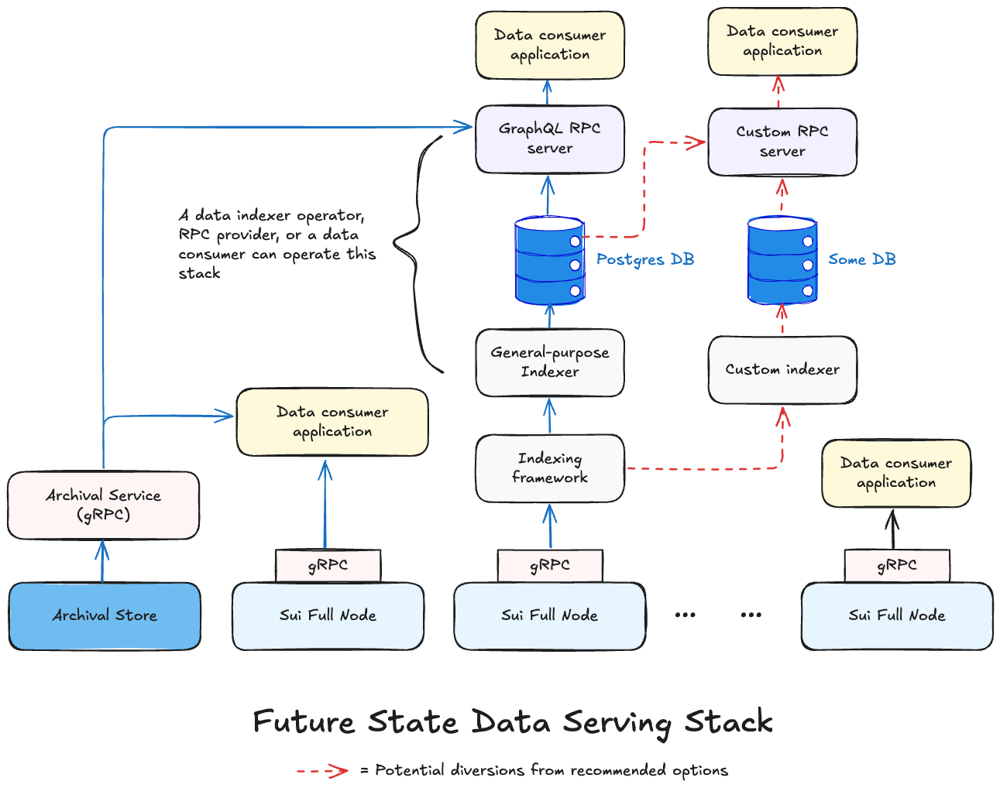

Access Sui network data, like [transactions](/guides/developer/transactions/txn-overview.mdx), [checkpoints](/concepts/cryptography/system/checkpoint-verification.mdx), [objects](/guides/developer/objects/object-model.mdx), and [events](/guides/developer/accessing-data/using-events.mdx), through different interfaces to build applications, analyze network behavior, or audit network activity.

This document outlines the interfaces that are currently available to access Sui network data, along with an overview of how that is gradually evolving. The following definitions apply to release stages mentioned in this document:

- **Alpha**: Experimental release that is subject to change and is not recommended for production use. You can use it for exploration in non-production environments.

- **Beta**: Near-stable that remains subject to change based on user feedback. You can use it for testing and production readiness in non-production environments. Production use is not recommended. Do so at your own risk. Use in production only after verifying the desired functional, performance, and other relevant characteristics in a non-production environment and ensuring your application can accommodate regular updates for any changes.

- **Generally available (GA)**: Fully stable release that you can use in production. Notifications for any breaking changes are made in advance.

## Latest data access interfaces

Primary interfaces to access Sui data include:

- [Custom indexers](#custom-indexers): Build your own pipelines for application-specific data with the [custom indexing framework](/guides/developer/accessing-data/custom-indexer/build.mdx).

- [gRPC API](#grpc-api): Replaces JSON-RPC on full nodes. If you already use JSON-RPC or are starting to utilize it as a dependency for your use case, JSON-RPC is **deprecated** and you need to migrate to gRPC or GraphQL RPC.

- [GraphQL RPC](#graphql-rpc): A lightweight service that you can use to read data from the General-Purpose Indexer's (a performant and scalable implementation of the [custom indexing framework](/guides/developer/accessing-data/custom-indexing-framework.mdx)) relational database. It is currently available in beta. You can use it as an alternative to gRPC, including for migration from JSON-RPC for an existing application. See the [high-level timeline for GraphQL and General-Purpose Indexer availability](#graphql-rpc).

- [Archival Store and Service](#archival-store-and-service): Provides long-term storage and access to historical network data that might no longer be available on full nodes because of pruning. If using gRPC as your primary data access mechanism, you can query it using the gRPC `LedgerService` APIs by changing the endpoint from a full node to the Archival Service. If using GraphQL RPC, it is abstracted and you do not need to directly interact with it.

:::info
View the video below for a comparison of the latest and legacy Sui data stacks. 
<iframe width="560" height="315" src="https://www.youtube.com/embed/CL7H4QQSWd0?si=Mt2xo3HNfm2mbRtE" title="YouTube video player" frameborder="0" allow="accelerometer; autoplay; clipboard-write; encrypted-media; gyroscope; picture-in-picture; web-share" referrerpolicy="strict-origin-when-cross-origin" allowfullscreen></iframe>
:::

<ImportContent source="grpc-graphql.mdx" mode="snippet" />

## Supported SDKs

You can use the following SDKs to interact with gRPC and GraphQL RPC with General-Purpose Indexer:

- [TypeScript SDK](https://sdk.mystenlabs.com/sui/migrations/sui-2.0/json-rpc-migration)

- [Rust SDK](https://github.com/MystenLabs/sui-rust-sdk)

- Community-maintained [Python SDK](https://github.com/FrankC01/pysui)

## Legacy data access interfaces

:::info

<ImportContent source="json-rpc-deprecation.mdx" mode="snippet" />

:::

Directly connect to [JSON-RPC](/references/sui-api.mdx) hosted on Sui [full nodes](/guides/operator/sui-full-node.mdx) that are operated by [RPC providers](https://sui.io/developers#dev-tools) (filter by `RPC`) or [data indexer operators](https://github.com/sui-foundation/awesome-sui?tab=readme-ov-file#indexers--data-services). The [Mainnet](https://fullnode.mainnet.sui.io:443), [Testnet](https://fullnode.testnet.sui.io:443), or [Devnet](https://fullnode.devnet.sui.io:443) load balancer URLs abstract the Sui Foundation-managed full nodes. Those are not recommended for production use.

You can get real-time or historical data using JSON-RPC. The retention period for historical data depends on the [pruning strategy](/guides/operator/data-management.mdx#sui-full-node-pruning-policies) that node operators implement, though the default configuration for all full nodes is to implicitly fall back on the [Archival Store](#archival-store-and-service) managed by the Sui Foundation.

## Related links

<RelatedLink to="/concepts/data-access/grpc" />
<RelatedLink to="/concepts/data-access/custom-indexers" />
<RelatedLink to="/concepts/data-access/graphql-rpc-gp-indexer" />
<RelatedLink to="/concepts/data-access/archival-store-service" />
<RelatedLink to="/guides/developer/accessing-data/custom-indexer/build" />
<RelatedLink to="/guides/developer/accessing-data/custom-indexer/pipeline-architecture" />
<RelatedLink href="/references/fullnode-protocol" label="Sui Full Node gRPC" desc="Generated documentation from the Sui gRPC schema." />
<RelatedLink href="/references/sui-api/sui-graphql/beta/reference" label="GraphQL Beta schema" desc="Schema documentation for GraphQL Beta." />