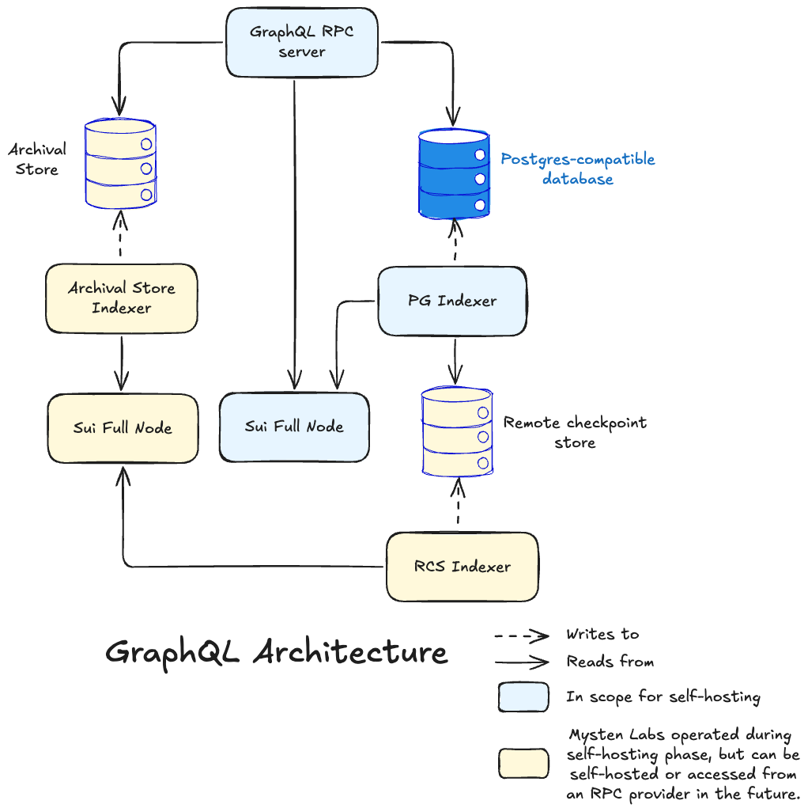

The [GraphQL Beta service](./graphql-rpc.mdx) offers a structured way for your clients to interact with data on the Sui blockchain. Instead of fixed REST endpoints, the Sui GraphQL Beta service exposes a typed schema that enables clients to request exactly the data they need.

Rather than constantly query the Sui APIs, you can introduce a [custom data indexer](./custom-indexing-framework.mdx) to your project pipeline. A custom indexer enables you to extract, transform, and store the specific blockchain data you need. With a custom indexer, you no longer need to build complex filtering logic because you process the raw blockchain data once and store it in your preferred format. For an introduction to building a basic custom indexer, see [Build Your First Custom Indexer](/guides/developer/advanced/custom-indexer.mdx).

Further extension options include the [Archival Store and Service](./archival-store). These features provide a scalable, consistent foundation for accessing historical data on Sui beyond what full nodes or indexer databases typically retain. They power rich builder experiences through GraphQL APIs while keeping storage and operations manageable.

## Schema and feature prioritization

Mysten Labs operates an instance of GraphQL Beta and the associated upstream components. Functionality prioritization is guided by builder adoption feedback focused on:

- How functionality is presented in the current schema, and its usability in real-world development.
- Identifying missing functionality and prioritizing features from early iterations of the GraphQL schema.

### Endpoints

-	**Mainnet:** https://public-rpc.sui-mainnet.mystenlabs.com/graphql
-	**Testnet:** https://public-rpc.sui-testnet.mystenlabs.com/graphql

## Self-hosting infrastructure

Builders intending to operate their own GraphQL service can self-host the following components:

-	Indexer
-	Postgres-compatible database
- GraphQL RPC service

These services require integration with:

-	Archival Service for point lookups over the complete history of checkpoints, transactions, and objects.
-	Remote Checkpoint Store for indexer backfilling.

Mysten Labs provides:

-	Access to Archival Service and Remote Checkpoint Store.
-	Guidance for stack setup, including indexer, database, and RPC configuration, with flexibility to select indexed tables and retention policies.
-	Infrastructure provisioning advice and cost estimates, based on Mysten Labs deployments.
-	Grafana dashboard templates and example alerting rules for observability.

Feedback is encouraged on ease of setup, maintenance, observability, performance, and cost efficiency under real workloads.

## Public beta evolution and sustainability

GraphQL Beta continues to evolve alongside adoption. The architecture is being refined based on partner input, with continued development of the Archival Service and Archival Store.

Long-term access to key backend services will move beyond their initial freely provided form. This includes:

-	Archival Service for point lookups.
-	Remote Checkpoint Store for indexer backfilling.

Mysten Labs is evaluating sustainable paths for ongoing access, including:

-	Partnerships with external RPC providers.
-	Self-hosting support for builders.
-	Paid access to Mysten Labs-operated services.

Future updates will clarify the long-term model as the service approaches general availability.

GraphQL can read data from 3 sources:

1. Full nodes for tip-of-chain data, and transaction execution.
1. A Postgres-compatible database for rich queries (filters) over historical data (transactions by affected address, object, or function calls, events by type, and so on).
1. Archival stores for point lookups of historical data, usually served from a key-value store. This is optional, and if not present, Postgres attempts point lookups.

The current architecture requires a Postgres-compatible database to support rich queries. Ongoing development continues to improve the flexibility and cost-efficiency of the system. Looking ahead, the GraphQL service will be configurable for different deployment profiles based on use case complexity, data retention needs, and infrastructure constraints. Your feedback is invaluable to help guide the direction of future development.

Indexers can either fetch data directly from a full node, or from a remote checkpoint store. Currently, you must configure the indexer to pick one or the other. The remote store is useful for backfilling, but a full node can provide lower latency access to recent checkpoints. In the long-term, the aim is to make the indexer configurable to access both, with the ability to pick between the two based on need (remote store for backfills and full node for recent checkpoints).

## Related links

<RelatedLink to="/concepts/graphql-rpc" />
<RelatedLink to="/concepts/custom-indexing-framework" />
<RelatedLink to="/concepts/custom-indexer/pipeline-architecture" />
<RelatedLink to="/concepts/archival-store" />
<RelatedLink to="/guides/developer/advanced/custom-indexer" />
<RelatedLink href="https://github.com/MystenLabs/sui/tree/main/crates/sui-indexer-alt" label="Sui Indexer Alt" desc="The `sui-indexer-alt` crate in the Sui repo." />
<RelatedLink href="https://github.com/MystenLabs/mvr/tree/main/crates/mvr-indexer" label="Move Registry" desc="The indexer that the Move Registry (MVR) implements." />
<RelatedLink href="https://github.com/MystenLabs/deepbookv3/tree/main/crates/indexer" label="DeepBook Indexer" desc="The indexer that DeepBook implements." />
<RelatedLink href="/references/sui-api/sui-graphql/beta/reference" label="GraphQL Beta schema" desc="Schema documentation for GraphQL Beta" />
