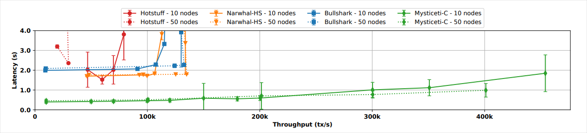

The basic purpose of consensus in blockchains is to agree on a consistent order and ensure the availability of transactions.

On Sui, consensus has a simple API: validators submit different user transactions to consensus concurrently, and the consensus outputs a consistent stream of transactions across all well-behaving validators.

Sui uses the Mysticeti protocol to optimize for both low latency and high throughput. The benefits of Mysticeti include:

- Supports multiple validators proposing blocks in parallel, utilizing the full bandwidth of the network and providing censorship resistance. These are features of the DAG-based consensus protocols.
- requires only three rounds of messages to commit blocks from the DAGs, same as practical Byzantine Fault Tolerance and matches the theoretical minimum.
- The commit rule allows voting and certifying leaders on blocks in parallel, further reducing the median and tail latencies.
- The commit rule also tolerates unavailable leaders without significantly increasing the commit latencies.

## Transaction throughput

Compared to other state-of-the-art consensus protocols, Mysticeti is theoretically capable of handling over twice as many transactions with half the observed latency as other protocols. In a controlled environment using 10 nodes, Mysticeti is capable of handling 300,000 transactions per second (TPS) before latency crosses the one-second marker. Increased to 50 nodes, test results show 400,000 TPS before surpassing a one-second latency. In the same tests, the other top performing consensus mechanisms do not reach 150,000 TPS and observed latency _begins_ at around two seconds.

On average, testing shows Mysticeti can achieve consensus commitment in about **0.5 seconds** with a sustained throughput of **200,000 TPS**.

## Decision rule

The novel decision rule at the heart of Mysticeti optimizes its operational efficiency. Traditional consensus engine decision rules require explicit block validation and certification. This process necessitates greater communication overhead as validators sign and broadcast votes to reach consensus. By contrast, Mysticeti provides implicit commitment, which reduces this inter-node communication, significantly lowering bandwidth usage.

## Finality

Finality is the guarantee that a transaction or block, after confirmation, is permanently added to the network and cannot be altered or reversed. In traditional blockchain consensus, confirming transactions can take time because they rely on other transactions to “reference” them repeatedly before they are considered final. This process can slow down if the network activity decreases or if there are many competing transactions. In contrast, Mysticeti simplifies this process by finalizing transactions immediately upon inclusion in the structure. Consequently, there's no waiting for additional confirmations or network activity, making Mysticeti faster and more reliable for confirming transactions, even in less active or challenging network conditions.

For more details, including correctness proofs, see the [MYSTICETI: Reaching the Latency Limits with
Uncertified DAGs](/paper/mysticeti.pdf) whitepaper.

## Related links

- [Life of a Transaction](./transaction-lifecycle.mdx): The life of a transaction on the Sui network has some differences compared to those from other blockchains.
- [Sui Security](./sui-security.mdx): Sui is designed to provide very high security guarantees to asset owners.
- [MYSTICETI: Reaching the Latency Limits with Uncertified DAGs](/paper/mysticeti.pdf): Whitepaper documenting the Mysticeti protocol.