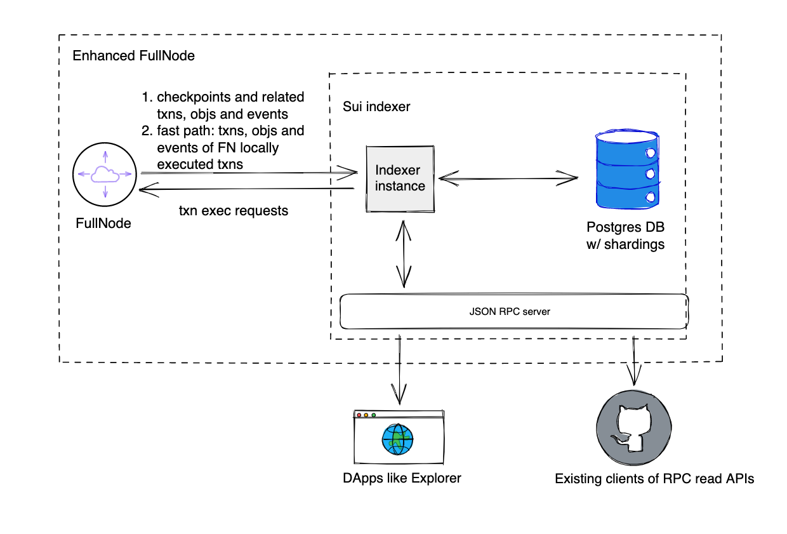

Sui Indexer is an off-Full node data service that serves data from the Sui protocol, including both data directly generated from chain and derivative data.

## Functions 

Sui Indexer provides three main functionalities:
- Ingest data from a Full node to a relational database. Data on Full nodes is stored as BCS bytes in embedded RocksDB, thus the query capabilities are very limited. The indexer pulls checkpoint blob data, schematizing them into various tables like objects, transactions, and so on with proper indices.
- Serve online transaction processing (OLTP) RPC requests. With data in relational databases, Sui indexer spins a stateless reader binary as JSON RPC server with an [interface](/references/sui-api).
- Analytical indexer. Other than OLTP data ingestion and requests, indexer also supports some analytical data ingestion like transactions per second (TPS) and daily active user (DAU) metrics.

## Run an indexer

Refer to the [Sui Indexer README](https://github.com/MystenLabs/sui/tree/main/crates/sui-indexer) in the `crates/sui-indexer` directory of the Sui repo to run an indexer with a local or managed Postgres-compatible database. 

## Future enahancements

Two planned enhancements for Sui indexer are:
- Expand Sui indexer to be able to run on MySQL compatible DB
- Encapsulate the deployment steps into a `docker-compose`-like script for easier initial setup.
