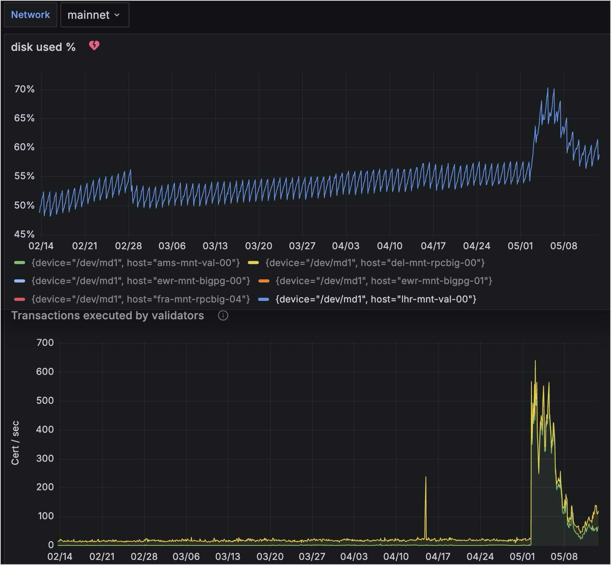

The cost of operating on any blockchain boils down to two major components: compute, the cost of the power needed to process programming logic, and storage, the amount of digital space necessary to store that logic and its results.

Compute is a relatively fixed cost for Sui, with hundreds of validators running 24 Core, 128GB RAM machines.

Because Sui is capable of such high throughput compared to other blockchains, the storage costs of running the Sui network aren't as precise.

There are several components that contribute to storage costs:

| Storage category    | Storage type         | Usage description                                                                                                                                                            | Mainnet storage needs (as of May, 2024) |
| ------------------- | -------------------- | ---------------------------------------------------------------------------------------------------------------------------------------------------------------------------- | ---------------------------------------------------- |
| Validators          | Rocksdb, SSD storage | Validators store latest consensus data on high-performance NVMe disks.                                                                                                       | ~200GB                                               |
| Pruning Full nodes  | Rocksdb, SSD storage | Pruning Full nodes maintain unpruned RocksDB indexes for efficient querying.                                                                                                 | ~1.6TB                                               |
| Unpruned Full nodes | Rocksdb, SSD storage | Unpruned full nodes retain full object and transaction history for complete archival.                                                                                        | ~4.9TB                                               |
| Full node snapshots | Cloud storage        | Snapshots of full node data are stored in cloud storage for validator or full node backup and recovery.                                                                      | ~1.6TB                                               |
| State-sync archival | Cloud storage        | State-sync archival involves storing blockchain state data in cloud storage to facilitate syncing historical objects in the event they have been pruned from a node's peers. | ~1.3TB                                               |

## Validators

Validators are advised to enable pruning to limit the amount of growth occurring in validator databases. Increases in transaction per second (TPS) rates contribute to validator data growth, but the paths storing full transaction and object history are the major growth factors. An additional factor to consider is the type of transaction, which also influences data growth.

The preceding image examines a slice of time on Mainnet in 2024. Reviewing data from a 90 day range in the early part of the year, Mainnet averaged ~18 TPS. Over that period, disk usage went from 203GB to 215GB. Average growth per day was just over 130MB.

During a two-week range in the middle of the year, Mainnet averaged ~183 TPS. Over that period disk usage increased from 215GB to 271GB. Average growth per day was just over 4GB.

These results show the data growth increase relative to the increase in TPS rates.

## Pruning Full nodes

Pruning Full nodes are very similar in disk usage to validators, as the pruning configurations are essentially identical. There are two notable exceptions:

1. Full nodes do keep a `consensus_db`, this makes up about half of validator disk usage.
1. If you serve RPC queries from your Full node, the `indexes/` in Mainnet takes up a substantial amount of data. Today the mainnet `indexes/` are 1.5TB, growing in relation to TPS.

The total disk usage of a pruned Full node with indexes in Mainnet is 1.6TB. With indexing disabled, the total disk usage would be ~100GB.

## Unpruned Full nodes

Most implementations do not use unpruned Full nodes because the benefits of maintaining them apply to only a few specific use cases:

1. You want the entire chain state on a single machine.
1. Enabling state-sync without the need for a cloud archival fallback. In other words, if you use a fully unpruned node as a state sync peer, you don't have to specify the archival fallback in your node config.

Examining the same 90-day period of time mentioned previously, where Mainnet averaged ~18 TPS, disk usage on an unpruned node went from 3.4TB to 4.34TB. Average growth per day was just over 10GB.

In the two-week period mid year, where Mainnet averaged ~183 TPS, disk usage increased from 4.34TB to 4.92TB. Average growth per day was just over 40GB.

## Full node snapshots

There are two types of [snapshots](../../guides/operator/snapshots.mdx), database snapshots and formal snapshots.

Database snapshot size is equal to the database size of the Full node that produces it, as its a 1:1 copy of the database. 

Formal snapshot size is very lightweight, ~30GB for the latest Mainnet epochs as of May of 2024.

## State-sync archival

This is a cloud storage bucket, that a Full node (or data-ingestion daemon) writes to. 

Examining the same 90-day period of time mentioned previously, disk usage went from 867GB to 1.18TB. Average growth per day was just over 3GB.

In the two-week period mid year, disk usage went from 1.18TB to 1.32TB. Average growth per day was 10GB.

## Related links

- [Custom Indexers](../../guides/developer/advanced/custom-indexer.mdx): Build custom indexers using the Sui micro-data ingestion framework.
- [Snapshots](../../guides/operator/snapshots.mdx): Bootstrap a Full node without having to execute all the transactions that occurred after genesis.
- [Sui Archives](../../guides/operator/archives.mdx): Enable archiving on your Full nodes for a historical record of all transactions on Sui.