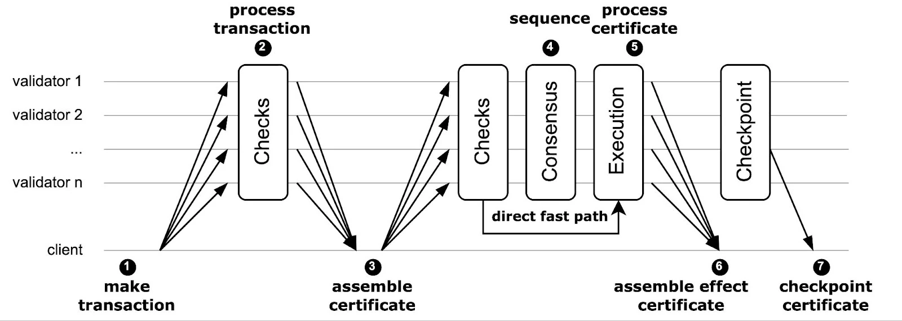

A transaction on the Sui network goes through many different steps during its life cycle.

## Life cycle overview

At a high level, the following figure outlines the life cycle of a transaction on the Sui blockchain.

The following steps align with those in the preceding image. 

1. The first step of the process is the creation of a transaction. A user with a private key creates and signs a user transaction to either mutate objects they own, or a mix of objects they own and [shared objects](../object-ownership/shared.mdx).

1. Sui sends the transaction to each validator (often through a Full node). Validators perform a series of validity and safety checks, sign it, and return the signed transaction to the client. 

1. The client then collects the responses from a set of validators that account for at least 2/3 stake on Sui (a supermajority) to form a transaction certificate. As a result, unlike consensus-based blockchains, Sui validators do not need to propagate signatures on a best-effort basis (gossip signatures) or aggregate certificates. This effort is now the responsibility of the client or gateway.

1. After assembling the certificate, the client sends it back to all validators, who check its validity and acknowledge its receipt to the client. If the transaction involves owned objects exclusively, Sui can process the transaction certificate immediately and execute it without waiting for the [consensus engine](./consensus.mdx) (**direct fast path**). All certificates are forwarded to the Sui DAG-based consensus protocol (also operated by the Sui validators). 

1. Consensus eventually outputs a total order of certificates; the validators check and execute those that contain shared objects. 

1. Clients can collect a supermajority of validator responses, assemble them into an effect certificate, and use it as proof of the settlement of the transaction. 

1. Subsequently, Sui forms checkpoints for every consensus commit, which it also uses to drive the reconfiguration protocol.

The complete [Sui Lutris](https://docs.sui.io/paper/sui-lutris.pdf) paper provides additional detail on how the safety and liveness protocols operate, as well as proofs of security for them in the standard distributed systems model with Byzantine participants in partial synchrony. The following sections provide more detail on the various stages in the life of a transaction.

## Submission

All transactions on Sui begin when they are submitted to the network. For example, imagine you want to transfer an NFT that you own in your wallet to your friend. First, you would create a transaction using a wallet or some other app. The transaction includes your gas payment object and a command to transfer the NFT object to your friend's address. Before the wallet or app submits the transaction to the network, it must also sign it.

After the transaction is signed, the wallet or app submits the transaction to a Sui Full node on behalf of the user.

## Certification

Certification happens after a transaction gets submitted to a Full node. Upon submission, the Full node begins the process of certifying the transaction. The Full node cannot certify the transaction on its own because it does not have a complete view of transactions across the network. Consequently, the Full node must send the transaction to a validator. The validator performs a validity check on the transaction and signs it if it passes. To be considered valid, the transaction must pass the following checks:

   - The transaction has a valid user signature.
   - The initiator of the transaction must have access to all the owned input objects the transaction uses. In the previous NFT example, the validity check makes sure you own the NFT you're trying to send to a friend.
   - All the shared input objects used by the transaction exist.
   - The gas coin is a `Coin<SUI>` object, and it contains at least as much gas as specified in the transaction's gas budget.

If all the validity checks pass, the validator then attempts to lock all the owned input objects to the given transaction digest. This ensures each owned input object can only be used by one transaction at a time and is the way that Sui prevents double-spending. In other words, this makes sure that you send your NFT to only one friend instead of trying to send the same NFT to all your friends.

If the locking succeeds, the validator signs the transaction using its BLS private key and returns the signature to the Full node. A single validator signature is not enough, though. The Full node must collect signatures from enough validators to form a supermajority.

:::info

Full nodes collect signatures from validators in parallel to minimize latency. 

:::

After the Full node collects a supermajority, or quorum, of validator signatures, the transaction is considered certified. To be precise, the Full node has formed a _transaction certificate_.

Because of the locking step described previously, it is impossible to concurrently form certificates for two different transactions that attempt to use the same owned object. This is true even if there are some dishonest validators that illegally sign both transactions, because of a principle in distributed computing called "quorum intersection".

If fewer than 1/3rd of the validators are dishonest (Byzantine), then the set of signers for any two certificates must have an overlap that includes at least one honest validator. And, crucially, because that validator is honest, it never signs two transactions that attempt to access the same input object at the same version. After the transaction completes, the input object version changes and can be accessed again by subsequent transactions. 

## Execution

Full nodes send transactions that have a certificate to validators for execution. Each validator verifies the signatures on the certificate.
If the certificate signatures are valid, then the validator can be sure that the transaction is valid and is not attempting to double-spend any objects.

Then, each validator does the following, based on whether the transaction:
- Does not access any shared input objects, in which case it executes it immediately.
- Does access shared input objects, in which case it submits the object to Sui's consensus layer, which orders the transaction with respect to other transactions using the same shared objects and then executes it.

## Certified Effects

After the transaction executes, the validator signs the effects of the transaction and returns them to the Full node.
The transaction effects are essentially a list of all the actions that the transaction took, which mainly include:
- All the objects that were mutated, created, wrapped, unwrapped, or deleted.
- The gas that was spent.
- The execution status (Success or an error code) of the transaction.

Eventually, the Full node collects effects signatures from a supermajority of validators. This collection of signatures, plus the effects themselves, is called an _effects certificate_.

:::tip

An effects certificate is a guarantee of transaction finality.

::: 

After you or a Full node observes an effects certificate, you are guaranteed that the transaction is going to be included in a checkpoint, which means that the transaction cannot be reverted.

If you wanted, you could present the effects certificate to your friend to prove that you sent them the NFT. The presence of the validator signatures means that an effects certificate cannot be forged.

## Checkpoints

Inclusion in a checkpoint is the final stage in the life of a transaction. As validators execute transactions, they submit them to consensus.

While transactions that use shared input objects must be sent to consensus before they are executed, owned-input-only transactions are also sent to consensus. The difference is that owned-input-only transactions are executed first.

The consensus layer produces a universally agreed-upon ordering of transactions. This ordering is the starting point for the creation of checkpoints. 

The validators take chunks of ordered transactions from the consensus layer and use them to form a checkpoint. Each chunk of transactions is first made causally complete and causally ordered - this means that the validators add any missing dependencies to the list of transactions and order them so that dependencies always appear before dependents in checkpoints.

Then the validator constructs a checkpoint, which (among other data) contains a list of transaction digests as well as the digests of the transaction effects of each transaction. Because checkpoints must be complete, the network sometimes has to wait for the availability of all transactions to form the checkpoints, which may take a couple of commits to process. This process typically completes in the order of a few seconds.

At this point, the transaction has reached the end of its life cycle and is included in the permanent record of transaction activity on the Sui network.

## Transaction finality

Transaction finality is the point at which the execution of a transaction becomes irreversible and its details cannot be altered or changed. 

The network round trip of sending a transaction and receiving a validator signature takes less than half a second to complete. At this point the sender knows the transaction is irrevocable and is going to be processed within the epoch, no matter what. The transaction has reached finality; honest validators deem invalid any subsequent transactions using the same owned input objects during the same epoch.

## Settlement finality

After a validator executes a transaction, it returns signed effects from that transaction to the network.

After the supermajority of validators have executed the transaction, and an effects certificate exists, the effects of the transaction (transfers, newly minted objects, and so on) have been implemented. At this point, the network can process transactions that depend on those effects. 

For transactions that involve owned objects only, this happens before consensus in under half a second. If a transaction includes shared objects, it happens shortly after consensus, which can take a few seconds. At this point, the transaction reached settlement finality because now you can process more transactions on the same input objects. See [Object Ownership](../../concepts/object-ownership.mdx) for more information.

## An example path to an effects certificate

As a real-world example, suppose you want to pay the local coffee shop 10 SUI for your morning coffee. How can the coffee shop be sure that the payment is complete and allow you to take your coffee?

Step 1: Transaction creation

You open the wallet app on your phone, scan the coffee shop's QR code that contains the recipient on-chain address. The wallet app constructs a transaction that transfers 10 Sui from your Sui address to the coffee shop's address. You review the transaction details and approve it. The wallet app then signs the transaction with your private key. Now you have a signed transaction.

Step 2: Transaction broadcast

Your wallet app submits the signed transaction to a Full node. The Full node broadcasts the transaction to all validators in the network.

Step 3: Transaction certification

Validators receive the transaction from the Full node. After examining its validity, a validator locks the referenced owned objects, and returns its signature of the transaction to the Full node.

After the Full node collects a quorum of signatures, it forms a transaction certificate. The transaction certificate contains the transaction and signatures from the supermajority of validators.

Step 4: Transaction finalization

The Full node broadcasts the transaction certificate to all validators. Validators receive the transaction certificate, verify its validity (for example, there are indeed enough signatures), execute the transaction, and unlock the previously locked owned objects. Transaction effects are the output of an executed transaction. Validators sign the transaction effects and return them to the Full node, along with their signatures.

The Full node verifies that effects returned from validators are identical. After it collects a supermajority of signatures, it forms an `EffectsCertificate` object. The effects certificate contains the transaction effects and signatures from a supermajority of validators.

At this point, as your wallet app gets back the effects certificate from the Full node, you can share this effect certified transaction with the coffee shop. The coffee shop can then be sure that the transaction is executed and irreversible.

### Checkpoint processing

The process in the previous section demonstrates a finalized transaction through an effects certificate. As the process shows, the Full node plays the quorum driving role.

What if the Full node goes offline before it collects a quorum of validator-signed effects? Your wallet app will probably retry the process with a different Full node. Unfortunately, your phone runs out of battery before it sends the signed transaction to a new Full node.

No worries. The coffee shop shortly notices your payment arrive in its terminal, connected to a different Full node. This Full node learns about your transaction through checkpoints.

As mentioned, a checkpoint contains a list of transactions. If a transaction appears in a certified checkpoint (a checkpoint that has been signed by a supermajority of validators), it is considered finalized.

The Full node that the coffee shop's terminal connects to knows about your transaction through state sync. In this case, as long as one validator receives the transaction certificate from your original Full node, the transaction will highly likely finalize even without an effects certificate. The coffee shop is assured of payment and can give you your coffee.

### Local execution on Full node

Before the Full node sends back an effects certificate to your wallet app, it may try to execute the transaction locally, if the request asks it to.

The purpose of this extra step is to keep the Full node up to date as much as possible, especially when the wallet app frequently hits the same Full node. In this coffee shop example, this might be trivial, but for a high frequency application, such as gaming, it could be important.

When an app constructs a transaction, it typically requests that the Full node choose a gas object for it. Gas objects are owned objects, meaning that if the Full node is stale and not aware of the right version of the object, it could lead to invalid transactions, or worse, client equivocation if the client software does not handle it properly. Executing on Full node before returning `EffectsCertificate` is one way to avoid this situation. A request can ask for such behavior by using the `WaitForLocalExecution` parameter. See [Sponsored Transactions](../transactions/sponsored-transactions.mdx) for more on client equivocation.

Using `WaitForLocalExecution` is not always the best choice, however. For example, with this coffee payment it adds a layer of end-to-end latency without significant benefits. In this case, using the `WaitForEffects` parameter instead to have a slightly shorter user-perceived latency.

### Epoch change

Periodically (~24 hours), the Sui network enters the process of epoch change. During epoch change, the network calculates and distributes staking rewards, validators metadata take effect, and other network processes are performed. All user transactions are delayed until the new epoch begins.

If your transaction is submitted at epoch boundary, in rare perfect timing, it is possible that a quorum of validators already decided to not accept any new transaction certificates in the current epoch. Of course, this means your coffee purchase is not be checkpointed either. For any transactions that are certified but not finalized, they are reverted if executed, or its owned objects are unlocked and not yet executed. In this case, the transaction certificate does not guarantee finality. In the new epoch, this transaction certificate will become void because validator signatures are signed over epoch ID. To continue this transaction, a new transaction certificate is necessary with the new epoch ID. The standard Full node implementation handles this automatically.

### Verifying finality

Assume your wallet app crashed during the original transaction. If the app stores the signed transaction locally before sending it to the Full node, which is best practice, then when the app restarts it tries to verify if the transaction has been finalized first. If it has, then no other steps are necessary. If it hasn't, then the app needs to resubmit the transaction.

The wallet app can query the Full node with the `getTransactionBlock` method. Assuming the Full node is honest:
- If the response contains transaction details, the transaction must have been finalized. It is either executed with `WaitForLocalExecution`, or executed as a checkpointed transaction.
- If the response is `None`, it could mean the transaction was dropped in some step, or is already finalized but this Full node does not know yet. In this scenario, the safer option is to resubmit the transaction.

Before a transaction is locally executed, its effects are not reflected on the Full node. The same idea applies to the coffee shop's Full node. Your transaction was not submitted through this Full node, hence it does not have a chance to locally execute it before it's included in a checkpoint. This Full node must wait for the transaction to be checkpointed and state synced, which normally takes a few seconds. After the Full node receives this transaction in a checkpoint, it is executed and has effects updated locally, for example the coffee shop's balance increases.

## Summary

Hopefully, you now have a better understanding of how a transaction gets certified and finalized.

1. A transaction certificate does not always guaranteed finality, even though it's highly likely. Specifically, a transaction certificate might become void after an epoch change.

2. An effects certificate guarantees finality - it takes a supermajority of validators to execute the transaction and commit to the effects.

3. An inclusion in a certified checkpoint guarantees finality - it takes a supermajority of validators to certify the checkpoint, in which every transaction is executed and effects-committed.

