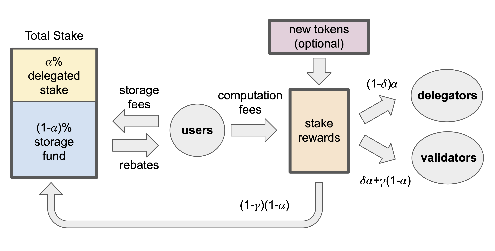

The term "tokenomics" is a combination of two words, “token” and “economics”, that is generally used to describe the economic principles and behaviors of a blockchain. 

The “token” part of the tokenomics portmanteau refers to the native token (or native coin) of the blockchain. On Sui, the native coin is SUI, which acts as the currency of the network. SUI also pays for the computational cost of transactions (gas fees) and storage on the network. 

## Proof of stake

Sui uses a proof-of-stake (PoS) consensus mechanism. This means that validators (entities that validate transactions) lock up a certain amount of SUI as collateral (stake). They then earn rewards for processing operations. Users of the network hold their own SUI, which they can delegate to the validators of their choice as part of the validators' stakes. In so doing, the validators reward users based on the amount of SUI they delegate. Users are free to withdraw their SUI or to change their selected validator when the epoch changes.

## Stakeholders

Stakeholders in a blockchain's tokenomics have a vested interest in the viability of the blockchain economy. The Sui economy has three main groups of stakeholders:

- **Users** submit transactions to the Sui platform to create, mutate, and transfer digital assets or interact with more sophisticated applications enabled by smart contracts, interoperability, and composability.
- **SUI token holders** have the option of staking their tokens to validators and participating in the proof-of-stake mechanism. SUI owners also hold the rights to participate in Sui governance.
- **Validators** manage transaction processing and execution on the Sui platform.

## SUI coin

As mentioned, the native coin of Sui is SUI. The coin uses the capitalized version of SUI to distinguish the coin from the Sui network. A sound policy to govern the native coin on a blockchain ensures stability and encourages growth. The Sui tokenomics structure is designed to support the long-term financial needs of Web3, not get-rich-quick schemes that have plagued the industry in the past.

The SUI coin serves four purposes on the Sui network:

- You can stake SUI to participate in the proof-of-stake mechanism.
- SUI is the asset denomination needed to pay the gas fees required to execute and store transactions or other operations on the Sui network.
- You can use SUI as a versatile and liquid asset for various applications, including the standard features of money - a unit of account, a medium of exchange, or a store of value - and more complex functionality smart contracts enable, interoperability, and composability across the Sui ecosystem.
- SUI coins play an important role in governance by acting as a right to participate in on-chain voting on issues such as protocol upgrades.

### Supply

The total supply of SUI tokens on Mainnet is capped at 10,000,000,000 SUI (ten billion). This is the total number of SUI that can ever be minted, but the total supply is not available for transactions. Supply availability follows the designed unlocking schedules in place to enhance the tokenomics stability of the network and provide a long-term level of security. 

There is a finite supply of SUI. The balance must support all economic activities to scale as more and more people migrate to the Sui platform. In addition, the presence of a storage fund creates important monetary dynamics, in that higher on-chain data requirements translate into a larger storage fund, reducing the amount of SUI in circulation.

### Distribution

At the beginning of each epoch, three important events happen:

- SUI holders stake (some) of their tokens to validators and a new [committee](https://docs.sui.io/guides/operator/validator-committee) is formed.
- The reference gas prices are set as described in [Sui Gas Pricing](https://docs.sui.io/concepts/tokenomics/gas-pricing).
- The [storage fund](#storage-fund) size is adjusted using the net inflow of the previous epoch.

Following these actions, the protocol computes the total amount of stake as the sum of staked SUI plus the storage fund.

During each epoch, users submit transactions to the Sui platform and validators process them. For each transaction, users pay the associated computation and storage gas fees. In cases where users delete previous transaction data, users obtain a partial [rebate of their storage fees](#storage-fund-rewards). Validators observe the behavior of other validators and evaluate each other's performance.

At the end of each epoch, the protocol distributes stake rewards to participants of the PoS mechanism. This occurs through two main steps:

- The total amount of stake rewards is calculated as the sum of computation fees accrued throughout the epoch plus the epoch's stake reward subsidies. The latter component is temporary in that it will only exist in the network's first years and disappear in the long run as the amount of SUI in circulation reaches its total supply.
- The total amount of stake rewards is distributed across various entities. The storage fund is taken into account in the calculation of the epoch total stake, which is not owned by any entities in the way that staked SUI is. Instead, the Sui economic model distributes the stake rewards accruing to the storage fund to validators for compensation of their storage costs.

The distribution mechanisms built into Sui tokenomics encourages a healthy competition for fair prices where validators set low gas fees while operating with viable business models. Refer to the https://docs.sui.io/paper/tokenomics.pdf whitepaper for in-depth review of the mathematical proofs that support this structure.

### Unlocking schedules

Sui tokenomics design includes a vesting schedule (or unlock schedule) that dictates when certain blocks of SUI become accessible to the market. Like most blockchains concerned with stability and long-term commitment, Sui tokenomics design includes a multi-tiered SUI unlock schedule.

When Sui first launched its Mainnet network (initial SUI mint), there was a one-year cliff period. During this time, all initial investors were blocked from transferring their initial stake of SUI to the marketplace. A common practice for new cryptocurrency, the cliff period protected early network stability against large-scale sell-offs from early investors. The cliff period ended in May 2024.

### Airdrops

Often, when a new coin or token launches, its minters set aside a percentage of the sum to distribute to early adopters to drive interest in the associated blockchain project. This process is termed an “airdrop”. 

There were no SUI airdrops to support the launch of Sui's Mainnet network. This was a publicly-stated, intentional decision for the following reasons: 

- Airdrops expose a potential for bad actors to take advantage of the excitement around a new launch. By publicly stating there would be no airdrops, Sui attempted to mitigate the risk its users faced.
- Cryptocurrency is regulated differently across the globe. Airdrops can be viewed as taxable events in some jurisdictions, creating legal or financial complications.
- Sui is committed to the long-term success of the network and its stakeholders. Airdrops might generate excitement early in a project's lifecycle, but the long-term benefits are minimal.

## Storage fund

As previously mentioned, SUI pays for the gas fees and data storage on the network. A potential problem arises, however, when new validators come on chain. Even though the validator is new, it still must pay the storage cost for activity that happened before it was part of the network.

Sui addresses this problem with the storage fund. The storage fund is essentially a cache of SUI that never fully depletes. Each on-chain transaction that adds data to the chain includes a fee for storage, which the protocol adds to the storage fund. The storage fund itself essentially has a stake in the network, so it collects rewards based on that stake, just like every other on-chain stakeholder. The protocol then regularly distributes those storage fund rewards to Sui validators to pay for storage. In this way, new validators to the network get paid for storing data from past transactions.

### Storage fund rewards

The Sui delegated proof-of-stake (PoS) mechanism calculates total stake as the sum of user stake plus the SUI tokens deposited in the storage fund. Hence, the storage fund receives a proportional share of the overall stake rewards depending on its size relative to total stake. The largest share of these stake rewards are paid out to current validators to compensate for storage costs. The rewards that remain are reinvested into the fund. In other words, stake rewards accruing to the storage fees submitted by past transactions are paid out to current validators to compensate them for data storage costs. When on-chain storage requirements are high, validators receive substantial additional rewards to compensate for their storage costs. Vice versa when storage requirements are low.

The storage fund includes three key features:

- The storage fund is funded by past transactions and functions as a tool for shifting gas fees across different epochs. This ensures that future validators are compensated for their storage costs by the past users who created those storage requirements in the first place.
- The storage fund pays out only the returns on its capital and does not distribute its principal. In practice, this essentially means validators borrow the storage fund's SUI as additional stake and keep the majority of stake rewards. Validators do not, however, receive funds directly from the storage fund. This guarantees the fund never loses its capitalization and can survive indefinitely. This feature is further buttressed by the stake rewards reinvested into the fund.
- The storage fund includes a *deletion option*. If you delete data, you get a partial refund of the storage fees paid originally.

### Deflation

The storage fund also contributes to the deflationary aspect of the network. Unlike traditional economics, deflation is a feature of Sui rather than a bug. The total supply of SUI is capped, so increased activity on the network has a deflationary effect as the storage fund grows in relation to the amount of data stored, which effectively takes more SUI out of circulation.  The store of value for SUI increases in relation to the decrease in circulating supply, promoting long-term investment in SUI for a strong network into the future. 

## Validator rewards

With traditional PoS blockchains, validator rewards are somewhat randomized based on the amount of stake a validator holds. As the validators reinvest their rewards, their stake compounds, as does the probability that they receive more rewards based on that growing stake.

Sui takes a novel approach to rewarding its validators to avoid this effect. All honest validators on Sui receive their staking rewards with full certainty. The rewards are based only on the amount of stake the validators hold, removing randomness from the equation. 

## Validators and staking pools

Each Sui validator maintains its own staking pool to track the amount of stake and to compound staking rewards. Validator pools operate together with a time series of exchange rates that are computed at each epoch boundary. These exchange rates determine the amount of SUI tokens that each past SUI staker can withdraw in the future. Importantly, the exchange rates increase as more rewards are deposited into a staking pool and the longer an amount of SUI is deposited in a staking pool, the more rewards it will accrue.

When SUI is deposited to the staking pool in epoch `E`, those SUI are converted into liquidity tokens at the epoch `E` exchange rate. As the staking pool earns rewards, the exchange rate appreciates. At epoch `E'`, those liquidity tokens are worth more and translate into more SUI.
The only difference between Sui staking pools and typical liquidity pools is that in Sui the liquidity tokens do not exist. Rather, the global exchange rate table is used to track the accounting. Because all SUI tokens in the staking pool are treated the same, regardless of whether they were originally deposited as new stake or as stake rewards, all SUI tokens immediately count as stake and thus compound rewards immediately.

The staking pool is implemented in a system-level smart contract ([staking_pool.move](https://github.com/MystenLabs/sui/blob/main/crates/sui-framework/packages/sui-system/sources/staking_pool.move)) and is part of the Sui framework.

### Validator pool exchange rate 

The exchange rate for each validator pool is calculated at each epoch boundary as follows:

Exchange rate at E+1 = ( 1 + ( third-party staker rewards at E / third-party stake at E )) ( exchange rate at E )

The distinction between third-party owned vs validator-owned rewards and stake is relevant in that validators earn commissions on the staking pool's tokens but third-party stakers do not. This accounting enables Sui to keep track of the rewards accrued by both validators and third-party token holders using a single global exchange rate table.

{@include: ../snippets/staking-pool-reqs.mdx}

## Related links

- [The Sui Smart Contracts Platform: Economics and Incentives](https://docs.sui.io/paper/tokenomics.pdf): Whitepaper that details Sui tokenomics.
- [Gas fees](https://docs.sui.io/concepts/tokenomics/gas-in-sui): Gas fees are charged on all network operations and used to reward participants of the proof-of-stake mechanism and prevent spam and denial-of-service attacks.
