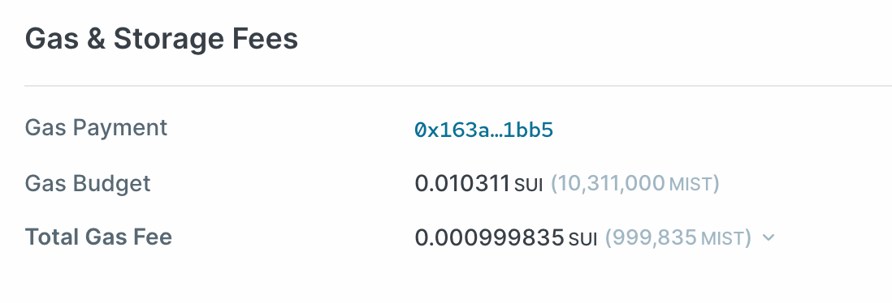

A Sui transaction must pay for both the computational cost of execution and the long-term cost of storing the objects a transaction creates or mutates. Specifically, [Sui Gas Pricing](gas-pricing.mdx) is such that any transaction pays the following gas fees:

`total_gas_fees = computation_units * reference_gas_price + storage_units * storage_price`

While computation and storage fees are separate, they are conceptually similar in that they each translate computation or storage into SUI terms by multiplying computation or storage units by the relevant price.

Finally, Sui storage mechanics provide storage fee rebates whenever a transaction deletes previously stored objects. Hence, the net fees that a user pays equals gas fees minus the rebates associated with data deletion:

`net_gas_fees = computation_gas_fee + storage_gas_fee - storage_rebate`

The information on net gas fees is displayed in a Sui network explorer for each transaction block:

_The Gas Fees section for a transaction block displayed on a Sui network explorer_

## Gas prices {#gas-prices}

The [reference gas price](gas-pricing.mdx#computation-gas-prices) translates the real-time cost of executing a transaction into SUI units and the validator set updates it at each epoch boundary. Similarly, the [storage price](gas-pricing.mdx#storage-gas-prices) translates the long-term cost of storing data on chain into SUI units and updates infrequently; often remaining constant for various consecutive epochs. During regular network operations, all Sui users can expect to pay the reference gas price and storage price for computation and storage, respectively.

## Gas units {#gas-units}

Gas units include both

- [Computation units](#computation)
- [Storage units](#storage)

### Computation units {#computation}

Different Sui transactions require varying amounts of computational time for processing and execution. Sui translates these varying operational loads into transaction fees by measuring each transaction in terms of computation units. In general, more complex transactions require more computation units.

Importantly, though, Sui computation gas schedule is built coarsely with a bucketing approach. Two relatively similar transactions translate into the exact same amount of computation units if they are in the same bucket, whereas two relatively different transactions translate into different amounts of computation units if they fall in separate buckets. The smallest bucket maps into 1,000 computation units, meaning that all transactions that fall into the smallest bucket cost 1,000 computation units. The largest bucket maps into 5,000,000 computation units; if a transaction requires more computation units, it aborts.

Using coarse bucketing accomplishes two important goals:

    - Frees you from optimizing your smart contracts to deliver marginal gains in gas costs via "gas golfing" — instead, you can focus on step-function improvements in your products and services.
    - Gives you the freedom to adjust per-instruction gas costs and experiment with new gas metering schemes without creating significant development disruption. This can happen frequently, so it's important that you do not rely on per-instruction gas costs remaining stable over time.

| Bucket Lower Threshold | Bucket Upper Threshold | Computation Units      |
| ---------------------- | ---------------------- | ---------------------- |
| 0                      | 1,000                  | 1,000                  |
| 1,001                  | 5,000                  | 5,000                  |
| 5,001                  | 10,000                 | 10,000                 |
| 10,001                 | 20,000                 | 20,000                 |
| 20,001                 | 50,000                 | 50,000                 |
| 50,001                 | 200,000                | 200,000                |
| 200,001                | 1,000,000              | 1,000,000              |
| 1,000,001              | 5,000,000              | 5,000,000              |
| 5,000,001              | Infinity               | transaction will abort |

### Storage units {#storage}

Similarly, Sui transactions vary depending on the amount of new data written into on-chain storage. The variable storage units capture these differences by mapping the amount of bytes held in storage into storage units. The current Sui schedule is linear and maps each byte into 100 storage units. So, for example, a transaction that stores 25 bytes costs 2,500 storage units, while a transaction that stores 75 bytes costs 7,500 units.

Importantly, in the Sui [storage fund](../tokenomics.mdx#storage-fund) model users pay up front for the cost of storing data in perpetuity but can also get a partial rebate on previously stored data, if that data is deleted. Hence, the amount of storage fees that you pay can be split into a rebateable and non-rebateable amount. Initially, the rebateable amount equals 99% of the storage fees, while the non-rebateable amount equals the remaining 1%.

### Gas budgets {#gas-budgets}

You must submit all transactions need together with a gas budget. This provides a cap to the amount of gas fees you pay, especially because sometimes it might be hard to perfectly forecast how much a transaction costs before you submit it to the Sui network.

The gas budget for a Sui transaction is defined in SUI units and transactions are successfully executed if:

`gas_budget >= max{computation_fees,total_gas_fees}`

If the gas budget does not fulfill this condition, then the transaction fails and a portion of the gas budget is charged. In cases where the `gas_budget` is insufficient for covering `computation_fees`, then the entirety of the `gas_budget` is charged. In cases where `gas_budget` is sufficient for covering `computation_fees` but not the `total_gas_fees`, then a portion of the `gas_budget` corresponding to `computation_fees` and the fees associated with mutating the transaction's input objects are charged.

Ultimately, a successful transaction requires the end user to pay the transaction's `total_gas_fees`. However, since it is challenging to perfectly forecast computation time before the transaction is processed, the `gas_budget` condition also requires the `gas_budget` to be at least as large as the transaction's `computation_fees` in case the transaction aborts. In some cases -- especially in the presence of high storage rebates, and, thus negative net storage fees -- the gas budget might be higher than the total gas fees you pay.

Importantly, the minimum gas budget is 2,000 MIST (.000002 SUI). This ensures validators are compensated with at least 2,000 MIST even if the gas budget is incorrectly specified and the transaction aborts. Additionally, this protects the Sui network from being spammed with a large number of transactions with minimal gas budgets. The maximum gas budget is 50 billion MIST or 50 SUI. This protects the network against overflow of internal multiplications and gas limits for denial of service attacks.

As mentioned previously, the storage rebate currently equals 99% of the originally paid storage fees. Because the gas budget applies to the totality of gas fees, it is often the case that a transaction only goes through if the gas budget is considerably higher than the net gas fees that a user ultimately pays.

### Gas budget examples {#gas-budget-examples}

The following table provides some examples of gas accounting on the Sui network. Within the first two and last two rows, computation units are the same because transactions fall within the same bucket. However, the last two transactions are more complex than the first two and thus fall in a higher bucket. Finally, in the last transaction the storage rebate is large enough to fully offset the transaction gas fees and actually pays the user back a positive amount of SUI.

These examples showcase the importance of the gas budget. The minimum gas budget is the smallest amount a transaction can specify to successfully execute. Importantly, when there is a storage rebate, the minimum gas budget is larger than the amount of net gas fees a user ultimately pays — this is especially stark in the last example where the user receives a positive amount back for executing the transaction. This is because the minimum gas budget must be higher than a transaction's computation fees.

|                                                         | Reference Gas Price | Computation Units | Storage Price | Storage Units | Storage Rebate | Minimum Gas Budget | Net Gas Fees   |
| ------------------------------------------------------- | ------------------- | ----------------- | ------------- | ------------- | -------------- | ------------------ | -------------- |
| Simple transaction storing 10 bytes                     | 1,000 MIST          | 1,000             | 75 MIST       | 1,000         | 0 MIST         | 1,075,000 MIST     | 1,075,000 MIST |
| Simple transaction storing 10 bytes and deleting data   | 500 MIST            | 1,000             | 75 MIST       | 1,000         | 100,000 MIST   | 500,000 MIST       | 475,000 MIST   |
| Complex transaction storing 120 bytes                   | 1,000 MIST          | 5,000             | 200 MIST      | 12,000        | 0 MIST         | 7,400,000 MIST     | 7,400,000 MIST |
| Complex transaction storing 120 bytes and deleting data | 500 MIST            | 5,000             | 200 MIST      | 12,000        | 5,000,000 MIST | 2,500,000 MIST     | -100,000 MIST  |
