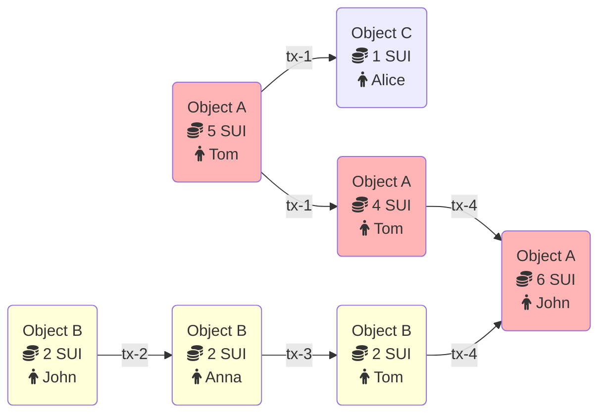

All updates to the Sui database happen via transactions. This topic describes the transaction types supported by Sui and explains how their execution changes the ledger.  There are only two kinds of transactions on Sui:

- Programmable transaction blocks, which anyone can submit on the network.  For information on these transactions, see [Programmable Transaction Blocks](./transactions/prog-txn-blocks.mdx).
- System transactions, which only validators can directly submit and are responsible for keeping the network running (changing epochs, starting checkpoints, and so on).

## Transaction metadata

All Sui transactions have the following common metadata:

- **Sender address:** The [address](guides/developer/getting-started/get-address.mdx) of the user sending this transaction.
- **Gas input:** An object reference pointing to the object that will be used to pay for this transaction's execution and storage. This object must be owned by the user and must be of type `sui::coin::Coin<SUI>` (i.e., the Sui native currency).
- **Gas price:** An unsigned integer specifying the number of native tokens per gas unit this transaction will pay. The gas price must always be nonzero.
- **Maximum gas budget:** The maximum number of gas units that can be expended by executing this transaction. If this budget is exceeded, transaction execution will abort and have no effects other than debiting the gas input object. Consequently, the gas input object must have a value higher than the gas price multiplied by the max gas, and this product is the maximum amount that the gas input object will be debited for the transaction.
- **Epoch:** The Sui epoch this transaction is intended for.
- **Type:** A call, publish, or native transaction and its type-specific-data (see below).
- **Authenticator:** A cryptographic signature and a public key that both verifies against the signature and is cryptographically committed to by the sender address.
- **Expiration:** An epoch reference that sets a deadline after which validators will no longer consider the transaction valid. The optional expiration epoch reference enables users to define transactions that either execute and commit by a set time (current epoch less than or equal to expiration epoch), or never execute after the deadline passes. By default, there is no deadline for when a transaction must execute. 

## Transactions flow - example

Here's an example showing how objects and transactions are connected to each other in Sui.

In the following example there are two objects:
- Object A is a coin of type SUI with a total balance of 5 SUI
- Object B with 2 SUI coins that belongs to John

Tom decides to send 1 SUI coin to Alice. In this case, Object A is the input to this transaction and 1 SUI coin is debited from this object. The output of the transaction is two objects: 
- Object A with 4 SUI coins that still belongs to Tom
- new created Object C with 1 SUI coin that belongs now to Alice

At the same time, John decides to send 2 SUI coins to Anna. Because the relationship between objects and transactions is written in a directed acyclic graph (DAG), and both transactions interact with different objects, this transaction executes in parallel with the transaction that sends coins from Tom to Alice. This transaction changes only the owner of Object B from John to Anna.

After receiving 2 SUI coins, Anna sent them immediately to Tom. Now Tom has 6 SUI coins (4 from Object A and 2 from Object B).

Finally, Tom sends all of his SUI coins to John. For this transaction, the input is actually two objects (Object A and Object B). Object B is destroyed, and its value is added to Object A. As a result, the transaction's output is only Object A with a value of 6 SUI.

## Limits on transactions, objects, and data

Sui has some limits on transactions and the data used in them, such as a maximum size and number of objects used. You can find these limits in the [`sui-protocol-config` crate](https://github.com/MystenLabs/sui/blob/main/crates/sui-protocol-config/src/lib.rs) of the Sui repo. The limits are defined in the `ProtocolConfig` struct and values set in the `get_for_version_impl` function.
