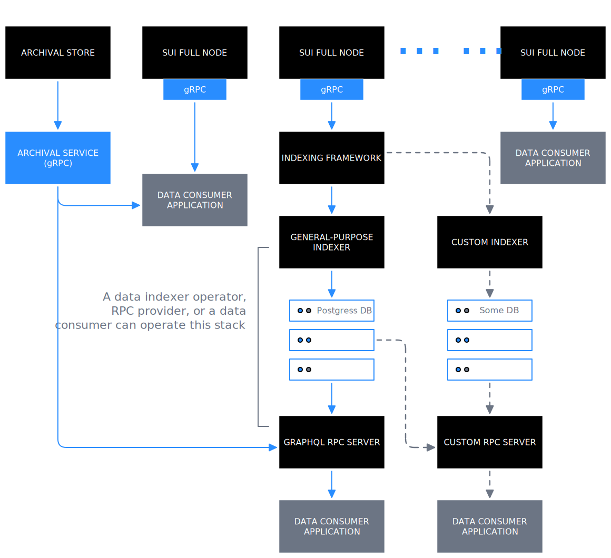

Access Sui network data, like [transactions](/develop/transactions/txn-overview), [checkpoints](/develop/sui-architecture/checkpoint-verification), [objects](/develop/sui-architecture/object-model), and [events](/develop/accessing-data/using-events), through different interfaces to build applications, analyze network behavior, or audit network activity.

Primary interfaces to access Sui data include:

- [gRPC API](/develop/accessing-data/grpc): Replaces JSON-RPC on full nodes. If you already use JSON-RPC or are starting to utilize it as a dependency for your use case, JSON-RPC is **deprecated** and you need to migrate to gRPC or GraphQL RPC.

- [GraphQL RPC](/develop/accessing-data/graphql/graphql-rpc): A lightweight service that you can use to read data from the General-Purpose Indexer's (a performant and scalable implementation of the [custom indexing framework](/develop/accessing-data/custom-indexer/custom-indexers)) relational database. You can use it as an alternative to gRPC, including for migration from JSON-RPC for an existing application.

- [Archival Store and Service](/develop/accessing-data/archival-store): Provides long-term storage and access to historical network data that might no longer be available on full nodes because of pruning. If using gRPC as your primary data access mechanism, you can query it using the gRPC `LedgerService` APIs by changing the endpoint from a full node to the Archival Service. If using GraphQL RPC, it is abstracted and you do not need to directly interact with it.

- [Custom indexers](/develop/accessing-data/custom-indexer/custom-indexers): [Build your own pipelines](/develop/accessing-data/custom-indexer/build) for application-specific data with the custom indexing framework.

## Latest data access interfaces

:::info
View the video below for a comparison of the latest and legacy Sui data stacks. 
<iframe width="560" height="315" src="https://www.youtube.com/embed/CL7H4QQSWd0?si=Mt2xo3HNfm2mbRtE" title="YouTube video player" frameborder="0" allow="accelerometer; autoplay; clipboard-write; encrypted-media; gyroscope; picture-in-picture; web-share" referrerpolicy="strict-origin-when-cross-origin" allowfullscreen></iframe>
:::

## Supported SDKs

You can use the following SDKs to interact with data on Sui.

- [TypeScript SDK](https://sdk.mystenlabs.com/sui/migrations/sui-2.0/json-rpc-migration)

- [Rust SDK - gRPC](https://github.com/MystenLabs/sui-rust-sdk)

- [Rust SDK - GraphQL](https://docs.rs/sui-graphql/latest/sui_graphql/)

- Community-maintained [Python SDK](https://github.com/FrankC01/pysui)

## When to use gRPC or GraphQL with General-purpose Indexer

You can use the high-level criteria mentioned in the following table to determine whether gRPC API or GraphQL RPC with General-purpose Indexer would better serve your use case. This is not an exhaustive list and either of the options could work suitably for some of the use cases.

| Dimension | gRPC API | GraphQL RPC with General-purpose Indexer |
| -------- | ------- | ------- |
| Type of application or data consumer. | Ideal for Web3 exchanges, DeFi market maker apps, other DeFi protocols or apps with ultra low-latency needs. | Ideal for web application builders or builders with slightly relaxed latency needs. |
| Query patterns. | Okay to read data from different endpoints separately and combine on the client-side; faster serialization, parsing, and validation because of binary format. | Allows easier decoupling of the client with the ability to combine data from different tables in a single request; returns consistent data from different tables across similar checkpoints, including for paginated results. |
| Retention period requirements. | Default retention period is 2 weeks with actual configuration dependent on the full node operator and their needs and goals; see history-related information after the table. | Default retention period in Postgres database is 4 weeks with actual configuration depending on your needs or an RPC provider or data indexer operator's setup; see history-related information after the table. |
| Streaming needs. | Includes a streaming or subscription API before beta release. | Subscription API is planned but is available after GA. |
| Incremental costs. | Little to no incremental costs if already using full node JSON-RPC. | Somewhat significant incremental costs if already using full node JSON-RPC and if retention period and query patterns differences are insignificant. |

This table only mentions the default retention period for both options. The expectation is that a full node operator, RPC provider, or data indexer operator can reasonably configure that to a few times higher without significantly impacting the performance. Also, by default, the GraphQL RPC service can directly connect to the Archival Store and Service for historical data beyond the retention period configured for the underlying Postgres database. In comparison, gRPC API does not have such direct connectivity to the Archival Store and Service and you must directly connect to one from your application.

Refer to the following articles outlining general differences between gRPC and GraphQL. Validate the accuracy and authenticity of the differences using your own experiments.

- https://stackoverflow.blog/2022/11/28/when-to-use-grpc-vs-graphql/
- https://blog.postman.com/grpc-vs-graphql/

## Legacy data access interfaces

:::info

<ImportContent source="json-rpc-deprecation" mode="snippet" />

:::

Directly connect to [JSON-RPC](/references/sui-api) hosted on Sui [full nodes](/operators/full-node/sui-full-node) that are operated by [RPC providers](https://sui.io/developers#dev-tools) (filter by `RPC`) or [data indexer operators](https://github.com/sui-foundation/awesome-sui?tab=readme-ov-file#indexers--data-services). The Mainnet, Testnet, or Devnet load balancer URLs abstract the Sui Foundation-managed full nodes. Do not use those for production.

You can get real-time or historical data using JSON-RPC. The retention period for historical data depends on the [pruning strategy](/operators/data-management/managing-data#sui-full-node-pruning-policies) that node operators implement, though the default configuration for all full nodes is to implicitly fall back on the [Archival Store](#archival-store-and-service) managed by the Sui Foundation.
