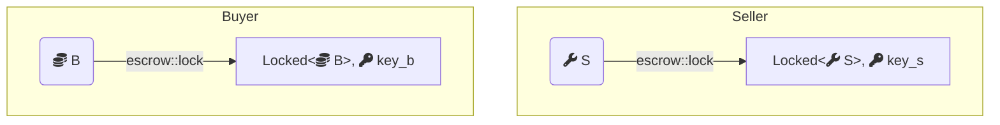
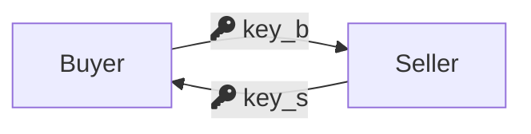
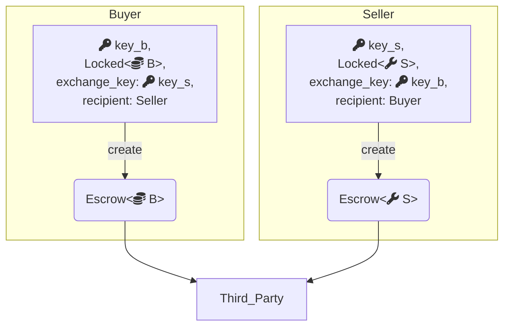
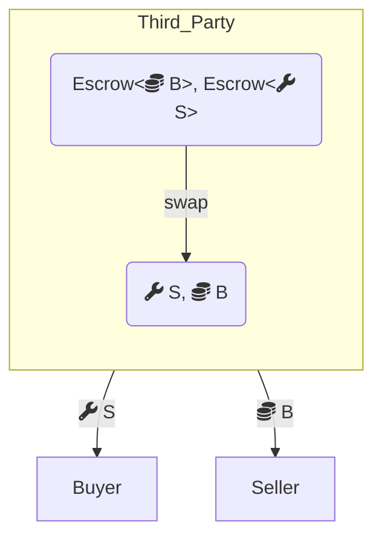
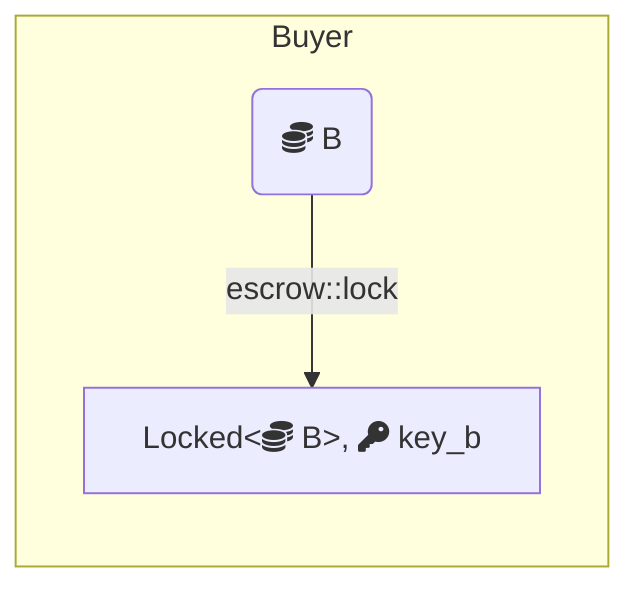
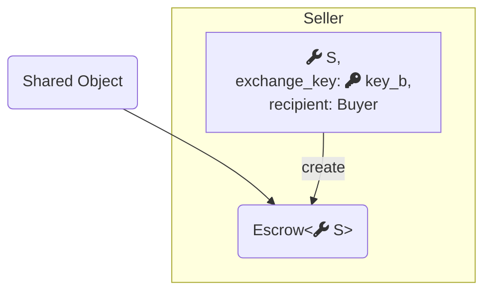
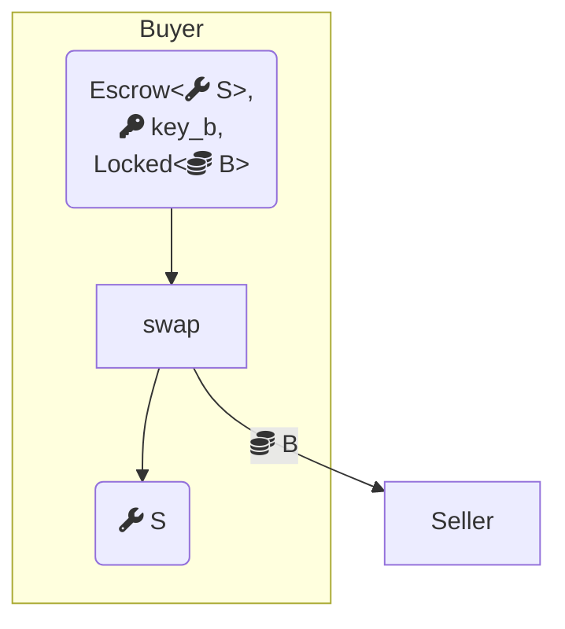

Choosing between [address-owned](/develop/objects/object-ownership/address-owned) and [shared](/develop/objects/object-ownership/shared) objects changes how a service is built, not just how it performs. This page implements the same trustless object swap 2 ways, once with address-owned objects and a custodian, and once with a shared object.

Both implementations use a locking primitive:

```move
module escrow::lock {
    public fun lock<T: store>(obj: T, ctx: &mut TxContext): (Locked<T>, Key);
    public fun unlock<T: store>(locked: Locked<T>, key: Key): T
}
```

Any `T: store` can be locked to get a `Locked<T>` and a corresponding `Key`. Unlocking consumes the key, so any tampering with the locked value is detectable by monitoring the key's ID.

View the [complete code](https://github.com/MystenLabs/sui/blob/main/examples/trading/contracts/escrow/sources/lock.move) on GitHub.

## Fastpath: address-owned objects

<details>
<summary>`owned.move`</summary>

<ImportContent source="examples/trading/contracts/escrow/sources/owned.move" mode="code" />

</details>

Both parties begin by locking their objects. If either decides not to proceed, they unlock and exit.



Both parties then swap keys:



A third-party custodian holds the objects and matches them when both arrive. The `create` function sends the `Escrow` request to the custodian, unlocking the offered object while recording the ID of the key it was locked with:

<ImportContent source="examples/trading/contracts/escrow/sources/owned.move" mode="code" fun="create" noComments />



Even though the custodian owns both objects, the only valid actions in Move are to match them correctly or return them. The `swap` function verifies that senders and recipients match and that each party wants what the other is offering by comparing key IDs:

<ImportContent source="examples/trading/contracts/escrow/sources/owned.move" mode="code" fun="swap" />



## Consensus: shared object

<details>
<summary>`shared.move`</summary>

<ImportContent source="examples/trading/contracts/escrow/sources/shared.move" mode="code" />

</details>

The first party locks the object they want to swap:



The second party views the locked object and, if interested, creates a swap request that passes their object directly into a shared `Escrow` object. The request records the sender (who can reclaim if the swap doesn't complete) and the intended recipient:

<ImportContent source="examples/trading/contracts/escrow/sources/shared.move" mode="code" fun="create" noComments />



The intended recipient completes the swap by providing their locked object:

<ImportContent source="examples/trading/contracts/escrow/sources/shared.move" mode="code" fun="swap" />



Although the `Escrow` object is shared and accessible by anyone, Move ensures only the original sender and intended recipient can interact with it. `swap` verifies the locked object matches what was requested, extracts the escrowed object, deletes the wrapper, and delivers both objects to their new owners.
