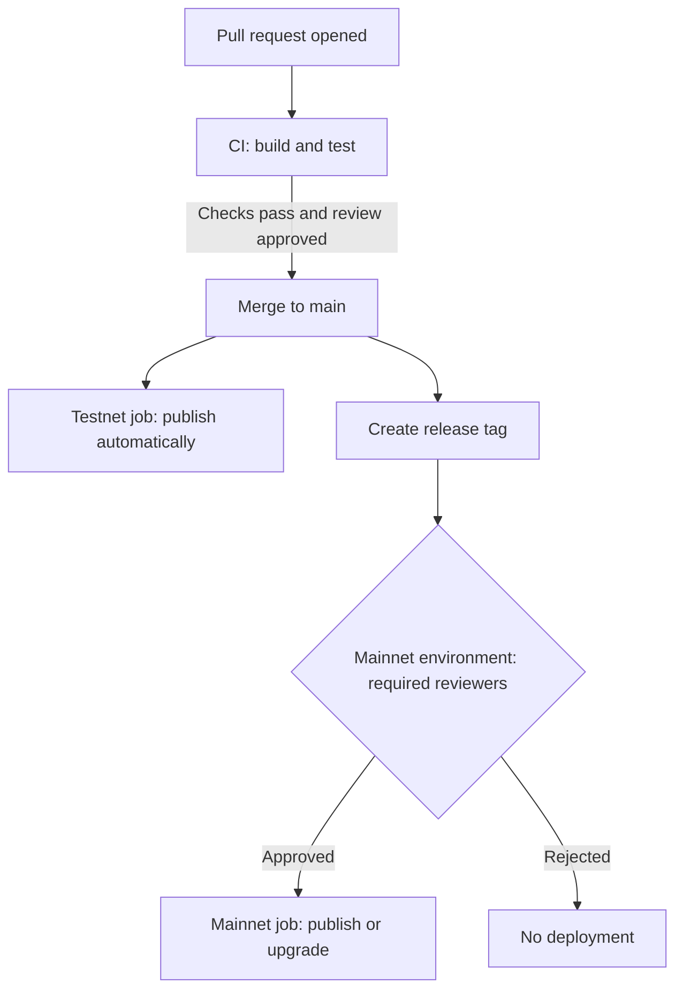

import Tabs from '@theme/Tabs';
import TabItem from '@theme/TabItem';

This guide shows how to deploy Move packages through a continuous integration and continuous delivery (CI/CD) pipeline in GitHub Actions. The goal is a production-safe setup, not a single workflow that publishes from a branch. A safe pipeline separates low-risk automation from high-risk actions, keeps signing keys out of logs, and requires a human to approve anything that touches Mainnet.

<Tabs className="tabsHeadingCentered--small">
<TabItem value="prereq" label="Prerequisites">
- [x] A Move package that builds and tests locally with the Sui CLI.
- [x] A GitHub repository with Actions enabled.
- [x] Familiarity with [publishing](/develop/publish-upgrade-packages) and [upgrading packages](/develop/publish-upgrade-packages/upgrade).
- [x] For Mainnet, a signing solution you control, such as a hardware wallet, a multisig, or a key management service, and a dedicated RPC endpoint.
</TabItem>
</Tabs>

## Recommended pipeline structure

Split the pipeline into three tiers, ordered by how much damage a mistake can cause. Each tier has a different trigger and a different level of automation.



The table below maps each tier to its trigger, automation level, and the protection it needs.

| **Tier** | **Trigger** | **Automation** | **Protection** |
|---|---|---|---|
| CI | Every pull request | Fully automated | Branch review before merge |
| Testnet | Merge to the default branch | Fully automated | Optional environment protection |
| Mainnet | Release tag or manual dispatch | Manual approval required | Required reviewers, restricted secrets |

CI gives fast feedback on every change. Testnet publishing is reversible in practice, because you can republish at any time, so you can automate it. Mainnet publishing and upgrades affect real users and real value, so a person approves them before they run.

## Handle secrets and signing

Treat the signing key as the most sensitive value in your pipeline. Anyone who reads it can publish or upgrade your package. Protect it with GitHub environments, keep it out of logs, and prefer a signer you control for Mainnet.

### Use GitHub environments and required reviewers

GitHub environments hold environment-scoped secrets and variables, and they support protection rules. Create one environment for each network tier, such as `testnet` and `mainnet`, then attach protection rules to the high-risk environment.

To gate Mainnet deployments, add required reviewers to the `mainnet` environment. When a job names that environment, GitHub pauses the run until a reviewer approves it. The job cannot read the environment secrets until approval, so an unreviewed branch cannot reach the Mainnet signing key.

Scope each secret to the narrowest environment that needs it. Store the Mainnet RPC URL and any Mainnet signing material only in the `mainnet` environment, never as repository-wide secrets.

### Keep private keys out of logs

GitHub masks registered secret values in run logs, but you remain responsible for not defeating that protection.

:::danger

Never print, echo, or commit a private key. Pass keys to a step through the `env` block rather than inline command interpolation, do not run commands that output the key, and never write a key into the repository, an artifact, or a job summary. A leaked key cannot be revoked, so rotate to a new address if you suspect exposure.

:::

When a step needs a key, map it from secrets to an environment variable and reference the variable. The Sui CLI reads the imported key from its keystore, so the key value appears only once, during import.

### Prefer external signers for production

For Mainnet, the strongest pattern keeps the private key out of CI entirely. CI builds an unsigned transaction, a signer you control approves it, and the signed transaction goes back to the network. This works with hardware wallets, multisig, and custody services.

The flow uses three commands. First, build the unsigned transaction in CI with the `--serialize-unsigned-transaction` flag, which every transaction-crafting command accepts, including `sui client publish` and `sui client upgrade`. Second, sign the transaction bytes offline with your signer. Third, submit the signed transaction:

```bash
$ sui client execute-signed-tx --tx-bytes <TX_BYTES> --signatures <SERIALIZED_SIGNATURE>
```

For details on signing the bytes and combining multisig signatures, see [Offline Signing](/develop/transactions/transaction-auth/offline-signing) and [Multisig Authentication](/develop/transactions/transaction-auth/multisig). For Testnet automation, importing a low-value key from a secret is acceptable because the stakes are low.

## Pin the Sui CLI to a release

Sui ships updates regularly, and the CLI version determines build output and framework compatibility. Pin the CLI to a specific release so your pipeline produces the same result every run. Use [suiup](https://github.com/MystenLabs/suiup) to install and pin a version. The `sui@NETWORK-VERSION` form pins both the network release line and the exact version.

Add these steps to any job that runs the Sui CLI. They install `suiup`, install a pinned Sui CLI, and add the binary directory to the path:

```yaml
- name: Install suiup
  run: cargo install --git https://github.com/MystenLabs/suiup.git --locked

- name: Install pinned Sui CLI
  run: |
    suiup install sui@${{ env.SUI_VERSION }}
    echo "$HOME/.suiup/bin" >> "$GITHUB_PATH"
```

Pin to the release line that matches the target network. Use a Testnet release for the Testnet job and a Mainnet release for the Mainnet job, because the CLI must agree with the onchain Sui framework version. The workflows below set `SUI_VERSION` per file, such as `testnet-1.51.4` or `mainnet-1.51.4`. Replace the version numbers with the current release you intend to pin.

## Test every pull request

The CI workflow runs on every pull request. It builds and tests the package but never publishes. This catches errors before review and never holds a signing key, so it is safe to run on any branch.

Save the following workflow as `.github/workflows/ci.yml`. It builds and tests the package on each pull request to the default branch:

```yaml title='.github/workflows/ci.yml'
name: CI

on:
  pull_request:
    branches: [main]

permissions:
  contents: read

env:
  SUI_VERSION: testnet-1.51.4
  PACKAGE_PATH: ./move/my_package

jobs:
  build-and-test:
    runs-on: ubuntu-latest
    steps:
      - name: Check out the repository
        uses: actions/checkout@v4

      - name: Cache Cargo and suiup
        uses: actions/cache@v4
        with:
          path: |
            ~/.cargo
            ~/.suiup
          key: suiup-${{ runner.os }}-${{ env.SUI_VERSION }}

      - name: Install suiup
        run: cargo install --git https://github.com/MystenLabs/suiup.git --locked

      - name: Install pinned Sui CLI
        run: |
          suiup install sui@${{ env.SUI_VERSION }}
          echo "$HOME/.suiup/bin" >> "$GITHUB_PATH"

      - name: Build
        run: sui move build --path ${{ env.PACKAGE_PATH }}

      - name: Test
        run: sui move test --path ${{ env.PACKAGE_PATH }}
```

:::caution

Do not auto-deploy unreviewed branches. Trigger publishing only after a change merges to a protected branch or carries a release tag. Running a publish job on `pull_request` from a fork or an arbitrary branch exposes your environment secrets to code that no one has reviewed.

:::

## Automate Testnet publishing

After a change merges to the default branch, publish to Testnet automatically. The workflow names the `testnet` environment, imports a low-value key from a secret, publishes, and captures the resulting IDs.

The CI address needs gas before it can publish. Fund the Testnet deployer address from the [Testnet faucet](/getting-started/onboarding/get-coins) once, ahead of time.

Save the following workflow as `.github/workflows/testnet.yml`:

```yaml title='.github/workflows/testnet.yml'
name: Publish to Testnet

on:
  push:
    branches: [main]

permissions:
  contents: read

concurrency:
  group: testnet-publish
  cancel-in-progress: false

env:
  SUI_VERSION: testnet-1.51.4
  PACKAGE_PATH: ./move/my_package

jobs:
  publish:
    runs-on: ubuntu-latest
    environment: testnet
    steps:
      - uses: actions/checkout@v4

      - name: Install pinned Sui CLI
        run: |
          cargo install --git https://github.com/MystenLabs/suiup.git --locked
          suiup install sui@${{ env.SUI_VERSION }}
          echo "$HOME/.suiup/bin" >> "$GITHUB_PATH"

      - name: Configure network and key
        env:
          SUI_PRIVATE_KEY: ${{ secrets.TESTNET_PRIVATE_KEY }}
        run: |
          sui client new-env --alias testnet --rpc https://fullnode.testnet.sui.io:443
          sui client switch --env testnet
          sui keytool import "$SUI_PRIVATE_KEY" ed25519
          sui client switch --address ${{ vars.TESTNET_ADDRESS }}

      - name: Publish and capture IDs
        run: |
          sui client publish --json --gas-budget 200000000 ${{ env.PACKAGE_PATH }} > publish.json
          PACKAGE_ID=$(jq -r '.objectChanges[] | select(.type == "published") | .packageId' publish.json)
          UPGRADE_CAP=$(jq -r '.objectChanges[] | select(.objectType == "0x2::package::UpgradeCap") | .objectId' publish.json)
          echo "Package ID: $PACKAGE_ID" >> "$GITHUB_STEP_SUMMARY"
          echo "UpgradeCap ID: $UPGRADE_CAP" >> "$GITHUB_STEP_SUMMARY"

      - name: Upload deployment record
        uses: actions/upload-artifact@v4
        with:
          name: testnet-publish
          path: |
            publish.json
            ${{ env.PACKAGE_PATH }}/Move.lock
```

The address lives in a repository variable rather than a secret, because addresses are public. Only the private key is sensitive.

## Gate Mainnet publishing and upgrades

The Mainnet workflow triggers on a release tag and names the `mainnet` environment, which carries required reviewers. The run pauses for human approval before it can read any Mainnet secret. The recommended job below builds an unsigned upgrade transaction and hands it off for signing, so no private key enters CI.

Save the following workflow as `.github/workflows/mainnet.yml`:

```yaml title='.github/workflows/mainnet.yml'
name: Mainnet release

on:
  push:
    tags: ['v*']

permissions:
  contents: read

concurrency:
  group: mainnet-release
  cancel-in-progress: false

env:
  SUI_VERSION: mainnet-1.51.4
  PACKAGE_PATH: ./move/my_package

jobs:
  prepare-upgrade:
    runs-on: ubuntu-latest
    environment: mainnet
    steps:
      - uses: actions/checkout@v4

      - name: Install pinned Sui CLI
        run: |
          cargo install --git https://github.com/MystenLabs/suiup.git --locked
          suiup install sui@${{ env.SUI_VERSION }}
          echo "$HOME/.suiup/bin" >> "$GITHUB_PATH"

      - name: Connect to a dedicated Mainnet RPC
        run: |
          sui client new-env --alias mainnet --rpc ${{ secrets.MAINNET_RPC_URL }}
          sui client switch --env mainnet
          sui client switch --address ${{ vars.MAINNET_SENDER_ADDRESS }}

      - name: Build the unsigned upgrade transaction
        run: |
          sui client upgrade \
            --upgrade-capability ${{ vars.MAINNET_UPGRADE_CAP }} \
            --gas-budget 500000000 \
            --serialize-unsigned-transaction \
            ${{ env.PACKAGE_PATH }} > unsigned-upgrade.txt

      - name: Upload unsigned transaction for custody signing
        uses: actions/upload-artifact@v4
        with:
          name: unsigned-upgrade
          path: unsigned-upgrade.txt
```

The artifact holds the Base64 transaction bytes. Sign those bytes with your hardware wallet, multisig, or custody service, then submit the signed transaction with `sui client execute-signed-tx`, as shown earlier. A first Mainnet publish follows the same pattern with `sui client publish --serialize-unsigned-transaction`.

If you accept single-key risk for a lower-assurance setup, you can sign and submit inside the gated job by importing a Mainnet key from the `mainnet` environment secret, the same way the Testnet job does. The manual approval and restricted secret scope still apply.

:::info

Public full nodes might rate-limit requests or lag behind the chain tip. For a Mainnet pipeline where reliability matters, point the CLI at a dedicated or commercial RPC endpoint stored in the `mainnet` environment, rather than a shared public URL.

:::

## Capture and commit package state

A publish or upgrade produces two kinds of state you need to keep: the IDs returned by the transaction and the updated package lock file.

### Capture the package ID and UpgradeCap ID

Publishing with the `--json` flag returns structured object changes. Parse them with `jq` to read the new package ID and the `UpgradeCap` object ID:

```bash
$ PACKAGE_ID=$(jq -r '.objectChanges[] | select(.type == "published") | .packageId' publish.json)
$ UPGRADE_CAP=$(jq -r '.objectChanges[] | select(.objectType == "0x2::package::UpgradeCap") | .objectId' publish.json)
```

Record both values. You need the package ID to call into the package and the `UpgradeCap` ID to authorize future upgrades. Write them to the job summary and upload the full JSON as an artifact so each deployment leaves an auditable record.

### Commit the lock file through a release branch

A successful publish or upgrade updates the package lock state for the target network. Depending on your toolchain version, the published address and version land in `Move.lock` under the environment section, or in a `Published.toml` file. Commit whichever file your build produces so the repository tracks what is live onchain.

Do not push directly from CI to a protected branch. Use a release branch flow instead:

1. Run Mainnet deployments from a release tag or a dedicated release branch.
2. After a successful deploy, have the workflow open a pull request that commits the updated `Move.lock`, or `Published.toml`, back to the release branch.
3. Review and merge that pull request like any other change.

This keeps the source of truth for onchain state in version control while preserving branch protection.

## Protect the UpgradeCap

The `UpgradeCap` is the object that authorizes upgrades to your package. Whoever holds it controls every future version of your code.

:::danger

Protect the `UpgradeCap` with the same care as a signing key. Do not leave it on a single hot key used by automation. For production, transfer it to a multisig or custody account, and consider locking its upgrade policy so it cannot become more permissive later. Calling `sui::package::make_immutable` destroys the `UpgradeCap` and makes the package permanently unupgradable, which removes single-key risk but also blocks all future fixes. This action is irreversible.

:::

Store the `UpgradeCap` ID as a non-sensitive variable so workflows can reference it, but keep ownership of the object itself with your signer, not with the CI runner. For background on upgrade policies, see [Custom Upgrade Policies](/develop/publish-upgrade-packages/custom-policies).
