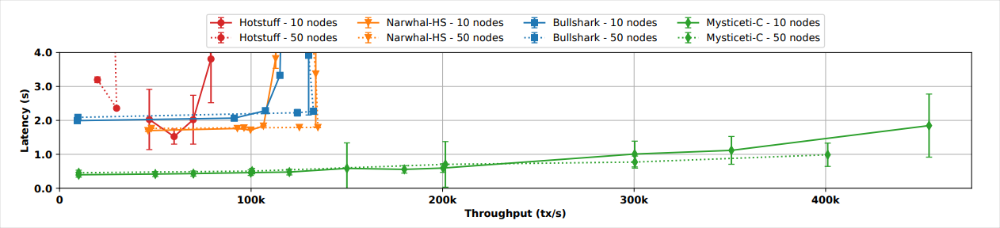

Consensus is the process by which the majority of nodes on a blockchain network agree on the current state of the network, including which transactions to finalize and commit to the chain's permanent history. This process prevents malicious or faulty nodes from altering the network incorrectly.

## Validator nodes

To participate in consensus, validators must [stake SUI tokens](/operators/validator/validator-rewards) on the network. Sui uses delegated proof-of-stake (DPoS) to determine which validators operate the network and their voting power. Validators are incentivized to participate in good faith through a share of transaction fees, [staking rewards](/operators/validator/validator-rewards), and slashing of stake and staking rewards in case of misbehavior.

### Epochs

An [epoch](/develop/sui-architecture/epochs) is a duration of time where the Sui validators and their stakes do not change. An epoch is about 24 hours on both [Mainnet](/develop/sui-architecture/networks) and [Testnet](/develop/sui-architecture/networks). At an epoch boundary, [reconfiguration](/develop/sui-architecture/epochs) might occur and can change the set of validators participating in the network and their voting power. Conceptually, reconfiguration starts a new instance of the Sui protocol with the previous epoch's final state as genesis and the new set of validators as the operators. Besides validator set changes, [tokenomics](/develop/sui-architecture/tokenomics-overview) operations such as staking and un-staking, and distribution of staking rewards are also processed at epoch boundaries.

### Quorums

A quorum is a set of [validators](/operators/validator/validator-config) whose combined voting power is greater than two-thirds (>2/3) of the total during a particular epoch. For example, in a Sui instance operated by 4 validators that all have the same voting power, any group containing 3 validators is a quorum.

The quorum size of >2/3 ensures Byzantine fault tolerance (BFT). Committing the block that carries a transaction is not on its own enough for that transaction to take effect. Peers vote on the transactions inside a block as they reference it, and the protocol accepts only transactions that gather enough accept votes. That threshold is what makes the guarantee hold: if validators holding >2/3 of the voting power follow the protocol, they eventually agree on both the set of accepted transactions and their effects.

## Submitting transactions

A validator exposes a single write entry point for user transactions. A client does not assemble a certificate and does not talk to a quorum itself.

### Submission

The user sends a signed transaction to a [full node](/operators/full-node/sui-full-node). The full node runs **Transaction Driver**, which picks a validator and submits the transaction to it. The receiving validator checks that the signature is valid, that the inputs exist and the sender is allowed to use them, and that the sender can cover the gas budget. If those checks pass, the validator includes the transaction in its next proposed consensus block.

Peer validators run the same checks when they receive that block, so a transaction that fails them is not accepted no matter which validator it entered through. This is what stops a single validator from admitting a double spend.

### Execution and finality

Consensus sequences the block, and every validator executes the accepted transactions in it against the same ordered state. Validators do not execute a transaction that a committed block carries but that consensus rejected. Execution is deterministic, so honest validators produce identical effects. Execution either succeeds and commits all of its effects, or aborts with no effect other than debiting the gas input. A transaction might abort because of an explicit abort instruction, a runtime error such as division by zero, or exceeding the maximum gas budget.

**Transaction Driver** then certifies the result: it takes the full effects from one validator and quorum acknowledgments of the same effects digest from the others. Holding those certified effects is proof of settlement finality, and the transaction is irreversible from that point. If the acknowledgments do not arrive, the full node waits for the transaction to appear in a certified checkpoint, which is itself proof of finality.

For the full path from signing through checkpoint inclusion, see [Transaction Lifecycle](/develop/transactions/transaction-lifecycle).
## Mysticeti

Sui uses a [directed acyclic graph](https://en.wikipedia.org/wiki/Directed_acyclic_graph)-based consensus protocol called Mysticeti that optimizes for both low latency and high throughput. Mysticeti supports multiple validators proposing blocks in parallel, which uses the full bandwidth of the network and provides censorship resistance. Mysticeti only requires 3 rounds of messages to commit blocks from the DAGs. This is the same as practical BFT and matches the theoretical minimum.

Mysticeti also allows voting and certifying leaders on blocks in parallel, which reduces median and tail latencies, and tolerates unavailable leaders without significantly increasing commit latencies.

The order of transactions in the consensus output determines the relative order in which they can operate on each shared object. Executions of transactions touching different shared objects are parallelized on multiple cores.

If the total execution cost of transactions in a consensus commit exceeds a threshold, transactions can be cancelled post consensus to avoid overloading the system.

### Transaction throughput

The following figures are benchmark results from controlled testing described in the [MYSTICETI: Reaching the Latency Limits with Uncertified DAGs](/paper/mysticeti.pdf) whitepaper and do not represent production metrics. In a controlled environment using 10 nodes, Mysticeti handles 300,000 transactions per second (TPS) before latency crosses the 1-second marker. With 50 nodes, test results show 400,000 TPS before latency exceeds 1 second. In the same tests, other top performing consensus mechanisms do not reach 150,000 TPS and their observed latency starts at about 2 seconds.

On average, benchmark testing shows Mysticeti reaches consensus commitment in about **0.5 seconds** with a sustained throughput of **200,000 TPS**.

### Decision rule

Traditional consensus decision rules require explicit block validation and certification. This process increases communication overhead because validators must sign and broadcast votes to reach consensus. By contrast, Mysticeti provides implicit commitment, which reduces inter-node communication and lowers bandwidth usage.

### Finality

Finality is the guarantee that a transaction or block, after confirmation, is permanently added to the network and cannot be altered or reversed. In traditional blockchain consensus, confirming transactions can take time because they rely on other transactions to reference them before they are considered final. This process slows down if network activity decreases or if there are many competing transactions.

Mysticeti simplifies this process by finalizing transactions immediately upon inclusion in the structure. As a result, there is no need to wait for additional confirmations or network activity, which makes Mysticeti faster and more reliable for confirming transactions in less active or challenging network conditions.

For more details, including correctness proofs, see the [MYSTICETI: Reaching the Latency Limits with Uncertified DAGs](/paper/mysticeti.pdf) whitepaper.
