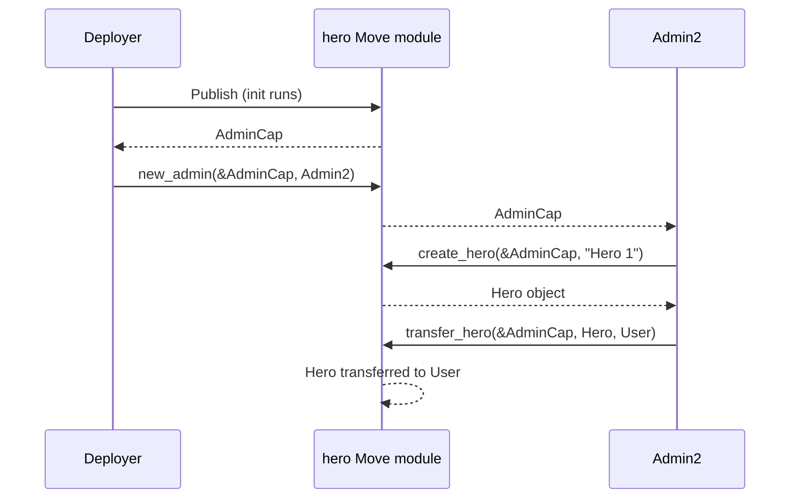

The Move [capability pattern](/develop/write-move/sui-move-concepts) enables [address-owned objects](/develop/objects/object-ownership/address-owned) to act as authorization tokens in Move. In this example, an `AdminCap` object gates who can create and transfer `Hero` objects, and existing admins can delegate authority by minting new `AdminCap` instances for other addresses.

## When to use this pattern

Use this pattern when you need to:

- Restrict who can call sensitive functions (minting, configuration, withdrawals) without hardcoding addresses.

- Delegate authority to multiple accounts rather than locking admin access to a single deployer.

- Revoke access by destroying or transferring the capability object, instead of managing an onchain allowlist.

- Compose authorization by requiring multiple capabilities for a single operation (for example, an `AdminCap` and a `MintCap`).

- Avoid the singleton constraint of the `Publisher` pattern when more than 1 account needs admin rights.

## What you learn

This example teaches:

- **Capability objects:** A struct with the `key` ability that acts as a permission token. Holding the object proves authorization. You do not need an onchain list or mapping.

- **Reference-based gating:** Functions accept `&AdminCap` (an immutable reference) as a parameter. The caller must own the object to pass it, but the function does not consume it.

- **Delegation:** An existing capability holder can create new capability objects and transfer them to other addresses, granting those addresses the same privileges.

- **Init-time issuance:** The `init` function creates the first `AdminCap` and transfers it to the deployer. This is the only way the first capability enters circulation.

## Architecture

In this example, the deployer receives the initial `AdminCap` when the module is published. That capability gates 3 operations: creating heroes, transferring heroes, and delegating admin access. The deployer can call `new_admin` to mint a second `AdminCap` for another address, giving them the same privileges. Any `AdminCap` holder can create a `Hero` and transfer it to a user.

The diagram below traces the delegation and hero creation flow.



The following steps walk through the flow:

1. The deployer publishes the module. The `init` function creates `AdminCap #1` and transfers it to the deployer.

2. The deployer calls `new_admin` with a reference to their `AdminCap` and Admin2's address. The function mints `AdminCap #2` and transfers it to Admin2.

3. Admin2 calls `create_hero` with a reference to their `AdminCap`. The function creates a new `Hero` and returns it.

4. Admin2 calls `transfer_hero` with their `AdminCap`, the `Hero`, and a user address. The function transfers the hero to the user.

Access control fails if the caller does not own an `AdminCap`. Move's type system enforces this at transaction construction time, because the caller cannot produce a `&AdminCap` reference without owning one.

## Prerequisites

<Tabs className="tabsHeadingCentered--small">
<TabItem value="prereq" label="Prerequisites">
- [x] [Install the latest version of Sui](/getting-started/onboarding/sui-install).

- [x] [Configure the Sui client](/getting-started/onboarding/configure-sui-client).

- [x] [Create a Sui address](/getting-started/onboarding/get-address).

- [x] [Get SUI Testnet tokens](/getting-started/onboarding/get-coins).

- [x] Download and install an IDE. The following are recommended, as they offer Move extensions:

    - [VSCode](https://code.visualstudio.com/), corresponding [Move extension](https://marketplace.visualstudio.com/items?itemName=mysten.move)

    - [Emacs](https://www.gnu.org/software/emacs/), corresponding [Move extension](https://github.com/amnn/move-mode)

    - [Vim](https://www.vim.org/download.php), corresponding [Move extension](https://github.com/yanganto/move.vim)

    - [Zed](https://zed.dev/), corresponding [Move extension](https://github.com/Tzal3x/move-zed-extension)
    
        Alternatively, you can use the [Move web IDE](https://www.playmove.dev/), which does not require a download. It does not support all functions necessary for this guide, however.

- [x] [Download and install Git](https://git-scm.com/downloads).

- [x] [Node.js](https://nodejs.org/) 18 or later

</TabItem>
</Tabs>

## Setup

Follow these steps to set up the example locally.

##### Step 1: Clone the repo

```bash
$ git clone -b solution https://github.com/MystenLabs/sui-move-bootcamp.git
$ cd sui-move-bootcamp/C1/capability
```

##### Step 2: Build and test

```bash
$ rm Move.lock
$ sui move build
$ sui move test
```

All 4 tests should pass, confirming the capability pattern works for initialization, hero creation, hero transfer, and admin delegation.

##### Step 3: Publish to Testnet (optional)

```bash
$ sui client switch --env testnet
$ sui client publish --gas-budget 200000000
```

The `init` function automatically creates and transfers the `AdminCap` to your address. Take note of your package's ID and the object ID:

```
│ Created Objects:                                                                                   │
│  ┌──                                                                                               │
│  │ ObjectID: 0x88b18141ae40ab392479f2046ba4e93b27f22a2d1e031dcf01d4a4d37650f917        <---- Object ID            │
│  │ Sender: 0x9ac241b2b3cb87ecd2a58724d4d182b5cd897ad307df62be2ae84beddc9d9803                      │
│  │ Owner: Account Address ( 0x9ac241b2b3cb87ecd2a58724d4d182b5cd897ad307df62be2ae84beddc9d9803 )   │
│  │ ObjectType: 0x18f1a5f9f0fd5e9a903477fdfc8160979aa8b0a0791bf3308143240577a24c83::hero::AdminCap  │ <-- Note Object Type of hero::AdminCap
│  │ Version: 847518299                                                                              │
│  │ Digest: HLrKjEFdQ6T7JkwTNrAPyMXS3cvEjVbwKR6QYr3oNYbc   
...
│ Published Objects:                                                                                 │
│  ┌──                                                                                               │
│  │ PackageID: 0x18f1a5f9f0fd5e9a903477fdfc8160979aa8b0a0791bf3308143240577a24c83      <---- Package ID             │
│  │ Version: 1                                                                                      │
│  │ Digest: 2yoR5uP5iMf3gjvoUxsehfLttNf42cxP4F2JLbdGtt22                                            │
│  │ Modules: hero                                                                                   │
│  └──                                                                                               │
╰──────────────────────────

## Run the example

After publishing, verify you received the `AdminCap`:

```bash
$ sui client objects
```

You should see an object of type `capability::hero::AdminCap` in your owned objects. 

To create a hero and transfer it to another address, replace `PACKAGE_ID` with your published package ID, `ADMIN_CAP_ID` with the object ID to use `AdminCap` to create a hero, and replace `RECIPIENT_ADDRESS` with your destination address.

```bash
$ sui client ptb --move-call '@OBJECT_ID::hero::create_hero' @PACKAGE_ID '"My Hero"' --assign hero --move-call 'OBJECT_ID::hero::transfer_hero' @PACKAGE_ID hero @RECIPIENT_ADDRESS --gas-budget 10000000  
```

The transaction creates a `Hero` object owned by your address, then delegates admin access to another address.

## Key code highlights

The following snippets are the parts of the code worth reading carefully.

### The `AdminCap` capability struct

The `AdminCap` struct is the authorization token. Owning it proves you have admin privileges.

<ImportContent source="C1/capability/sources/hero.move" mode="code" org="MystenLabs" repo="sui-move-bootcamp" branch="solution" struct="AdminCap" />

The struct has only the `key` ability (not `store`), which means it can exist as a Sui object but cannot be wrapped inside another object. It has a single `id` field. The struct carries no data because its purpose is purely authorization: if you can pass a `&AdminCap` reference, you have permission.

### Issuing the first capability in `init`

The `init` function creates the initial `AdminCap` and transfers it to the module deployer.

<ImportContent source="C1/capability/sources/hero.move" mode="code" org="MystenLabs" repo="sui-move-bootcamp" branch="solution" fun="init" />

This function runs once when the module is published. It creates a new `AdminCap` with a fresh UID and transfers it to `ctx.sender()` (the deployer). This is the only way the first capability enters the system.

### Gating a function with a capability reference

The `create_hero` function requires an `&AdminCap` reference as its first parameter.

<ImportContent source="C1/capability/sources/hero.move" mode="code" org="MystenLabs" repo="sui-move-bootcamp" branch="solution" fun="create_hero" />

The parameter `_: &AdminCap` is an immutable reference that the function does not use (hence the underscore). Its purpose is purely as a gate: the caller must own an `AdminCap` to produce this reference. The function creates and returns a new `Hero` with the given name.

### Delegating authority

The `new_admin` function lets an existing admin mint a new `AdminCap` for another address.

<ImportContent source="C1/capability/sources/hero.move" mode="code" org="MystenLabs" repo="sui-move-bootcamp" branch="solution" fun="new_admin" />

This function takes a reference to the caller's `AdminCap` (proving they have authority), creates a new `AdminCap`, and transfers it to the target address. The new admin has identical privileges. Unlike an allowlist-based approach, each admin holds their own independent object, so revoking 1 admin (by destroying their cap) does not affect others.

## Common modifications

- **Add a `MintCap` separate from `AdminCap`:** Split creation and administration into 2 capabilities. The deployer holds `AdminCap` for configuration, and minters hold `MintCap` for hero creation. This follows the principle of least privilege.

- **Gate with multiple capabilities:** Require both an `AdminCap` and a `TreasuryKey` to call a withdrawal function. The caller must hold 2 separate objects, which enables multi-sig-like authorization at the application layer.

- **Add `store` ability to `AdminCap`:** This lets the cap be wrapped inside other objects, enabling patterns like time-locked capabilities or escrow.

## Troubleshooting

The following sections address common issues with this example.
### Cannot call `create_hero` because `AdminCap` is missing

**Symptom:** The transaction fails with an error about not being able to provide the `AdminCap` argument.

**Cause:** Your address does not own an `AdminCap`. Either you are not the deployer, or no admin delegated a cap to you.

**Fix:** Ask an existing admin to call `new_admin` with your address. Or re-publish the module from your address to receive the initial cap.

### Test fails with `has_most_recent_for_address returned false`

**Symptom:** The `test_publisher_address_gets_admin_cap` test fails.

**Cause:** The `init` function did not run, or ran with a different sender address than the test expects.

**Fix:** Verify the test uses the same address constant (`ADMIN`) as the `ts::begin(ADMIN)` call. The `init` function transfers the cap to `ctx.sender()`, which is the address passed to `begin`.

### `Hero` has `key` but not `store`, cannot wrap it

**Symptom:** Trying to wrap a `Hero` inside another object fails with an ability constraint error.

**Cause:** `Hero` has `key` but the code shown does not include `store`. Without `store`, the object cannot be placed inside another object's fields.

**Fix:** Add `store` to the `Hero` struct abilities if you need to wrap it: `public struct Hero has key, store { ... }`. The example already includes `store` on `Hero` for this reason.
