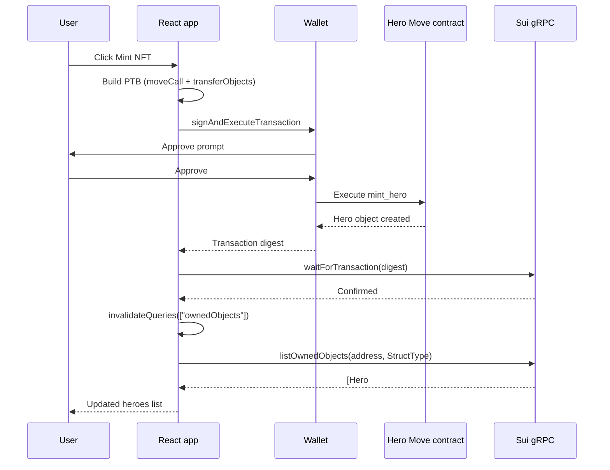

[dApp Kit](https://sdk.mystenlabs.com/dapp-kit) provides a React starter template that provides scaffolding for wallet connection, transaction building, onchain queries, and cache invalidation. In this example, the app connects to a deployed Hero NFT contract, mints an NFT with a single button click, and displays all owned heroes by filtering objects by type. This example does not include Move code, as it focuses entirely on the TypeScript frontend patterns.

## When to use this pattern

Use this pattern when you need to:

- Set up a Sui-connected React app from scratch with wallet management and network switching.

- Build and execute transactions from a browser using `signAndExecuteTransaction`.

- Query a user's owned objects filtered by a specific Move type (for example, all `Hero` NFTs).

- Automatically refresh the UI after a transaction completes using React Query cache invalidation.

- Create a starter template for any Sui app frontend that you can extend with your own contract calls.

## What you learn

This example teaches:

- **Provider setup:** The app wraps components in `QueryClientProvider` (React Query) and `DAppKitProvider` (Sui). The dApp Kit config creates `SuiGrpcClient` instances for each network. This is the foundation every Sui React app needs.

- **Wallet hooks:** `useCurrentAccount()` returns the connected wallet address (or null). `useDAppKit()` provides `signAndExecuteTransaction` and the Sui client. These hooks drive all wallet-dependent UI.

- **Transaction building:** The `Transaction` class creates a PTB. `tx.moveCall()` calls a Move function. `tx.transferObjects()` sends the result to the user. `signAndExecuteTransaction` prompts the wallet to sign and submit.

- **Reactive queries:** `useQuery` fetches data from the chain with a query key tied to the wallet address. When the key changes (wallet connects/disconnects) or the cache is invalidated (after a transaction), React Query refetches automatically.

- **Cache invalidation pattern:** After `waitForTransaction` confirms a transaction, `queryClient.invalidateQueries` marks the owned-objects cache as stale. React Query refetches in the background, and the component re-renders with the new data.

## Architecture

The example has 1 React app that connects to a deployed Move contract on Testnet. The React app renders a mint button, a wallet status card, and an owned-objects list. The wallet (Slush Wallet or any Sui-compatible wallet) handles signing. The Sui gRPC node serves object queries for the owned-objects list.

The diagram below traces 1 mint-and-refresh cycle.



The following steps walk through the flow:

1. The user clicks **Mint NFT**. The frontend builds a PTB with `moveCall` targeting the deployed `mint_hero` function and `transferObjects` to send the result to the user's address.

2. The frontend calls `signAndExecuteTransaction`, which prompts the wallet to sign and submit. The wallet executes the transaction on Testnet.

3. The frontend calls `waitForTransaction` to wait for confirmation, then calls `queryClient.invalidateQueries` with the `["ownedObjects", address]` key.

4. React Query detects the stale cache and refetches by calling `listOwnedObjects` with a `StructType` filter for `Hero`. The component re-renders with the updated list.

## Prerequisites

<Tabs className="tabsHeadingCentered--small">
<TabItem value="prereq" label="Prerequisites">
- [x] [Install the latest version of Sui](/getting-started/onboarding/sui-install).

- [x] [Configure the Sui client](/getting-started/onboarding/configure-sui-client).

- [x] [Create a Sui address](/getting-started/onboarding/get-address).

- [x] [Get SUI Testnet tokens](/getting-started/onboarding/get-coins).

- [x] Download and install an IDE. The following are recommended, as they offer Move extensions:

    - [VSCode](https://code.visualstudio.com/), corresponding [Move extension](https://marketplace.visualstudio.com/items?itemName=mysten.move)

    - [Emacs](https://www.gnu.org/software/emacs/), corresponding [Move extension](https://github.com/amnn/move-mode)

    - [Vim](https://www.vim.org/download.php), corresponding [Move extension](https://github.com/yanganto/move.vim)

    - [Zed](https://zed.dev/), corresponding [Move extension](https://github.com/Tzal3x/move-zed-extension)
    
        Alternatively, you can use the [Move web IDE](https://www.playmove.dev/), which does not require a download. It does not support all functions necessary for this guide, however.

- [x] [Download and install Git](https://git-scm.com/downloads).

- [x] [Node.js](https://nodejs.org/) 18 or later

- [x] A Sui wallet ([Slush Wallet](https://slush.app/) or another compatible wallet)

</TabItem>
</Tabs>

## Setup

Follow these steps to set up the example locally.

##### Step 1: Clone the repo

```bash
$ git clone -b solution https://github.com/MystenLabs/sui-move-bootcamp.git
$ cd sui-move-bootcamp/E2/my-first-sui-dapp
```

##### Step 2: Install dependencies

```bash
$ pnpm install
```

##### Step 3: Start the dev server

```bash
$ pnpm dev
```

You do not need a `.env` file if you use the hardcoded contract addresses in the source.

## Run the example

Open `http://localhost:5173` in a browser and click **Connect** in the top-right corner to link your wallet. Once connected, the wallet status card shows your address. Click **Mint NFT** to mint a Hero. After the transaction confirms, the owned-objects section updates to show your new hero's object ID.

## Key code highlights

The following snippets are the parts of the code worth reading carefully.

### dApp Kit configuration

The `dapp-kit.ts` file configures multi-network gRPC clients for Devnet, Testnet, and Mainnet.

<ImportContent source="E2/my-first-sui-dapp/src/dapp-kit.ts" mode="code" org="MystenLabs" repo="sui-move-bootcamp" branch="solution" />

The `createDAppKit` factory takes an array of network configs, each with a `chain` identifier and a `createClient` factory. The `SuiGrpcClient` uses binary protocol for faster communication than JSON-RPC. The module declaration augments dApp Kit's types so TypeScript knows about the configured networks.

### Minting an NFT with a PTB

The `MintNFTForm` component builds a transaction, signs it with the wallet, and invalidates the cache after confirmation.

<ImportContent source="E2/my-first-sui-dapp/src/components/ui/MintNFTForm.tsx" mode="code" org="MystenLabs" repo="sui-move-bootcamp" branch="solution" fun="MintNFTForm" />

The `handleMint` function builds a `Transaction` with `moveCall` targeting the deployed `mint_hero` function, then `transferObjects` to send the hero to the user's address. After `signAndExecuteTransaction` returns the digest, it waits for confirmation and invalidates the `["ownedObjects", address]` query key so the heroes list refetches.

### Querying owned objects by type

The `OwnedObjects` component uses `listOwnedObjects` with a `StructType` filter to show only Hero NFTs.

<ImportContent source="E2/my-first-sui-dapp/src/OwnedObjects.tsx" mode="code" org="MystenLabs" repo="sui-move-bootcamp" branch="solution" fun="OwnedObjects" />

The `useQuery` hook fetches owned objects only when a wallet is connected (`enabled: !!account`). The `StructType` filter limits results to the Hero type. The query key includes the address so the cache is per-wallet. React Query handles loading, error, and empty states.

### Provider hierarchy

The `main.tsx` entry point wraps the app in the required providers.

<ImportContent source="E2/my-first-sui-dapp/src/main.tsx" mode="code" org="MystenLabs" repo="sui-move-bootcamp" branch="solution" />

The provider order matters: `QueryClientProvider` must wrap `DAppKitProvider` because dApp Kit hooks use React Query internally. The `initialChain` prop sets Testnet as the default network.

## Common modifications

- **Add network switching:** Use dApp Kit's `useChainSwitch` hook to let users switch between Testnet and Mainnet from the UI. The gRPC clients are already configured for all 3 networks.

- **Display object details:** After listing owned heroes, call `getObject` with `showContent: true` to fetch each hero's name, stamina, and weapon. Render hero cards instead of raw IDs.

- **Add form inputs for mint parameters:** Replace the hardcoded mint arguments with a form that accepts hero name and stamina. Pass user values to `tx.pure.string()` and `tx.pure.u64()`.

- **Add pagination for owned objects:** The `listOwnedObjects` response includes a `nextCursor`. Use React Query's `useInfiniteQuery` to load more objects on scroll.

- **Add transaction history:** After each mint, store the transaction digest in local state or `localStorage`. Display a history section with links to the Sui explorer.

## Troubleshooting

The following sections address common issues with this example.
### Wallet does not appear in connect modal

**Symptom:** Clicking **Connect** opens the modal but no wallet is listed.

**Cause:** No supported wallet extension is installed, or the extension is disabled for the current site.

**Fix:** Install Slush Wallet or another Sui-compatible wallet. Enable it for `localhost:5173`. Refresh the page.

### Owned objects list is empty after minting

**Symptom:** The mint transaction succeeds but no heroes appear in the list.

**Cause:** The `StructType` filter in `OwnedObjects.tsx` does not match the deployed contract's full type path, or the component did not invalidate the React Query cache.

**Fix:** Verify the `StructType` matches `PACKAGE_ID::hero::Hero` exactly. Confirm `invalidateQueries` uses the same query key as the `useQuery` call. If you are reading through a separately indexed API after execution, wait for indexing before invalidating. GraphQL execution-attached selections can often return transaction effects and related execution data in the same request without waiting for a follow-up indexed query.

### `signAndExecuteTransaction` fails silently

**Symptom:** Clicking **Mint NFT** does nothing and no wallet popup appears.

**Cause:** The wallet is not connected, or the `useDAppKit()` hook is called outside the `DAppKitProvider`.

**Fix:** Check that `useCurrentAccount()` returns a non-null value before calling `signAndExecuteTransaction`. Verify `DAppKitProvider` wraps the component tree in `main.tsx`.

### gRPC client returns network error

**Symptom:** Queries fail with a connection or timeout error.

**Cause:** The gRPC endpoint URL is wrong or unreachable from the browser.

**Fix:** Verify the URLs in `dapp-kit.ts` match the current Sui gRPC endpoints. The standard endpoints are `https://grpc.testnet.sui.io` for Testnet and `https://grpc.mainnet.sui.io` for Mainnet.
