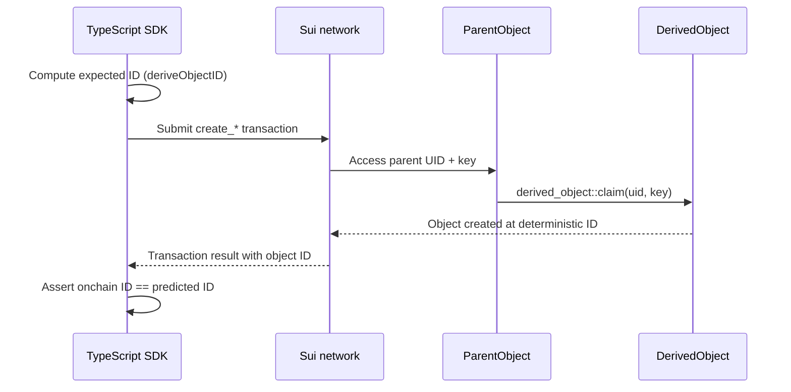

Derived objects are Sui objects with deterministic IDs computed from a parent object and a key. You can predict a derived object's ID offchain before the transaction that creates it runs, which enables indexer-free lookups, batch queries, and state verification.

## When to use this pattern

Use this pattern when you need to:

- Look up an object by a known key (a user address, a string identifier, a counter) without an indexer or event query.

- Predict an object's ID before creating it, so the frontend or another contract can reference it immediately.

- Build paginated collections where each item's ID is derived from a sequential counter, enabling reverse-order traversal without an indexer.

- Create 1-to-1 mappings between a parent object and child records (for example, a user profile per game, a config per module).

- Avoid dynamic fields when you need the derived object to be a standalone top-level object with its own ownership and transferability.

## What you learn

This example teaches:

- **Derived objects:** Top-level Sui objects whose IDs are deterministically computed from a parent UID and a serialized key. The same parent + key always produces the same ID.

- **Derivation strategies:** 4 key types that cover different use cases: `u64` (incremental counter), `address` (per-user objects), `String` (named resources), and custom structs (composite keys).

- **Offchain ID prediction:** The `deriveObjectID` function in the TS SDK computes the same ID the chain computes, so you can reference an object before it exists.

- **Indexer-free queries:** Because IDs are deterministic, you can enumerate objects by iterating over a known key space (for example, counter values 0 through N) and computing each ID locally.

## Architecture

The example has 2 components: a Move package that creates derived objects onchain, and a TypeScript test suite that predicts IDs offchain and verifies them against Testnet. The diagram below traces the derivation flow for 1 object.



The following steps walk through the flow:

1. The TypeScript test computes the expected object ID offchain using `deriveObjectID(parentObjectId, keyType, serializedKey)`. No network call is needed.

2. The test builds and submits a transaction that calls 1 of the 4 `create_*` entry functions with the parent object and the key.

3. The Move function calls `derived_object::claim` with the parent's mutable UID reference and the key. The chain computes the object ID from the same inputs.

4. The newly created object appears at exactly the ID the test predicted. The test asserts they match.

This pattern means any client that knows the parent ID and the key can compute the derived object's ID without querying the chain.

[Learn more about derived objects](/develop/objects/derived-objects).

## Prerequisites

<Tabs className="tabsHeadingCentered--small">
<TabItem value="prereq" label="Prerequisites">

- [x] [Install the latest version of Sui](/getting-started/onboarding/sui-install).

- [x] [Configure the Sui client](/getting-started/onboarding/configure-sui-client).

- [x] [Create a Sui address](/getting-started/onboarding/get-address).

- [x] [Get SUI Testnet tokens](/getting-started/onboarding/get-coins).

- [x] Download and install an IDE. The following are recommended, as they offer Move extensions:

    - [VSCode](https://code.visualstudio.com/), corresponding [Move extension](https://marketplace.visualstudio.com/items?itemName=mysten.move)

    - [Emacs](https://www.gnu.org/software/emacs/), corresponding [Move extension](https://github.com/amnn/move-mode)

    - [Vim](https://www.vim.org/download.php), corresponding [Move extension](https://github.com/yanganto/move.vim)

    - [Zed](https://zed.dev/), corresponding [Move extension](https://github.com/Tzal3x/move-zed-extension)
    
        Alternatively, you can use the [Move web IDE](https://www.playmove.dev/), which does not require a download. It does not support all functions necessary for this guide, however.

- [x] [Download and install Git](https://git-scm.com/downloads).

- [x] Node.js 18 or later

</TabItem>
</Tabs>

## Setup

Follow these steps to set up the example locally.

##### Step 1: Clone the repo

```bash
$ git clone -b solution https://github.com/MystenLabs/sui-move-bootcamp.git
$ cd sui-move-bootcamp/C5
```

##### Step 2: Publish the Move package

```bash
$ cd contracts/derived_objects
$ sui client switch --env testnet
$ sui move build
$ sui client publish --gas-budget 200000000
```

Record the package ID and parent object ID from the output.

```bash
│  ┌──                                                                                                    │
│  │ ObjectID: 0xcb497ec47a994a71c04c351cd307682c49b31f586251cb51aa0acae3cb91d59e                   <---- Parent Object ID       │
│  │ Sender: 0x9ac241b2b3cb87ecd2a58724d4d182b5cd897ad307df62be2ae84beddc9d9803                           │
│  │ Owner: Shared( 847518303 )                                                                           │
│  │ ObjectType: 0x67a9682e05ec2a0023f3500f1b4d07c7569b5ed4929b350b61d0bb0453f4867::parent::ParentObject  │
│  │ Version: 847518303                                                                                   │
│  │ Digest: 76emagtHjhr6kVeFiS4QA2YjYchHdu2BF1QpyczS3sUX                                                 │
│  └──  
...
│ Published Objects:                                                                                      │
│  ┌──                                                                                                    │
│  │ PackageID: 0x067a9682e05ec2a0023f3500f1b4d07c7569b5ed4929b350b61d0bb0453f4867             <----- Package ID           │
│  │ Version: 1                                                                     
```

##### Step 3: Configure the TypeScript tests

```bash
$ cd ../../ts
$ bun install
$ cp .env.example .env
```

Edit `.env` with the values from the publish step. You can get your USER_SECRET_KEY from the command `sui keytool export --key-identity <ADDRESS>`

```bash title='.env'
NETWORK=testnet
PACKAGE_ID=PACKAGE_ID_FROM_STEP_2
PARENT_OBJECT_ID=PARENT_OBJECT_ID_FROM_STEP_2
USER_SECRET_KEY=YOUR_TESTNET_PRIVATE_KEY
DERIVED_STRUCT_KEY_SIGNATURE=DerivedObjectStructKey
```

## Run the example

Run the test suite against Testnet:

```bash
$ bun test
```

The tests create derived objects using each of the 4 key types, predict their IDs offchain, and assert the onchain results match. A passing suite confirms that offchain ID prediction works correctly for all derivation strategies.

## Key code highlights

The following snippets are the parts of the code worth reading carefully.

### Parent object with incremental counter

The `ParentObject` struct holds the shared UID that all derived objects derive from, plus an incremental counter for sequential derivation.

<ImportContent source="C5/contracts/derived_objects/sources/parent.move" mode="code" org="MystenLabs" repo="sui-move-bootcamp" branch="solution" struct="ParentObject" />

The `uid_mut_ref` function exposes the parent's UID as a mutable reference, which `derived_object::claim` requires. The `incremental_counter` gives each sequentially derived object a unique key.

### Offchain ID prediction

The `deriveObjectIDFromParent` helper computes a derived object's ID using the Sui SDK, without any network call.

<ImportContent source="C5/ts/src/helpers/deriveObjectID.ts" mode="code" org="MystenLabs" repo="sui-move-bootcamp" branch="solution" fun="deriveObjectIDFromParent" />

The function serializes the key with BCS, passes it to `deriveObjectID` along with the parent object ID and the key's type tag, and returns the predicted ID. The tests verify this matches the onchain result.

## Common modifications

- Per-user profiles: Use `create_address` with the player's wallet address as the key. Each user gets exactly 1 derived profile object per game. Look it up by computing `deriveObjectID(gameId, "address", userAddress)`.

- Named configuration objects: Use `create_string` with config names like `"fee_schedule"` or `"whitelist"`. Any client can find the config object by name without querying events.

- Batch create and verify: Build a PTB that calls `create_incremental` multiple times in a single transaction. Predict all IDs offchain from the current counter value before submitting, then verify the batch.

## Troubleshooting

The following sections address common issues with this example.
### Derived object ID does not match prediction

**Symptom:** The test asserts that the onchain object ID equals the predicted ID, but they differ.

**Cause:** The key type tag or BCS serialization does not match between the TypeScript prediction and the Move contract. Common issues: using `"u64"` instead of the full type path, or serializing a string without the BCS length prefix.

**Fix:** Verify the `keyType` parameter matches the Move type exactly. For built-in types, use the `TYPE_TAGS` enum (`"0x1::string::String"`, `"address"`, `"u64"`). For custom structs, use the fully qualified type path including the package ID.

### Object already exists at derived ID

**Symptom:** The `derived_object::claim` call aborts because an object already exists at the computed ID.

**Cause:** A derived object with the same parent + key combination was already created. Derived IDs are unique per parent-key pair.

**Fix:** Use a different key value. For incremental derivation, this happens automatically because the counter advances. For address or string keys, check whether the object already exists before creating.

### Parent object not found

**Symptom:** The transaction fails with an object-not-found error for the `ParentObject`.

**Cause:** The `PARENT_OBJECT_ID` in `.env` is wrong, or the package was published on a different network than the client targets.

**Fix:** Verify the parent object ID from the publish transaction output. Confirm `NETWORK` in `.env` matches the network the package was published on.

### Type tag mismatch for struct keys

**Symptom:** The custom struct derivation test fails because the offchain ID does not match.

**Cause:** The `DERIVED_STRUCT_KEY_SIGNATURE` environment variable does not match the Move struct's fully qualified type path.

**Fix:** Set `DERIVED_STRUCT_KEY_SIGNATURE` to the struct name as it appears in the Move module (for example, `DerivedObjectStructKey`). The test utility prepends the package ID and module path automatically.