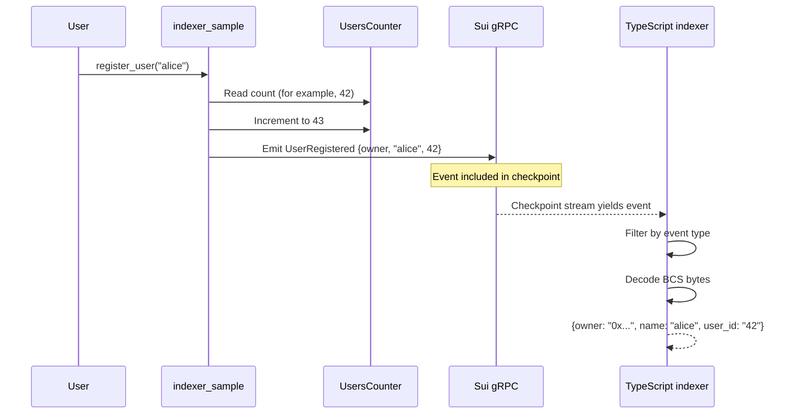

A real-time event indexer demonstrates how to listen for onchain events as they happen. In this example, a Move contract emits `UserRegistered` events when users register, and a TypeScript backend subscribes to Sui checkpoints through [gRPC](/develop/accessing-data/grpc), filters for those events, and decodes the BCS-encoded data into readable objects.

## When to use this pattern

Use this pattern when you need to:

- React to onchain events in real time without polling. For example, updating a leaderboard, sending notifications, or triggering offchain workflows.

- Build a custom indexer that processes specific event types from your Move contract.

- Decode BCS-encoded event data in TypeScript to extract structured fields from raw blockchain output.

- Subscribe to Sui checkpoints through gRPC streaming for lower latency than JSON-RPC polling.

## What you learn

This example teaches:

- **Move events:** A struct with `copy` and `drop` abilities that you pass to `sui::event::emit`. The network indexes events and makes them queryable by type. They carry data but do not create onchain objects.

- **gRPC checkpoint streaming:** The `SuiGrpcClient.subscribeCheckpoint` method opens a persistent stream that yields each new checkpoint as it finalizes. The `readMask` parameter filters the response to only include the fields you need (in this case, `transactions.events`).

- **BCS event decoding:** Move encodes events with BCS. The TypeScript SDK provides `BCS.struct` to define a schema that matches the Move struct layout. Parsing the raw bytes with this schema produces a typed JavaScript object.

- **Shared counter pattern:** The `UsersCounter` is a shared object that tracks how many users have registered. Each `register_user` call reads the current count as the user's ID, then increments it. This is a common pattern for sequential ID assignment.

## Architecture

The example has 2 components: a Move contract that emits events and a TypeScript backend that indexes them. The diagram below traces 1 registration from the user to the indexer.



The following steps walk through the flow:

1. The user calls `register_user` with a name string and a reference to the shared `UsersCounter`.

2. The contract reads the current `count` as the user's ID, emits a `UserRegistered` event with the owner address, name, and ID, then increments the counter.

3. The next finalized checkpoint includes the event. The gRPC stream delivers the checkpoint to the indexer.

4. The indexer filters the checkpoint's transactions for events matching the `UserRegistered` type string (`PACKAGE_ID::indexer::UserRegistered`).

5. For each matching event, the indexer passes the raw bytes to `decodeBcsEvent`, which uses the `BCS.struct` schema to parse the owner (address), name (string), and user_id (u64) fields.

## Prerequisites

<Tabs className="tabsHeadingCentered--small">
<TabItem value="prereq" label="Prerequisites">
- [x] [Install the latest version of Sui](/getting-started/onboarding/sui-install).

- [x] [Configure the Sui client](/getting-started/onboarding/configure-sui-client).

- [x] [Create a Sui address](/getting-started/onboarding/get-address).

- [x] [Get SUI Testnet tokens](/getting-started/onboarding/get-coins).

- [x] Download and install an IDE. The following are recommended, as they offer Move extensions:

    - [VSCode](https://code.visualstudio.com/), corresponding [Move extension](https://marketplace.visualstudio.com/items?itemName=mysten.move)

    - [Emacs](https://www.gnu.org/software/emacs/), corresponding [Move extension](https://github.com/amnn/move-mode)

    - [Vim](https://www.vim.org/download.php), corresponding [Move extension](https://github.com/yanganto/move.vim)

    - [Zed](https://zed.dev/), corresponding [Move extension](https://github.com/Tzal3x/move-zed-extension)
    
        Alternatively, you can use the [Move web IDE](https://www.playmove.dev/), which does not require a download. It does not support all functions necessary for this guide, however.

- [x] [Download and install Git](https://git-scm.com/downloads).

- [x] [Node.js](https://nodejs.org/) 18 or later

- [x] A Sui wallet ([Slush Wallet](https://slush.app/) or another compatible wallet)

</TabItem>
</Tabs>

## Setup

Follow these steps to set up the example locally.

##### Step 1: Clone the repo

```bash
$ git clone https://github.com/MystenLabs/sui-move-bootcamp.git
$ cd sui-move-bootcamp/K1
```

##### Step 2: Publish the Move contract

```bash
$ cd contract
$ sui client switch --env testnet
$ sui move build
$ sui client publish --gas-budget 200000000
```

Record the package ID and the `UsersCounter` shared object ID from the publish output.

```
───────────────────────────────────┤
│ Created Objects:                                                                                                 │
│  ┌──                                                                                                             │
│  │ ObjectID: 0x1a2f1e1cb7e773cb87fd32ac446b1a6b834e0b02afbebba5e4dc726c0c000915         <--- Shared Object ID                         │
│  │ Sender: 0x9ac241b2b3cb87ecd2a58724d4d182b5cd897ad307df62be2ae84beddc9d9803                                    │
│  │ Owner: Shared( 847518320 )                                                                                    │
│  │ ObjectType: 0x76ed45eaf3af85410645ed51386908bb86af19747885139d102371467f99709a::indexer_sample::UsersCounter  │
│  │ Version: 847518320                                                                                            │
│  │ Digest: 4k8S8pchBak8jvnmRUpkkLEipYKddCFk1DfkysiaU9XR    
...
│ Published Objects:                                                                                               │
│  ┌──                                                                                                             │
│  │ PackageID: 0x76ed45eaf3af85410645ed51386908bb86af19747885139d102371467f99709a       <---- Package ID>                         │
│  │ Version: 1                                                                                                    │
│  │ Digest: 7uKc7oWMvXrETHxhgcgz7WwgVcsHGfoas5EQBsSZYTKu                                                          │
│  │ Modules: indexer_sample              
```

##### Step 3: Configure the backend

```bash
$ cd ../backend
$ npm install
$ cp env.example .env
```

Edit `.env` with the values from the publish step:

```bash title='.env'
PACKAGE_ID=PACKAGE_ID_FROM_STEP_2
MODULE_NAME=indexer
PRIVATE_KEY=YOUR_BASE64_PRIVATE_KEY
USERS_COUNTER_OBJECT_ID=COUNTER_OBJECT_ID_FROM_STEP_2
```

To get your base64 private key, first export your key as base32:

```bash
$ sui keytool export --key-identity YOUR_WALLET_ADDRESS
```

Then, convert it to base64 format and record the `base64WithFlag` value:

```bash
$ sui keytool convert YOUR_BASE32_PRIVATE_KEY
```

## Run the example

Start the indexer in 1 terminal:

```bash
$ npm start
```

The indexer subscribes to the gRPC checkpoint stream and logs decoded events as they arrive.

In a second terminal, run the registration test to emit an event:

```bash
$ cd sui-move-bootcamp/K1/backend
$ npm test
```

The test calls `register_user` with a timestamped username. After the transaction finalizes, the indexer terminal logs the decoded `UserRegistered` event with the owner address, name, and sequential user ID.

## Key code highlights

The following snippets are the parts of the code worth reading carefully.

### Event emission with shared counter

The `register_user` function emits a `UserRegistered` event and increments the shared counter.

<ImportContent source="K1/contract/sources/indexer_sample.move" mode="code" org="MystenLabs" repo="sui-move-bootcamp" fun="register_user" />

The function reads the current `count` as the user's ID before incrementing. The `UserRegistered` event has `copy` and `drop` abilities, which `event::emit` requires. The event carries the sender address, the name string, and the sequential ID.

### Event struct

The `UserRegistered` struct defines the shape of the emitted event.

<ImportContent source="K1/contract/sources/indexer_sample.move" mode="code" org="MystenLabs" repo="sui-move-bootcamp" struct="UserRegistered" />

The struct has 3 fields: `owner` (the sender's address), `name` (the registration name), and `user_id` (the sequential counter value).

### gRPC checkpoint subscription

The indexer subscribes to checkpoints and filters for `UserRegistered` events.

<ImportContent source="K1/backend/indexer.ts" mode="code" org="MystenLabs" repo="sui-move-bootcamp" fun="main" />

The `subscribeCheckpoint` call opens a persistent gRPC stream starting from the latest checkpoint. The `readMask` limits the response to `transactions.events`, reducing bandwidth. The `for await` loop processes each checkpoint as it arrives, calling `processCheckpoint` to filter and decode events.

### BCS event decoding

The `decodeBcsEvent` function parses raw event bytes using a BCS schema that matches the Move struct.

<ImportContent source="K1/backend/utils/parseEvent.ts" mode="code" org="MystenLabs" repo="sui-move-bootcamp" fun="decodeBcsEvent" />

The `userRegisteredSchema` defines the BCS layout: `Address` for the owner, `string()` for the name, and `u64()` for the user ID. The function extracts the raw bytes from the event, converts them to a `Uint8Array`, and parses them with the schema. The function converts `user_id` to a string because JavaScript cannot safely represent all u64 values as numbers.

### Registration test

The test executes a `register_user` transaction and verifies that the contract emitted the event.

<ImportContent source="K1/backend/tests/registerUser.test.ts" mode="code" org="MystenLabs" repo="sui-move-bootcamp" fun="should successfully register a new user" />

The test creates a unique username with a timestamp suffix (preventing nonce-like collisions), builds a `TransactionBlock` with a `moveCall` targeting `register_user`, signs and executes it, and asserts the transaction status is `success`. The `showEvents: true` option includes the emitted events in the response for inspection.

## Common modifications

- **Persist events to a database:** Replace the `console.log` in `processCheckpoint` with an insert to PostgreSQL, SQLite, or Redis. Each decoded event becomes a row with the owner, name, user ID, and checkpoint number.

- **Add a REST API on top:** Wrap the indexer in an Express or Fastify server that serves the indexed data through HTTP endpoints. Consumers query the REST API instead of the blockchain directly.

- **Index multiple event types:** Add more BCS schemas and filter for additional event types in `processCheckpoint`. Use a registry pattern that maps event type strings to their corresponding BCS decoders.

## Troubleshooting

The following sections address common issues with this example.
### Indexer does not log any events

**Symptom:** The indexer runs but no events appear, even after running the registration test.

**Cause:** The `EVENT_TYPE` string does not match the deployed contract's event type. The format must be `PACKAGE_ID::MODULE_NAME::UserRegistered` with the exact package ID and module name.

**Fix:** Verify `PACKAGE_ID` and `MODULE_NAME` in `.env` match the deployed contract. The module name in the Move source is `indexer` (from `module indexer_sample::indexer`), not `indexer_sample`.

### BCS decoding fails with `invalid bytes`

**Symptom:** The indexer catches a decoding error for a matching event.

**Cause:** The BCS schema field order or types do not match the Move struct. BCS is sensitive to field order: `owner` must come before `name`, which must come before `user_id`.

**Fix:** Verify the TypeScript `BCS.struct` field order matches the Move struct exactly. `Address` maps to `address`, `string()` maps to `String`, and `u64()` maps to `u64`.

### Registration test fails with `insufficient gas`

**Symptom:** The Jest test fails with a gas-related error.

**Cause:** The test wallet does not have enough SUI for the transaction.

**Fix:** Fund the test address with Testnet SUI using `sui client faucet`. The registration transaction uses minimal gas (under 0.01 SUI).

### gRPC stream disconnects

**Symptom:** The indexer stops receiving checkpoints after running for a while.

**Cause:** The gRPC connection timed out or the node dropped the stream.

**Fix:** Add reconnection logic in the `catch` block of `main()`. Wrap the subscription in a retry loop that re-establishes the stream on disconnection.
